<<<<<<< HEAD
### Bioinformatics Analysis of 3 adenocarcinoma lung cancer patients (41,012 cells ), 3 prime scRNA-seq


=======
>>>>>>> d339118485321a54c24ffa554e2338af35789a73
```python
import scanpy as sc
import numpy as np
import scipy as sp
import pandas as pd
import matplotlib.pyplot as plt
from matplotlib import rcParams
from matplotlib import colors
import seaborn as sb
from gprofiler import GProfiler
import loompy as lp
import rpy2.rinterface_lib.callbacks
import logging
import scrublet as scr
from rpy2.robjects import pandas2ri
import anndata2ri
import scanorama
```

    /home/spuccio/miniconda3/envs/scrnseq/lib/python3.6/site-packages/anndata/_core/anndata.py:21: FutureWarning: pandas.core.index is deprecated and will be removed in a future version.  The public classes are available in the top-level namespace.
      from pandas.core.index import RangeIndex


```python
# Ignore R warning messages
#Note: this can be commented out to get more verbose R output
rpy2.rinterface_lib.callbacks.logger.setLevel(logging.ERROR)

# Automatically convert rpy2 outputs to pandas dataframes
pandas2ri.activate()
anndata2ri.activate()
%load_ext rpy2.ipython

plt.rcParams['figure.figsize']=(8,8) #rescale figures
sc.settings.verbosity = 3
#sc.set_figure_params(dpi=200, dpi_save=300)
sc.logging.print_versions()
```

    scanpy==1.4.6 anndata==0.7.1 umap==0.4.2 numpy==1.17.5 scipy==1.4.1 pandas==1.0.3 scikit-learn==0.23.1 statsmodels==0.11.1 python-igraph==0.8.2 louvain==0.6.1


```r
%%R
# Load libraries from correct lib Paths for my environment - ignore this!
.libPaths("/home/spuccio/miniconda3/envs/scrnseq/lib/R/library")

# Load all the R libraries we will be using in the notebook
library(scran)
library(RColorBrewer)
library(slingshot)
library(monocle)
library(gam)
library(clusterExperiment)
library(ggplot2)
library(plyr)
library(MAST)
library(clustree)
library(SingleCellExperiment)
library(CHETAH)
library(SingleR)
library(cowplot)
library(Matrix)
```

### Import Lung Dataset


```python
path_lung="/mnt/lugli/SP025_NaClTcell/PangenomeBlueprint/LC_counts/"
adata_lung = sc.read("".join([path_lung,"matrix.mtx"]), cache=False)
adata_lung = adata_lung.transpose()
adata_lung.X = adata_lung.X.toarray()
barcodes = pd.read_csv("".join([path_lung,"barcodes.tsv"]), header=None, sep='\t')
genes = pd.read_csv("".join([path_lung,"genes.tsv"]), header=None, sep='\t')
#Annotate data
barcodes.rename(columns={0:'barcode'}, inplace=True)
barcodes.set_index('barcode', inplace=True)
adata_lung.obs = barcodes
genes.rename(columns={0:'gene_id', 1:'gene_symbol'}, inplace=True)
genes.set_index('gene_symbol', inplace=True)
adata_lung.var = genes
```

<<<<<<< HEAD
    --> This might be very slow. Consider passing `cache=True`, which enables much faster reading from a cache file.


=======
>>>>>>> d339118485321a54c24ffa554e2338af35789a73

```python
Metadata_lung = pd.read_csv("/mnt/lugli/SP025_NaClTcell/PangenomeBlueprint/LC_metadata.csv",header=0,low_memory=False)
```


```python
Metadata_lung.head()
```


<<<<<<< HEAD


<div>
<style scoped>
    .dataframe tbody tr th:only-of-type {
        vertical-align: middle;
    }

    .dataframe tbody tr th {
        vertical-align: top;
    }

    .dataframe thead th {
        text-align: right;
    }
</style>
<table border="1" class="dataframe">
  <thead>
    <tr style="text-align: right;">
      <th></th>
      <th>Cell</th>
      <th>nGene</th>
      <th>nUMI</th>
      <th>CellFromTumor</th>
      <th>PatientNumber</th>
      <th>TumorType</th>
      <th>TumorSite</th>
      <th>CellType</th>
    </tr>
  </thead>
  <tbody>
    <tr>
      <th>0</th>
      <td>BT1238_AAATCAACTGCCTC</td>
      <td>897</td>
      <td>3227</td>
      <td>True</td>
      <td>1</td>
      <td>Lung</td>
      <td>I</td>
      <td>Cancer</td>
    </tr>
    <tr>
      <th>1</th>
      <td>BT1238_AACATTGACCTAAG</td>
      <td>509</td>
      <td>731</td>
      <td>True</td>
      <td>1</td>
      <td>Lung</td>
      <td>I</td>
      <td>Cancer</td>
    </tr>
    <tr>
      <th>2</th>
      <td>BT1238_AACCAGTGCTTAGG</td>
      <td>642</td>
      <td>2958</td>
      <td>True</td>
      <td>1</td>
      <td>Lung</td>
      <td>I</td>
      <td>Myeloid</td>
    </tr>
    <tr>
      <th>3</th>
      <td>BT1238_AACCTACTCGCTAA</td>
      <td>925</td>
      <td>2781</td>
      <td>True</td>
      <td>1</td>
      <td>Lung</td>
      <td>I</td>
      <td>T_cell</td>
    </tr>
    <tr>
      <th>4</th>
      <td>BT1238_AACTCTTGCTGTAG</td>
      <td>713</td>
      <td>3000</td>
      <td>True</td>
      <td>1</td>
      <td>Lung</td>
      <td>I</td>
      <td>T_cell</td>
    </tr>
  </tbody>
</table>
</div>


=======
>>>>>>> d339118485321a54c24ffa554e2338af35789a73
```python
adata_lung.obs['CellId'] = Metadata_lung["Cell"].to_list()
adata_lung.obs['CellFromTumor'] = Metadata_lung["CellFromTumor"].to_list()
adata_lung.obs['PatientNumber'] = Metadata_lung["PatientNumber"].to_list()
adata_lung.obs['TumorType'] = Metadata_lung["TumorType"].to_list()
adata_lung.obs['TumorSite'] = Metadata_lung["TumorSite"].to_list()
adata_lung.obs['CellType'] = Metadata_lung["CellType"].to_list()
```

### Print the number of high quality cell / Ptz


```python
print(adata_lung.obs['PatientNumber'].value_counts())
```

<<<<<<< HEAD
    4    17272
    3    16791
    6     6949
    Name: PatientNumber, dtype: int64


=======
>>>>>>> d339118485321a54c24ffa554e2338af35789a73

```python
adenocarcinomacell = (adata_lung.obs['PatientNumber'] == 3) | (adata_lung.obs['PatientNumber'] == 4) | (adata_lung.obs['PatientNumber'] == 6)
```


```python
print(f'Total number of cell from Lung adenocarcinoma {sum(adenocarcinomacell)}')
```

<<<<<<< HEAD
    Total number of cell from Lung adenocarcinoma 41012


=======
>>>>>>> d339118485321a54c24ffa554e2338af35789a73
### Filter Cell from Ptz with Adenocarcinoma 


```python
adata_lung = adata_lung[adenocarcinomacell, :]
```


```python
adata_lung.write("/mnt/lugli/SP025_NaClTcell/PangenomeBlueprint/write/adatalung.h5ad")
```

<<<<<<< HEAD
    /home/spuccio/miniconda3/envs/scrnseq/lib/python3.6/site-packages/anndata/_core/anndata.py:1172: ImplicitModificationWarning: Initializing view as actual.
      "Initializing view as actual.", ImplicitModificationWarning
    Trying to set attribute `.obs` of view, copying.
    ... storing 'TumorType' as categorical
    Trying to set attribute `.obs` of view, copying.
    ... storing 'TumorSite' as categorical
    Trying to set attribute `.obs` of view, copying.
    ... storing 'CellType' as categorical


=======
>>>>>>> d339118485321a54c24ffa554e2338af35789a73
### Filter genes with 0 expression 


```python
adata_lung = adata_lung[:, adata_lung[:,].to_df().sum(axis=0) > 0] 
```

### Calculate cell-cycle scores


```python
cell_cycle_genes = [x.strip() for x in open('/mnt/lugli/SP025_NaClTcell/PangenomeBlueprint/regev_lab_cell_cycle_genes.txt')]
```

Split into 2 lists


```python
s_genes = cell_cycle_genes[:43]
g2m_genes = cell_cycle_genes[43:]
```


```python
cell_cycle_genes = [x for x in cell_cycle_genes if x in adata_lung.var_names]
print(len(cell_cycle_genes))
```

<<<<<<< HEAD
    97


=======
>>>>>>> d339118485321a54c24ffa554e2338af35789a73

```python
adata_lung.raw = adata_lung
```

### normalize to depth 10000


```python
sc.pp.normalize_total(adata_lung, target_sum=1e4)
```

<<<<<<< HEAD
    normalizing counts per cell
        finished (0:00:01)


### logaritmize (Natural Log)
=======
### logaritmize
>>>>>>> d339118485321a54c24ffa554e2338af35789a73


```python
sc.pp.log1p(adata_lung)
```


```python
sc.tl.score_genes_cell_cycle(adata_lung, s_genes=s_genes, g2m_genes=g2m_genes)
```

<<<<<<< HEAD
    calculating cell cycle phase
    computing score 'S_score'
        finished: added
        'S_score', score of gene set (adata.obs) (0:00:04)
    computing score 'G2M_score'
        finished: added
        'G2M_score', score of gene set (adata.obs) (0:00:04)
    -->     'phase', cell cycle phase (adata.obs)


=======
>>>>>>> d339118485321a54c24ffa554e2338af35789a73
### Identifying highly variable genes


```python
<<<<<<< HEAD
sc.pp.highly_variable_genes(adata_lung,flavor='cell_ranger', n_top_genes=4000)
```

    extracting highly variable genes
        finished (0:00:05)
    --> added
        'highly_variable', boolean vector (adata.var)
        'means', float vector (adata.var)
        'dispersions', float vector (adata.var)
        'dispersions_norm', float vector (adata.var)


=======
sc.pp.highly_variable_genes(adata_lung)
```

>>>>>>> d339118485321a54c24ffa554e2338af35789a73

```python
sc.pl.highly_variable_genes(adata_lung)
```

<<<<<<< HEAD

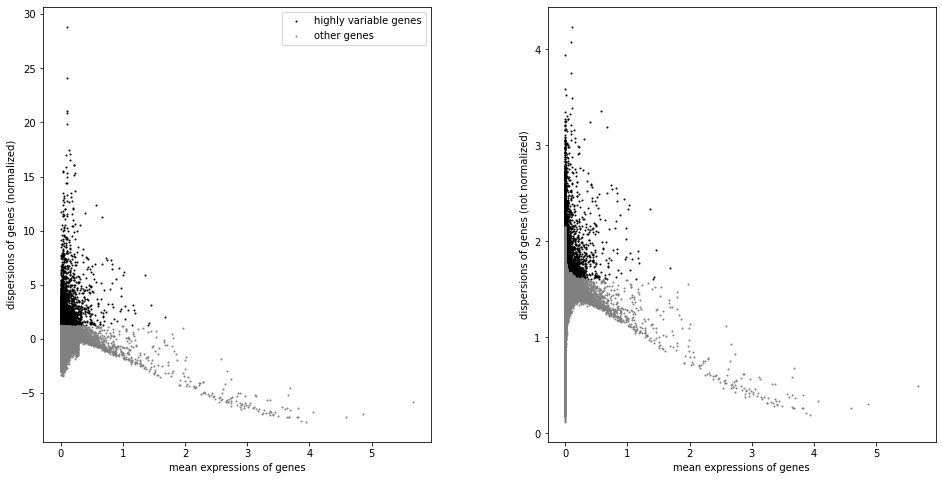


=======
>>>>>>> d339118485321a54c24ffa554e2338af35789a73
scale data


```python
<<<<<<< HEAD
sc.pp.scale(adata_lung, max_value=20)
=======
sc.pp.scale(adata_lung, max_value=10)
>>>>>>> d339118485321a54c24ffa554e2338af35789a73
```

### Dimensional Reduction 


```python
sc.tl.pca(adata_lung, svd_solver='arpack')
```

<<<<<<< HEAD
        on highly variable genes
    computing PCA with n_comps = 50
        finished (0:00:09)


=======
>>>>>>> d339118485321a54c24ffa554e2338af35789a73

```python
sc.pl.pca(adata_lung)
```

<<<<<<< HEAD
    ... storing 'phase' as categorical


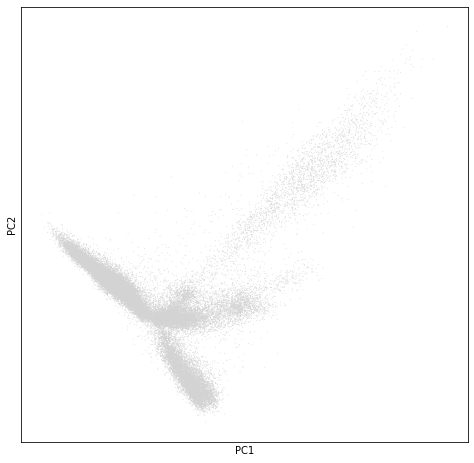


```python
sc.pp.neighbors(adata_lung)
```

    computing neighbors
        using 'X_pca' with n_pcs = 50
        finished: added to `.uns['neighbors']`
        'distances', distances for each pair of neighbors
        'connectivities', weighted adjacency matrix (0:00:17)


=======

```python
sc.pp.neighbors(adata_lung, n_neighbors=10, n_pcs=40)
```

>>>>>>> d339118485321a54c24ffa554e2338af35789a73

```python
sc.tl.umap(adata_lung)
```

<<<<<<< HEAD
    computing UMAP
        finished: added
        'X_umap', UMAP coordinates (adata.obsm) (0:00:46)


```python
sc.pl.umap(adata_lung, color='CellType',s=30)
```


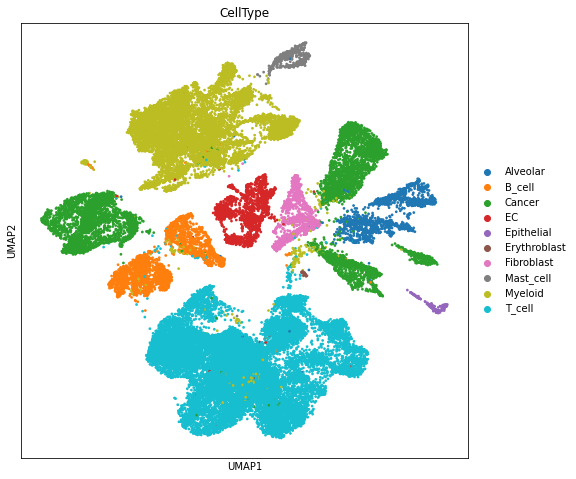


```python
sc.pl.umap(adata_lung, color='TumorSite',s=30)
```


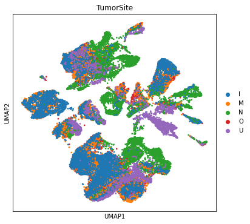

=======

```python
#sc.tl.paga(adata_lung)
#sc.pl.paga(adata_lung, plot=False)  # remove `plot=False` if you want to see the coarse-grained graph
#sc.tl.umap(adata_lung, init_pos='paga')
```


```python
sc.pl.umap(adata_lung, color='CellType',s=30)
```

sc.pl.umap(adata_lung, color='TumorSite',s=30)
>>>>>>> d339118485321a54c24ffa554e2338af35789a73

### Cluster composition split using Ptz ID


```python
#adata_magic.obs.groupby(["leiden", "SampleID"]).size().reset_index().plot(kind='bar')
fig, (ax1) = plt.subplots(1,1, figsize=(33/2.54, 17/2.54))
ax1 = adata_lung.obs.groupby("CellType")["PatientNumber"].value_counts(normalize=True).mul(100).unstack().plot.bar(stacked=True,legend=False,ax=ax1)
ax1.set_xlabel("Main Cell Type ")
ax1.set_ylabel("% Frequency")
ax1.grid(False)
ax1.legend(bbox_to_anchor=(1.1, 1.0))
```


<<<<<<< HEAD


    <matplotlib.legend.Legend at 0x7ff9b7425240>


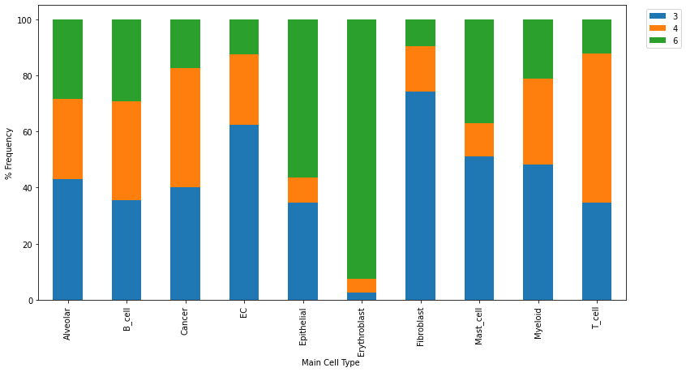


```python
#adata_magic.obs.groupby(["leiden", "SampleID"]).size().reset_index().plot(kind='bar')
fig, (ax1) = plt.subplots(1,1, figsize=(33/2.54, 17/2.54))
ax1 = adata_lung.obs.groupby("CellType")["CellFromTumor"].value_counts(normalize=True).mul(100).unstack().plot.bar(stacked=True,legend=False,ax=ax1)
ax1.set_xlabel("Main Cell Type ")
ax1.set_ylabel("% Frequency")
ax1.grid(False)
ax1.legend(bbox_to_anchor=(1.1, 1.0))
```


    <matplotlib.legend.Legend at 0x7ff9b56f09e8>


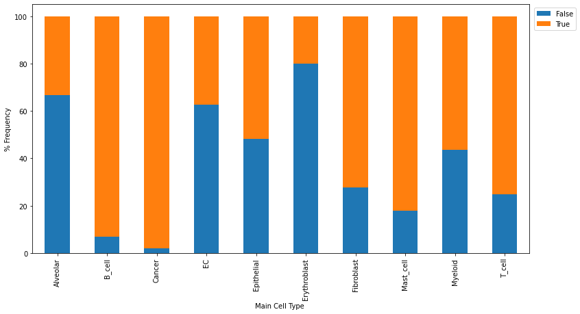


=======
>>>>>>> d339118485321a54c24ffa554e2338af35789a73
```python
adata_lung.obs.groupby("CellType")["PatientNumber"].value_counts(normalize=True).mul(100)
```

<<<<<<< HEAD


    CellType      PatientNumber
    Alveolar      3                42.949640
                  4                28.633094
                  6                28.417266
    B_cell        3                35.470566
                  4                35.208099
                  6                29.321335
    Cancer        4                42.326383
                  3                40.272770
                  6                17.400847
    EC            3                62.476665
                  4                24.891101
                  6                12.632234
    Epithelial    6                56.410256
                  3                34.615385
                  4                 8.974359
    Erythroblast  6                92.500000
                  4                 5.000000
                  3                 2.500000
    Fibroblast    3                74.235403
                  4                16.126043
                  6                 9.638554
    Mast_cell     3                51.039261
                  6                37.182448
                  4                11.778291
    Myeloid       3                48.196682
                  4                30.464054
                  6                21.339264
    T_cell        4                53.106688
                  3                34.783297
                  6                12.110014
    Name: PatientNumber, dtype: float64


=======
>>>>>>> d339118485321a54c24ffa554e2338af35789a73
### Cluster composition split using TumorSite


```python
#adata_magic.obs.groupby(["leiden", "SampleID"]).size().reset_index().plot(kind='bar')
fig, (ax1) = plt.subplots(1,1, figsize=(33/2.54, 17/2.54))
ax1 = adata_lung.obs.groupby("CellType")["TumorSite"].value_counts(normalize=True).mul(100).unstack().plot.bar(stacked=True,legend=False,ax=ax1)
ax1.set_xlabel("Main Cell Type")
ax1.set_ylabel("% Frequency")
ax1.grid(False)
ax1.legend(bbox_to_anchor=(1.1, 1.0))
```


<<<<<<< HEAD


    <matplotlib.legend.Legend at 0x7ff9bf1c1390>


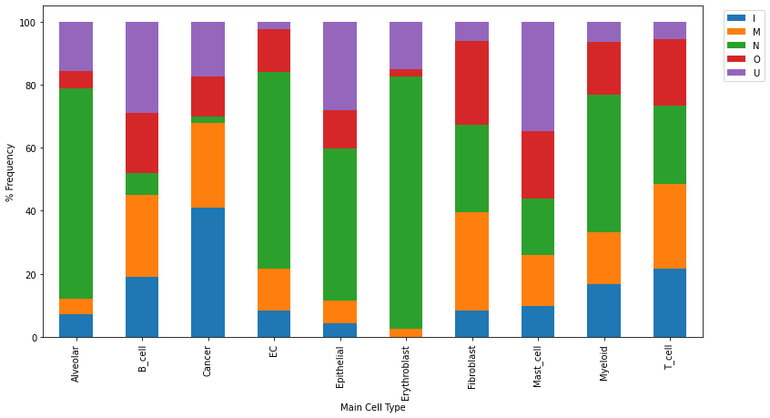


=======
>>>>>>> d339118485321a54c24ffa554e2338af35789a73
```python
colors2 = plt.cm.Reds(np.linspace(0, 1, 254))
colors3 = plt.cm.Greys_r(np.linspace(0.7,0.8,20))
colorsComb = np.vstack([colors3, colors2])
mymap = colors.LinearSegmentedColormap.from_list('my_colormap', colorsComb)
```

### Extract T_cell and Cancer cell 


```python
adataAll= sc.read("/mnt/lugli/SP025_NaClTcell/PangenomeBlueprint/write/adatalung.h5ad")
```


```python
adataAll
```


    AnnData object with n_obs × n_vars = 41012 × 33694 
        obs: 'CellId', 'CellFromTumor', 'PatientNumber', 'TumorType', 'TumorSite', 'CellType'
        var: 'gene_id'


```python
Tcell = adataAll.obs['CellType'] == 'T_cell'
Cancercell = adataAll.obs['CellType'] == 'Cancer'
```


```python
adata_lungTcell = adataAll[Tcell, :]
adata_lungCancercell = adataAll[Cancercell, :]
```


```python
<<<<<<< HEAD
Tcelltumor = adata_lungTcell.obs['CellFromTumor'].astype(str) == 'True'
```

### Filter T cell from normal sample


```python
adata_lungTcell = adata_lungTcell[Tcelltumor,:] 
```


```python
adata_lungTcell.layers["counts"] = adata_lungTcell[:,].to_df()
```


```python
adata_lungTcell
```


    AnnData object with n_obs × n_vars = 14213 × 33694 
        obs: 'CellId', 'CellFromTumor', 'PatientNumber', 'TumorType', 'TumorSite', 'CellType'
        var: 'gene_id'
        layers: 'counts'


```python
#sc.pp.calculate_qc_metrics(adata_lungTcell, inplace=True)
```
=======
adata_lungTcell.layers["counts"] =adata_lungTcell[:,].to_df()
```

### T cell Lung analysis
>>>>>>> d339118485321a54c24ffa554e2338af35789a73


```python
adata_lungTcell = adata_lungTcell[:, adata_lungTcell[:,].to_df().sum(axis=0) > 0] 
```


```python
<<<<<<< HEAD
adata_lungTcell
```


    View of AnnData object with n_obs × n_vars = 14213 × 20870 
        obs: 'CellId', 'CellFromTumor', 'PatientNumber', 'TumorType', 'TumorSite', 'CellType'
        var: 'gene_id'
        layers: 'counts'


### T cell Lung analysis


```python
=======
>>>>>>> d339118485321a54c24ffa554e2338af35789a73
sc.pp.filter_cells(adata_lungTcell, min_genes=200)
sc.pp.filter_genes(adata_lungTcell, min_cells=3)
```

    Trying to set attribute `.obs` of view, copying.


<<<<<<< HEAD
    filtered out 3225 genes that are detected in less than 3 cells
=======
    filtered out 3175 genes that are detected in less than 3 cells
>>>>>>> d339118485321a54c24ffa554e2338af35789a73


```python
adata_lungTcell.var['mt'] = adata_lungTcell.var_names.str.startswith('MT-')  # annotate the group of mitochondrial genes as 'mt'
```


```python
sc.pp.calculate_qc_metrics(adata_lungTcell, qc_vars=['mt'], percent_top=None, inplace=True)
```


```python
sc.pl.violin(adata_lungTcell, ['n_genes_by_counts', 'total_counts', 'pct_counts_mt'],
             jitter=0.4, multi_panel=True)
```


<<<<<<< HEAD
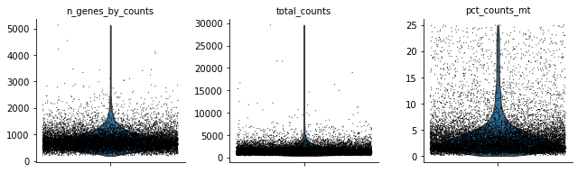
=======
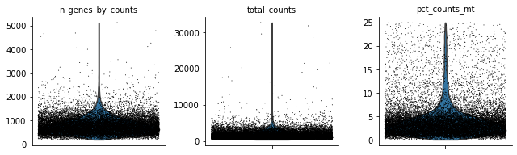
>>>>>>> d339118485321a54c24ffa554e2338af35789a73


```python
rcParams['figure.figsize'] = 4, 4
sc.pl.scatter(adata_lungTcell, x='total_counts', y='pct_counts_mt')
sc.pl.scatter(adata_lungTcell, x='total_counts', y='n_genes_by_counts')
```


<<<<<<< HEAD
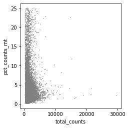


=======
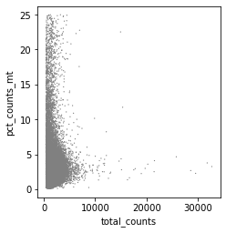


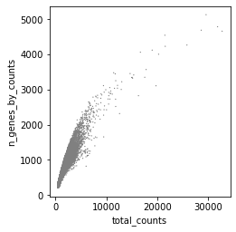
>>>>>>> d339118485321a54c24ffa554e2338af35789a73


```python
adata_lungTcell = adata_lungTcell[adata_lungTcell.obs.n_genes_by_counts < 2500, :]
adata_lungTcell = adata_lungTcell[adata_lungTcell.obs.pct_counts_mt < 5, :]
```


```python
ribo_genes = adata_lungTcell.var_names.str.startswith(("RP"))
<<<<<<< HEAD
malat1 = adata_lungTcell.var_names.str.startswith(("MALAT1"))
remove = np.add(ribo_genes,malat1)
keep = np.invert(remove)
adata_lungTcell = adata_lungTcell[:,keep]
```

Library-size normalization
=======
```


```python
malat1 = adata_lungTcell.var_names.str.startswith(("MALAT1"))
remove = np.add(ribo_genes,malat1)
keep = np.invert(remove)
```


```python
adata_lungTcell = adata_lungTcell[:,keep]
```
>>>>>>> d339118485321a54c24ffa554e2338af35789a73


```python
sc.pp.normalize_total(adata_lungTcell, target_sum=1e4)
```

    normalizing counts per cell
<<<<<<< HEAD
        finished (0:00:01)


Square root transform


```python
sc.pp.sqrt(adata_lungTcell)
```


```python
adata_lungTcell.layers["sqrtcounts"] = adata_lungTcell[:,].to_df()
```


```python
sc.pp.combat(adata_lungTcell, key='PatientNumber')
```

    Standardizing Data across genes.
    
    Found 3 batches
    
    Found 0 numerical variables:
    	
    
    Found 18 genes with zero variance.
    Fitting L/S model and finding priors
    
    Finding parametric adjustments
    


    /home/spuccio/miniconda3/envs/scrnseq/lib/python3.6/site-packages/scanpy/preprocessing/_combat.py:338: RuntimeWarning: invalid value encountered in true_divide
      change = max((abs(g_new - g_old) / g_old).max(), (abs(d_new - d_old) / d_old).max())
    /home/spuccio/miniconda3/envs/scrnseq/lib/python3.6/site-packages/scanpy/preprocessing/_combat.py:338: RuntimeWarning: divide by zero encountered in true_divide
      change = max((abs(g_new - g_old) / g_old).max(), (abs(d_new - d_old) / d_old).max())


    Adjusting data
    


```python
sc.pp.highly_variable_genes(adata_lungTcell, flavor='cell_ranger', n_top_genes=4000)
```

    extracting highly variable genes
        finished (0:00:01)
=======
        finished (0:00:02)


```python
sc.pp.log1p(adata_lungTcell)
```

    /home/spuccio/miniconda3/envs/scrnseq/lib/python3.6/site-packages/scanpy/preprocessing/_simple.py:297: UserWarning: Revieved a view of an AnnData. Making a copy.
      view_to_actual(data)


```python
#adata_lungTcell = adata_lungTcell[:,adata_lungTcell.X.sum(axis=0) > 0]
```


```python
#sc.pp.combat(adata_lungTcell, key='PatientNumber')
```


```python
sc.pp.highly_variable_genes(adata_lungTcell, min_mean=0.0125, max_mean=3, min_disp=0.5)
```

    extracting highly variable genes
        finished (0:00:03)
>>>>>>> d339118485321a54c24ffa554e2338af35789a73
    --> added
        'highly_variable', boolean vector (adata.var)
        'means', float vector (adata.var)
        'dispersions', float vector (adata.var)
        'dispersions_norm', float vector (adata.var)


```python
rcParams['figure.figsize'] = 4, 4
sc.pl.highly_variable_genes(adata_lungTcell)
```


<<<<<<< HEAD
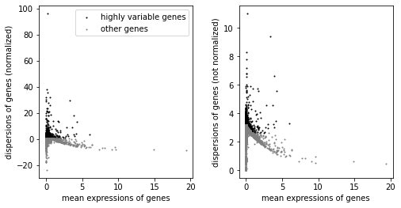
=======
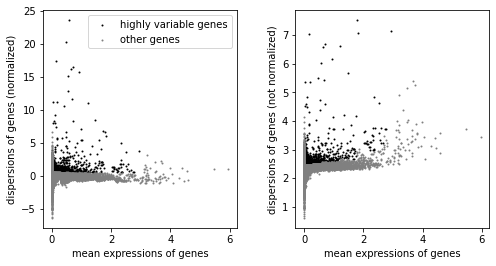
>>>>>>> d339118485321a54c24ffa554e2338af35789a73


```python
<<<<<<< HEAD
sc.tl.score_genes_cell_cycle(adata_lungTcell, s_genes=s_genes, g2m_genes=g2m_genes)
```

    calculating cell cycle phase
    computing score 'S_score'
    WARNING: genes are not in var_names and ignored: ['RPA2']
        finished: added
        'S_score', score of gene set (adata.obs) (0:00:01)
    computing score 'G2M_score'
        finished: added
        'G2M_score', score of gene set (adata.obs) (0:00:01)
    -->     'phase', cell cycle phase (adata.obs)


```python
#adata_lungTcell = adata_lungTcell[:,adata_lungTcell.X.sum(axis=0) > 0]
=======
#sc.tl.score_genes_cell_cycle(adata_lungTcell, s_genes=s_genes, g2m_genes=g2m_genes)
```


```python
adata_lungTcell = adata_lungTcell[:,adata_lungTcell.X.sum(axis=0) > 0]
>>>>>>> d339118485321a54c24ffa554e2338af35789a73
```


```python
<<<<<<< HEAD
#sc.pp.regress_out(adata_lungTcell, ['total_counts', 'pct_counts_mt'])
=======
sc.pp.regress_out(adata_lungTcell, ['total_counts', 'pct_counts_mt'])
>>>>>>> d339118485321a54c24ffa554e2338af35789a73
```

    regressing out ['total_counts', 'pct_counts_mt']
        finished (0:02:53)


```python
<<<<<<< HEAD
sc.pp.scale(adata_lungTcell, max_value=20)
=======
sc.pp.scale(adata_lungTcell, max_value=10)
>>>>>>> d339118485321a54c24ffa554e2338af35789a73
```


```python
sc.tl.pca(adata_lungTcell, svd_solver='arpack')
```

        on highly variable genes
    computing PCA with n_comps = 50
<<<<<<< HEAD
        finished (0:00:11)
=======
        finished (0:00:02)
>>>>>>> d339118485321a54c24ffa554e2338af35789a73


```python
<<<<<<< HEAD
rcParams['figure.figsize'] = 5, 5
sc.pl.pca(adata_lungTcell, color=['CD8A','CD4'])
```

    ... storing 'phase' as categorical


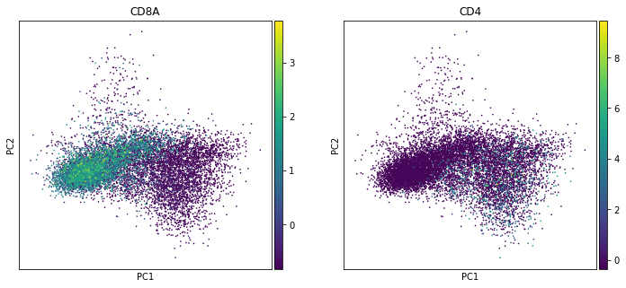
=======
rcParams['figure.figsize'] = 4, 4
sc.pl.pca(adata_lungTcell, color=['CD8A','CD4'])
```


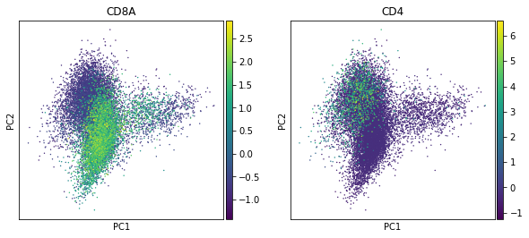
>>>>>>> d339118485321a54c24ffa554e2338af35789a73


```python
adata_lungTcell.write("/mnt/lugli/SP025_NaClTcell/PangenomeBlueprint/write/adatalungTcell.h5ad")
```


```python
<<<<<<< HEAD
sc.pp.neighbors(adata_lungTcell)
```

    computing neighbors
        using 'X_pca' with n_pcs = 50
        finished: added to `.uns['neighbors']`
        'distances', distances for each pair of neighbors
        'connectivities', weighted adjacency matrix (0:00:08)
=======
sc.pp.neighbors(adata_lungTcell, n_neighbors=10, n_pcs=40)
```

    computing neighbors
        using 'X_pca' with n_pcs = 40
        finished: added to `.uns['neighbors']`
        'distances', distances for each pair of neighbors
        'connectivities', weighted adjacency matrix (0:00:03)
>>>>>>> d339118485321a54c24ffa554e2338af35789a73


```python
sc.tl.umap(adata_lungTcell)
```

    computing UMAP
        finished: added
<<<<<<< HEAD
        'X_umap', UMAP coordinates (adata.obsm) (0:00:13)
=======
        'X_umap', UMAP coordinates (adata.obsm) (0:00:14)
>>>>>>> d339118485321a54c24ffa554e2338af35789a73


### Plot CD8A and CD4


```python
rcParams['figure.figsize'] = 6, 6
sc.pl.umap(adata_lungTcell,color=['CD8A','CD4'],use_raw=False, color_map=mymap,s=50)
```


<<<<<<< HEAD
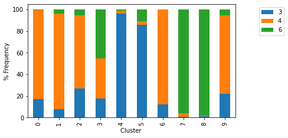


### Perform Clustering with Leiden with several resolution


```python
sc.tl.leiden(adata_lungTcell,resolution=0.8, key_added='leiden_r8_clusters',random_state=10,use_weights=True)
sc.tl.leiden(adata_lungTcell, resolution=0.7, key_added='leiden_r7_clusters', random_state=10,use_weights=True)
sc.tl.leiden(adata_lungTcell, resolution=0.6, key_added='leiden_r6_clusters', random_state=10,use_weights=True)
sc.tl.leiden(adata_lungTcell,resolution=0.5, key_added='leiden_r5_clusters',random_state=10,use_weights=True)
sc.tl.leiden(adata_lungTcell, resolution=0.4, key_added='leiden_r4_clusters', random_state=10,use_weights=True)
```

    running Leiden clustering
        finished: found 12 clusters and added
        'leiden_r8_clusters', the cluster labels (adata.obs, categorical) (0:00:02)
    running Leiden clustering
        finished: found 9 clusters and added
        'leiden_r7_clusters', the cluster labels (adata.obs, categorical) (0:00:05)
    running Leiden clustering
        finished: found 8 clusters and added
        'leiden_r6_clusters', the cluster labels (adata.obs, categorical) (0:00:02)
    running Leiden clustering
        finished: found 7 clusters and added
        'leiden_r5_clusters', the cluster labels (adata.obs, categorical) (0:00:02)
    running Leiden clustering
        finished: found 7 clusters and added
        'leiden_r4_clusters', the cluster labels (adata.obs, categorical) (0:00:02)


### Clustree visualization for Leidein clustering


```r
%%R -i adata_lungTcell

clustree(adata_lungTcell,prefix="leiden_r",suffix = "_clusters",exprs = "X")
```

    /home/spuccio/miniconda3/envs/scrnseq/lib/python3.6/site-packages/anndata2ri/py2r.py:37: NotConvertedWarning: Conversion 'py2rpy' not defined for objects of type '<class 'NoneType'>'
      warn(str(e), NotConvertedWarning)


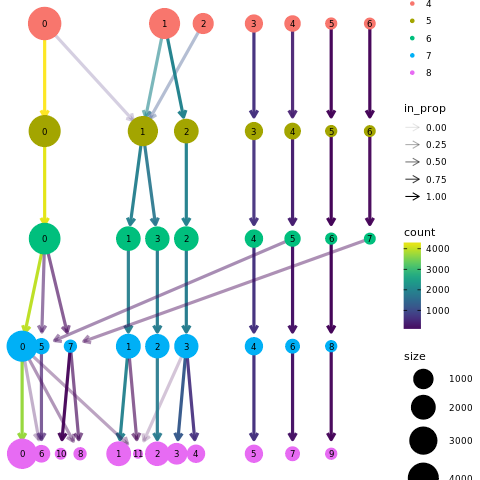


### Resolution selected is the 6 (0.6 Green Dots) 
=======
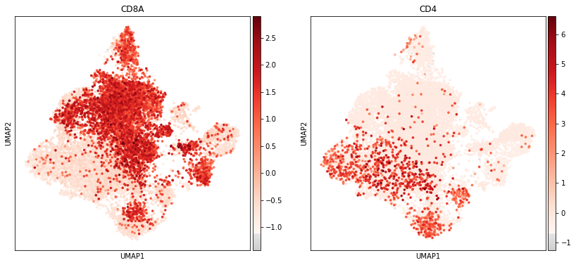


### Perform Clustering with Louvain with several resolution


```python
sc.tl.louvain(adata_lungTcell,resolution=0.8, key_added='louvain_r8_clusters',random_state=10,use_weights=True)
sc.tl.louvain(adata_lungTcell, resolution=0.7, key_added='louvain_r7_clusters', random_state=10,use_weights=True)
sc.tl.louvain(adata_lungTcell, resolution=0.6, key_added='louvain_r6_clusters', random_state=10,use_weights=True)
sc.tl.louvain(adata_lungTcell,resolution=0.5, key_added='louvain_r5_clusters',random_state=10,use_weights=True)
sc.tl.louvain(adata_lungTcell, resolution=0.4, key_added='louvain_r4_clusters', random_state=10,use_weights=True)
sc.tl.louvain(adata_lungTcell,resolution=0.3, key_added='louvain_r3_clusters',random_state=10,use_weights=True)
```

    running Louvain clustering
        using the "louvain" package of Traag (2017)
        finished: found 13 clusters and added
        'louvain_r8_clusters', the cluster labels (adata.obs, categorical) (0:00:01)
    running Louvain clustering
        using the "louvain" package of Traag (2017)
        finished: found 12 clusters and added
        'louvain_r7_clusters', the cluster labels (adata.obs, categorical) (0:00:01)
    running Louvain clustering
        using the "louvain" package of Traag (2017)
        finished: found 11 clusters and added
        'louvain_r6_clusters', the cluster labels (adata.obs, categorical) (0:00:01)
    running Louvain clustering
        using the "louvain" package of Traag (2017)
        finished: found 10 clusters and added
        'louvain_r5_clusters', the cluster labels (adata.obs, categorical) (0:00:01)
    running Louvain clustering
        using the "louvain" package of Traag (2017)
        finished: found 9 clusters and added
        'louvain_r4_clusters', the cluster labels (adata.obs, categorical) (0:00:01)
    running Louvain clustering
        using the "louvain" package of Traag (2017)
        finished: found 8 clusters and added
        'louvain_r3_clusters', the cluster labels (adata.obs, categorical) (0:00:01)


```python
import anndata2ri
anndata2ri.activate()
%load_ext rpy2.ipython
```

    The rpy2.ipython extension is already loaded. To reload it, use:
      %reload_ext rpy2.ipython


### Clustree Visualization


```r
%%R -i adata_lungTcell

clustree(adata_lungTcell,prefix="louvain_r",suffix = "_clusters",exprs = "X")

```


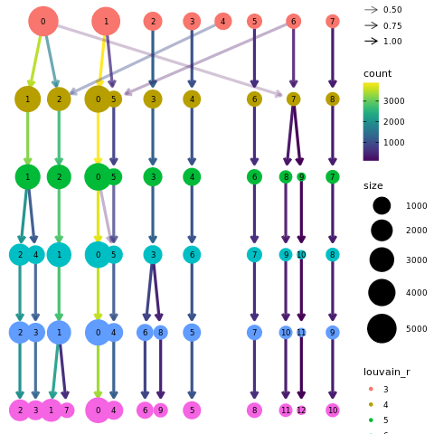

>>>>>>> d339118485321a54c24ffa554e2338af35789a73

### Absolute frequency for clusters


```python
#adata_magic.obs.groupby(["leiden", "SampleID"]).size().reset_index().plot(kind='bar')
fig, (ax1) = plt.subplots(1,1, figsize=(16/2.54, 9/2.54))
<<<<<<< HEAD
ax1 = adata_lungTcell.obs.groupby("leiden_r6_clusters")["PatientNumber"].value_counts(normalize=True).mul(100).unstack().plot.bar(stacked=True,legend=False,ax=ax1)
=======
ax1 = adata_lungTcell.obs.groupby("louvain_r5_clusters")["PatientNumber"].value_counts(normalize=True).mul(100).unstack().plot.bar(stacked=True,legend=False,ax=ax1)
>>>>>>> d339118485321a54c24ffa554e2338af35789a73
ax1.set_xlabel("Cluster ")
ax1.set_ylabel("% Frequency")
ax1.grid(False)
ax1.legend(bbox_to_anchor=(1.1, 1.0))
<<<<<<< HEAD
sc.pl.umap(adata_lungTcell,color=['leiden_r6_clusters'],use_raw=False, color_map=mymap,s=50)
```


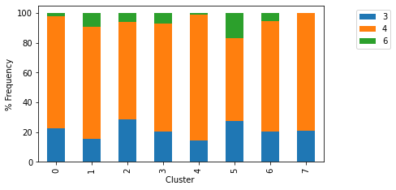


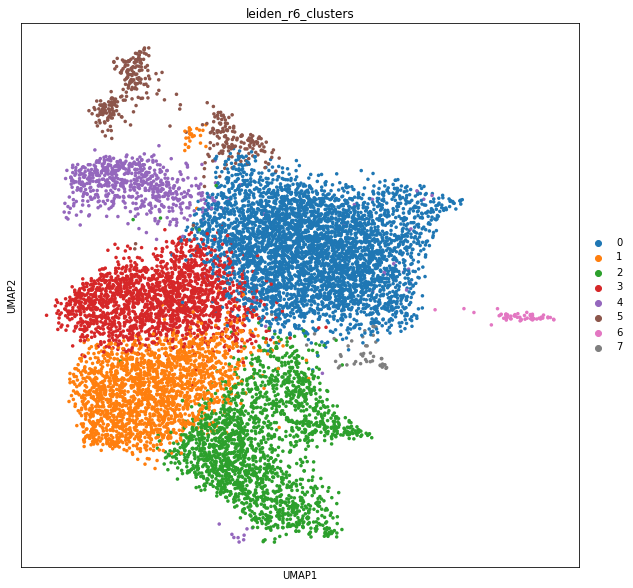
=======
sc.pl.umap(adata_lungTcell,color=['louvain_r5_clusters'],use_raw=False, color_map=mymap,s=50)
```


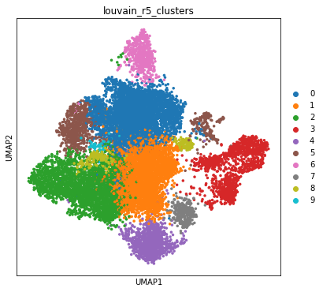
>>>>>>> d339118485321a54c24ffa554e2338af35789a73


```python
rcParams['figure.figsize'] = 10, 10
<<<<<<< HEAD
marker_genes = ['CD8A','CD4','CD3E','NCAM1','FOXP3','FGFBP2','XCL1']
sc.pl.dotplot(adata_lungTcell, marker_genes, groupby='leiden_r6_clusters')
=======
marker_genes = ['CD8A','CD4','CD3E','NCAM1','FOXP3']
sc.pl.dotplot(adata_lungTcell, marker_genes, groupby='louvain_r5_clusters')
>>>>>>> d339118485321a54c24ffa554e2338af35789a73
#sc.pl.stacked_violin(adata_lungTcell, marker_genes, groupby='leiden_r5_clusters', dendrogram=False)
```


<<<<<<< HEAD
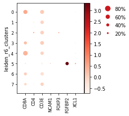
=======
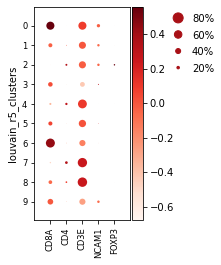
>>>>>>> d339118485321a54c24ffa554e2338af35789a73


<<<<<<< HEAD
    GridSpec(2, 5, height_ratios=[0, 10.5], width_ratios=[2.4499999999999997, 0, 0.2, 0.5, 0.25])


### Computer Marker Genes


```python
sc.tl.rank_genes_groups(adata_lungTcell, 'leiden_r6_clusters', method='t-test')
```

    ranking genes


    /home/spuccio/miniconda3/envs/scrnseq/lib/python3.6/site-packages/scanpy/tools/_rank_genes_groups.py:252: RuntimeWarning: invalid value encountered in log2
      rankings_gene_logfoldchanges.append(np.log2(foldchanges[global_indices]))


        finished: added to `.uns['rank_genes_groups']`
        'names', sorted np.recarray to be indexed by group ids
        'scores', sorted np.recarray to be indexed by group ids
        'logfoldchanges', sorted np.recarray to be indexed by group ids
        'pvals', sorted np.recarray to be indexed by group ids
        'pvals_adj', sorted np.recarray to be indexed by group ids (0:00:16)


```python
sc.tl.rank_genes_groups(adata_lungTcell, 'leiden_r6_clusters', method='t-test', key_added = "t-test")
```

    ranking genes


    /home/spuccio/miniconda3/envs/scrnseq/lib/python3.6/site-packages/scanpy/tools/_rank_genes_groups.py:252: RuntimeWarning: invalid value encountered in log2
      rankings_gene_logfoldchanges.append(np.log2(foldchanges[global_indices]))


        finished: added to `.uns['t-test']`
        'names', sorted np.recarray to be indexed by group ids
        'scores', sorted np.recarray to be indexed by group ids
        'logfoldchanges', sorted np.recarray to be indexed by group ids
        'pvals', sorted np.recarray to be indexed by group ids
        'pvals_adj', sorted np.recarray to be indexed by group ids (0:00:16)


```python
sc.tl.rank_genes_groups(adata_lungTcell, 'leiden_r6_clusters', method='t-test_overestim_var', key_added = "t-test_overestim_var")
```

    ranking genes
        finished: added to `.uns['t-test_overestim_var']`
        'names', sorted np.recarray to be indexed by group ids
        'scores', sorted np.recarray to be indexed by group ids
        'logfoldchanges', sorted np.recarray to be indexed by group ids
        'pvals', sorted np.recarray to be indexed by group ids
        'pvals_adj', sorted np.recarray to be indexed by group ids (0:00:16)


```python
sc.tl.rank_genes_groups(adata_lungTcell, 'leiden_r6_clusters', method='wilcoxon', key_added = "wilcoxon")
```

    ranking genes


    /home/spuccio/miniconda3/envs/scrnseq/lib/python3.6/site-packages/scanpy/tools/_rank_genes_groups.py:420: RuntimeWarning: invalid value encountered in log2
      rankings_gene_logfoldchanges.append(np.log2(foldchanges[global_indices]))


        finished: added to `.uns['wilcoxon']`
        'names', sorted np.recarray to be indexed by group ids
        'scores', sorted np.recarray to be indexed by group ids
        'logfoldchanges', sorted np.recarray to be indexed by group ids
        'pvals', sorted np.recarray to be indexed by group ids
        'pvals_adj', sorted np.recarray to be indexed by group ids (0:00:24)


```python
sc.tl.rank_genes_groups(adata_lungTcell, 'leiden_r6_clusters', method='logreg', key_added = "logreg")
```

    ranking genes
        finished: added to `.uns['logreg']`
        'names', sorted np.recarray to be indexed by group ids
        'scores', sorted np.recarray to be indexed by group ids
     (0:00:20)
=======
    GridSpec(2, 5, height_ratios=[0, 10.5], width_ratios=[1.75, 0, 0.2, 0.5, 0.25])


### Computer marker genes 


```python
sc.tl.rank_genes_groups(adata_lungTcell, 'louvain_r5_clusters', method='logreg')
```

    ranking genes
        finished: added to `.uns['rank_genes_groups']`
        'names', sorted np.recarray to be indexed by group ids
        'scores', sorted np.recarray to be indexed by group ids
     (0:00:41)
>>>>>>> d339118485321a54c24ffa554e2338af35789a73


    /home/spuccio/miniconda3/envs/scrnseq/lib/python3.6/site-packages/sklearn/linear_model/_logistic.py:764: ConvergenceWarning: lbfgs failed to converge (status=1):
    STOP: TOTAL NO. of ITERATIONS REACHED LIMIT.
    
    Increase the number of iterations (max_iter) or scale the data as shown in:
        https://scikit-learn.org/stable/modules/preprocessing.html
    Please also refer to the documentation for alternative solver options:
        https://scikit-learn.org/stable/modules/linear_model.html#logistic-regression
      extra_warning_msg=_LOGISTIC_SOLVER_CONVERGENCE_MSG)


```python
<<<<<<< HEAD
#compare cluster1 genes, only stores top 100 by default
rcParams['figure.figsize'] = 6, 6
wc = adata_lungTcell.uns['wilcoxon']['names']['0']
tt = adata_lungTcell.uns['t-test']['names']['0']
tt_ov = adata_lungTcell.uns['t-test_overestim_var']['names']['0']
lr = adata_lungTcell.uns['logreg']['names']['0']

from matplotlib_venn import venn3

venn3([set(wc),set(tt),set(tt_ov)], ('Wilcox','T-test','T-test_ov') )
plt.show()


venn3([set(wc),set(lr),set(tt_ov)], ('Wilcox','Logreg','T-test_ov') )
plt.show()
```


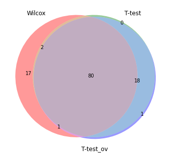


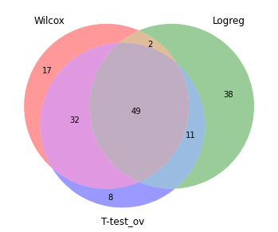


```python
#sc.pl.rank_genes_groups_heatmap(adata_lungTcell, n_genes=5, key="wilcoxon", groupby="leiden_r6_clusters", show_gene_labels=True)
```


```python
sc.pl.rank_genes_groups_dotplot(adata_lungTcell, n_genes=5, key="wilcoxon", groupby="leiden_r6_clusters")
```


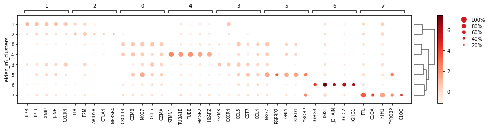


```python
sc.pl.rank_genes_groups_stacked_violin(adata_lungTcell, n_genes=5, key="wilcoxon", groupby="leiden_r6_clusters")
```


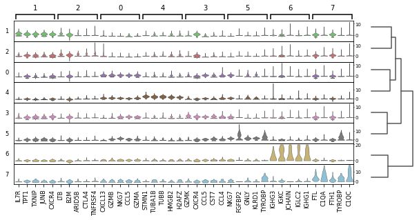


```python
pd.DataFrame(adata_lungTcell.uns['t-test']['names']).head(50)
=======
pd.DataFrame(adata_lungTcell.uns['rank_genes_groups']['names']).head(50)
>>>>>>> d339118485321a54c24ffa554e2338af35789a73
```


<div>
<style scoped>
    .dataframe tbody tr th:only-of-type {
        vertical-align: middle;
    }

    .dataframe tbody tr th {
        vertical-align: top;
    }

    .dataframe thead th {
        text-align: right;
    }
</style>
<table border="1" class="dataframe">
  <thead>
    <tr style="text-align: right;">
      <th></th>
      <th>0</th>
      <th>1</th>
      <th>2</th>
      <th>3</th>
      <th>4</th>
      <th>5</th>
      <th>6</th>
      <th>7</th>
<<<<<<< HEAD
=======
      <th>8</th>
      <th>9</th>
>>>>>>> d339118485321a54c24ffa554e2338af35789a73
    </tr>
  </thead>
  <tbody>
    <tr>
      <th>0</th>
<<<<<<< HEAD
      <td>CCL5</td>
      <td>IL7R</td>
      <td>LTB</td>
      <td>GZMK</td>
      <td>STMN1</td>
      <td>NKG7</td>
      <td>SSR4</td>
      <td>FTL</td>
    </tr>
    <tr>
      <th>1</th>
      <td>NKG7</td>
      <td>TPT1</td>
      <td>TNFRSF4</td>
      <td>CCL5</td>
      <td>TUBB</td>
      <td>KLRD1</td>
      <td>IGKC</td>
      <td>HLA-DRA</td>
    </tr>
    <tr>
      <th>2</th>
      <td>GZMB</td>
      <td>TXNIP</td>
      <td>TNFRSF18</td>
      <td>CXCR4</td>
      <td>TUBA1B</td>
      <td>GNLY</td>
      <td>IGHG1</td>
      <td>TYROBP</td>
    </tr>
    <tr>
      <th>3</th>
      <td>GZMA</td>
      <td>JUNB</td>
      <td>RTKN2</td>
      <td>CST7</td>
      <td>HMGB2</td>
      <td>PRF1</td>
      <td>IGHGP</td>
      <td>C1QB</td>
    </tr>
    <tr>
      <th>4</th>
      <td>CXCL13</td>
      <td>CXCR4</td>
      <td>B2M</td>
      <td>LYAR</td>
      <td>H2AFZ</td>
      <td>CTSW</td>
      <td>JCHAIN</td>
      <td>C1QA</td>
    </tr>
    <tr>
      <th>5</th>
      <td>HAVCR2</td>
      <td>BTG1</td>
      <td>ARID5B</td>
      <td>CD8B</td>
      <td>KIAA0101</td>
      <td>TYROBP</td>
      <td>IGHG3</td>
      <td>RNASE1</td>
    </tr>
    <tr>
      <th>6</th>
      <td>CD8A</td>
      <td>FOS</td>
      <td>BATF</td>
      <td>ANXA1</td>
      <td>GAPDH</td>
      <td>FGFBP2</td>
      <td>MZB1</td>
      <td>APOC1</td>
    </tr>
    <tr>
      <th>7</th>
      <td>CTSW</td>
      <td>MT-CO3</td>
      <td>CTLA4</td>
      <td>KLRG1</td>
      <td>HMGB1</td>
      <td>FCGR3A</td>
      <td>IGLC2</td>
      <td>C1QC</td>
    </tr>
    <tr>
      <th>8</th>
      <td>LAG3</td>
      <td>SARAF</td>
      <td>IL2RA</td>
      <td>TMSB4X</td>
      <td>TYMS</td>
      <td>KLRF1</td>
      <td>IGHA1</td>
      <td>FTH1</td>
    </tr>
    <tr>
      <th>9</th>
      <td>GZMH</td>
      <td>MT-CYB</td>
      <td>ICA1</td>
      <td>CD69</td>
      <td>MKI67</td>
      <td>FCER1G</td>
      <td>DERL3</td>
      <td>APOE</td>
    </tr>
    <tr>
      <th>10</th>
      <td>PRF1</td>
      <td>PABPC1</td>
      <td>SELL</td>
      <td>BTG1</td>
      <td>NUSAP1</td>
      <td>KLRB1</td>
      <td>FKBP11</td>
      <td>AIF1</td>
    </tr>
    <tr>
      <th>11</th>
      <td>KLRD1</td>
      <td>LTB</td>
      <td>TBC1D4</td>
      <td>CLDND1</td>
      <td>PCNA</td>
      <td>CST7</td>
      <td>IGLC3</td>
      <td>CD68</td>
    </tr>
    <tr>
      <th>12</th>
      <td>GNLY</td>
      <td>MT-ND2</td>
      <td>TIGIT</td>
      <td>CCL4</td>
      <td>RAN</td>
      <td>MT-CO1</td>
      <td>CD79A</td>
      <td>S100A11</td>
    </tr>
    <tr>
      <th>13</th>
      <td>CCL3</td>
      <td>GNB2L1</td>
      <td>PIM2</td>
      <td>GIMAP7</td>
      <td>UBE2C</td>
      <td>SPON2</td>
      <td>XBP1</td>
      <td>GPX1</td>
    </tr>
    <tr>
      <th>14</th>
      <td>CCL4</td>
      <td>FAU</td>
      <td>SAT1</td>
      <td>PIK3R1</td>
      <td>TPI1</td>
      <td>HOPX</td>
      <td>FKBP2</td>
      <td>GLUL</td>
    </tr>
    <tr>
      <th>15</th>
      <td>HLA-DRB1</td>
      <td>BTG2</td>
      <td>FOXP3</td>
      <td>RARRES3</td>
      <td>H2AFV</td>
      <td>PLAC8</td>
      <td>SEC11C</td>
      <td>CD74</td>
    </tr>
    <tr>
      <th>16</th>
      <td>RBPJ</td>
      <td>MT-ND1</td>
      <td>CORO1B</td>
      <td>TC2N</td>
      <td>DUT</td>
      <td>ITGB2</td>
      <td>IGHG2</td>
      <td>LGALS1</td>
    </tr>
    <tr>
      <th>17</th>
      <td>CD63</td>
      <td>EEF1B2</td>
      <td>UGP2</td>
      <td>B2M</td>
      <td>HLA-DRA</td>
      <td>AREG</td>
      <td>CLSTN1</td>
      <td>TMSB10</td>
    </tr>
    <tr>
      <th>18</th>
      <td>ID2</td>
      <td>CD69</td>
      <td>BIRC3</td>
      <td>GIMAP4</td>
      <td>SNRPB</td>
      <td>TRDC</td>
      <td>IGHG4</td>
      <td>CST3</td>
    </tr>
    <tr>
      <th>19</th>
      <td>CD7</td>
      <td>ZFP36L2</td>
      <td>CD4</td>
      <td>TXNIP</td>
      <td>DEK</td>
      <td>CD247</td>
      <td>FCRL5</td>
      <td>FCER1G</td>
    </tr>
    <tr>
      <th>20</th>
      <td>IFNG</td>
      <td>GLTSCR2</td>
      <td>PBXIP1</td>
      <td>STK17A</td>
      <td>ZWINT</td>
      <td>GZMB</td>
      <td>AL928768.3</td>
      <td>IFITM3</td>
    </tr>
    <tr>
      <th>21</th>
      <td>ALOX5AP</td>
      <td>FXYD5</td>
      <td>ICOS</td>
      <td>CD8A</td>
      <td>SMC4</td>
      <td>KLRC1</td>
      <td>IGHM</td>
      <td>COX6C</td>
    </tr>
    <tr>
      <th>22</th>
      <td>GAPDH</td>
      <td>CD40LG</td>
      <td>SPOCK2</td>
      <td>PPP2R5C</td>
      <td>ACTB</td>
      <td>MT-ND4</td>
      <td>GSTP1</td>
      <td>NUPR1</td>
    </tr>
    <tr>
      <th>23</th>
      <td>AC092580.4</td>
      <td>CCR7</td>
      <td>RGS1</td>
      <td>FOS</td>
      <td>MAD2L1</td>
      <td>MT-CYB</td>
      <td>IGHA2</td>
      <td>LYZ</td>
    </tr>
    <tr>
      <th>24</th>
      <td>HLA-DRA</td>
      <td>EEF1D</td>
      <td>GPX1</td>
      <td>GZMA</td>
      <td>ANP32B</td>
      <td>MT-CO2</td>
      <td>IGKV1-12</td>
      <td>S100A9</td>
    </tr>
    <tr>
      <th>25</th>
      <td>CCL4L2</td>
      <td>TSC22D3</td>
      <td>AC133644.2</td>
      <td>FOSB</td>
      <td>RANBP1</td>
      <td>MT-CO3</td>
      <td>IGLV3-1</td>
      <td>MCL1</td>
    </tr>
    <tr>
      <th>26</th>
      <td>APOBEC3G</td>
      <td>UBA52</td>
      <td>AC017002.1</td>
      <td>CMC1</td>
      <td>RRM2</td>
      <td>CLIC3</td>
      <td>SDF2L1</td>
      <td>LST1</td>
    </tr>
    <tr>
      <th>27</th>
      <td>CD3D</td>
      <td>FTH1</td>
      <td>IL1R2</td>
      <td>HLA-A</td>
      <td>CDK1</td>
      <td>MATK</td>
      <td>NDUFAB1</td>
      <td>IFI27</td>
    </tr>
    <tr>
      <th>28</th>
      <td>HLA-DPA1</td>
      <td>LEPROTL1</td>
      <td>MAGEH1</td>
      <td>GZMM</td>
      <td>VIM</td>
      <td>CMC1</td>
      <td>TOMM5</td>
      <td>CAPG</td>
    </tr>
    <tr>
      <th>29</th>
      <td>CD8B</td>
      <td>NFKBIA</td>
      <td>IL32</td>
      <td>AOAH</td>
      <td>CFL1</td>
      <td>IER2</td>
      <td>JSRP1</td>
      <td>MS4A7</td>
    </tr>
    <tr>
      <th>30</th>
      <td>VCAM1</td>
      <td>ANXA1</td>
      <td>FXYD5</td>
      <td>GIMAP1</td>
      <td>COX8A</td>
      <td>MT-ATP6</td>
      <td>P4HA1</td>
      <td>CXCL10</td>
    </tr>
    <tr>
      <th>31</th>
      <td>CTSD</td>
      <td>EIF3E</td>
      <td>DNPH1</td>
      <td>ZFP36</td>
      <td>TK1</td>
      <td>BIN2</td>
      <td>GSK3B</td>
      <td>TXN</td>
    </tr>
    <tr>
      <th>32</th>
      <td>ACP5</td>
      <td>GPR183</td>
      <td>CD27</td>
      <td>ITM2C</td>
      <td>TOP2A</td>
      <td>GSTP1</td>
      <td>C5orf56</td>
      <td>HLA-DPB1</td>
    </tr>
    <tr>
      <th>33</th>
      <td>CHST12</td>
      <td>GPR171</td>
      <td>CD79B</td>
      <td>KLF6</td>
      <td>GZMB</td>
      <td>TXK</td>
      <td>FHOD1</td>
      <td>PSAP</td>
    </tr>
    <tr>
      <th>34</th>
      <td>CLEC2B</td>
      <td>ZFP36</td>
      <td>OAZ1</td>
      <td>ZNF683</td>
      <td>PFN1</td>
      <td>PLEK</td>
      <td>PDK1</td>
      <td>C1orf162</td>
    </tr>
    <tr>
      <th>35</th>
      <td>SH3BGRL3</td>
      <td>TMEM123</td>
      <td>PIK3IP1</td>
      <td>PTPRC</td>
      <td>HLA-DRB1</td>
      <td>S1PR5</td>
      <td>SELK</td>
      <td>NPC2</td>
    </tr>
    <tr>
      <th>36</th>
      <td>HCST</td>
      <td>PIK3IP1</td>
      <td>FTH1</td>
      <td>MT-CO3</td>
      <td>SMC2</td>
      <td>C1orf21</td>
      <td>DNAJB9</td>
      <td>IFI6</td>
    </tr>
    <tr>
      <th>37</th>
      <td>LY6E</td>
      <td>SLC2A3</td>
      <td>SRGN</td>
      <td>PARP8</td>
      <td>CKS2</td>
      <td>LITAF</td>
      <td>IGHD</td>
      <td>GRN</td>
    </tr>
    <tr>
      <th>38</th>
      <td>ENTPD1</td>
      <td>DUSP1</td>
      <td>F5</td>
      <td>HLA-DPB1</td>
      <td>ASF1B</td>
      <td>MYO1F</td>
      <td>FBXO34</td>
      <td>TMEM176B</td>
    </tr>
    <tr>
      <th>39</th>
      <td>HSPB1</td>
      <td>TOMM7</td>
      <td>FBLN7</td>
      <td>JUNB</td>
      <td>SLC25A5</td>
      <td>APMAP</td>
      <td>MZT2B</td>
      <td>MS4A4A</td>
    </tr>
    <tr>
      <th>40</th>
      <td>HLA-DPB1</td>
      <td>JUN</td>
      <td>GADD45A</td>
      <td>LY9</td>
      <td>PSMB9</td>
      <td>CD300A</td>
      <td>MED6</td>
      <td>SPP1</td>
    </tr>
    <tr>
      <th>41</th>
      <td>SIRPG</td>
      <td>EEF2</td>
      <td>TMEM173</td>
      <td>PIP4K2A</td>
      <td>NUDT1</td>
      <td>IFITM2</td>
      <td>CLK3</td>
      <td>PSME2</td>
    </tr>
    <tr>
      <th>42</th>
      <td>TIGIT</td>
      <td>RORA</td>
      <td>SARAF</td>
      <td>MATK</td>
      <td>PTMA</td>
      <td>TTC38</td>
      <td>ZCCHC6</td>
      <td>VSIG4</td>
    </tr>
    <tr>
      <th>43</th>
      <td>ADGRE5</td>
      <td>MT-ATP6</td>
      <td>PMAIP1</td>
      <td>CLEC2B</td>
      <td>LDHA</td>
      <td>CCL5</td>
      <td>SVIL-AS1</td>
      <td>CCL18</td>
    </tr>
    <tr>
      <th>44</th>
      <td>PDCD1</td>
      <td>NACA</td>
      <td>SMAP2</td>
      <td>TNF</td>
      <td>RHOA</td>
      <td>FCRL6</td>
      <td>STYK1</td>
      <td>S100A10</td>
    </tr>
    <tr>
      <th>45</th>
      <td>TNIP3</td>
      <td>MT-ND3</td>
      <td>LAIR2</td>
      <td>NUCB2</td>
      <td>CD74</td>
      <td>LAT2</td>
      <td>BRAT1</td>
      <td>SMIM12</td>
    </tr>
    <tr>
      <th>46</th>
      <td>RGS2</td>
      <td>EIF1</td>
      <td>NR3C1</td>
      <td>ZFP36L2</td>
      <td>HNRNPA2B1</td>
      <td>FGR</td>
      <td>SELM</td>
      <td>TIMP1</td>
    </tr>
    <tr>
      <th>47</th>
      <td>TNFRSF9</td>
      <td>PTMA</td>
      <td>PRDX2</td>
      <td>EOMES</td>
      <td>CHCHD2</td>
      <td>CCL4</td>
      <td>TOMM40</td>
      <td>MIR155HG</td>
    </tr>
    <tr>
      <th>48</th>
      <td>RABAC1</td>
      <td>BIRC3</td>
      <td>TNFRSF1B</td>
      <td>CD44</td>
      <td>MT2A</td>
      <td>TMIGD2</td>
      <td>IGHV1-69-2</td>
      <td>MS4A6A</td>
    </tr>
    <tr>
      <th>49</th>
      <td>TRGC2</td>
      <td>MT-CO1</td>
      <td>MAF</td>
      <td>IER2</td>
      <td>PKM</td>
      <td>GPR65</td>
      <td>IGHV1-24</td>
      <td>CYBB</td>
=======
      <td>HAVCR2</td>
      <td>LYAR</td>
      <td>LTB</td>
      <td>FGFBP2</td>
      <td>CRIP1</td>
      <td>SPINK1</td>
      <td>MKI67</td>
      <td>FABP4</td>
      <td>SCGB3A1</td>
      <td>IGHGP</td>
    </tr>
    <tr>
      <th>1</th>
      <td>CXCL13</td>
      <td>ANXA1</td>
      <td>RTKN2</td>
      <td>KLRF1</td>
      <td>HBA2</td>
      <td>TFPI</td>
      <td>RRM2</td>
      <td>H3F3A</td>
      <td>SCGB1A1</td>
      <td>JCHAIN</td>
    </tr>
    <tr>
      <th>2</th>
      <td>CCL3</td>
      <td>KLRG1</td>
      <td>CCR7</td>
      <td>SPON2</td>
      <td>SFTPC</td>
      <td>KLRC1</td>
      <td>KIAA0101</td>
      <td>C1QB</td>
      <td>SCGB3A2</td>
      <td>IGHG1</td>
    </tr>
    <tr>
      <th>3</th>
      <td>CTSW</td>
      <td>GZMK</td>
      <td>SELL</td>
      <td>FCGR3A</td>
      <td>HBB</td>
      <td>IFITM1</td>
      <td>CENPF</td>
      <td>C1QA</td>
      <td>H3F3A</td>
      <td>IGHG3</td>
    </tr>
    <tr>
      <th>4</th>
      <td>IFIT2</td>
      <td>ANKRD28</td>
      <td>IL2RA</td>
      <td>KLRD1</td>
      <td>CCL2</td>
      <td>PAEP</td>
      <td>CDC20</td>
      <td>LYZ</td>
      <td>AKR1C1</td>
      <td>IGLC2</td>
    </tr>
    <tr>
      <th>5</th>
      <td>GZMB</td>
      <td>KLF6</td>
      <td>MAL</td>
      <td>NKG7</td>
      <td>LMNA</td>
      <td>AGR2</td>
      <td>CCNB2</td>
      <td>APOE</td>
      <td>IGHG4</td>
      <td>IGLC3</td>
    </tr>
    <tr>
      <th>6</th>
      <td>NKG7</td>
      <td>LY9</td>
      <td>TNFRSF4</td>
      <td>PLEK</td>
      <td>HBA1</td>
      <td>ANGPTL4</td>
      <td>UBE2C</td>
      <td>CST3</td>
      <td>TPSB2</td>
      <td>IGKC</td>
    </tr>
    <tr>
      <th>7</th>
      <td>VCAM1</td>
      <td>DKK3</td>
      <td>FOXP3</td>
      <td>PLAC8</td>
      <td>CREM</td>
      <td>KRT7</td>
      <td>ASPM</td>
      <td>VSIG4</td>
      <td>HIST2H2BE</td>
      <td>IGHA1</td>
    </tr>
    <tr>
      <th>8</th>
      <td>GZMH</td>
      <td>TNFAIP3</td>
      <td>FCMR</td>
      <td>S1PR5</td>
      <td>HLA-DRB5</td>
      <td>AC092580.4</td>
      <td>STMN1</td>
      <td>APOC1</td>
      <td>AC090498.1</td>
      <td>DERL3</td>
    </tr>
    <tr>
      <th>9</th>
      <td>IFIT1</td>
      <td>GLUL</td>
      <td>F5</td>
      <td>GZMH</td>
      <td>SOCS3</td>
      <td>XCL2</td>
      <td>TYMS</td>
      <td>BPIFB1</td>
      <td>IGHG3</td>
      <td>MZB1</td>
    </tr>
    <tr>
      <th>10</th>
      <td>CD27</td>
      <td>RGCC</td>
      <td>SESN1</td>
      <td>CD160</td>
      <td>APOC1</td>
      <td>SFTPB</td>
      <td>CCNB1</td>
      <td>EEF1A1</td>
      <td>CD40LG</td>
      <td>IGHG2</td>
    </tr>
    <tr>
      <th>11</th>
      <td>IFNG</td>
      <td>FOS</td>
      <td>SESN3</td>
      <td>CMC1</td>
      <td>ZFP36</td>
      <td>IGHG4</td>
      <td>AURKB</td>
      <td>HBB</td>
      <td>EGR1</td>
      <td>CD79A</td>
    </tr>
    <tr>
      <th>12</th>
      <td>KLRC2</td>
      <td>MALT1</td>
      <td>IL1R2</td>
      <td>KLRG1</td>
      <td>C10orf10</td>
      <td>TYROBP</td>
      <td>TROAP</td>
      <td>M6PR</td>
      <td>EEF1A1</td>
      <td>IGHA2</td>
    </tr>
    <tr>
      <th>13</th>
      <td>CCL5</td>
      <td>CLDND1</td>
      <td>TBCEL</td>
      <td>PRSS23</td>
      <td>SFTPA2</td>
      <td>AREG</td>
      <td>TUBB</td>
      <td>GCHFR</td>
      <td>NDUFV2-AS1</td>
      <td>AL928768.3</td>
    </tr>
    <tr>
      <th>14</th>
      <td>TSC22D1</td>
      <td>CTD-3252C9.4</td>
      <td>FBLN7</td>
      <td>CST7</td>
      <td>CCL18</td>
      <td>SAA1</td>
      <td>TK1</td>
      <td>GLUL</td>
      <td>TPSAB1</td>
      <td>IGHM</td>
    </tr>
    <tr>
      <th>15</th>
      <td>GNLY</td>
      <td>DUSP2</td>
      <td>TNFRSF18</td>
      <td>FABP4</td>
      <td>TM4SF1</td>
      <td>KIR2DL4</td>
      <td>NUSAP1</td>
      <td>SCGB1A1</td>
      <td>HIST1H2BG</td>
      <td>FCRL5</td>
    </tr>
    <tr>
      <th>16</th>
      <td>CCL4L2</td>
      <td>RUFY1</td>
      <td>LEF1</td>
      <td>ADGRG1</td>
      <td>ANXA1</td>
      <td>CCL20</td>
      <td>BIRC5</td>
      <td>MSMB</td>
      <td>CMB9-22P13.1</td>
      <td>SSR4</td>
    </tr>
    <tr>
      <th>17</th>
      <td>TSHZ2</td>
      <td>PIK3R1</td>
      <td>TRABD2A</td>
      <td>CX3CR1</td>
      <td>IFITM1</td>
      <td>CCND1</td>
      <td>CDK1</td>
      <td>MARCO</td>
      <td>HSPA1B</td>
      <td>IGKV1-12</td>
    </tr>
    <tr>
      <th>18</th>
      <td>APOBEC3C</td>
      <td>CCL4</td>
      <td>ICA1</td>
      <td>FCRL6</td>
      <td>SFTPA1</td>
      <td>KRT19</td>
      <td>CASC5</td>
      <td>RETN</td>
      <td>TNF</td>
      <td>JSRP1</td>
    </tr>
    <tr>
      <th>19</th>
      <td>TNFSF10</td>
      <td>VIM</td>
      <td>CD177</td>
      <td>TTC38</td>
      <td>GNA15</td>
      <td>XCL1</td>
      <td>HMGB2</td>
      <td>MYADM</td>
      <td>MTRNR2L8</td>
      <td>TNFRSF17</td>
    </tr>
    <tr>
      <th>20</th>
      <td>IFIT3</td>
      <td>AHNAK</td>
      <td>ZBTB16</td>
      <td>PRF1</td>
      <td>CCNH</td>
      <td>KRT8</td>
      <td>CDCA5</td>
      <td>FAM118A</td>
      <td>MTRNR2L12</td>
      <td>IGHG4</td>
    </tr>
    <tr>
      <th>21</th>
      <td>PRF1</td>
      <td>POLR3K</td>
      <td>IL6R</td>
      <td>CD300A</td>
      <td>EML4</td>
      <td>C15orf48</td>
      <td>PRC1</td>
      <td>RGCC</td>
      <td>HIST3H2BB</td>
      <td>SLC9B2</td>
    </tr>
    <tr>
      <th>22</th>
      <td>HSPA1B</td>
      <td>CD8B</td>
      <td>TBC1D4</td>
      <td>LYZ</td>
      <td>ATP2B1</td>
      <td>S100A9</td>
      <td>KIF2C</td>
      <td>SERPINA1</td>
      <td>C21orf62</td>
      <td>CLSTN1</td>
    </tr>
    <tr>
      <th>23</th>
      <td>TNFRSF9</td>
      <td>NUCB2</td>
      <td>IL23A</td>
      <td>PTGDR</td>
      <td>TAGLN2</td>
      <td>LINC00996</td>
      <td>ZWINT</td>
      <td>FBP1</td>
      <td>DNAJB4</td>
      <td>FKBP11</td>
    </tr>
    <tr>
      <th>24</th>
      <td>SERPINH1</td>
      <td>ZNF683</td>
      <td>LAIR2</td>
      <td>TRGC2</td>
      <td>GPR183</td>
      <td>TRDC</td>
      <td>NUF2</td>
      <td>FAM215B</td>
      <td>GPX2</td>
      <td>KIAA0125</td>
    </tr>
    <tr>
      <th>25</th>
      <td>TRDC</td>
      <td>CD52</td>
      <td>IL7R</td>
      <td>FGR</td>
      <td>PTGER4</td>
      <td>TNNC2</td>
      <td>SPC25</td>
      <td>CCL18</td>
      <td>NBEAL1</td>
      <td>FKBP2</td>
    </tr>
    <tr>
      <th>26</th>
      <td>GZMA</td>
      <td>CMC1</td>
      <td>RIC3</td>
      <td>KLRB1</td>
      <td>MT2A</td>
      <td>S100A16</td>
      <td>TUBA1B</td>
      <td>MCEMP1</td>
      <td>HSPA1A</td>
      <td>ZCCHC6</td>
    </tr>
    <tr>
      <th>27</th>
      <td>KLRD1</td>
      <td>USP28</td>
      <td>PASK</td>
      <td>C1orf21</td>
      <td>SFTPD</td>
      <td>TNFRSF18</td>
      <td>DLGAP5</td>
      <td>ANKRD28</td>
      <td>IGKC</td>
      <td>IGLV3-1</td>
    </tr>
    <tr>
      <th>28</th>
      <td>MX1</td>
      <td>NEK7</td>
      <td>HSPA1B</td>
      <td>H3F3A</td>
      <td>NAA50</td>
      <td>IGKC</td>
      <td>FEN1</td>
      <td>NBEAL1</td>
      <td>TLE4</td>
      <td>IGHV1-69-2</td>
    </tr>
    <tr>
      <th>29</th>
      <td>RSAD2</td>
      <td>MVB12B</td>
      <td>AC017002.1</td>
      <td>LITAF</td>
      <td>NHSL2</td>
      <td>SPINT2</td>
      <td>CENPN</td>
      <td>TFF3</td>
      <td>PLCG2</td>
      <td>IGKV3-11</td>
    </tr>
    <tr>
      <th>30</th>
      <td>ISG15</td>
      <td>DCUN1D1</td>
      <td>NUDT16</td>
      <td>GNLY</td>
      <td>GPX3</td>
      <td>SPRY1</td>
      <td>SGOL1</td>
      <td>CSTA</td>
      <td>MTRNR2L1</td>
      <td>HIST1H2BJ</td>
    </tr>
    <tr>
      <th>31</th>
      <td>CRTAM</td>
      <td>PARP14</td>
      <td>HSPA1A</td>
      <td>PTGDS</td>
      <td>CST3</td>
      <td>KRT18</td>
      <td>CEP55</td>
      <td>RBPJ</td>
      <td>JUN</td>
      <td>IGLV6-57</td>
    </tr>
    <tr>
      <th>32</th>
      <td>RBPJ</td>
      <td>ARID1A</td>
      <td>NCF4</td>
      <td>SH3BP5</td>
      <td>TNFAIP3</td>
      <td>WFDC2</td>
      <td>CDCA2</td>
      <td>SPI1</td>
      <td>HMGN2</td>
      <td>C2orf47</td>
    </tr>
    <tr>
      <th>33</th>
      <td>ENTPD1</td>
      <td>PRR5L</td>
      <td>ADTRP</td>
      <td>MYBL1</td>
      <td>SARAF</td>
      <td>SPRR2D</td>
      <td>TOP2A</td>
      <td>VIM</td>
      <td>CXCL17</td>
      <td>CRNKL1</td>
    </tr>
    <tr>
      <th>34</th>
      <td>RGS2</td>
      <td>FAM46C</td>
      <td>GADD45A</td>
      <td>ITGB2</td>
      <td>LEPROTL1</td>
      <td>C19orf33</td>
      <td>PKMYT1</td>
      <td>ALDH1A1</td>
      <td>CHN1</td>
      <td>SDF2L1</td>
    </tr>
    <tr>
      <th>35</th>
      <td>CD7</td>
      <td>MYADM</td>
      <td>LINC01281</td>
      <td>GZMM</td>
      <td>C1QB</td>
      <td>CRIP1</td>
      <td>GTSE1</td>
      <td>FCER1G</td>
      <td>CPA3</td>
      <td>SMPDL3B</td>
    </tr>
    <tr>
      <th>36</th>
      <td>CLECL1</td>
      <td>KIAA0513</td>
      <td>LDLRAP1</td>
      <td>CTSW</td>
      <td>VIM</td>
      <td>SPP1</td>
      <td>KIAA1524</td>
      <td>S100A11</td>
      <td>SBF2</td>
      <td>ZZZ3</td>
    </tr>
    <tr>
      <th>37</th>
      <td>CD63</td>
      <td>TNF</td>
      <td>FANK1</td>
      <td>APBA2</td>
      <td>JUND</td>
      <td>KRT81</td>
      <td>DEPDC1B</td>
      <td>RBMS1</td>
      <td>AC022182.3</td>
      <td>INVS</td>
    </tr>
    <tr>
      <th>38</th>
      <td>LAYN</td>
      <td>C1orf56</td>
      <td>NABP1</td>
      <td>ZEB2</td>
      <td>CYR61</td>
      <td>KRT86</td>
      <td>CDKN3</td>
      <td>TYROBP</td>
      <td>DNAJA4</td>
      <td>AREL1</td>
    </tr>
    <tr>
      <th>39</th>
      <td>AC006129.2</td>
      <td>FAM162A</td>
      <td>C10orf54</td>
      <td>RAB9A</td>
      <td>DPP4</td>
      <td>COL1A1</td>
      <td>SMC4</td>
      <td>HLA-DRB1</td>
      <td>LINC00623</td>
      <td>HPGD</td>
    </tr>
    <tr>
      <th>40</th>
      <td>HERC5</td>
      <td>NUDT9</td>
      <td>CORO1B</td>
      <td>TRBV28</td>
      <td>NR3C1</td>
      <td>FCER1G</td>
      <td>SHCBP1</td>
      <td>UBC</td>
      <td>EEF1G</td>
      <td>NBEAL2</td>
    </tr>
    <tr>
      <th>41</th>
      <td>HSPB1</td>
      <td>RORA</td>
      <td>APOLD1</td>
      <td>TYROBP</td>
      <td>CAMK4</td>
      <td>UBE2C</td>
      <td>MXD3</td>
      <td>HNRNPL</td>
      <td>B2M</td>
      <td>IGLL5</td>
    </tr>
    <tr>
      <th>42</th>
      <td>ALOX5AP</td>
      <td>TC2N</td>
      <td>SERINC5</td>
      <td>AKR1C3</td>
      <td>CLU</td>
      <td>TACSTD2</td>
      <td>DDX39A</td>
      <td>TMEM173</td>
      <td>ID2</td>
      <td>FABP7</td>
    </tr>
    <tr>
      <th>43</th>
      <td>CDKN2C</td>
      <td>SENP7</td>
      <td>CYSLTR1</td>
      <td>VCL</td>
      <td>GPR171</td>
      <td>SH2D1B</td>
      <td>KIFC1</td>
      <td>CES1</td>
      <td>HSPE1</td>
      <td>WDR3</td>
    </tr>
    <tr>
      <th>44</th>
      <td>ZBED2</td>
      <td>PRCP</td>
      <td>ARID5B</td>
      <td>C1QB</td>
      <td>ZNF331</td>
      <td>DDIT4</td>
      <td>CCNA2</td>
      <td>HBA2</td>
      <td>HIST1H2AE</td>
      <td>PTDSS2</td>
    </tr>
    <tr>
      <th>45</th>
      <td>TRGC1</td>
      <td>TRAT1</td>
      <td>LY96</td>
      <td>A2M-AS1</td>
      <td>MYADM</td>
      <td>CLIC3</td>
      <td>SMC2</td>
      <td>PSMC1</td>
      <td>UTY</td>
      <td>TMEM234</td>
    </tr>
    <tr>
      <th>46</th>
      <td>ID2</td>
      <td>PRRT3</td>
      <td>TNFSF13B</td>
      <td>C1QA</td>
      <td>FAM46C</td>
      <td>C8orf4</td>
      <td>NRM</td>
      <td>ANXA1</td>
      <td>DPP4</td>
      <td>XBP1</td>
    </tr>
    <tr>
      <th>47</th>
      <td>MX2</td>
      <td>STK17A</td>
      <td>CTLA4</td>
      <td>MYO1F</td>
      <td>NACA2</td>
      <td>CHRM3-AS2</td>
      <td>CLSPN</td>
      <td>TPPP3</td>
      <td>AGR2</td>
      <td>IGHV5-51</td>
    </tr>
    <tr>
      <th>48</th>
      <td>TTN</td>
      <td>PIP4K2A</td>
      <td>TMBIM6</td>
      <td>PTPN12</td>
      <td>SAMSN1</td>
      <td>PVRL2</td>
      <td>RAD51</td>
      <td>FAM101B</td>
      <td>CITED2</td>
      <td>KHSRP</td>
    </tr>
    <tr>
      <th>49</th>
      <td>CD79A</td>
      <td>IL7R</td>
      <td>PGM2L1</td>
      <td>MATK</td>
      <td>EVI2A</td>
      <td>IGHG1</td>
      <td>MAD2L1</td>
      <td>FTL</td>
      <td>NQO1</td>
      <td>HOXB2</td>
>>>>>>> d339118485321a54c24ffa554e2338af35789a73
    </tr>
  </tbody>
</table>
</div>


```python
<<<<<<< HEAD
#pd.DataFrame(adata_lungTcell.uns['rank_genes_groups']['names']).head(50)
```


```python
=======
>>>>>>> d339118485321a54c24ffa554e2338af35789a73
marker_genes = dict()
```


```python
marker_genes["CD8 T Effector Memory"]  = ['HSPA1A', 'HSPA1B', 'HSPH1', 'ANXA1', 'HSPA8', 'MTRNR2L12', 'IL7R', 'TC2N', 'RPS27', 'GZMM', 'HLA-C', 'RPL41', 'SAMD3', 'DNAJB1', 'GZMH', 'ZFP36L2', 'HSP90AA1', 'MTRNR2L8', 'RPS21', 'RPS29', 'HSPA6', 'SPOCK2', 'PARP8', 'MT-ATP8', 'XCL2', 'CAMK4', 'CACYBP', 'STK17A', 'HSPE1', 'P2RY8', 'RGCC', 'FYN', 'RPS15A', 'TUBA4A', 'HSPD1', 'PTPRCAP', 'DUSP2', 'AIM1', 'STAT4', 'FAM102A', 'SUN2', 'SH2D1A', 'HSP90AB1', 'MATK', 'CHORDC1', 'RPL26', 'SCML4', 'CXCR4', 'NELL2', 'RASAL3', 'CALM1', 'AC090498.1', 'HLA-B', 'CCR7', 'S1PR4', 'KLRG1', 'DNAJA1', 'AHNAK', 'CD52', 'GZMK', 'RNF125', 'SARAF', 'TXNIP', 'RPL36A', 'PLP2', 'HIST1H4C', 'CD69', 'SELPLG', 'ZFAND2A', 'IFITM1', 'LYAR', 'CD3E', 'PTPRC', 'AHSA1', 'ARHGEF1', 'BTG1', 'DUSP1', 'KLF2', 'OASL', 'UBC', 'TSC22D3', 'PLK3', 'CRTAM', 'CD5', 'TAGAP', 'RPS25', 'CD6', 'FKBP4', 'BIN2', 'JMJD6', 'RPL23A', 'TNFSF9', 'CNN2', 'CD48', 'RPL35A', 'RPL28', 'BAG3', 'CXCR3', 'ALOX5AP', 'RPL37', 'ARHGDIB', 'RPS12', 'CTSW', 'DOK2', 'COTL1', 'PCBP1', 'CYTIP', 'RPL30', 'MBP', 'CCND3', 'SEMA4D', 'LIME1', 'GZMA', 'LCP1', 'RPS28', 'ITK', 'CCNH', 'IL21R', 'DEDD2', 'HCST', 'RPL34', 'CDC42EP3', 'CD96', 'SLC7A5', 'ISG20', 'RPS3', 'TTC39C', 'SLBP', 'TCP1', 'RPS4Y1', 'TSPYL2', 'PPP1R2', 'ZC3HAV1', 'SMCHD1', 'F2R', 'GIMAP7', 'RASA3', 'EZR', 'GNG2', 'MYADM', 'RHOF', 'S100A10', 'CRIP1', 'SLC2A3', 'RPS27A', 'RPL17', 'SKAP1', 'PITPNC1', 'LEPROTL1', 'FAM177A1', 'SLC9A3R1', 'IL32', 'PRKCH', 'ZAP70', 'ACAP1', 'RPL39', 'RAC2', 'STOM', 'THEMIS', 'HSPA5', 'EMB', 'RALGAPA1', 'IL2RG', 'CD8B', 'SRSF2', 'PTGER4', 'AOAH', 'DNAJB6', 'SRSF7', 'PIK3R1', 'CSRNP1', 'TES', 'LDHA', 'IL2RB', 'PBXIP1', 'C12orf75', 'TGFB1', 'EML4', 'FCMR', 'RARA', 'RPL38', 'KIAA1551', 'CD37', 'ARHGEF3', 'FKBP5', 'MYH9', 'KLF3', 'CITED2', 'PDCL3', 'IKZF1', 'CD3G', 'PPP2R5C', 'TUBA1A', 'H2AFX', 'TMEM2', 'RPLP2', 'RPL36', 'SYNE1', 'AKNA', 'ADGRE5', 'FLNA', 'RBM39', 'MSN', 'NOP58', 'HERPUD2', 'TRAT1', 'FAU', 'SOCS1', 'SYNE2', 'STIP1', 'UBB', 'PIK3IP1', 'MRPL18', 'SEPT1', 'TAGLN2', 'TNFAIP8', 'PDCD4', 'HNRNPUL1', 'ETS1', 'RORA', 'DDX5', 'DDIT4', 'IL16', 'GABARAPL1', 'CDK17', 'SAP18', 'SF3A1', 'PTGES3', 'SRRT', 'CORO1A', 'FOXP1', 'CAPN2', 'SC5D', 'OCIAD2', 'FXYD5', 'DNTTIP2', 'HMHA1', 'TUBB4B', 'PNP', 'IFNG', 'MAPRE2', 'NBEAL1', 'CYFIP2', 'MT-ND1', 'MT-ND4L', 'RHOH', 'LTB', 'ARAP2', 'MT-ND4', 'ATF7IP', 'S100A4', 'NFATC2', 'MAT2A', 'KLRB1', 'DDX24', 'CDC42SE2', 'RBL2', 'ZFP36', 'APBB1IP', 'TRMT10C', 'FLT3LG', 'SLC38A1', 'CDC42SE1', 'PGK1', 'CD53', 'ARHGAP15', 'RNF213', 'TAPBP', 'YWHAZ', 'IDI1', 'SON', 'TMA7', 'CCT4', 'MECP2', 'STK17B', 'CD44', 'SEPT6', 'NUCB2', 'AES', 'LINC-PINT', 'JAK1', 'ARID5A', 'YWHAB', 'PDE3B', 'IDS', 'PRKACB', 'PSME1', 'FAM129A', 'PLIN2', 'GBP5', 'STK4', 'SP100', 'PNPLA2', 'CCT2', 'PDE4B', 'SLC1A5', 'MCL1', 'JUNB', 'ZC3H12A', 'ELOVL5', 'LRRFIP1', 'IFRD1', 'SAMSN1', 'TAF7', 'NUP98', 'YPEL5', 'CCL4', 'IFNGR1', 'VPS37B', 'TGFBR2', 'PHF20', 'HSPA4', 'NUDC', 'RNF149', 'ODC1', 'CLK1', 'ANKRD12', 'CLDND1', 'TNF', 'JUN', 'CSNK1D', 'PIM1', 'MT2A', 'KLF6', 'TNFAIP3', 'SFPQ', 'IL10RA', 'USP36', 'PER1', 'STARD7', 'ITGB1', 'RP11-290D2.6', 'MT1X', 'NEU1', 'ATP1B3', 'HSPB1', 'LMNA', 'NR4A1']
marker_genes["CD8 T Resident Memory"] = ['CXCL13', 'ETV1', 'PCAT29', 'KLRD1', 'XCL2', 'CRTAM', 'TNFRSF9', 'CTLA4', 'XCL1', 'LYST', 'DUSP2', 'TMEM2', 'CD8A', 'TIGIT', 'CD7', 'CD8B', 'PTPN22', 'AKAP5', 'NKG7', 'COTL1', 'ITM2A', 'RPS15A', 'CCL5', 'RNF19A', 'CNOT6L', 'HCST', 'DUSP4', 'CBLB', 'SLA', 'HOPX', 'TOX', 'PDCD1', 'CST7', 'CTSW', 'RPL28', 'RPS27', 'PTPRC', 'RAB27A', 'CD3D', 'TRAT1', 'FYN', 'PRKCH', 'CD27', 'CLEC2D', 'CD3E', 'IL32', 'ICOS', 'GZMA', 'CCL4', 'GFOD1', 'BTG1', 'NR3C1', 'ZFP36L2', 'CD96', 'PDE7A', 'CREM', 'ATP8A1', 'SH2D1A', 'LEPROTL1', 'MT-ND3', 'ISG20', 'FABP5', 'TRBC2', 'GEM', 'RGCC', 'HNRNPLL', 'PCED1B', 'RPLP1', 'SARAF', 'RPL12', 'NAB1', 'ARAP2', 'FAU', 'ALOX5AP', 'LAG3', 'TNFRSF1B', 'FAM177A1', 'RPL37', 'CD52', 'ITGA4', 'SIRPG', 'TRBC1', 'RPS24', 'SNX9', 'RPS15', 'RPL39', 'RPS21', 'SRGN', 'TUBA4A', 'SH3BGRL3', 'HMGB2', 'PTMS', 'ITGAE', 'ASXL2', 'RGS2', 'LIMD2', 'ITK', 'RPL35A', 'HLA-C', 'PYHIN1', 'WIPF1', 'SLA2', 'BCL11B', 'ETS1', 'SH2D2A', 'RPL18', 'RPL41', 'PPP1R2', 'MT-CO2', 'RPS28', 'IKZF3', 'VCAM1', 'SLC7A5', 'C12orf57', 'HAVCR2', 'SYTL3', 'RARRES3', 'NR4A2', 'TMA7', 'CXCR6', 'CCSER2', 'IFI16', 'SRRT', 'CD2', 'RPL26', 'SOD1', 'SNAP47', 'CLEC2B', 'CD99', 'ZEB2', 'EVL', 'PNRC1', 'CD3G', 'RPS2', 'RAC2', 'LBH', 'LINC00152', 'HSPE1', 'NUCB2', 'ELF1', 'IL2RG', 'PTPRCAP', 'C9orf16', 'SH3KBP1', 'UBE2B', 'STK4', 'PARK7', 'ADGRE5', 'RPL24', 'WHSC1L1', 'SEPT7', 'SRSF7', 'MAPRE2', 'COMMD6', 'EZR', 'RHBDD2', 'PPP1R16B', 'NIN', 'YPEL5', 'PCBP1', 'CDKN1B', 'LSP1', 'NFATC2', 'STAT3', 'RASAL3', 'LCK', 'SEMA4D', 'VPS37B', 'EMD', 'CD69', 'PPP2R5C', 'FAM3C', 'STK17B', 'MBNL1', 'ENTPD1', 'SIT1', 'GABARAPL1', 'CXCR4', 'ARID4B', 'PIK3IP1', 'CYTIP', 'CHIC2', 'STK17A', 'PARP8', 'GNG2', 'ATP5L', 'SRSF2', 'SNRPD2', 'RBM39', 'JMJD6', 'SUB1', 'PNISR', 'ATPIF1', 'CYCS', 'CRIP1', 'SLC38A1', 'FCMR', 'KIAA1551', 'RGS1', 'SKAP1', 'TERF2IP', 'NAP1L4', 'PSME1', 'TOMM5', 'C5orf56', 'PMAIP1', 'TSPYL2', 'SP140', 'RUNX3', 'IL21R', 'CNIH1', 'BUB3', 'ATXN1', 'RHOH', 'HLA-F', 'USP11', 'ARHGAP9', 'GSPT1', 'PTPN7', 'SHFM1', 'PPM1G', 'CCND2', 'GBP2', 'RALGAPA1', 'ISG15', 'CHST12', 'ARF6', 'SEPT1', 'PIK3R1', 'TBRG1', 'MAZ', 'EPC1', 'PTP4A1', 'LINC-PINT', 'SPN', 'NAA50', 'IFI27L2', 'FKBP5', 'ZBTB1', 'ITGB1', 'RNF125', 'AKAP13', 'JAK1', 'RELB', 'GPBP1', 'HBP1', 'STARD7', 'CELF2', 'GNAS', 'CDC42SE2', 'ATP5D', 'MT2A', 'SMG1', 'ODC1', 'HSPH1', 'CHORDC1', 'MAT2B', 'IDI1', 'CDK2AP2', 'SUN2', 'GGA2', 'C9orf142', 'OGT', 'RSRP1', 'SAMSN1', 'SON', 'KPNA2', 'DHX36', 'NBEAL1', 'CHD1', 'TSTD1', 'TANK', 'ATRX', 'RPL22L1', 'SCAND1', 'DNAJB1', 'EVI2A', 'BTG3', 'RBPJ', 'ARGLU1', 'KLRB1', 'NOP58', 'CNN2', 'PPP1R12A', 'KMT2E', 'PPP4R2', 'HSPD1', 'CD38', 'SCAF11', 'ATP1B3', 'ISCA1', 'REL', 'CLK1', 'GLUD1', 'GPCPD1', 'GZMM', 'N4BP2L2', 'AHSA1', 'PIM3', 'CACYBP']
marker_genes["CD8 gamma delta t cells"]  = ['KLRD1', 'GZMH', 'AC092580.4', 'XCL2', 'ZFP36L2', 'GZMB', 'IL7R', 'STAT4', 'GZMM', 'RNF125', 'PARP8', 'FAM177A1', 'BTG1', 'DUSP2', 'RPS27', 'AIM1', 'ANXA1', 'FYN', 'SPOCK2', 'SLC7A5', 'MATK', 'HLA-C', 'CXCR4', 'RPL41', 'TUBA4A', 'GNG2', 'XCL1', 'GABARAPL1', 'IFITM1', 'ALOX5AP', 'SATB1', 'RGCC', 'ISG20', 'PIK3R1', 'RORA', 'SYTL3', 'TGFB1', 'MYADM', 'LEPROTL1', 'TC2N', 'SARAF', 'RPL28', 'RPS29', 'SRSF2', 'P2RY8', 'FKBP5', 'CTSW', 'PBX4', 'AOAH', 'PTPRC', 'CAMK4', 'RPS15A', 'IL21R', 'CD52', 'RPS21', 'RPS12', 'S100A4', 'ARHGDIB', 'CD69', 'HLA-B', 'RARA', 'IL32', 'EZR', 'CD7', 'CD96', 'HNRNPUL1', 'CNOT6L', 'CALM1', 'TSC22D3', 'RALGAPA1', 'KLRB1', 'RPS27A', 'SCML4', 'EML4', 'ZFP36', 'SOCS1', 'HCST', 'DDIT4', 'PPP1R16B', 'SRGN', 'PITPNC1', 'LDHA', 'HOPX', 'GPR171', 'KLRG1', 'RPS25', 'IFNGR1', 'REL', 'RPL39', 'PDCD4', 'RPL35A', 'SLC2A3', 'RPL32', 'STK17A', 'ADGRE5', 'S1PR4', 'RPS14', 'PTGER4', 'LCP1', 'OASL', 'CCNH', 'YWHAZ', 'S100A10', 'PRF1', 'RPL23A', 'RASA3', 'SH2D2A', 'AKNA', 'FLNA', 'TAGLN2', 'RUNX3', 'MT-ATP8', 'CCL4', 'SYAP1', 'RPS28', 'GZMA', 'RPL26', 'FAM102A', 'ABLIM1', 'CD3E', 'RPL34', 'PTMA', 'MCL1', 'SELPLG', 'KMT2E', 'ETS1', 'GPR65', 'PTPN22', 'RPLP2', 'PDE4B', 'VPS37B', 'FAM129A', 'SRSF7', 'RPL36A', 'RPL30', 'AHNAK', 'CDC42SE2', 'PNRC1', 'TTC39C', 'SLC10A3', 'HERPUD2', 'RPL37', 'RPS3', 'EMB', 'SLA', 'GLIPR1', 'USP36', 'CXCR6', 'BZW1', 'SMCHD1', 'AKAP13', 'EMD', 'SFPQ', 'MT-ND3', 'LYAR', 'RNF149', 'HLA-A', 'LRRFIP1', 'YPEL5', 'S100A6', 'HSPA8', 'PLP2', 'RPL36AL', 'MBP', 'FAM46C', 'DDX24', 'CXCR3', 'TRBC2', 'SEMA4D', 'IFITM2', 'TMEM2', 'PCBP1', 'IL2RG', 'TRBC1', 'CRIP1', 'MYH9', 'CRTAM', 'G3BP2', 'HSPA5', 'MECP2', 'CDK17', 'PPP2R5C', 'NUP98', 'HIST1H4C', 'GUK1', 'JMJD6', 'CD8A', 'ELOVL5', 'ARF6', 'CD6', 'TNFAIP3', 'RPL36', 'SLC38A1', 'ARID5A', 'PIK3IP1', 'ARHGAP9', 'GYG1', 'AC090498.1', 'HSPH1', 'FAU', 'RPL38', 'RNF138', 'MTRNR2L12', 'ST3GAL1', 'C12orf75', 'ADSS', 'SKIL', 'PER1', 'FBXO34', 'PLK3', 'GSPT1', 'HSPE1', 'CREM', 'PLEKHA2', 'PDCL3', 'IKZF1', 'TSEN54', 'CD5', 'GPBP1', 'ATP8A1', 'PHF20', 'TNFRSF1B', 'CCND3', 'DIAPH1', 'HSPD1', 'CEBPZ', 'IDS', 'PRKCH', 'SUN2', 'DUSP1', 'CYTIP', 'GPR132', 'PRKX', 'STOM', 'CD55', 'NDUFS5', 'CYTH1', 'PPP2CA', 'TRAT1', 'PFKFB3', 'PTP4A1', 'IQGAP2', 'CSNK1D', 'ELL2', 'YIPF5', 'DHX36', 'FNBP1', 'BIN2', 'RPL17', 'PBXIP1', 'SLBP', 'DNAJB6', 'RBMS1', 'TUBB2A', 'RHOF', 'CITED2', 'KLF3', 'FOSL2', 'STK4', 'PPP1CB', 'MAZ', 'ARAP2', 'C9orf78', 'HNRNPA0', 'CD44', 'RASSF5', 'JAK1', 'IDI1', 'NR4A3', 'SH2D1A', 'ZC3HAV1', 'LMNA', 'CDC42SE1', 'PRNP', 'ACTN4', 'PDE3B', 'RASAL3', 'CAST', 'ATP1A1', 'STARD7', 'CSRNP1', 'MSN', 'SLC16A3', 'BCAS2', 'MT2A', 'WIPF1', 'RANBP2', 'RHOH', 'SURF4', 'BCL11B', 'MAT2A', 'TERF2IP', 'RAP1B', 'SRRM1', 'LIME1', 'CAPN2', 'MTRNR2L8', 'EVI2A', 'ACAP1', 'CD48', 'RBM39', 'LITAF', 'VIM', 'AREG', 'TMA7', 'TES', 'UBC', 'ID2', 'BRD2', 'SLA2', 'AES', 'SC5D', 'ITK', 'CD53', 'PPP1R2', 'CHD1', 'MAP1LC3B', 'PGK1', 'NCL', 'BHLHE40', 'ATF7IP', 'SELK', 'SERPINB9', 'PHF1', 'ICAM3', 'CELF2', 'PRKAR2A', 'HSP90AA1', 'BAZ1A', 'CCSER2', 'SCAF11', 'DOK2', 'ATP1B3', 'SEC62', 'UPP1', 'BIRC2', 'NBEAL1', 'CLEC2B', 'CNOT2', 'ZC3H12A', 'TUBB4B', 'NFKB1', 'SETD2', 'HSPA1A', 'JUND', 'KDM6B', 'MGAT4A', 'KIAA1551', 'PIM1', 'ERN1', 'TSPYL2', 'SNHG15', 'RP5-1171I10.5', 'RELB', 'TAGAP']
marker_genes["Cytotoxic CD8"] = ['TRBV15', 'NKG7', 'TRAV19', 'CCL5', 'CST7', 'CD8A', 'GZMK', 'VCAM1', 'CD27', 'TRAV26-1', 'CMC1', 'CD8B', 'LAG3', 'DUSP4', 'CD3D', 'PRF1', 'GZMA', 'TNFRSF9', 'CD2', 'TRAC', 'LYST', 'CTSW', 'RGS1', 'DENND2D', 'SNAP47', 'CD3G', 'CD3E', 'CD7', 'ADGRG1', 'ZNF331', 'HLA-A', 'TOX', 'ITM2A', 'LCK', 'LIMD2', 'CREM', 'PSMB9', 'HLA-E', 'HLA-B', 'B2M', 'IL32', 'RNF19A', 'NR4A2', 'CORO1A', 'LITAF', 'MALAT1', 'SIT1', 'HAVCR2', 'SIRPG', 'APOBEC3G', 'CXCR4', 'LBH', 'IL2RG', 'TRBC2', 'PARK7', 'EVL', 'CHST12', 'UBC', 'IRF1', 'SH2D2A', 'H3F3B', 'ITGA4', 'DDX5', 'GATA3', 'PTPN6', 'PRKCH', 'PDCD1', 'TERF2IP', 'TNFRSF1B', 'RARRES3', 'PTPN7', 'MTRNR2L8', 'APOBEC3C', 'CCNI', 'HNRNPA1', 'RPS4Y1', 'SYTL3', 'RUNX3', 'APMAP', 'SLA', 'CBLB', 'HNRNPLL', 'TUBA4A', 'TNFAIP3', 'SUB1', 'SLA2', 'SPN', 'PSTPIP1', 'PRDM1', 'SLC38A1', 'PTPRC', 'RGS2', 'SRSF7', 'LY6E', 'LSP1', 'SRSF5', 'TAP1', 'LAT', 'PSMB8', 'TIGIT', 'CD247', 'SEPT7', 'CD82', 'ENTPD1', 'RAC2', 'SRRT', 'SUMO2', 'STAT3', 'RAB27A', 'CLEC2D', 'STK17B', 'FAM3C', 'TRAF3IP3', 'MIR155HG', 'CCND2', 'ALDOA', 'PKM', 'CFL1', 'NPM1', 'CLIC1', 'FKBP1A', 'CNBP', 'CALR', 'UBB', 'ARHGAP9', 'CDK2AP2', 'HLA-F', 'SOD1', 'CIRBP', 'ARPC2', 'SYNGR2', 'ZFP36', 'NCL', 'CARHSP1', 'ACTG1', 'EIF5', 'CXCR3', 'ANXA6', 'TRAT1', 'CD2BP2', 'DRAP1', 'HNRNPK', 'LAPTM5', 'HOPX', 'CALM3', 'PSME1', 'PPDPF', 'CD38', 'DDIT4', 'GALM', 'AKNA', 'HMGB1', 'CD99', 'PDIA3', 'SPTAN1', 'PGAM1', 'HNRNPF', 'ARL6IP5', 'ARID4B', 'SEPT1', 'TPI1', 'ATP6V0E1', 'BRD2', 'FYB', 'SRSF2', 'CHCHD2', 'UCP2', 'MYH9', 'TMBIM6', 'PSMA7', 'TBC1D10C', 'PRRC2C', 'KMT2E', 'FUS', 'PEBP1', 'ISCU', 'BST2', 'ACAP1', 'EDF1', 'EID1', 'WIPF1', 'YWHAZ', 'PPP1CA', 'GPR65', 'PSME2', 'CYCS', 'CD37', 'SYNE2', 'C12orf57', 'SKP1', 'ABI3', 'PAG1', 'SH3KBP1', 'JUNB', 'UBE2L6', 'HSPA5', 'YPEL5', 'SLC9A3R1', 'TSPYL2', 'BAX', 'GABARAPL2', 'DAZAP2', 'MSN', 'DDX6', 'RHBDD2', 'GPSM3', 'LCP2', 'HMGN1', 'SPCS1', 'ID2', 'MAP3K8', 'RBM8A', 'CTSC', 'TMEM2', 'PSMB10', 'BUB3', 'VCP', 'RNF167', 'ADGRE5', 'AIP', 'CCDC85B', 'CIB1', 'ICAM3', 'RAB1B', 'CLDND1', 'ZFP36L1', 'TRBC1', 'PRR13', 'SF3B2', 'SKAP1', 'NOP58', 'HNRNPDL', 'RBM3', 'PSMB1', 'SNX9', 'LDHB', 'BHLHE40', 'CCNDBP1', 'TAPBP', 'TPR', 'THRAP3', 'LCP1', 'ZBTB38', 'ARF1', 'ITGB2', 'CLEC2B', 'IDH2', 'NCOR1', 'SRI', 'DDX24', 'SERTAD1', 'BCLAF1', 'TRAPPC1', 'SURF4', 'TRIM22', 'HNRNPA0', 'GIMAP4', 'SRSF3', 'EPC1', 'XRCC6', 'ANAPC16', 'WAS', 'SSR2', 'GBP5', 'PSMB3', 'SEPT9', 'PDIA6', 'EWSR1', 'JTB', 'RASSF5', 'C9orf142', 'G3BP2', 'HNRNPA3', 'PRPF38B', 'STAT1', 'WDR1', 'BTG3', 'CDKN1B', 'PRELID1', 'SON', 'FNBP1', 'IDS', 'CAP1', 'HNRNPR', 'ARHGEF1', 'PHLDA1', 'ELF1', 'ADAR', 'TMEM50A', 'SF3B1', 'UBXN1', 'C20orf24', 'PPP2R1A', 'KIAA1551', 'IDI1', 'GTF2B', 'GBP2', 'CRIP1', 'PNISR', 'SNRPB', 'ARF5', 'SF1', 'RNF213', 'MPHOSPH8', 'ATRX', 'PSMA3', 'TMEM179B', 'PTPN22', 'REEP5', 'SHISA5', 'C11orf58', 'OPTN', 'PSMA5', 'C14orf166', 'RNPS1', 'HSPA9', 'ADRM1', 'PDCD6', 'PPM1G', 'VPS37B', 'SCAMP2', 'MEAF6', 'ANXA11', 'MTDH', 'MAF1', 'M6PR', 'LINC00152', 'IMP3', 'SCAND1', 'PPP1CC', 'IFI16', 'SS18L2', 'SELT', 'AKIRIN1', 'NONO', 'ARGLU1', 'KIF5B', 'AKIRIN2', 'SUMO1', 'CELF2', 'XRCC5', 'PPP4C', 'ROCK1', 'ARL4C', 'HMGN3', 'IL10RA', 'TAX1BP1', 'ENSA', 'PSMD8', 'WHSC1L1', 'UBXN4', 'JAK1', 'MAT2B', 'AP3S1', 'SYF2', 'OTUB1', 'DYNLT1', 'CNPY3', 'HNRNPM', 'PSMB2', 'SIVA1', 'ARID5A', 'RSRP1', 'BCAP31', 'ANP32A', 'EIF4H']
marker_genes["Mitotic CD8 T Cells"] = ['TYMS', 'RRM2', 'MKI67', 'UBE2C', 'CENPF', 'TOP2A', 'CCNA2', 'NUSAP1', 'ASPM', 'TPX2', 'CKS1B', 'CDK1', 'ZWINT', 'ASF1B', 'TK1', 'CENPM', 'UHRF1', 'KIFC1', 'HIST1H1B', 'BIRC5', 'SMC2', 'CDKN3', 'MAD2L1', 'CDC20', 'PKMYT1', 'DHFR', 'CLSPN', 'AURKB', 'KIAA0101', 'CASC5', 'EZH2', 'UBE2T', 'CENPE', 'HMGB3', 'RACGAP1', 'NUF2', 'CENPW', 'CENPU', 'CCNB2', 'CCNB1', 'PLK1', 'CDCA5', 'DLGAP5', 'KIF23', 'CKAP2L', 'CENPN', 'CDCA8', 'GINS2', 'FANCI', 'KIF11', 'TCF19', 'RAD51AP1', 'KIF2C', 'NCAPH', 'TROAP', 'GTSE1', 'DEPDC1B', 'PRC1', 'MCM4', 'KIF15', 'CDCA2', 'NCAPG', 'HMMR', 'CDCA7', 'KIF14', 'CENPH', 'ESCO2', 'BUB1', 'CDCA3', 'NEIL3', 'NCAPG2', 'FAM111B', 'SPC25', 'CDT1', 'CENPA', 'ANLN', 'HJURP', 'CHEK1', 'DIAPH3', 'RAD51', 'FOXM1', 'MELK', 'MND1', 'CEP55', 'CDC6', 'CDC45', 'MYBL2', 'E2F8', 'DTL', 'SGOL1', 'SKA1', 'POC1A', 'PLK4', 'MCM2', 'FBXO5', 'ATAD2', 'FEN1', 'ECT2', 'ARHGAP11A', 'WDR34', 'NDC80', 'CENPK', 'MCM7', 'ORC6', 'SGOL2', 'STMN1', 'SPAG5', 'NCAPD2', 'TIMELESS', 'KIAA1524', 'DTYMK', 'PHF19', 'LIG1', 'PCNA', 'HELLS', 'SMC4', 'TMEM106C', 'FANCD2', 'HIRIP3', 'KIF22', 'HMGB2', 'WDR76', 'ATAD5', 'WHSC1', 'CCDC34', 'TMPO', 'GGH', 'SNRNP25', 'RNASEH2A', 'RFC4', 'AURKA', 'KIF20B', 'RPL39L', 'DNAJC9', 'MCM3', 'LRR1', 'CDCA4', 'SAE1', 'PTTG1', 'RRM1', 'BARD1', 'LMNB1', 'TUBB', 'GMNN', 'INCENP', 'NUDT1', 'WDHD1', 'TTF2', 'HIST1H1D', 'MCM5', 'NRM', 'CHAF1A', 'HMGN2', 'USP1', 'ANP32E', 'NCAPD3', 'RFC5', 'C12orf75', 'DLEU2', 'CCDC28B', 'SMC3', 'RPA3', 'TACC3', 'BRCA2', 'CARHSP1', 'POLA2', 'HMGB1', 'SAC3D1', 'DDX11', 'HIST1H4C', 'HIST1H1E', 'H2AFZ', 'BCL2L12', 'SMC1A', 'YEATS4', 'CDKN2A', 'TUBA1B', 'H2AFX', 'CKAP5', 'DEK', 'TOPBP1', 'FABP5', 'VRK1', 'SKA2', 'SSRP1', 'RBL1', 'PFN1', 'MCM6', 'H2AFV', 'CDC25B', 'FAM111A', 'ANP32B', 'MAD2L2', 'NCAPH2', 'TFDP1', 'RANBP1', 'CTNNAL1', 'DUT', 'DNMT1', 'MTHFD1', 'ACTB', 'LSM4', 'RAD21', 'ACAT2', 'NABP2', 'WDR54', 'GAPDH', 'TUBG1', 'ACOT7', 'CALM3', 'BAZ1B', 'CBX5', 'TEX30', 'CEP78', 'POLD3', 'RNASEH2B', 'DDX39A', 'C19orf48', 'HDAC1', 'CKS2', 'PAFAH1B3', 'SIVA1', 'HAUS1', 'ZDHHC12', 'CDKN2D', 'MIS18BP1', 'CFL1', 'ACTL6A', 'RAD51C', 'ITGB3BP', 'NUCKS1', 'RAN', 'POLR3K', 'RBBP7', 'CKAP2', 'FANCA', 'NUDT21', 'TOX', 'LSM5', 'LBR', 'MZT1', 'IDH2', 'PIN1', 'PSMC3', 'HADH', 'CNTRL', 'HSPB11', 'SFXN1', 'VDAC3', 'EBP', 'PRIM2', 'PPIA', 'TMEM14A', 'GMPS', 'CBX3', 'SIT1', 'BUB3', 'APOBEC3C', 'FDPS', 'LSM2', 'HNRNPR', 'STRA13', 'HN1', 'CORO1A', 'ACTG1', 'RALY', 'CDCA7L', 'HNRNPA2B1', 'HMGN1', 'BANF1', 'PPP1CA', 'PARP1', 'BATF', 'FIBP', 'NUDT5', 'ACYP1', 'DCPS', 'MAGOHB', 'DDB2', 'ARL6IP6', 'PSMB9', 'PTMA', 'SNRPA', 'MPHOSPH9', 'PCNT', 'PGAM1', 'SNRPD1', 'H2AFY', 'CDK2AP2', 'RFC2', 'TPI1', 'SNRPB', 'POP7', 'HAT1', 'CXCL13', 'OXCT1', 'SUPT16H', 'DCTPP1', 'HCFC1', 'ARPC5L', 'VBP1', 'JAKMIP1', 'C1orf35', 'RBBP4', 'HPRT1', 'TRNAU1AP', 'RCC1', 'NUP37', 'ODF2', 'CSE1L', 'MRPS11', 'HINT2', 'PSMB2', 'RBBP8', 'CTPS1', 'MYL6B', 'EXOSC8', 'DCTN3', 'SNRNP40', 'HDGF', 'NUP107', 'KPNA2', 'POLD2', 'RAC2', 'ITM2A', 'NASP', 'KIF2A', 'LSM14A', 'RAB27A', 'RHNO1', 'CEP57', 'TSEN15', 'ITGB1BP1', 'COX8A', 'PA2G4', 'PRDX3', 'SPN', 'PPIH', 'LSM6', 'PAICS', 'TUBB4B', 'PRKDC', 'HP1BP3', 'MRPL37', 'UBE2S', 'C17orf49', 'PKM', 'CCDC167', 'CDKN2C', 'PSIP1', 'NUDT15', 'PPM1G', 'SRP9', 'EXOSC9', 'HNRNPF', 'MAP4K1', 'ARPC2', 'RECQL', 'SRSF10', 'TAF15', 'IFI27L1', 'NUP210', 'PSMD2', 'SNRPA1', 'SCCPDH', 'UCHL5', 'SH2D1A', 'TPGS2', 'POLR2G', 'CYB5B', 'SNRPF', 'TESC', 'ANAPC11', 'PCMT1', 'HIST1H1C', 'NFATC2IP', 'PSTPIP1', 'SUMO2', 'NUP50', 'NONO', 'SLC25A5', 'ANAPC15', 'PDCD5', 'MRPL13', 'TOX2', 'HAUS2', 'PSMB8', 'PRPSAP1', 'HMGXB4', 'NUCB2', 'RUVBL2', 'PSMA4', 'RANGAP1', 'RPIA', 'RSRC1', 'INO80E', 'SSNA1', 'RNPS1', 'PSMD1', 'RFC1', 'TMEM109', 'SUZ12', 'HNRNPA3', 'ILF3', 'TAP1', 'TUBA1C', 'ILF2', 'NAP1L1', 'SNRPE', 'CD3G', 'ARPC5', 'U2AF2', 'THOC3', 'CDK5RAP2', 'DBF4', 'ANXA6', 'HNRNPD', 'LCK', 'CDK2', 'PTBP1', 'SEPT11', 'CCT5', 'CDK4', 'CD8B', 'TPR', 'PSMB3', 'CLIC1', 'IFI16', 'CBX1', 'PDCD1', 'TALDO1', 'IKZF3', 'PTPN7', 'ERH', 'XPO1', 'GALM', 'WDR1', 'TCP1', 'IMMT', 'ACTN4', 'DCXR', 'MEA1', 'HSD17B10', 'FAM96A', 'SF3A2', 'CTLA4', 'UBE2I', 'TIPRL', 'PARK7', 'SNRPC', 'CLN6', 'LAGE3', 'PDS5B', 'PMAIP1', 'RAB1B', 'PSMD7', 'SMARCC1', 'ITGAE', 'ID3', 'SNRPD3', 'MRPL51', 'UFD1L', 'SET', 'CPSF6', 'NELFCD', 'MPC2', 'PDAP1', 'GTF3C6', 'TNFRSF9', 'YWHAQ', 'ETFA', 'LSM3', 'HNRNPAB', 'LAG3', 'COX5A', 'VCAM1', 'MRPL11', 'AATF', 'UBE2N', 'PSMB6', 'NAP1L4', 'APOBEC3G', 'MYL6', 'NUTF2', 'RBM17', 'ROCK1', 'LUC7L2', 'GGCT', 'DENND2D', 'LAT', 'SIRPG', 'ENTPD1', 'PSMD14', 'AP1M1', 'DECR1', 'TIMM10', 'PHF5A', 'TOMM5', 'NDE1', 'KPNB1', 'UBE2A', 'RNASEH2C', 'AIP', 'LSP1', 'FAM195B', 'CMC2', 'DUSP4', 'SMC5', 'CD70', 'SUB1', 'CSK', 'YIF1B', 'DDX46', 'ATP5G3', 'HTATSF1', 'XRCC5', 'COPS3', 'DCK', 'C9orf142', 'TWF2', 'SLBP', 'ZCRB1', 'MRPL27', 'NAA38', 'POP4', 'CD3D', 'SRSF4', 'MED30', 'LINC00152', 'SRPK1', 'CD99', 'NOP56', 'PSME2', 'PSMC5', 'RRP7A', 'PSMG2', 'SRSF1', 'LCP1', 'CXCR3', 'SLC9A3R1', 'SRSF2', 'CD247', 'MAGOH', 'PSMA5', 'HNRNPM', 'PPP4C', 'STOML2', 'LRBA', 'TRAPPC1', 'MEAF6', 'SHMT2', 'ATP5F1', 'PLP2', 'HNRNPA1', 'MIR4435-2HG', 'RPSA', 'RNF167', 'DBI', 'PMVK', 'PSMD8', 'SYNCRIP', 'POLDIP3', 'LRMP', 'ELAVL1', 'SF3B2', 'BCAP29', 'C11orf73', 'PNN', 'FBXW2', 'CYC1', 'UQCRC1', 'HMGN4', 'IL21R', 'PTPN6', 'ANAPC5', 'GID8', 'SP140', 'CCT7', 'BCLAF1', 'RSRC2', 'SRSF3', 'SRRT', 'CDC123', 'RPA2', 'EOMES', 'SPTBN1', 'UBE2L6', 'SNRPG', 'SUMO3', 'IFI27L2', 'NHP2', 'CCT8', 'RBMX', 'SMS', 'ADRM1', 'DPM2', 'TMX1', 'THRAP3', 'PPP1R7', 'SHKBP1', 'HMGN3', 'PSMB7', 'GZMA', 'GSDMD', 'ACTR3', 'SLC25A39', 'PSMD11', 'CHCHD2', 'RBX1', 'FKBP1A', 'LYST', 'CCT2', 'DNAJC8', 'PSMA6', 'BAX', 'UBA2', 'PDIA6', 'BLOC1S1', 'CD27', 'DCAF7', 'BTG3', 'BOLA3', 'SF3B5', 'CCAR1', 'NUDC', 'RAB11A', 'MYO1G', 'PSMA7', 'DBNL', 'IAH1', 'MZT2B', 'SUMO1', 'ABRACL', 'PPP1R12A', 'CISD2', 'MYH9', 'PSMD13', 'CNN2', 'SEPT6', 'SMARCB1', 'NDUFA6', 'TBCB', 'ILK', 'SEPT1', 'TADA3', 'DOCK2', 'NDUFB10', 'NDUFB3', 'SH3KBP1', 'UBE2D2', 'CD8A', 'EWSR1', 'DHX15', 'NKG7', 'NDUFB6', 'LRRFIP1', 'MAP4', 'TRBC2', 'NDUFA12', 'EIF5A', 'RTF1', 'MRPS34', 'POLR2K', 'SYNE2', 'BCAS4', 'ENO1', 'ARF5', 'TPM3', 'EIF4G1', 'RASSF5', 'ARHGAP30', 'CCT6A', 'RHOA', 'CD82', 'NDUFS8', 'ATP5C1', 'C20orf24', 'MTHFD2', 'SF3B6', 'RBM42', 'MDH1', 'STAG2', 'ATPIF1', 'TMUB1', 'RFTN1', 'OPTN', 'PRDX6', 'LSM7', 'ARGLU1', 'TRAF5', 'PPDPF', 'STIP1', 'SEPT7', 'XRCC6', 'PPA1', 'HNRNPLL', 'ARL6IP4', 'NDUFA2', 'UBE2E3', 'ARHGDIA', 'UQCRFS1', 'ARL6IP1', 'NDUFAB1', 'TXNDC17', 'FLNA', 'UBE2L3', 'C7orf73', 'TMEM160', 'SLTM', 'GNG5', 'RAD23A', 'YWHAH', 'CHST12', 'PABPN1', 'SHFM1', 'RHEB', 'MAZ', 'TRA2B', 'TPM4', 'WNK1', 'CCDC109B', 'CBFB', 'COTL1', 'CDK6', 'PRPF40A', 'PPIG', 'SERBP1', 'NCL', 'HNRNPH3', 'PSMB10', 'DOCK8', 'TXN', 'TUFM', 'COX17', 'SRRM1', 'COX6A1', 'CD2', 'LIMD2', 'NDUFB11', 'CACYBP', 'SH2D2A', 'ITGA4', 'VCP', 'CTSW', 'GBP4', 'NDUFS6', 'ATP5J2', 'PRELID1', 'IL2RG', 'UBXN4', 'LDHA', 'ACP1', 'PSMB1', 'PHB2', 'HNRNPC', 'RAB11B', 'SLC20A1', 'TCEA1', 'C14orf166', 'CLEC2D', 'EIF2S2', 'RUNX3', 'RBM25', 'VDAC1', 'PHPT1', 'PSMA3', 'SRI', 'POLR2E', 'NDUFV2', 'RBM3', 'ATP5B', 'LDHB', 'CD3E', 'MZT2A', 'HNRNPDL', 'MIR155HG', 'CKLF', 'RBM8A', 'LY6E', 'GTF3A', 'CAP1', 'KHDRBS1', 'SH3BGRL3', 'H3F3A', 'CD7', 'GMFG', 'ARPC1B', 'SOD1', 'SDF2L1', 'HNRNPA0', 'SFPQ', 'PPP1CC', 'CD38', 'PSME1', 'EIF3A', 'HNRNPK', 'CALM2', 'HMGA1', 'HINT1', 'BRD2', 'PCBP2', 'PTGES3', 'MT-ND6', 'YWHAB', 'EID1', 'CALM1', 'HLA-F', 'HNRNPUL1', 'MSN', 'ZNF706', 'RPLP0', 'ATP5L', 'BHLHE40', 'PGK1', 'GZMK', 'ARHGDIB', 'DYNLL1', 'SNRPD2', 'VIM', 'COX7A2', 'UBB', 'NPM1', 'HLA-A', 'TMA7', 'CALR', 'MYL12A', 'S100A4', 'LGALS1', 'HLA-B']
marker_genes["NK Cells"] = ['GNLY', 'GZMB', 'KLRD1', 'FGFBP2', 'TRDC', 'KLRF1', 'GZMH', 'NKG7', 'GZMM', 'PRF1', 'HOPX', 'MATK', 'IFITM2', 'IL2RB', 'CTSW', 'NCR3', 'CD7', 'IFITM1', 'CLIC3', 'KLRB1', 'GZMA', 'CD247', 'SPON2', 'MYL12A', 'CST7', 'PLAC8', 'SLA2', 'XCL1', 'PIK3R1', 'CCL5', 'HCST', 'RNF125', 'GPR65', 'AREG', 'RAC2', 'CALM1', 'PFN1', 'CD69', 'DDIT4', 'ALOX5AP', 'LCP1', 'AKNA', 'PTPRC', 'SYTL3', 'CD99', 'BIN2', 'FLNA', 'XCL2', 'IL2RG', 'STAT4', 'BTG1', 'FOSL2', 'ARHGDIB', 'FYN', 'AOAH', 'CCND3', 'SH3BGRL3', 'TSEN54', 'JAK1', 'CORO1A', 'ACTB', 'C12orf75', 'RPS3', 'CCL4', 'SPN', 'ANXA1', 'TGFB1', 'HLA-C', 'HLA-B', 'CFL1', 'GNG2', 'ZAP70', 'CHST12', 'SKAP1', 'CXCR4', 'ARHGAP9', 'SH2D2A', 'CLIC1', 'SLC9A3R1', 'LDHA', 'SELPLG', 'MYL12B', 'CD96', 'TRBC1', 'RAP1B', 'LSP1', 'S100A4', 'RARRES3', 'TRBC2', 'ARPC2', 'ADGRE5', 'LITAF', 'GLIPR2', 'ITGB2', 'IRF1', 'MSN', 'EVL', 'LY6E', 'SLC2A3', 'APOBEC3G', 'VPS37B', 'CD52', 'BZW1', 'HLA-E', 'RUNX3', 'SASH3', 'IER2', 'CDC42SE1', 'CD53', 'NR4A2', 'S100A10', 'IL32', 'ZFP36L2', 'YWHAZ', 'C9orf142', 'ITGAL', 'FAM177A1', 'CLEC2B', 'SRSF2', 'RORA', 'CD37', 'DHRS7', 'AES', 'SUN2', 'S100A6', 'PLEKHA2', 'CDK17', 'PRKCH', 'GABARAPL1', 'PTGER4', 'ID2', 'RHOF', 'MAP3K8', 'TES', 'REL', 'LCK', 'TPM3', 'CD55', 'TUBA4A', 'STOM', 'CYFIP2', 'APMAP', 'CYTIP', 'ACTG1', 'TPST2', 'SOCS1', 'IFNGR1', 'MYH9', 'RASSF5', 'GIMAP7', 'SEPT1', 'SEPT7', 'FAM46C', 'PTPN7', 'PPP1CA', 'ARL4C', 'MBP', 'SLC38A1', 'FAM49B', 'KMT2E', 'PDE4D', 'WIPF1', 'RBM3', 'MT-ATP8', 'TAGLN2', 'PPIB', 'EIF3G', 'ANXA6', 'AHNAK', 'LYAR', 'EML4', 'BHLHE40', 'FCGR3A', 'PPP1R18', 'RPS4Y1', 'MGAT4A', 'TSC22D3', 'PDCD4', 'DUSP2', 'CD48', 'DDX6', 'STK4', 'JMJD6', 'TBC1D10C', 'LRRFIP1', 'PTPN22', 'STK10', 'RALGAPA1', 'ACAP1', 'MBNL1', 'BTG2', 'TMEM2', 'MACF1', 'ARHGEF1', 'HNRNPDL', 'RNF213', 'PSME1', 'CREM', 'CMC1', 'RBM8A', 'STK17A', 'SLC16A3', 'EMP3', 'PARP8', 'HNRNPUL1', 'FMNL1', 'NXT1', 'IKZF1', 'MAPRE2', 'ICAM3', 'DOK2', 'ITGB7', 'ARHGDIA', 'SERBP1', 'CD3E', 'SHISA5', 'HSPA5', 'ISG20', 'NCL', 'ANXA11', 'ACTN4', 'PDIA3', 'PRMT2', 'ETS1', 'ABI3', 'UTRN', 'BIN1', 'B4GALT1', 'C9orf78', 'NFATC2', 'NFE2L2', 'DSTN', 'IL16', 'RPS26', 'SYAP1', 'SYNE2', 'IDS', 'RALY', 'LINC-PINT', 'BTN3A2', 'NCOR1', 'RSRP1', 'TXNIP', 'TAPBP', 'APBB1IP', 'SPOCK2', 'ABRACL', 'ISCA1', 'YWHAQ', 'LNPEP', 'DHX36', 'IQGAP1', 'SEPT6', 'ARF6', 'TAGAP', 'HCLS1', 'G3BP2', 'CD47', 'RAB8B', 'CNOT2', 'SF3B2', 'GOLGA7', 'CNN2', 'DNAJB6', 'AKAP13', 'CCNH', 'TMX4', 'CASP4', 'ZBTB1', 'RBL2', 'SDF4', 'PTP4A1', 'ANKRD44', 'IFRD1']
marker_genes["Naive T Cells"] = ['IL7R', 'ANXA1', 'CD52', 'ZFP36L2', 'LTB', 'LEPROTL1', 'SARAF', 'RPS27', 'RPL39', 'RPS15A', 'RPL34', 'RPL28', 'RPLP2', 'RPL32', 'RPS12', 'RPS27A', 'RPS25', 'RPL30', 'RPS14', 'RPS3', 'RPL13', 'RPL10', 'BTG1', 'RPL11', 'RPS19', 'RPL35A', 'SPOCK2', 'RPS18', 'KLRB1', 'RPL41', 'CCR7', 'FAM177A1', 'RPS28', 'RPL23A', 'RPL18A', 'RPL36', 'CXCR4', 'RPS21', 'RPL21', 'RPS16', 'FAU', 'RPS15', 'RPL19', 'S100A4', 'RPS29', 'SLC2A3', 'RPL14', 'RPL37', 'IL32', 'RORA', 'RPL3', 'FLT3LG', 'RPLP1', 'IFITM1', 'RPS23', 'AIM1', 'CD69', 'RGCC', 'RPL9', 'RPS4X', 'STAT4', 'RPS6', 'PBX4', 'PIK3R1', 'SC5D', 'RPL35', 'RPL24', 'EML4', 'RPS8', 'TSC22D3', 'TC2N', 'RPS3A', 'MALAT1', 'RPL18', 'CAMK4', 'FXYD5', 'RNF125', 'EEF1A1', 'RPS7', 'RPS2', 'NR3C1', 'UBA52', 'RPSA', 'RPL29', 'TOMM7', 'ARHGDIB', 'SOCS1', 'ITK', 'JUNB', 'RPL13A', 'CD5', 'RPL10A', 'RPL27', 'RPS5', 'RPL38', 'RPS13', 'S100A10', 'GZMM', 'ALOX5AP', 'CD6', 'PARP8', 'RPL37A', 'FOXP1', 'MT-ND3', 'PTPRC', 'RPL27A', 'FKBP5', 'ISG20', 'CNOT6L', 'SMCHD1', 'RPL26', 'CD96', 'P2RY8', 'PTMA', 'CD3E', 'TRAT1', 'ETS1', 'PTGER4', 'RPL36AL', 'RPL22', 'PIK3IP1', 'YPEL5', 'DUSP2', 'RPL5', 'RHOH', 'CD28', 'ZFP36', 'IFITM2', 'S100A6', 'STK4', 'CYTIP', 'CREM', 'EZR', 'DDIT4', 'RPS20', 'EMB', 'CD2', 'SAMSN1', 'NDUFS5', 'CALM1', 'STK17A', 'PBXIP1', 'RPL36A', 'RPL31', 'CD44', 'PPP2R5C', 'CD48', 'CDC42SE2', 'FYN', 'TMA7', 'BCL11B', 'SH3BGRL3', 'GNG2', 'PLP2', 'TXNIP', 'KLF2', 'CCNH', 'TRBC1', 'COMMD6', 'GIMAP7', 'PPP1CB', 'TNFAIP3', 'GPR183', 'GLIPR1', 'SRGN', 'PDCD4', 'TAGLN2', 'AHNAK', 'ARHGAP15', 'LINC-PINT', 'EVI2A', 'MCL1', 'TRBC2', 'OCIAD2', 'CCDC109B', 'MYL12A', 'CRIP1', 'AC090498.1', 'FAM129A', 'TUBA4A', 'SEPT6', 'SF1', 'GLTSCR2', 'PDCL3', 'USP36', 'VIM', 'PLK3', 'TNFAIP8', 'PDE4B', 'ICOS', 'SEPT1', 'HCST', 'ANKRD12', 'ARID5A', 'CD37', 'IKZF1', 'ZC3HAV1', 'DDX24', 'PPP1R2', 'CD55', 'CDKN1B', 'SYNE2', 'TMEM123', 'TGFBR2', 'BIRC3', 'AES', 'FYB', 'SYTL3', 'MBNL1', 'RNF149', 'TGFB1', 'ACAP1', 'EMP3', 'STK17B', 'PER1', 'ABRACL', 'RPL17', 'ELF1', 'LMNA', 'SELK', 'CCND3', 'MBP', 'IDS', 'TRAC', 'KIAA1551', 'HNRNPA0', 'MYADM', 'RPS10', 'HNRNPUL1', 'CYTH1', 'SMAP2', 'ISCA1', 'NOSIP', 'ARL4C', 'ELOVL5', 'HERPUD2', 'RALGAPA1', 'CORO1B', 'N4BP2L2', 'GPBP1', 'AMD1', 'G3BP2', 'MT2A', 'EPC1', 'RPS17', 'KLF6', 'BAZ1A', 'FAM46C', 'TAGAP', 'ITGB1', 'PRMT2', 'EMD', 'PHF20', 'SYAP1', 'CITED2', 'PTP4A1', 'FOSL2', 'CHD2']
marker_genes["T Regulatory Cells"] =['FOXP3', 'TNFRSF4', 'TNFRSF18', 'LAYN', 'ICA1', 'BATF', 'CTLA4', 'TBC1D4', 'TIGIT', 'LTB', 'IKZF2', 'GK', 'IL32', 'SPOCK2', 'NMB', 'S100A4', 'NR3C1', 'CARD16', 'TNIK', 'MAGEH1', 'METTL8', 'IL7R', 'CD52', 'RPL28', 'DUSP16', 'ICOS', 'CORO1B', 'GEM', 'SESN3', 'AC133644.2', 'PMAIP1', 'BTG1', 'STAM', 'RPL32', 'RPL11', 'RPS19', 'RORA', 'DUSP4', 'ARID5B', 'RPS15', 'RPL18', 'RPS15A', 'CD2', 'RPL24', 'C12orf57', 'PHTF2', 'RPL30', 'TRBC2', 'RPS8', 'CD28', 'PTPRC', 'FAU', 'CD3E', 'RPS27', 'SH2D1A', 'RPL35A', 'SOD1', 'SKAP1', 'RPL18A', 'LAT', 'FXYD5', 'PBXIP1', 'CXCR6', 'RHBDD2', 'RPL36', 'SOCS1', 'RPL39', 'SH3BGRL3', 'RPL37', 'RAB11FIP1', 'OXNAD1', 'BIRC3', 'PELI1', 'ISG20', 'RPL41', 'UBE2B', 'TRBC1', 'RPL29', 'SNX9', 'BTG3', 'COMMD6', 'RHOH', 'PFN1', 'IL2RG', 'JUNB', 'CYTIP', 'SEPT6', 'RPS28', 'SARAF', 'NDUFV2', 'CDKN1B', 'CD7', 'MT-ND3', 'C9orf16', 'P2RY10', 'PHLDA1', 'MIR4435-2HG', 'CD247', 'CNIH1', 'PTPN22', 'FAS', 'TMEM173', 'TSC22D3', 'RAC2', 'RPS26', 'STK17B', 'TRAC', 'UCP2', 'DNPH1', 'RPS21', 'TRAF1', 'ITM2A', 'RPL22', 'HINT1', 'LEPROTL1', 'ITK', 'FCMR', 'IFITM1', 'MAF', 'GBP5', 'CREM', 'SIRPG', 'MRPS6', 'TSTD1', 'PRDX2', 'EPC1', 'APBB1IP', 'FAM129A', 'CD5', 'ETS1', 'SAMSN1', 'KLRB1', 'STAT3', 'LBH', 'TRAF3IP3', 'GBP2', 'ARHGDIB', 'CD4', 'USP15', 'TMA7', 'PIK3IP1', 'RPS27L', 'TLK1', 'BCL11B', 'PAK2', 'STK4', 'COX7C', 'GMFG', 'CIRBP', 'ADD3', 'SRGN', 'OCIAD2', 'LCK', 'ICAM3', 'CASP1', 'EPSTI1', 'TANK', 'PTTG1', 'SH2D2A', 'RGCC', 'STAT4', 'YWHAB', 'TAGLN2', 'UGP2', 'MAT2B', 'JAK1', 'CLEC2D', 'C19orf43', 'ZNF292', 'GNG2', 'GPRIN3', 'SMAP2', 'IL6ST', 'ANAPC16', 'N4BP2L2', 'WHSC1L1', 'CCDC167', 'CD82', 'ANKRD12', 'TNFRSF1B', 'RNF19A', 'CNOT6L', 'SYNE2', 'PIM2', 'ATPIF1', 'FAM107B', 'IFNAR2', 'H2AFZ', 'WDR74', 'RFTN1', 'PDE4D', 'ARL6IP5', 'PPM1G', 'ANP32B', 'TBC1D10C', 'SH3KBP1', 'RAP1A', 'UBE2D2', 'GRSF1', 'FYB', 'FKBP5', 'ATP5D', 'GPBP1', 'EML4', 'MBNL1', 'SEPT1', 'CDC42SE2', 'RHOF', 'G3BP2', 'H2AFV', 'ISG15', 'FOXP1', 'PPP1CB', 'MYCBP2', 'PNISR', 'RAB9A', 'REL', 'DGUOK', 'EVI2A', 'STAT1', 'CKLF', 'ELF1', 'TNIP1', 'CCND3', 'IQGAP1', 'MTHFD2', 'CLK1', 'BAX', 'CTSC', 'SCAND1', 'CCND2', 'SERPINB9', 'SDF4', 'CHD2', 'LINC00152', 'TMEM123', 'RBPJ']
```


```python
cell_annotation = sc.tl.marker_gene_overlap(adata_lungTcell, marker_genes, key='rank_genes_groups')
```


```python
cell_annotation_norm = sc.tl.marker_gene_overlap(adata_lungTcell, marker_genes, key='rank_genes_groups', normalize='reference')
fig, ax = plt.subplots(figsize=(12,12))
sb.heatmap(cell_annotation_norm, cbar=True, annot=True,ax=ax)
```


<<<<<<< HEAD
    <matplotlib.axes._subplots.AxesSubplot at 0x7ff95c184ac8>


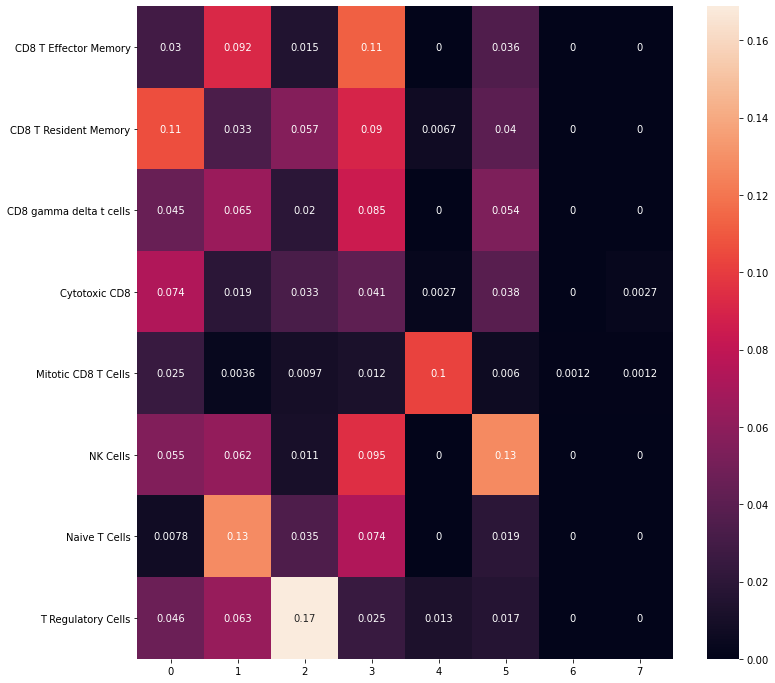


```python
sc.write('/mnt/lugli/SP025_NaClTcell/PangenomeBlueprint/write/adata_lungTcell_clsutered.h5ad', adata_lungTcell) 
```


```python
list_old = adata_lungTcell.obs['leiden_r6_clusters'].tolist()
```


```python
list_new= list_old
```


```python
for n, i in enumerate(list_old):
    if i == '0':
        list_new[n] = 'CD8'    
    if i == '1':
        list_new[n] = 'CD4'
    if i == '2':
        list_new[n] = 'CD4'
    if i == '3':
        list_new[n] = 'CD8'
    if i == '4':
        list_new[n] = 'CD8'
    if i == '5':
        list_new[n] = 'CD8'
    if i == '6':
        list_new[n] = 'CD8'
    if i == '7':
        list_new[n] = 'CD8'
```


```python
adata_lungTcell.obs['T_cell_main_type']=list_new
```


```python
sc.pl.umap(adata_lungTcell, color=['T_cell_main_type'],legend_loc='on data',s=50)
```

    ... storing 'T_cell_main_type' as categorical


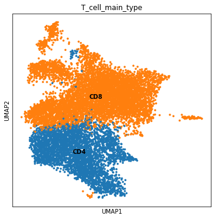


```python
rcParams['figure.figsize'] = 10, 10
marker_genes = ['CD8A','CD4','CD3E','NCAM1','FOXP3','IL2RA']
sc.pl.dotplot(adata_lungTcell, marker_genes, groupby='T_cell_main_type')
#sc.pl.stacked_violin(adata_lungTcell, marker_genes, groupby='leiden_r5_clusters', dendrogram=False)
```


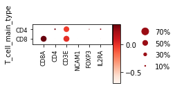


    GridSpec(2, 5, height_ratios=[0, 10.5], width_ratios=[2.0999999999999996, 0, 0.2, 0.5, 0.25])


### Filter only CD8 positive cell 


```python
adata_lungTcell_CD8 = adata_lungTcell[adata_lungTcell.obs['T_cell_main_type'].isin(['CD8']),:] 
adata_lungTcell_CD4 = adata_lungTcell[adata_lungTcell.obs['T_cell_main_type'].isin(['CD4']),:] 
```


```python
sc.write('/mnt/lugli/SP025_NaClTcell/PangenomeBlueprint/write/adata_lungTcell_clsutered_CD8.h5ad', adata_lungTcell_CD8) 
sc.write('/mnt/lugli/SP025_NaClTcell/PangenomeBlueprint/write/adata_lungTcell_clsutered_CD4.h5ad', adata_lungTcell_CD4) 
```


```python
adataAll= sc.read("/mnt/lugli/SP025_NaClTcell/PangenomeBlueprint/write/adatalung.h5ad")
```


```python
adata_CD8 =  adataAll[adata_lungTcell_CD8.obs_names].copy()
```

### Perform canical steps in order to identify sub-cluster of CD8


```python
adata_CD8
```


    AnnData object with n_obs × n_vars = 7277 × 33694 
        obs: 'CellId', 'CellFromTumor', 'PatientNumber', 'TumorType', 'TumorSite', 'CellType'
        var: 'gene_id'


```python
sc.pp.filter_cells(adata_CD8, min_genes=200)
sc.pp.filter_genes(adata_CD8, min_cells=3)
```

    filtered out 17929 genes that are detected in less than 3 cells


```python
adata_CD8 = adata_CD8[:, adata_CD8[:,].to_df().sum(axis=0) > 0] 
```


```python
adata_CD8.var['mt'] = adata_CD8.var_names.str.startswith('MT-')  # annotate the group of mitochondrial genes as 'mt'
sc.pp.calculate_qc_metrics(adata_CD8, qc_vars=['mt'], percent_top=None, inplace=True)
sc.pl.violin(adata_CD8, ['n_genes_by_counts', 'total_counts', 'pct_counts_mt'],
             jitter=0.4, multi_panel=True)
```

    Trying to set attribute `.var` of view, copying.


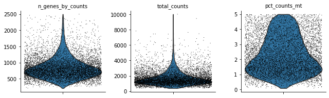


```python
rcParams['figure.figsize'] = 4, 4
sc.pl.scatter(adata_CD8, x='total_counts', y='pct_counts_mt')
sc.pl.scatter(adata_CD8, x='total_counts', y='n_genes_by_counts')
```


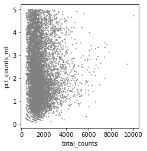


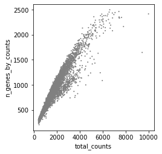


```python
adata_CD8 = adata_CD8[adata_CD8.obs.n_genes_by_counts < 2500, :]
adata_CD8 = adata_CD8[adata_CD8.obs.pct_counts_mt < 5, :]
```


```python
ribo_genes = adata_CD8.var_names.str.startswith(("RP"))
malat1 = adata_CD8.var_names.str.startswith(("MALAT1"))
remove = np.add(ribo_genes,malat1)
keep = np.invert(remove)
adata_CD8 = adata_CD8[:,keep]
```

Library-size normalization


```python
sc.pp.normalize_total(adata_CD8, target_sum=1e4)
```

    normalizing counts per cell
        finished (0:00:01)


Square root transform


```python
sc.pp.sqrt(adata_CD8)
```


```python
adata_CD8.layers["sqrtcounts"] = adata_CD8[:,].to_df()
```

Batch effect removal


```python
sc.pp.combat(adata_CD8, key='PatientNumber')
```

    Standardizing Data across genes.
    
    Found 3 batches
    
    Found 0 numerical variables:
    	
    
    Fitting L/S model and finding priors
    
    Finding parametric adjustments
    


    /home/spuccio/miniconda3/envs/scrnseq/lib/python3.6/site-packages/scanpy/preprocessing/_combat.py:338: RuntimeWarning: divide by zero encountered in true_divide
      change = max((abs(g_new - g_old) / g_old).max(), (abs(d_new - d_old) / d_old).max())


    Adjusting data
    


Imputation


```python
import scanpy.external as sce
sce.pp.magic(adata_CD8, name_list="all_genes", knn=5)
```

    computing MAGIC
      Running MAGIC with `solver='exact'` on 14481-dimensional data may take a long time. Consider denoising specific genes with `genes=<list-like>` or using `solver='approximate'`.
        finished (0:00:25)


```python
adata_CD8.layers["magiccounts"] = adata_CD8[:,].to_df()
```


```python
sc.pp.highly_variable_genes(adata_CD8, flavor='cell_ranger', n_top_genes=4000)
```

    extracting highly variable genes
        finished (0:00:00)
    --> added
        'highly_variable', boolean vector (adata.var)
        'means', float vector (adata.var)
        'dispersions', float vector (adata.var)
        'dispersions_norm', float vector (adata.var)


```python
rcParams['figure.figsize'] = 4, 4
sc.pl.highly_variable_genes(adata_CD8)
```


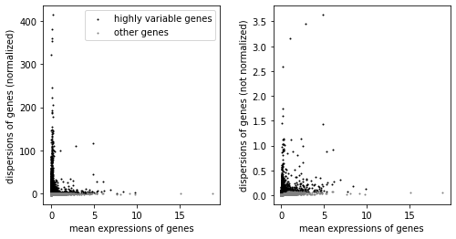


```python
sc.tl.score_genes_cell_cycle(adata_CD8, s_genes=s_genes, g2m_genes=g2m_genes)
```

    calculating cell cycle phase
    computing score 'S_score'
    WARNING: genes are not in var_names and ignored: ['RPA2']
        finished: added
        'S_score', score of gene set (adata.obs) (0:00:00)
    computing score 'G2M_score'
        finished: added
        'G2M_score', score of gene set (adata.obs) (0:00:00)
    -->     'phase', cell cycle phase (adata.obs)


```python
sc.pp.scale(adata_CD8, max_value=10)
```


```python
sc.tl.pca(adata_CD8, svd_solver='arpack')
rcParams['figure.figsize'] = 5, 5
sc.pl.pca(adata_CD8, color=['CD8A','CD4'])
```

        on highly variable genes
    computing PCA with n_comps = 50
        finished (0:00:01)


    ... storing 'phase' as categorical


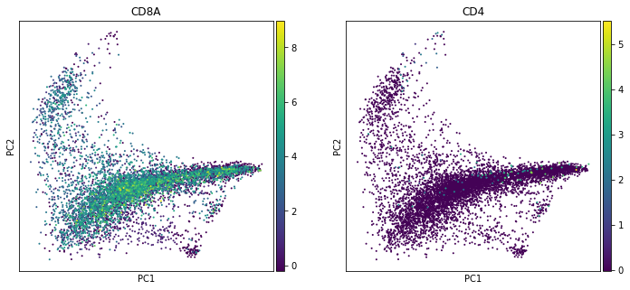


```python
adata_CD8.write("/mnt/lugli/SP025_NaClTcell/PangenomeBlueprint/write/adata_CD8LungCancer.h5ad")
```


```python
sc.pp.neighbors(adata_CD8)
```

    computing neighbors
        using 'X_pca' with n_pcs = 50
        finished: added to `.uns['neighbors']`
        'distances', distances for each pair of neighbors
        'connectivities', weighted adjacency matrix (0:00:01)


```python
sc.tl.umap(adata_CD8)
```

    computing UMAP
        finished: added
        'X_umap', UMAP coordinates (adata.obsm) (0:00:18)


```python
rcParams['figure.figsize'] = 6, 6
sc.pl.umap(adata_CD8,color=['CD8A','CD4'],use_raw=False, color_map=mymap,s=50)
```


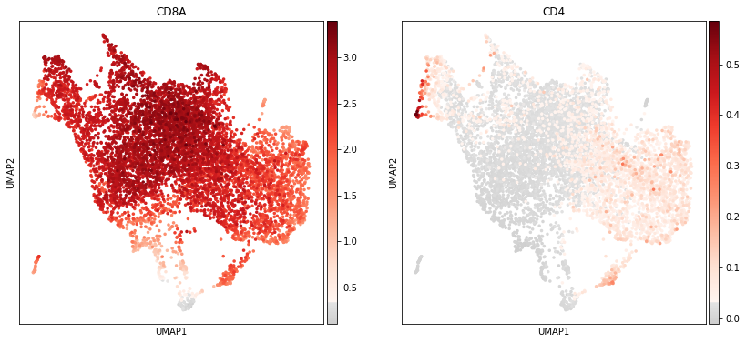


```python

```


```python
sc.tl.leiden(adata_CD8,resolution=0.8, key_added='leiden_r8_clusters',random_state=10,use_weights=True)
sc.tl.leiden(adata_CD8, resolution=0.7, key_added='leiden_r7_clusters', random_state=10,use_weights=True)
sc.tl.leiden(adata_CD8, resolution=0.6, key_added='leiden_r6_clusters', random_state=10,use_weights=True)
sc.tl.leiden(adata_CD8,resolution=0.5, key_added='leiden_r5_clusters',random_state=10,use_weights=True)
sc.tl.leiden(adata_CD8, resolution=0.4, key_added='leiden_r4_clusters', random_state=10,use_weights=True)
```

    running Leiden clustering
        finished: found 18 clusters and added
        'leiden_r8_clusters', the cluster labels (adata.obs, categorical) (0:00:01)
    running Leiden clustering
        finished: found 16 clusters and added
        'leiden_r7_clusters', the cluster labels (adata.obs, categorical) (0:00:01)
    running Leiden clustering
        finished: found 14 clusters and added
        'leiden_r6_clusters', the cluster labels (adata.obs, categorical) (0:00:01)
    running Leiden clustering
        finished: found 13 clusters and added
        'leiden_r5_clusters', the cluster labels (adata.obs, categorical) (0:00:00)
    running Leiden clustering
        finished: found 11 clusters and added
        'leiden_r4_clusters', the cluster labels (adata.obs, categorical) (0:00:01)


```python
adata_CD8
```


    AnnData object with n_obs × n_vars = 7277 × 14481 
        obs: 'CellId', 'CellFromTumor', 'PatientNumber', 'TumorType', 'TumorSite', 'CellType', 'n_genes', 'n_genes_by_counts', 'log1p_n_genes_by_counts', 'total_counts', 'log1p_total_counts', 'total_counts_mt', 'log1p_total_counts_mt', 'pct_counts_mt', 'S_score', 'G2M_score', 'phase', 'leiden_r8_clusters', 'leiden_r7_clusters', 'leiden_r6_clusters', 'leiden_r5_clusters', 'leiden_r4_clusters'
        var: 'gene_id', 'n_cells', 'mt', 'n_cells_by_counts', 'mean_counts', 'log1p_mean_counts', 'pct_dropout_by_counts', 'total_counts', 'log1p_total_counts', 'highly_variable', 'means', 'dispersions', 'dispersions_norm'
        uns: 'pca', 'neighbors', 'umap', 'leiden'
        obsm: 'X_pca', 'X_umap'
        varm: 'PCs'
        layers: 'sqrtcounts', 'magiccounts'


```r
%%R -i adata_CD8

clustree(adata_CD8,prefix="leiden_r",suffix = "_clusters",exprs = "X")
```


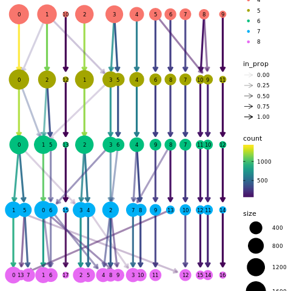

=======
    <matplotlib.axes._subplots.AxesSubplot at 0x7f414ad3bf98>


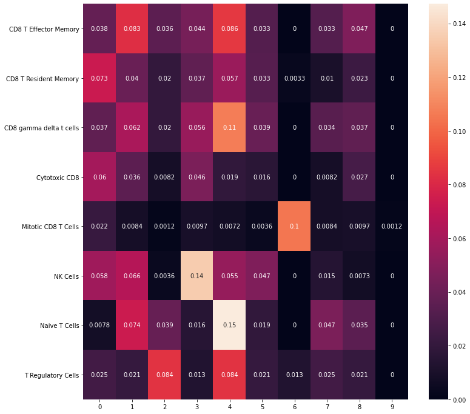


### Perform Clustering with Leiden with several resolution


```python
sc.tl.leiden(adata_lungTcell,resolution=0.8, key_added='leiden_r8_clusters',random_state=10,use_weights=True)
sc.tl.leiden(adata_lungTcell, resolution=0.7, key_added='leiden_r7_clusters', random_state=10,use_weights=True)
sc.tl.leiden(adata_lungTcell, resolution=0.6, key_added='leiden_r6_clusters', random_state=10,use_weights=True)
sc.tl.leiden(adata_lungTcell,resolution=0.5, key_added='leiden_r5_clusters',random_state=10,use_weights=True)
sc.tl.leiden(adata_lungTcell, resolution=0.4, key_added='leiden_r4_clusters', random_state=10,use_weights=True)
sc.tl.leiden(adata_lungTcell,resolution=0.3, key_added='leiden_r3_clusters',random_state=10,use_weights=True)
```

    running Leiden clustering
        finished: found 13 clusters and added
        'leiden_r8_clusters', the cluster labels (adata.obs, categorical) (0:00:02)
    running Leiden clustering
        finished: found 12 clusters and added
        'leiden_r7_clusters', the cluster labels (adata.obs, categorical) (0:00:04)
    running Leiden clustering
        finished: found 9 clusters and added
        'leiden_r6_clusters', the cluster labels (adata.obs, categorical) (0:00:04)
    running Leiden clustering
        finished: found 9 clusters and added
        'leiden_r5_clusters', the cluster labels (adata.obs, categorical) (0:00:02)
    running Leiden clustering
        finished: found 9 clusters and added
        'leiden_r4_clusters', the cluster labels (adata.obs, categorical) (0:00:03)
    running Leiden clustering
        finished: found 7 clusters and added
        'leiden_r3_clusters', the cluster labels (adata.obs, categorical) (0:00:04)


### Clustree visualization for Leidein clustering


```r
%%R -i adata_lungTcell

clustree(adata_lungTcell,prefix="leiden_r",suffix = "_clusters",exprs = "X")
```

    /home/spuccio/miniconda3/envs/scrnseq/lib/python3.6/site-packages/anndata2ri/py2r.py:37: NotConvertedWarning: Conversion 'py2rpy' not defined for objects of type '<class 'NoneType'>'
      warn(str(e), NotConvertedWarning)


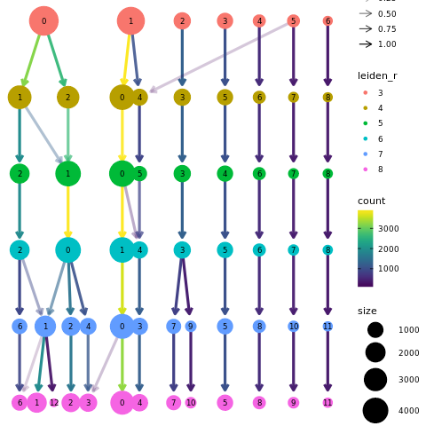


### Absolute frequency for clusters
>>>>>>> d339118485321a54c24ffa554e2338af35789a73


```python
#adata_magic.obs.groupby(["leiden", "SampleID"]).size().reset_index().plot(kind='bar')
fig, (ax1) = plt.subplots(1,1, figsize=(16/2.54, 9/2.54))
<<<<<<< HEAD
ax1 = adata_CD8.obs.groupby("leiden_r5_clusters")["PatientNumber"].value_counts(normalize=True).mul(100).unstack().plot.bar(stacked=True,legend=False,ax=ax1)
=======
ax1 = adata_lungTcell.obs.groupby("leiden_r5_clusters")["PatientNumber"].value_counts(normalize=True).mul(100).unstack().plot.bar(stacked=True,legend=False,ax=ax1)
>>>>>>> d339118485321a54c24ffa554e2338af35789a73
ax1.set_xlabel("Cluster ")
ax1.set_ylabel("% Frequency")
ax1.grid(False)
ax1.legend(bbox_to_anchor=(1.1, 1.0))
<<<<<<< HEAD
sc.pl.umap(adata_CD8,color=['leiden_r5_clusters'],use_raw=False, color_map=mymap,s=50)
```


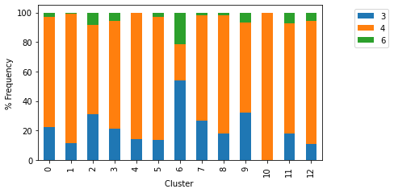


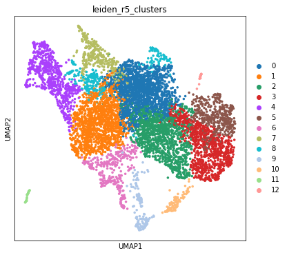
=======
sc.pl.umap(adata_lungTcell,color=['leiden_r5_clusters'],use_raw=False, color_map=mymap,s=50)
```


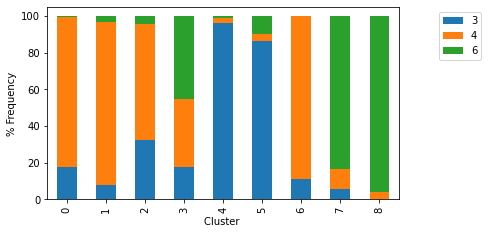


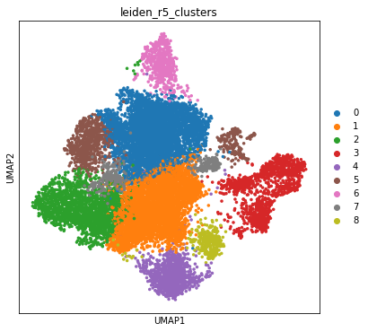
>>>>>>> d339118485321a54c24ffa554e2338af35789a73


```python
rcParams['figure.figsize'] = 10, 10
<<<<<<< HEAD
marker_genes = ['CD8A','GZMK','CD3E','TOX','IL7R','FGFBP2','XCL1']
sc.pl.dotplot(adata_CD8, marker_genes, groupby='leiden_r5_clusters')
=======
marker_genes = ['CD8A','CD4','CD3E','NCAM1','FOXP3']
sc.pl.dotplot(adata_lungTcell, marker_genes, groupby='leiden_r5_clusters')
>>>>>>> d339118485321a54c24ffa554e2338af35789a73
#sc.pl.stacked_violin(adata_lungTcell, marker_genes, groupby='leiden_r5_clusters', dendrogram=False)
```


<<<<<<< HEAD
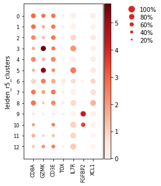
=======


>>>>>>> d339118485321a54c24ffa554e2338af35789a73


<<<<<<< HEAD

    GridSpec(2, 5, height_ratios=[0, 10.5], width_ratios=[2.4499999999999997, 0, 0.2, 0.5, 0.25])


```python
sc.tl.rank_genes_groups(adata_CD8, 'leiden_r5_clusters', method='t-test')
sc.tl.rank_genes_groups(adata_CD8, 'leiden_r5_clusters', method='logreg', key_added = "logreg")
sc.tl.rank_genes_groups(adata_CD8, 'leiden_r5_clusters', method='wilcoxon', key_added = "wilcoxon")
sc.tl.rank_genes_groups(adata_CD8, 'leiden_r5_clusters', method='t-test_overestim_var', key_added = "t-test_overestim_var")
=======
    GridSpec(2, 5, height_ratios=[0, 10.5], width_ratios=[1.75, 0, 0.2, 0.5, 0.25])


### Computer Marker Genes


```python
sc.tl.rank_genes_groups(adata_lungTcell, 'leiden_r5_clusters', method='logreg')
>>>>>>> d339118485321a54c24ffa554e2338af35789a73
```

    ranking genes
        finished: added to `.uns['rank_genes_groups']`
        'names', sorted np.recarray to be indexed by group ids
        'scores', sorted np.recarray to be indexed by group ids
<<<<<<< HEAD
        'logfoldchanges', sorted np.recarray to be indexed by group ids
        'pvals', sorted np.recarray to be indexed by group ids
        'pvals_adj', sorted np.recarray to be indexed by group ids (0:00:10)
    ranking genes
        finished: added to `.uns['logreg']`
        'names', sorted np.recarray to be indexed by group ids
        'scores', sorted np.recarray to be indexed by group ids
     (0:00:18)
    ranking genes
=======
     (0:00:39)
>>>>>>> d339118485321a54c24ffa554e2338af35789a73


    /home/spuccio/miniconda3/envs/scrnseq/lib/python3.6/site-packages/sklearn/linear_model/_logistic.py:764: ConvergenceWarning: lbfgs failed to converge (status=1):
    STOP: TOTAL NO. of ITERATIONS REACHED LIMIT.
    
    Increase the number of iterations (max_iter) or scale the data as shown in:
        https://scikit-learn.org/stable/modules/preprocessing.html
    Please also refer to the documentation for alternative solver options:
        https://scikit-learn.org/stable/modules/linear_model.html#logistic-regression
      extra_warning_msg=_LOGISTIC_SOLVER_CONVERGENCE_MSG)


<<<<<<< HEAD
        finished: added to `.uns['wilcoxon']`
        'names', sorted np.recarray to be indexed by group ids
        'scores', sorted np.recarray to be indexed by group ids
        'logfoldchanges', sorted np.recarray to be indexed by group ids
        'pvals', sorted np.recarray to be indexed by group ids
        'pvals_adj', sorted np.recarray to be indexed by group ids (0:00:16)
    ranking genes
        finished: added to `.uns['t-test_overestim_var']`
        'names', sorted np.recarray to be indexed by group ids
        'scores', sorted np.recarray to be indexed by group ids
        'logfoldchanges', sorted np.recarray to be indexed by group ids
        'pvals', sorted np.recarray to be indexed by group ids
        'pvals_adj', sorted np.recarray to be indexed by group ids (0:00:10)
=======

```python
pd.DataFrame(adata_lungTcell.uns['rank_genes_groups']['names']).head(50)
```


<div>
<style scoped>
    .dataframe tbody tr th:only-of-type {
        vertical-align: middle;
    }

    .dataframe tbody tr th {
        vertical-align: top;
    }

    .dataframe thead th {
        text-align: right;
    }
</style>
<table border="1" class="dataframe">
  <thead>
    <tr style="text-align: right;">
      <th></th>
      <th>0</th>
      <th>1</th>
      <th>2</th>
      <th>3</th>
      <th>4</th>
      <th>5</th>
      <th>6</th>
      <th>7</th>
      <th>8</th>
    </tr>
  </thead>
  <tbody>
    <tr>
      <th>0</th>
      <td>HAVCR2</td>
      <td>IL7R</td>
      <td>RTKN2</td>
      <td>FGFBP2</td>
      <td>CRIP1</td>
      <td>KLRC1</td>
      <td>MKI67</td>
      <td>IGHGP</td>
      <td>FABP4</td>
    </tr>
    <tr>
      <th>1</th>
      <td>CXCL13</td>
      <td>FOS</td>
      <td>IL2RA</td>
      <td>KLRF1</td>
      <td>HBA2</td>
      <td>SPINK1</td>
      <td>KIAA0101</td>
      <td>SCGB3A1</td>
      <td>H3F3A</td>
    </tr>
    <tr>
      <th>2</th>
      <td>KLRC2</td>
      <td>ANXA1</td>
      <td>TNFRSF4</td>
      <td>FCGR3A</td>
      <td>SFTPC</td>
      <td>IFITM1</td>
      <td>RRM2</td>
      <td>IGHG3</td>
      <td>C1QA</td>
    </tr>
    <tr>
      <th>3</th>
      <td>IFNG</td>
      <td>LYAR</td>
      <td>ICA1</td>
      <td>SPON2</td>
      <td>CCL2</td>
      <td>TFPI</td>
      <td>CDC20</td>
      <td>SCGB1A1</td>
      <td>LYZ</td>
    </tr>
    <tr>
      <th>4</th>
      <td>RGS2</td>
      <td>GIMAP4</td>
      <td>FOXP3</td>
      <td>NKG7</td>
      <td>HBA1</td>
      <td>PAEP</td>
      <td>CENPF</td>
      <td>IGHG1</td>
      <td>C1QB</td>
    </tr>
    <tr>
      <th>5</th>
      <td>CCL5</td>
      <td>GZMK</td>
      <td>SELL</td>
      <td>KLRD1</td>
      <td>HBB</td>
      <td>AGR2</td>
      <td>UBE2C</td>
      <td>IGKC</td>
      <td>APOE</td>
    </tr>
    <tr>
      <th>6</th>
      <td>CTSW</td>
      <td>KLF6</td>
      <td>SESN1</td>
      <td>PLEK</td>
      <td>LMNA</td>
      <td>KRT7</td>
      <td>CCNB2</td>
      <td>JCHAIN</td>
      <td>CST3</td>
    </tr>
    <tr>
      <th>7</th>
      <td>CCL3</td>
      <td>BTG2</td>
      <td>LTB</td>
      <td>PLAC8</td>
      <td>CREM</td>
      <td>TYROBP</td>
      <td>ASPM</td>
      <td>IGHG4</td>
      <td>BPIFB1</td>
    </tr>
    <tr>
      <th>8</th>
      <td>GZMB</td>
      <td>TNF</td>
      <td>TBCEL</td>
      <td>S1PR5</td>
      <td>HLA-DRB5</td>
      <td>AC092580.4</td>
      <td>STMN1</td>
      <td>IGLC2</td>
      <td>APOC1</td>
    </tr>
    <tr>
      <th>9</th>
      <td>NKG7</td>
      <td>CTD-3252C9.4</td>
      <td>TNFRSF18</td>
      <td>CMC1</td>
      <td>ZFP36</td>
      <td>CCL20</td>
      <td>CCNB1</td>
      <td>SCGB3A2</td>
      <td>EEF1A1</td>
    </tr>
    <tr>
      <th>10</th>
      <td>GZMH</td>
      <td>KLRG1</td>
      <td>FBLN7</td>
      <td>CD160</td>
      <td>SOCS3</td>
      <td>SFTPB</td>
      <td>TK1</td>
      <td>IGLC3</td>
      <td>HBB</td>
    </tr>
    <tr>
      <th>11</th>
      <td>HSPA1B</td>
      <td>TC2N</td>
      <td>TIGIT</td>
      <td>GZMH</td>
      <td>APOC1</td>
      <td>C15orf48</td>
      <td>TYMS</td>
      <td>AC090498.1</td>
      <td>VSIG4</td>
    </tr>
    <tr>
      <th>12</th>
      <td>VCAM1</td>
      <td>ZFP36L2</td>
      <td>CD79B</td>
      <td>KLRG1</td>
      <td>CCL18</td>
      <td>ANGPTL4</td>
      <td>TUBB</td>
      <td>CMB9-22P13.1</td>
      <td>SCGB1A1</td>
    </tr>
    <tr>
      <th>13</th>
      <td>SERPINH1</td>
      <td>LCP1</td>
      <td>IKZF2</td>
      <td>PRSS23</td>
      <td>SFTPA2</td>
      <td>KIR2DL4</td>
      <td>TROAP</td>
      <td>EGR1</td>
      <td>FAM215B</td>
    </tr>
    <tr>
      <th>14</th>
      <td>GZMA</td>
      <td>DKK3</td>
      <td>AC017002.1</td>
      <td>CX3CR1</td>
      <td>ANXA1</td>
      <td>KRT19</td>
      <td>CEP55</td>
      <td>AKR1C1</td>
      <td>GLUL</td>
    </tr>
    <tr>
      <th>15</th>
      <td>TNFSF10</td>
      <td>A2M-AS1</td>
      <td>IL1R2</td>
      <td>ADGRG1</td>
      <td>IFITM1</td>
      <td>TNFRSF18</td>
      <td>BIRC5</td>
      <td>H3F3A</td>
      <td>FBP1</td>
    </tr>
    <tr>
      <th>16</th>
      <td>TSC22D1</td>
      <td>LY9</td>
      <td>CTLA4</td>
      <td>CST7</td>
      <td>C10orf10</td>
      <td>TRDC</td>
      <td>AURKB</td>
      <td>DERL3</td>
      <td>TFF3</td>
    </tr>
    <tr>
      <th>17</th>
      <td>APOBEC3C</td>
      <td>TNFAIP3</td>
      <td>F5</td>
      <td>TTC38</td>
      <td>SFTPA1</td>
      <td>XCL1</td>
      <td>NUSAP1</td>
      <td>TPSB2</td>
      <td>GCHFR</td>
    </tr>
    <tr>
      <th>18</th>
      <td>CD27</td>
      <td>CLDND1</td>
      <td>NMB</td>
      <td>FABP4</td>
      <td>TM4SF1</td>
      <td>XCL2</td>
      <td>HMGB2</td>
      <td>MTRNR2L12</td>
      <td>RGCC</td>
    </tr>
    <tr>
      <th>19</th>
      <td>HSPA1A</td>
      <td>PASK</td>
      <td>CDO1</td>
      <td>PRF1</td>
      <td>EML4</td>
      <td>KRT8</td>
      <td>CDK1</td>
      <td>TLE4</td>
      <td>MSMB</td>
    </tr>
    <tr>
      <th>20</th>
      <td>DTHD1</td>
      <td>FOSB</td>
      <td>LINC01281</td>
      <td>FCRL6</td>
      <td>ATP2B1</td>
      <td>CCND1</td>
      <td>ZWINT</td>
      <td>HIST2H2BE</td>
      <td>ANKRD28</td>
    </tr>
    <tr>
      <th>21</th>
      <td>TNFRSF9</td>
      <td>GPR183</td>
      <td>FANK1</td>
      <td>CD300A</td>
      <td>GPR183</td>
      <td>KRT18</td>
      <td>NUF2</td>
      <td>GPX2</td>
      <td>M6PR</td>
    </tr>
    <tr>
      <th>22</th>
      <td>ALOX5AP</td>
      <td>DNAJA1</td>
      <td>LAIR2</td>
      <td>FGR</td>
      <td>TAGLN2</td>
      <td>TNNC2</td>
      <td>TOP2A</td>
      <td>EEF1A1</td>
      <td>MARCO</td>
    </tr>
    <tr>
      <th>23</th>
      <td>IFIT1</td>
      <td>CD40LG</td>
      <td>MAGEH1</td>
      <td>KLRB1</td>
      <td>CAMK4</td>
      <td>AREG</td>
      <td>PRC1</td>
      <td>MTRNR2L8</td>
      <td>MYADM</td>
    </tr>
    <tr>
      <th>24</th>
      <td>TRDC</td>
      <td>CXCR4</td>
      <td>ICOS</td>
      <td>TRGC2</td>
      <td>PTGER4</td>
      <td>SAA1</td>
      <td>CENPN</td>
      <td>IGHA1</td>
      <td>RBPJ</td>
    </tr>
    <tr>
      <th>25</th>
      <td>CRTAM</td>
      <td>MALT1</td>
      <td>NABP1</td>
      <td>GNLY</td>
      <td>GPR171</td>
      <td>S100A16</td>
      <td>TUBA1B</td>
      <td>TNF</td>
      <td>NBEAL1</td>
    </tr>
    <tr>
      <th>26</th>
      <td>ZBED2</td>
      <td>CD69</td>
      <td>ARID5B</td>
      <td>LYZ</td>
      <td>CST3</td>
      <td>IGHG4</td>
      <td>KIF2C</td>
      <td>SDR42E2</td>
      <td>AC090498.1</td>
    </tr>
    <tr>
      <th>27</th>
      <td>HSPA6</td>
      <td>SENP7</td>
      <td>SESN3</td>
      <td>H3F3A</td>
      <td>GNA15</td>
      <td>SPINT2</td>
      <td>DLGAP5</td>
      <td>MZB1</td>
      <td>FAM118A</td>
    </tr>
    <tr>
      <th>28</th>
      <td>TSHZ2</td>
      <td>AREG</td>
      <td>FCMR</td>
      <td>PTGDR</td>
      <td>MT2A</td>
      <td>IGKC</td>
      <td>CDCA5</td>
      <td>LINC00623</td>
      <td>SPI1</td>
    </tr>
    <tr>
      <th>29</th>
      <td>LAG3</td>
      <td>TXNIP</td>
      <td>IL6ST</td>
      <td>LITAF</td>
      <td>VIM</td>
      <td>S100A9</td>
      <td>SGOL1</td>
      <td>HIST1H2BG</td>
      <td>SERPINA1</td>
    </tr>
    <tr>
      <th>30</th>
      <td>ID2</td>
      <td>PIK3R1</td>
      <td>TBC1D4</td>
      <td>GZMM</td>
      <td>MYADM</td>
      <td>LINC00996</td>
      <td>SPC25</td>
      <td>TPSAB1</td>
      <td>CCL18</td>
    </tr>
    <tr>
      <th>31</th>
      <td>AC006129.2</td>
      <td>TMSB10</td>
      <td>NCF4</td>
      <td>ZEB2</td>
      <td>SAMSN1</td>
      <td>SPRY1</td>
      <td>CASC5</td>
      <td>NDUFV2-AS1</td>
      <td>CSTA</td>
    </tr>
    <tr>
      <th>32</th>
      <td>IFIT3</td>
      <td>BTG1</td>
      <td>CD200</td>
      <td>CTSW</td>
      <td>CCNH</td>
      <td>C19orf33</td>
      <td>FEN1</td>
      <td>HMGN2</td>
      <td>VIM</td>
    </tr>
    <tr>
      <th>33</th>
      <td>ISG15</td>
      <td>AP3M2</td>
      <td>PIM2</td>
      <td>SH3BP5</td>
      <td>SARAF</td>
      <td>SPP1</td>
      <td>SMC4</td>
      <td>IGHG2</td>
      <td>RBMS1</td>
    </tr>
    <tr>
      <th>34</th>
      <td>ENTPD1</td>
      <td>DIS3</td>
      <td>AC133644.2</td>
      <td>MYBL1</td>
      <td>TNFAIP3</td>
      <td>FCER1G</td>
      <td>SHCBP1</td>
      <td>CD40LG</td>
      <td>S100A11</td>
    </tr>
    <tr>
      <th>35</th>
      <td>CD7</td>
      <td>SLC2A3</td>
      <td>TNFSF13B</td>
      <td>VCL</td>
      <td>SFTPD</td>
      <td>KLRD1</td>
      <td>CENPA</td>
      <td>HIST3H2BB</td>
      <td>RETN</td>
    </tr>
    <tr>
      <th>36</th>
      <td>XCL2</td>
      <td>LEPROTL1</td>
      <td>BTLA</td>
      <td>RAB9A</td>
      <td>FAM46C</td>
      <td>CHRM3-AS2</td>
      <td>CDCA2</td>
      <td>CDC26</td>
      <td>TARSL2</td>
    </tr>
    <tr>
      <th>37</th>
      <td>CD8A</td>
      <td>WDR60</td>
      <td>LY96</td>
      <td>PTGDS</td>
      <td>USP36</td>
      <td>KRT86</td>
      <td>KIFC1</td>
      <td>C21orf62</td>
      <td>EMP3</td>
    </tr>
    <tr>
      <th>38</th>
      <td>GNLY</td>
      <td>TUBA4A</td>
      <td>CYSLTR1</td>
      <td>APBA2</td>
      <td>CD69</td>
      <td>COL1A1</td>
      <td>SMC2</td>
      <td>PGAM1</td>
      <td>TXNIP</td>
    </tr>
    <tr>
      <th>39</th>
      <td>IFI44L</td>
      <td>ROCK2</td>
      <td>CORO1B</td>
      <td>TYROBP</td>
      <td>NHSL2</td>
      <td>KLRB1</td>
      <td>C3orf14</td>
      <td>HSPA1B</td>
      <td>ALDH1A1</td>
    </tr>
    <tr>
      <th>40</th>
      <td>KLRD1</td>
      <td>CHMP4B</td>
      <td>METTL8</td>
      <td>C1orf21</td>
      <td>GPX3</td>
      <td>CD7</td>
      <td>CDKN3</td>
      <td>DNAJB4</td>
      <td>MCEMP1</td>
    </tr>
    <tr>
      <th>41</th>
      <td>CD8B</td>
      <td>NUCB2</td>
      <td>MAL</td>
      <td>ITGB2</td>
      <td>PDCL3</td>
      <td>CRIP1</td>
      <td>KIF15</td>
      <td>HSPA1A</td>
      <td>PLP2</td>
    </tr>
    <tr>
      <th>42</th>
      <td>TTN</td>
      <td>KLHDC4</td>
      <td>TRABD2A</td>
      <td>A2M-AS1</td>
      <td>NAA50</td>
      <td>WFDC2</td>
      <td>GTSE1</td>
      <td>MTRNR2L1</td>
      <td>GTF2IRD2</td>
    </tr>
    <tr>
      <th>43</th>
      <td>HSPB1</td>
      <td>SP3</td>
      <td>SAT1</td>
      <td>C1QB</td>
      <td>CLU</td>
      <td>GNLY</td>
      <td>DDX39A</td>
      <td>H2AFX</td>
      <td>ANXA1</td>
    </tr>
    <tr>
      <th>44</th>
      <td>RBPJ</td>
      <td>GNAS</td>
      <td>SLA</td>
      <td>C1QA</td>
      <td>TSPAN2</td>
      <td>IGHG1</td>
      <td>DEPDC1B</td>
      <td>HNRNPA1L2</td>
      <td>EEF1B2</td>
    </tr>
    <tr>
      <th>45</th>
      <td>CCL4L2</td>
      <td>CDC42SE2</td>
      <td>THADA</td>
      <td>TRBV28</td>
      <td>ZNF331</td>
      <td>CLIC3</td>
      <td>KIF11</td>
      <td>AL928768.3</td>
      <td>CES1</td>
    </tr>
    <tr>
      <th>46</th>
      <td>ADGRG5</td>
      <td>PNRC1</td>
      <td>STAM</td>
      <td>KLF3</td>
      <td>JUND</td>
      <td>ERRFI1</td>
      <td>CKAP2L</td>
      <td>LPAR6</td>
      <td>FTL</td>
    </tr>
    <tr>
      <th>47</th>
      <td>SARDH</td>
      <td>SARAF</td>
      <td>CD177</td>
      <td>AKR1C3</td>
      <td>AIM1</td>
      <td>C8orf4</td>
      <td>RAD51</td>
      <td>ADRB2</td>
      <td>HLA-DRB1</td>
    </tr>
    <tr>
      <th>48</th>
      <td>ARF1</td>
      <td>SERINC5</td>
      <td>B2M</td>
      <td>CST3</td>
      <td>MT1M</td>
      <td>IGFBP3</td>
      <td>CCNA2</td>
      <td>PAEP</td>
      <td>SH2D3A</td>
    </tr>
    <tr>
      <th>49</th>
      <td>NCR3</td>
      <td>TBL3</td>
      <td>OAZ1</td>
      <td>FAM65B</td>
      <td>NR3C1</td>
      <td>CD63</td>
      <td>SPDL1</td>
      <td>GZMH</td>
      <td>HMGN2</td>
    </tr>
  </tbody>
</table>
</div>

>>>>>>> d339118485321a54c24ffa554e2338af35789a73


```python
<<<<<<< HEAD
#compare cluster1 genes, only stores top 100 by default
#rcParams['figure.figsize'] = 6, 6
#wc = adata_lungTcell.uns['wilcoxon']['names']['0']
#tt = adata_lungTcell.uns['t-test']['names']['0']
#tt_ov = adata_lungTcell.uns['t-test_overestim_var']['names']['0']
#lr = adata_lungTcell.uns['logreg']['names']['0']

#from matplotlib_venn import venn3

#venn3([set(wc),set(tt),set(tt_ov)], ('Wilcox','T-test','T-test_ov') )
#plt.show()


#venn3([set(wc),set(lr),set(tt_ov)], ('Wilcox','Logreg','T-test_ov') )
#plt.show()
=======
marker_genes = dict()
```


```python
marker_genes["CD8 T Effector Memory"]  = ['HSPA1A', 'HSPA1B', 'HSPH1', 'ANXA1', 'HSPA8', 'MTRNR2L12', 'IL7R', 'TC2N', 'RPS27', 'GZMM', 'HLA-C', 'RPL41', 'SAMD3', 'DNAJB1', 'GZMH', 'ZFP36L2', 'HSP90AA1', 'MTRNR2L8', 'RPS21', 'RPS29', 'HSPA6', 'SPOCK2', 'PARP8', 'MT-ATP8', 'XCL2', 'CAMK4', 'CACYBP', 'STK17A', 'HSPE1', 'P2RY8', 'RGCC', 'FYN', 'RPS15A', 'TUBA4A', 'HSPD1', 'PTPRCAP', 'DUSP2', 'AIM1', 'STAT4', 'FAM102A', 'SUN2', 'SH2D1A', 'HSP90AB1', 'MATK', 'CHORDC1', 'RPL26', 'SCML4', 'CXCR4', 'NELL2', 'RASAL3', 'CALM1', 'AC090498.1', 'HLA-B', 'CCR7', 'S1PR4', 'KLRG1', 'DNAJA1', 'AHNAK', 'CD52', 'GZMK', 'RNF125', 'SARAF', 'TXNIP', 'RPL36A', 'PLP2', 'HIST1H4C', 'CD69', 'SELPLG', 'ZFAND2A', 'IFITM1', 'LYAR', 'CD3E', 'PTPRC', 'AHSA1', 'ARHGEF1', 'BTG1', 'DUSP1', 'KLF2', 'OASL', 'UBC', 'TSC22D3', 'PLK3', 'CRTAM', 'CD5', 'TAGAP', 'RPS25', 'CD6', 'FKBP4', 'BIN2', 'JMJD6', 'RPL23A', 'TNFSF9', 'CNN2', 'CD48', 'RPL35A', 'RPL28', 'BAG3', 'CXCR3', 'ALOX5AP', 'RPL37', 'ARHGDIB', 'RPS12', 'CTSW', 'DOK2', 'COTL1', 'PCBP1', 'CYTIP', 'RPL30', 'MBP', 'CCND3', 'SEMA4D', 'LIME1', 'GZMA', 'LCP1', 'RPS28', 'ITK', 'CCNH', 'IL21R', 'DEDD2', 'HCST', 'RPL34', 'CDC42EP3', 'CD96', 'SLC7A5', 'ISG20', 'RPS3', 'TTC39C', 'SLBP', 'TCP1', 'RPS4Y1', 'TSPYL2', 'PPP1R2', 'ZC3HAV1', 'SMCHD1', 'F2R', 'GIMAP7', 'RASA3', 'EZR', 'GNG2', 'MYADM', 'RHOF', 'S100A10', 'CRIP1', 'SLC2A3', 'RPS27A', 'RPL17', 'SKAP1', 'PITPNC1', 'LEPROTL1', 'FAM177A1', 'SLC9A3R1', 'IL32', 'PRKCH', 'ZAP70', 'ACAP1', 'RPL39', 'RAC2', 'STOM', 'THEMIS', 'HSPA5', 'EMB', 'RALGAPA1', 'IL2RG', 'CD8B', 'SRSF2', 'PTGER4', 'AOAH', 'DNAJB6', 'SRSF7', 'PIK3R1', 'CSRNP1', 'TES', 'LDHA', 'IL2RB', 'PBXIP1', 'C12orf75', 'TGFB1', 'EML4', 'FCMR', 'RARA', 'RPL38', 'KIAA1551', 'CD37', 'ARHGEF3', 'FKBP5', 'MYH9', 'KLF3', 'CITED2', 'PDCL3', 'IKZF1', 'CD3G', 'PPP2R5C', 'TUBA1A', 'H2AFX', 'TMEM2', 'RPLP2', 'RPL36', 'SYNE1', 'AKNA', 'ADGRE5', 'FLNA', 'RBM39', 'MSN', 'NOP58', 'HERPUD2', 'TRAT1', 'FAU', 'SOCS1', 'SYNE2', 'STIP1', 'UBB', 'PIK3IP1', 'MRPL18', 'SEPT1', 'TAGLN2', 'TNFAIP8', 'PDCD4', 'HNRNPUL1', 'ETS1', 'RORA', 'DDX5', 'DDIT4', 'IL16', 'GABARAPL1', 'CDK17', 'SAP18', 'SF3A1', 'PTGES3', 'SRRT', 'CORO1A', 'FOXP1', 'CAPN2', 'SC5D', 'OCIAD2', 'FXYD5', 'DNTTIP2', 'HMHA1', 'TUBB4B', 'PNP', 'IFNG', 'MAPRE2', 'NBEAL1', 'CYFIP2', 'MT-ND1', 'MT-ND4L', 'RHOH', 'LTB', 'ARAP2', 'MT-ND4', 'ATF7IP', 'S100A4', 'NFATC2', 'MAT2A', 'KLRB1', 'DDX24', 'CDC42SE2', 'RBL2', 'ZFP36', 'APBB1IP', 'TRMT10C', 'FLT3LG', 'SLC38A1', 'CDC42SE1', 'PGK1', 'CD53', 'ARHGAP15', 'RNF213', 'TAPBP', 'YWHAZ', 'IDI1', 'SON', 'TMA7', 'CCT4', 'MECP2', 'STK17B', 'CD44', 'SEPT6', 'NUCB2', 'AES', 'LINC-PINT', 'JAK1', 'ARID5A', 'YWHAB', 'PDE3B', 'IDS', 'PRKACB', 'PSME1', 'FAM129A', 'PLIN2', 'GBP5', 'STK4', 'SP100', 'PNPLA2', 'CCT2', 'PDE4B', 'SLC1A5', 'MCL1', 'JUNB', 'ZC3H12A', 'ELOVL5', 'LRRFIP1', 'IFRD1', 'SAMSN1', 'TAF7', 'NUP98', 'YPEL5', 'CCL4', 'IFNGR1', 'VPS37B', 'TGFBR2', 'PHF20', 'HSPA4', 'NUDC', 'RNF149', 'ODC1', 'CLK1', 'ANKRD12', 'CLDND1', 'TNF', 'JUN', 'CSNK1D', 'PIM1', 'MT2A', 'KLF6', 'TNFAIP3', 'SFPQ', 'IL10RA', 'USP36', 'PER1', 'STARD7', 'ITGB1', 'RP11-290D2.6', 'MT1X', 'NEU1', 'ATP1B3', 'HSPB1', 'LMNA', 'NR4A1']
marker_genes["CD8 T Resident Memory"] = ['CXCL13', 'ETV1', 'PCAT29', 'KLRD1', 'XCL2', 'CRTAM', 'TNFRSF9', 'CTLA4', 'XCL1', 'LYST', 'DUSP2', 'TMEM2', 'CD8A', 'TIGIT', 'CD7', 'CD8B', 'PTPN22', 'AKAP5', 'NKG7', 'COTL1', 'ITM2A', 'RPS15A', 'CCL5', 'RNF19A', 'CNOT6L', 'HCST', 'DUSP4', 'CBLB', 'SLA', 'HOPX', 'TOX', 'PDCD1', 'CST7', 'CTSW', 'RPL28', 'RPS27', 'PTPRC', 'RAB27A', 'CD3D', 'TRAT1', 'FYN', 'PRKCH', 'CD27', 'CLEC2D', 'CD3E', 'IL32', 'ICOS', 'GZMA', 'CCL4', 'GFOD1', 'BTG1', 'NR3C1', 'ZFP36L2', 'CD96', 'PDE7A', 'CREM', 'ATP8A1', 'SH2D1A', 'LEPROTL1', 'MT-ND3', 'ISG20', 'FABP5', 'TRBC2', 'GEM', 'RGCC', 'HNRNPLL', 'PCED1B', 'RPLP1', 'SARAF', 'RPL12', 'NAB1', 'ARAP2', 'FAU', 'ALOX5AP', 'LAG3', 'TNFRSF1B', 'FAM177A1', 'RPL37', 'CD52', 'ITGA4', 'SIRPG', 'TRBC1', 'RPS24', 'SNX9', 'RPS15', 'RPL39', 'RPS21', 'SRGN', 'TUBA4A', 'SH3BGRL3', 'HMGB2', 'PTMS', 'ITGAE', 'ASXL2', 'RGS2', 'LIMD2', 'ITK', 'RPL35A', 'HLA-C', 'PYHIN1', 'WIPF1', 'SLA2', 'BCL11B', 'ETS1', 'SH2D2A', 'RPL18', 'RPL41', 'PPP1R2', 'MT-CO2', 'RPS28', 'IKZF3', 'VCAM1', 'SLC7A5', 'C12orf57', 'HAVCR2', 'SYTL3', 'RARRES3', 'NR4A2', 'TMA7', 'CXCR6', 'CCSER2', 'IFI16', 'SRRT', 'CD2', 'RPL26', 'SOD1', 'SNAP47', 'CLEC2B', 'CD99', 'ZEB2', 'EVL', 'PNRC1', 'CD3G', 'RPS2', 'RAC2', 'LBH', 'LINC00152', 'HSPE1', 'NUCB2', 'ELF1', 'IL2RG', 'PTPRCAP', 'C9orf16', 'SH3KBP1', 'UBE2B', 'STK4', 'PARK7', 'ADGRE5', 'RPL24', 'WHSC1L1', 'SEPT7', 'SRSF7', 'MAPRE2', 'COMMD6', 'EZR', 'RHBDD2', 'PPP1R16B', 'NIN', 'YPEL5', 'PCBP1', 'CDKN1B', 'LSP1', 'NFATC2', 'STAT3', 'RASAL3', 'LCK', 'SEMA4D', 'VPS37B', 'EMD', 'CD69', 'PPP2R5C', 'FAM3C', 'STK17B', 'MBNL1', 'ENTPD1', 'SIT1', 'GABARAPL1', 'CXCR4', 'ARID4B', 'PIK3IP1', 'CYTIP', 'CHIC2', 'STK17A', 'PARP8', 'GNG2', 'ATP5L', 'SRSF2', 'SNRPD2', 'RBM39', 'JMJD6', 'SUB1', 'PNISR', 'ATPIF1', 'CYCS', 'CRIP1', 'SLC38A1', 'FCMR', 'KIAA1551', 'RGS1', 'SKAP1', 'TERF2IP', 'NAP1L4', 'PSME1', 'TOMM5', 'C5orf56', 'PMAIP1', 'TSPYL2', 'SP140', 'RUNX3', 'IL21R', 'CNIH1', 'BUB3', 'ATXN1', 'RHOH', 'HLA-F', 'USP11', 'ARHGAP9', 'GSPT1', 'PTPN7', 'SHFM1', 'PPM1G', 'CCND2', 'GBP2', 'RALGAPA1', 'ISG15', 'CHST12', 'ARF6', 'SEPT1', 'PIK3R1', 'TBRG1', 'MAZ', 'EPC1', 'PTP4A1', 'LINC-PINT', 'SPN', 'NAA50', 'IFI27L2', 'FKBP5', 'ZBTB1', 'ITGB1', 'RNF125', 'AKAP13', 'JAK1', 'RELB', 'GPBP1', 'HBP1', 'STARD7', 'CELF2', 'GNAS', 'CDC42SE2', 'ATP5D', 'MT2A', 'SMG1', 'ODC1', 'HSPH1', 'CHORDC1', 'MAT2B', 'IDI1', 'CDK2AP2', 'SUN2', 'GGA2', 'C9orf142', 'OGT', 'RSRP1', 'SAMSN1', 'SON', 'KPNA2', 'DHX36', 'NBEAL1', 'CHD1', 'TSTD1', 'TANK', 'ATRX', 'RPL22L1', 'SCAND1', 'DNAJB1', 'EVI2A', 'BTG3', 'RBPJ', 'ARGLU1', 'KLRB1', 'NOP58', 'CNN2', 'PPP1R12A', 'KMT2E', 'PPP4R2', 'HSPD1', 'CD38', 'SCAF11', 'ATP1B3', 'ISCA1', 'REL', 'CLK1', 'GLUD1', 'GPCPD1', 'GZMM', 'N4BP2L2', 'AHSA1', 'PIM3', 'CACYBP']
marker_genes["CD8 gamma delta t cells"]  = ['KLRD1', 'GZMH', 'AC092580.4', 'XCL2', 'ZFP36L2', 'GZMB', 'IL7R', 'STAT4', 'GZMM', 'RNF125', 'PARP8', 'FAM177A1', 'BTG1', 'DUSP2', 'RPS27', 'AIM1', 'ANXA1', 'FYN', 'SPOCK2', 'SLC7A5', 'MATK', 'HLA-C', 'CXCR4', 'RPL41', 'TUBA4A', 'GNG2', 'XCL1', 'GABARAPL1', 'IFITM1', 'ALOX5AP', 'SATB1', 'RGCC', 'ISG20', 'PIK3R1', 'RORA', 'SYTL3', 'TGFB1', 'MYADM', 'LEPROTL1', 'TC2N', 'SARAF', 'RPL28', 'RPS29', 'SRSF2', 'P2RY8', 'FKBP5', 'CTSW', 'PBX4', 'AOAH', 'PTPRC', 'CAMK4', 'RPS15A', 'IL21R', 'CD52', 'RPS21', 'RPS12', 'S100A4', 'ARHGDIB', 'CD69', 'HLA-B', 'RARA', 'IL32', 'EZR', 'CD7', 'CD96', 'HNRNPUL1', 'CNOT6L', 'CALM1', 'TSC22D3', 'RALGAPA1', 'KLRB1', 'RPS27A', 'SCML4', 'EML4', 'ZFP36', 'SOCS1', 'HCST', 'DDIT4', 'PPP1R16B', 'SRGN', 'PITPNC1', 'LDHA', 'HOPX', 'GPR171', 'KLRG1', 'RPS25', 'IFNGR1', 'REL', 'RPL39', 'PDCD4', 'RPL35A', 'SLC2A3', 'RPL32', 'STK17A', 'ADGRE5', 'S1PR4', 'RPS14', 'PTGER4', 'LCP1', 'OASL', 'CCNH', 'YWHAZ', 'S100A10', 'PRF1', 'RPL23A', 'RASA3', 'SH2D2A', 'AKNA', 'FLNA', 'TAGLN2', 'RUNX3', 'MT-ATP8', 'CCL4', 'SYAP1', 'RPS28', 'GZMA', 'RPL26', 'FAM102A', 'ABLIM1', 'CD3E', 'RPL34', 'PTMA', 'MCL1', 'SELPLG', 'KMT2E', 'ETS1', 'GPR65', 'PTPN22', 'RPLP2', 'PDE4B', 'VPS37B', 'FAM129A', 'SRSF7', 'RPL36A', 'RPL30', 'AHNAK', 'CDC42SE2', 'PNRC1', 'TTC39C', 'SLC10A3', 'HERPUD2', 'RPL37', 'RPS3', 'EMB', 'SLA', 'GLIPR1', 'USP36', 'CXCR6', 'BZW1', 'SMCHD1', 'AKAP13', 'EMD', 'SFPQ', 'MT-ND3', 'LYAR', 'RNF149', 'HLA-A', 'LRRFIP1', 'YPEL5', 'S100A6', 'HSPA8', 'PLP2', 'RPL36AL', 'MBP', 'FAM46C', 'DDX24', 'CXCR3', 'TRBC2', 'SEMA4D', 'IFITM2', 'TMEM2', 'PCBP1', 'IL2RG', 'TRBC1', 'CRIP1', 'MYH9', 'CRTAM', 'G3BP2', 'HSPA5', 'MECP2', 'CDK17', 'PPP2R5C', 'NUP98', 'HIST1H4C', 'GUK1', 'JMJD6', 'CD8A', 'ELOVL5', 'ARF6', 'CD6', 'TNFAIP3', 'RPL36', 'SLC38A1', 'ARID5A', 'PIK3IP1', 'ARHGAP9', 'GYG1', 'AC090498.1', 'HSPH1', 'FAU', 'RPL38', 'RNF138', 'MTRNR2L12', 'ST3GAL1', 'C12orf75', 'ADSS', 'SKIL', 'PER1', 'FBXO34', 'PLK3', 'GSPT1', 'HSPE1', 'CREM', 'PLEKHA2', 'PDCL3', 'IKZF1', 'TSEN54', 'CD5', 'GPBP1', 'ATP8A1', 'PHF20', 'TNFRSF1B', 'CCND3', 'DIAPH1', 'HSPD1', 'CEBPZ', 'IDS', 'PRKCH', 'SUN2', 'DUSP1', 'CYTIP', 'GPR132', 'PRKX', 'STOM', 'CD55', 'NDUFS5', 'CYTH1', 'PPP2CA', 'TRAT1', 'PFKFB3', 'PTP4A1', 'IQGAP2', 'CSNK1D', 'ELL2', 'YIPF5', 'DHX36', 'FNBP1', 'BIN2', 'RPL17', 'PBXIP1', 'SLBP', 'DNAJB6', 'RBMS1', 'TUBB2A', 'RHOF', 'CITED2', 'KLF3', 'FOSL2', 'STK4', 'PPP1CB', 'MAZ', 'ARAP2', 'C9orf78', 'HNRNPA0', 'CD44', 'RASSF5', 'JAK1', 'IDI1', 'NR4A3', 'SH2D1A', 'ZC3HAV1', 'LMNA', 'CDC42SE1', 'PRNP', 'ACTN4', 'PDE3B', 'RASAL3', 'CAST', 'ATP1A1', 'STARD7', 'CSRNP1', 'MSN', 'SLC16A3', 'BCAS2', 'MT2A', 'WIPF1', 'RANBP2', 'RHOH', 'SURF4', 'BCL11B', 'MAT2A', 'TERF2IP', 'RAP1B', 'SRRM1', 'LIME1', 'CAPN2', 'MTRNR2L8', 'EVI2A', 'ACAP1', 'CD48', 'RBM39', 'LITAF', 'VIM', 'AREG', 'TMA7', 'TES', 'UBC', 'ID2', 'BRD2', 'SLA2', 'AES', 'SC5D', 'ITK', 'CD53', 'PPP1R2', 'CHD1', 'MAP1LC3B', 'PGK1', 'NCL', 'BHLHE40', 'ATF7IP', 'SELK', 'SERPINB9', 'PHF1', 'ICAM3', 'CELF2', 'PRKAR2A', 'HSP90AA1', 'BAZ1A', 'CCSER2', 'SCAF11', 'DOK2', 'ATP1B3', 'SEC62', 'UPP1', 'BIRC2', 'NBEAL1', 'CLEC2B', 'CNOT2', 'ZC3H12A', 'TUBB4B', 'NFKB1', 'SETD2', 'HSPA1A', 'JUND', 'KDM6B', 'MGAT4A', 'KIAA1551', 'PIM1', 'ERN1', 'TSPYL2', 'SNHG15', 'RP5-1171I10.5', 'RELB', 'TAGAP']
marker_genes["Cytotoxic CD8"] = ['TRBV15', 'NKG7', 'TRAV19', 'CCL5', 'CST7', 'CD8A', 'GZMK', 'VCAM1', 'CD27', 'TRAV26-1', 'CMC1', 'CD8B', 'LAG3', 'DUSP4', 'CD3D', 'PRF1', 'GZMA', 'TNFRSF9', 'CD2', 'TRAC', 'LYST', 'CTSW', 'RGS1', 'DENND2D', 'SNAP47', 'CD3G', 'CD3E', 'CD7', 'ADGRG1', 'ZNF331', 'HLA-A', 'TOX', 'ITM2A', 'LCK', 'LIMD2', 'CREM', 'PSMB9', 'HLA-E', 'HLA-B', 'B2M', 'IL32', 'RNF19A', 'NR4A2', 'CORO1A', 'LITAF', 'MALAT1', 'SIT1', 'HAVCR2', 'SIRPG', 'APOBEC3G', 'CXCR4', 'LBH', 'IL2RG', 'TRBC2', 'PARK7', 'EVL', 'CHST12', 'UBC', 'IRF1', 'SH2D2A', 'H3F3B', 'ITGA4', 'DDX5', 'GATA3', 'PTPN6', 'PRKCH', 'PDCD1', 'TERF2IP', 'TNFRSF1B', 'RARRES3', 'PTPN7', 'MTRNR2L8', 'APOBEC3C', 'CCNI', 'HNRNPA1', 'RPS4Y1', 'SYTL3', 'RUNX3', 'APMAP', 'SLA', 'CBLB', 'HNRNPLL', 'TUBA4A', 'TNFAIP3', 'SUB1', 'SLA2', 'SPN', 'PSTPIP1', 'PRDM1', 'SLC38A1', 'PTPRC', 'RGS2', 'SRSF7', 'LY6E', 'LSP1', 'SRSF5', 'TAP1', 'LAT', 'PSMB8', 'TIGIT', 'CD247', 'SEPT7', 'CD82', 'ENTPD1', 'RAC2', 'SRRT', 'SUMO2', 'STAT3', 'RAB27A', 'CLEC2D', 'STK17B', 'FAM3C', 'TRAF3IP3', 'MIR155HG', 'CCND2', 'ALDOA', 'PKM', 'CFL1', 'NPM1', 'CLIC1', 'FKBP1A', 'CNBP', 'CALR', 'UBB', 'ARHGAP9', 'CDK2AP2', 'HLA-F', 'SOD1', 'CIRBP', 'ARPC2', 'SYNGR2', 'ZFP36', 'NCL', 'CARHSP1', 'ACTG1', 'EIF5', 'CXCR3', 'ANXA6', 'TRAT1', 'CD2BP2', 'DRAP1', 'HNRNPK', 'LAPTM5', 'HOPX', 'CALM3', 'PSME1', 'PPDPF', 'CD38', 'DDIT4', 'GALM', 'AKNA', 'HMGB1', 'CD99', 'PDIA3', 'SPTAN1', 'PGAM1', 'HNRNPF', 'ARL6IP5', 'ARID4B', 'SEPT1', 'TPI1', 'ATP6V0E1', 'BRD2', 'FYB', 'SRSF2', 'CHCHD2', 'UCP2', 'MYH9', 'TMBIM6', 'PSMA7', 'TBC1D10C', 'PRRC2C', 'KMT2E', 'FUS', 'PEBP1', 'ISCU', 'BST2', 'ACAP1', 'EDF1', 'EID1', 'WIPF1', 'YWHAZ', 'PPP1CA', 'GPR65', 'PSME2', 'CYCS', 'CD37', 'SYNE2', 'C12orf57', 'SKP1', 'ABI3', 'PAG1', 'SH3KBP1', 'JUNB', 'UBE2L6', 'HSPA5', 'YPEL5', 'SLC9A3R1', 'TSPYL2', 'BAX', 'GABARAPL2', 'DAZAP2', 'MSN', 'DDX6', 'RHBDD2', 'GPSM3', 'LCP2', 'HMGN1', 'SPCS1', 'ID2', 'MAP3K8', 'RBM8A', 'CTSC', 'TMEM2', 'PSMB10', 'BUB3', 'VCP', 'RNF167', 'ADGRE5', 'AIP', 'CCDC85B', 'CIB1', 'ICAM3', 'RAB1B', 'CLDND1', 'ZFP36L1', 'TRBC1', 'PRR13', 'SF3B2', 'SKAP1', 'NOP58', 'HNRNPDL', 'RBM3', 'PSMB1', 'SNX9', 'LDHB', 'BHLHE40', 'CCNDBP1', 'TAPBP', 'TPR', 'THRAP3', 'LCP1', 'ZBTB38', 'ARF1', 'ITGB2', 'CLEC2B', 'IDH2', 'NCOR1', 'SRI', 'DDX24', 'SERTAD1', 'BCLAF1', 'TRAPPC1', 'SURF4', 'TRIM22', 'HNRNPA0', 'GIMAP4', 'SRSF3', 'EPC1', 'XRCC6', 'ANAPC16', 'WAS', 'SSR2', 'GBP5', 'PSMB3', 'SEPT9', 'PDIA6', 'EWSR1', 'JTB', 'RASSF5', 'C9orf142', 'G3BP2', 'HNRNPA3', 'PRPF38B', 'STAT1', 'WDR1', 'BTG3', 'CDKN1B', 'PRELID1', 'SON', 'FNBP1', 'IDS', 'CAP1', 'HNRNPR', 'ARHGEF1', 'PHLDA1', 'ELF1', 'ADAR', 'TMEM50A', 'SF3B1', 'UBXN1', 'C20orf24', 'PPP2R1A', 'KIAA1551', 'IDI1', 'GTF2B', 'GBP2', 'CRIP1', 'PNISR', 'SNRPB', 'ARF5', 'SF1', 'RNF213', 'MPHOSPH8', 'ATRX', 'PSMA3', 'TMEM179B', 'PTPN22', 'REEP5', 'SHISA5', 'C11orf58', 'OPTN', 'PSMA5', 'C14orf166', 'RNPS1', 'HSPA9', 'ADRM1', 'PDCD6', 'PPM1G', 'VPS37B', 'SCAMP2', 'MEAF6', 'ANXA11', 'MTDH', 'MAF1', 'M6PR', 'LINC00152', 'IMP3', 'SCAND1', 'PPP1CC', 'IFI16', 'SS18L2', 'SELT', 'AKIRIN1', 'NONO', 'ARGLU1', 'KIF5B', 'AKIRIN2', 'SUMO1', 'CELF2', 'XRCC5', 'PPP4C', 'ROCK1', 'ARL4C', 'HMGN3', 'IL10RA', 'TAX1BP1', 'ENSA', 'PSMD8', 'WHSC1L1', 'UBXN4', 'JAK1', 'MAT2B', 'AP3S1', 'SYF2', 'OTUB1', 'DYNLT1', 'CNPY3', 'HNRNPM', 'PSMB2', 'SIVA1', 'ARID5A', 'RSRP1', 'BCAP31', 'ANP32A', 'EIF4H']
marker_genes["Mitotic CD8 T Cells"] = ['TYMS', 'RRM2', 'MKI67', 'UBE2C', 'CENPF', 'TOP2A', 'CCNA2', 'NUSAP1', 'ASPM', 'TPX2', 'CKS1B', 'CDK1', 'ZWINT', 'ASF1B', 'TK1', 'CENPM', 'UHRF1', 'KIFC1', 'HIST1H1B', 'BIRC5', 'SMC2', 'CDKN3', 'MAD2L1', 'CDC20', 'PKMYT1', 'DHFR', 'CLSPN', 'AURKB', 'KIAA0101', 'CASC5', 'EZH2', 'UBE2T', 'CENPE', 'HMGB3', 'RACGAP1', 'NUF2', 'CENPW', 'CENPU', 'CCNB2', 'CCNB1', 'PLK1', 'CDCA5', 'DLGAP5', 'KIF23', 'CKAP2L', 'CENPN', 'CDCA8', 'GINS2', 'FANCI', 'KIF11', 'TCF19', 'RAD51AP1', 'KIF2C', 'NCAPH', 'TROAP', 'GTSE1', 'DEPDC1B', 'PRC1', 'MCM4', 'KIF15', 'CDCA2', 'NCAPG', 'HMMR', 'CDCA7', 'KIF14', 'CENPH', 'ESCO2', 'BUB1', 'CDCA3', 'NEIL3', 'NCAPG2', 'FAM111B', 'SPC25', 'CDT1', 'CENPA', 'ANLN', 'HJURP', 'CHEK1', 'DIAPH3', 'RAD51', 'FOXM1', 'MELK', 'MND1', 'CEP55', 'CDC6', 'CDC45', 'MYBL2', 'E2F8', 'DTL', 'SGOL1', 'SKA1', 'POC1A', 'PLK4', 'MCM2', 'FBXO5', 'ATAD2', 'FEN1', 'ECT2', 'ARHGAP11A', 'WDR34', 'NDC80', 'CENPK', 'MCM7', 'ORC6', 'SGOL2', 'STMN1', 'SPAG5', 'NCAPD2', 'TIMELESS', 'KIAA1524', 'DTYMK', 'PHF19', 'LIG1', 'PCNA', 'HELLS', 'SMC4', 'TMEM106C', 'FANCD2', 'HIRIP3', 'KIF22', 'HMGB2', 'WDR76', 'ATAD5', 'WHSC1', 'CCDC34', 'TMPO', 'GGH', 'SNRNP25', 'RNASEH2A', 'RFC4', 'AURKA', 'KIF20B', 'RPL39L', 'DNAJC9', 'MCM3', 'LRR1', 'CDCA4', 'SAE1', 'PTTG1', 'RRM1', 'BARD1', 'LMNB1', 'TUBB', 'GMNN', 'INCENP', 'NUDT1', 'WDHD1', 'TTF2', 'HIST1H1D', 'MCM5', 'NRM', 'CHAF1A', 'HMGN2', 'USP1', 'ANP32E', 'NCAPD3', 'RFC5', 'C12orf75', 'DLEU2', 'CCDC28B', 'SMC3', 'RPA3', 'TACC3', 'BRCA2', 'CARHSP1', 'POLA2', 'HMGB1', 'SAC3D1', 'DDX11', 'HIST1H4C', 'HIST1H1E', 'H2AFZ', 'BCL2L12', 'SMC1A', 'YEATS4', 'CDKN2A', 'TUBA1B', 'H2AFX', 'CKAP5', 'DEK', 'TOPBP1', 'FABP5', 'VRK1', 'SKA2', 'SSRP1', 'RBL1', 'PFN1', 'MCM6', 'H2AFV', 'CDC25B', 'FAM111A', 'ANP32B', 'MAD2L2', 'NCAPH2', 'TFDP1', 'RANBP1', 'CTNNAL1', 'DUT', 'DNMT1', 'MTHFD1', 'ACTB', 'LSM4', 'RAD21', 'ACAT2', 'NABP2', 'WDR54', 'GAPDH', 'TUBG1', 'ACOT7', 'CALM3', 'BAZ1B', 'CBX5', 'TEX30', 'CEP78', 'POLD3', 'RNASEH2B', 'DDX39A', 'C19orf48', 'HDAC1', 'CKS2', 'PAFAH1B3', 'SIVA1', 'HAUS1', 'ZDHHC12', 'CDKN2D', 'MIS18BP1', 'CFL1', 'ACTL6A', 'RAD51C', 'ITGB3BP', 'NUCKS1', 'RAN', 'POLR3K', 'RBBP7', 'CKAP2', 'FANCA', 'NUDT21', 'TOX', 'LSM5', 'LBR', 'MZT1', 'IDH2', 'PIN1', 'PSMC3', 'HADH', 'CNTRL', 'HSPB11', 'SFXN1', 'VDAC3', 'EBP', 'PRIM2', 'PPIA', 'TMEM14A', 'GMPS', 'CBX3', 'SIT1', 'BUB3', 'APOBEC3C', 'FDPS', 'LSM2', 'HNRNPR', 'STRA13', 'HN1', 'CORO1A', 'ACTG1', 'RALY', 'CDCA7L', 'HNRNPA2B1', 'HMGN1', 'BANF1', 'PPP1CA', 'PARP1', 'BATF', 'FIBP', 'NUDT5', 'ACYP1', 'DCPS', 'MAGOHB', 'DDB2', 'ARL6IP6', 'PSMB9', 'PTMA', 'SNRPA', 'MPHOSPH9', 'PCNT', 'PGAM1', 'SNRPD1', 'H2AFY', 'CDK2AP2', 'RFC2', 'TPI1', 'SNRPB', 'POP7', 'HAT1', 'CXCL13', 'OXCT1', 'SUPT16H', 'DCTPP1', 'HCFC1', 'ARPC5L', 'VBP1', 'JAKMIP1', 'C1orf35', 'RBBP4', 'HPRT1', 'TRNAU1AP', 'RCC1', 'NUP37', 'ODF2', 'CSE1L', 'MRPS11', 'HINT2', 'PSMB2', 'RBBP8', 'CTPS1', 'MYL6B', 'EXOSC8', 'DCTN3', 'SNRNP40', 'HDGF', 'NUP107', 'KPNA2', 'POLD2', 'RAC2', 'ITM2A', 'NASP', 'KIF2A', 'LSM14A', 'RAB27A', 'RHNO1', 'CEP57', 'TSEN15', 'ITGB1BP1', 'COX8A', 'PA2G4', 'PRDX3', 'SPN', 'PPIH', 'LSM6', 'PAICS', 'TUBB4B', 'PRKDC', 'HP1BP3', 'MRPL37', 'UBE2S', 'C17orf49', 'PKM', 'CCDC167', 'CDKN2C', 'PSIP1', 'NUDT15', 'PPM1G', 'SRP9', 'EXOSC9', 'HNRNPF', 'MAP4K1', 'ARPC2', 'RECQL', 'SRSF10', 'TAF15', 'IFI27L1', 'NUP210', 'PSMD2', 'SNRPA1', 'SCCPDH', 'UCHL5', 'SH2D1A', 'TPGS2', 'POLR2G', 'CYB5B', 'SNRPF', 'TESC', 'ANAPC11', 'PCMT1', 'HIST1H1C', 'NFATC2IP', 'PSTPIP1', 'SUMO2', 'NUP50', 'NONO', 'SLC25A5', 'ANAPC15', 'PDCD5', 'MRPL13', 'TOX2', 'HAUS2', 'PSMB8', 'PRPSAP1', 'HMGXB4', 'NUCB2', 'RUVBL2', 'PSMA4', 'RANGAP1', 'RPIA', 'RSRC1', 'INO80E', 'SSNA1', 'RNPS1', 'PSMD1', 'RFC1', 'TMEM109', 'SUZ12', 'HNRNPA3', 'ILF3', 'TAP1', 'TUBA1C', 'ILF2', 'NAP1L1', 'SNRPE', 'CD3G', 'ARPC5', 'U2AF2', 'THOC3', 'CDK5RAP2', 'DBF4', 'ANXA6', 'HNRNPD', 'LCK', 'CDK2', 'PTBP1', 'SEPT11', 'CCT5', 'CDK4', 'CD8B', 'TPR', 'PSMB3', 'CLIC1', 'IFI16', 'CBX1', 'PDCD1', 'TALDO1', 'IKZF3', 'PTPN7', 'ERH', 'XPO1', 'GALM', 'WDR1', 'TCP1', 'IMMT', 'ACTN4', 'DCXR', 'MEA1', 'HSD17B10', 'FAM96A', 'SF3A2', 'CTLA4', 'UBE2I', 'TIPRL', 'PARK7', 'SNRPC', 'CLN6', 'LAGE3', 'PDS5B', 'PMAIP1', 'RAB1B', 'PSMD7', 'SMARCC1', 'ITGAE', 'ID3', 'SNRPD3', 'MRPL51', 'UFD1L', 'SET', 'CPSF6', 'NELFCD', 'MPC2', 'PDAP1', 'GTF3C6', 'TNFRSF9', 'YWHAQ', 'ETFA', 'LSM3', 'HNRNPAB', 'LAG3', 'COX5A', 'VCAM1', 'MRPL11', 'AATF', 'UBE2N', 'PSMB6', 'NAP1L4', 'APOBEC3G', 'MYL6', 'NUTF2', 'RBM17', 'ROCK1', 'LUC7L2', 'GGCT', 'DENND2D', 'LAT', 'SIRPG', 'ENTPD1', 'PSMD14', 'AP1M1', 'DECR1', 'TIMM10', 'PHF5A', 'TOMM5', 'NDE1', 'KPNB1', 'UBE2A', 'RNASEH2C', 'AIP', 'LSP1', 'FAM195B', 'CMC2', 'DUSP4', 'SMC5', 'CD70', 'SUB1', 'CSK', 'YIF1B', 'DDX46', 'ATP5G3', 'HTATSF1', 'XRCC5', 'COPS3', 'DCK', 'C9orf142', 'TWF2', 'SLBP', 'ZCRB1', 'MRPL27', 'NAA38', 'POP4', 'CD3D', 'SRSF4', 'MED30', 'LINC00152', 'SRPK1', 'CD99', 'NOP56', 'PSME2', 'PSMC5', 'RRP7A', 'PSMG2', 'SRSF1', 'LCP1', 'CXCR3', 'SLC9A3R1', 'SRSF2', 'CD247', 'MAGOH', 'PSMA5', 'HNRNPM', 'PPP4C', 'STOML2', 'LRBA', 'TRAPPC1', 'MEAF6', 'SHMT2', 'ATP5F1', 'PLP2', 'HNRNPA1', 'MIR4435-2HG', 'RPSA', 'RNF167', 'DBI', 'PMVK', 'PSMD8', 'SYNCRIP', 'POLDIP3', 'LRMP', 'ELAVL1', 'SF3B2', 'BCAP29', 'C11orf73', 'PNN', 'FBXW2', 'CYC1', 'UQCRC1', 'HMGN4', 'IL21R', 'PTPN6', 'ANAPC5', 'GID8', 'SP140', 'CCT7', 'BCLAF1', 'RSRC2', 'SRSF3', 'SRRT', 'CDC123', 'RPA2', 'EOMES', 'SPTBN1', 'UBE2L6', 'SNRPG', 'SUMO3', 'IFI27L2', 'NHP2', 'CCT8', 'RBMX', 'SMS', 'ADRM1', 'DPM2', 'TMX1', 'THRAP3', 'PPP1R7', 'SHKBP1', 'HMGN3', 'PSMB7', 'GZMA', 'GSDMD', 'ACTR3', 'SLC25A39', 'PSMD11', 'CHCHD2', 'RBX1', 'FKBP1A', 'LYST', 'CCT2', 'DNAJC8', 'PSMA6', 'BAX', 'UBA2', 'PDIA6', 'BLOC1S1', 'CD27', 'DCAF7', 'BTG3', 'BOLA3', 'SF3B5', 'CCAR1', 'NUDC', 'RAB11A', 'MYO1G', 'PSMA7', 'DBNL', 'IAH1', 'MZT2B', 'SUMO1', 'ABRACL', 'PPP1R12A', 'CISD2', 'MYH9', 'PSMD13', 'CNN2', 'SEPT6', 'SMARCB1', 'NDUFA6', 'TBCB', 'ILK', 'SEPT1', 'TADA3', 'DOCK2', 'NDUFB10', 'NDUFB3', 'SH3KBP1', 'UBE2D2', 'CD8A', 'EWSR1', 'DHX15', 'NKG7', 'NDUFB6', 'LRRFIP1', 'MAP4', 'TRBC2', 'NDUFA12', 'EIF5A', 'RTF1', 'MRPS34', 'POLR2K', 'SYNE2', 'BCAS4', 'ENO1', 'ARF5', 'TPM3', 'EIF4G1', 'RASSF5', 'ARHGAP30', 'CCT6A', 'RHOA', 'CD82', 'NDUFS8', 'ATP5C1', 'C20orf24', 'MTHFD2', 'SF3B6', 'RBM42', 'MDH1', 'STAG2', 'ATPIF1', 'TMUB1', 'RFTN1', 'OPTN', 'PRDX6', 'LSM7', 'ARGLU1', 'TRAF5', 'PPDPF', 'STIP1', 'SEPT7', 'XRCC6', 'PPA1', 'HNRNPLL', 'ARL6IP4', 'NDUFA2', 'UBE2E3', 'ARHGDIA', 'UQCRFS1', 'ARL6IP1', 'NDUFAB1', 'TXNDC17', 'FLNA', 'UBE2L3', 'C7orf73', 'TMEM160', 'SLTM', 'GNG5', 'RAD23A', 'YWHAH', 'CHST12', 'PABPN1', 'SHFM1', 'RHEB', 'MAZ', 'TRA2B', 'TPM4', 'WNK1', 'CCDC109B', 'CBFB', 'COTL1', 'CDK6', 'PRPF40A', 'PPIG', 'SERBP1', 'NCL', 'HNRNPH3', 'PSMB10', 'DOCK8', 'TXN', 'TUFM', 'COX17', 'SRRM1', 'COX6A1', 'CD2', 'LIMD2', 'NDUFB11', 'CACYBP', 'SH2D2A', 'ITGA4', 'VCP', 'CTSW', 'GBP4', 'NDUFS6', 'ATP5J2', 'PRELID1', 'IL2RG', 'UBXN4', 'LDHA', 'ACP1', 'PSMB1', 'PHB2', 'HNRNPC', 'RAB11B', 'SLC20A1', 'TCEA1', 'C14orf166', 'CLEC2D', 'EIF2S2', 'RUNX3', 'RBM25', 'VDAC1', 'PHPT1', 'PSMA3', 'SRI', 'POLR2E', 'NDUFV2', 'RBM3', 'ATP5B', 'LDHB', 'CD3E', 'MZT2A', 'HNRNPDL', 'MIR155HG', 'CKLF', 'RBM8A', 'LY6E', 'GTF3A', 'CAP1', 'KHDRBS1', 'SH3BGRL3', 'H3F3A', 'CD7', 'GMFG', 'ARPC1B', 'SOD1', 'SDF2L1', 'HNRNPA0', 'SFPQ', 'PPP1CC', 'CD38', 'PSME1', 'EIF3A', 'HNRNPK', 'CALM2', 'HMGA1', 'HINT1', 'BRD2', 'PCBP2', 'PTGES3', 'MT-ND6', 'YWHAB', 'EID1', 'CALM1', 'HLA-F', 'HNRNPUL1', 'MSN', 'ZNF706', 'RPLP0', 'ATP5L', 'BHLHE40', 'PGK1', 'GZMK', 'ARHGDIB', 'DYNLL1', 'SNRPD2', 'VIM', 'COX7A2', 'UBB', 'NPM1', 'HLA-A', 'TMA7', 'CALR', 'MYL12A', 'S100A4', 'LGALS1', 'HLA-B']
marker_genes["NK Cells"] = ['GNLY', 'GZMB', 'KLRD1', 'FGFBP2', 'TRDC', 'KLRF1', 'GZMH', 'NKG7', 'GZMM', 'PRF1', 'HOPX', 'MATK', 'IFITM2', 'IL2RB', 'CTSW', 'NCR3', 'CD7', 'IFITM1', 'CLIC3', 'KLRB1', 'GZMA', 'CD247', 'SPON2', 'MYL12A', 'CST7', 'PLAC8', 'SLA2', 'XCL1', 'PIK3R1', 'CCL5', 'HCST', 'RNF125', 'GPR65', 'AREG', 'RAC2', 'CALM1', 'PFN1', 'CD69', 'DDIT4', 'ALOX5AP', 'LCP1', 'AKNA', 'PTPRC', 'SYTL3', 'CD99', 'BIN2', 'FLNA', 'XCL2', 'IL2RG', 'STAT4', 'BTG1', 'FOSL2', 'ARHGDIB', 'FYN', 'AOAH', 'CCND3', 'SH3BGRL3', 'TSEN54', 'JAK1', 'CORO1A', 'ACTB', 'C12orf75', 'RPS3', 'CCL4', 'SPN', 'ANXA1', 'TGFB1', 'HLA-C', 'HLA-B', 'CFL1', 'GNG2', 'ZAP70', 'CHST12', 'SKAP1', 'CXCR4', 'ARHGAP9', 'SH2D2A', 'CLIC1', 'SLC9A3R1', 'LDHA', 'SELPLG', 'MYL12B', 'CD96', 'TRBC1', 'RAP1B', 'LSP1', 'S100A4', 'RARRES3', 'TRBC2', 'ARPC2', 'ADGRE5', 'LITAF', 'GLIPR2', 'ITGB2', 'IRF1', 'MSN', 'EVL', 'LY6E', 'SLC2A3', 'APOBEC3G', 'VPS37B', 'CD52', 'BZW1', 'HLA-E', 'RUNX3', 'SASH3', 'IER2', 'CDC42SE1', 'CD53', 'NR4A2', 'S100A10', 'IL32', 'ZFP36L2', 'YWHAZ', 'C9orf142', 'ITGAL', 'FAM177A1', 'CLEC2B', 'SRSF2', 'RORA', 'CD37', 'DHRS7', 'AES', 'SUN2', 'S100A6', 'PLEKHA2', 'CDK17', 'PRKCH', 'GABARAPL1', 'PTGER4', 'ID2', 'RHOF', 'MAP3K8', 'TES', 'REL', 'LCK', 'TPM3', 'CD55', 'TUBA4A', 'STOM', 'CYFIP2', 'APMAP', 'CYTIP', 'ACTG1', 'TPST2', 'SOCS1', 'IFNGR1', 'MYH9', 'RASSF5', 'GIMAP7', 'SEPT1', 'SEPT7', 'FAM46C', 'PTPN7', 'PPP1CA', 'ARL4C', 'MBP', 'SLC38A1', 'FAM49B', 'KMT2E', 'PDE4D', 'WIPF1', 'RBM3', 'MT-ATP8', 'TAGLN2', 'PPIB', 'EIF3G', 'ANXA6', 'AHNAK', 'LYAR', 'EML4', 'BHLHE40', 'FCGR3A', 'PPP1R18', 'RPS4Y1', 'MGAT4A', 'TSC22D3', 'PDCD4', 'DUSP2', 'CD48', 'DDX6', 'STK4', 'JMJD6', 'TBC1D10C', 'LRRFIP1', 'PTPN22', 'STK10', 'RALGAPA1', 'ACAP1', 'MBNL1', 'BTG2', 'TMEM2', 'MACF1', 'ARHGEF1', 'HNRNPDL', 'RNF213', 'PSME1', 'CREM', 'CMC1', 'RBM8A', 'STK17A', 'SLC16A3', 'EMP3', 'PARP8', 'HNRNPUL1', 'FMNL1', 'NXT1', 'IKZF1', 'MAPRE2', 'ICAM3', 'DOK2', 'ITGB7', 'ARHGDIA', 'SERBP1', 'CD3E', 'SHISA5', 'HSPA5', 'ISG20', 'NCL', 'ANXA11', 'ACTN4', 'PDIA3', 'PRMT2', 'ETS1', 'ABI3', 'UTRN', 'BIN1', 'B4GALT1', 'C9orf78', 'NFATC2', 'NFE2L2', 'DSTN', 'IL16', 'RPS26', 'SYAP1', 'SYNE2', 'IDS', 'RALY', 'LINC-PINT', 'BTN3A2', 'NCOR1', 'RSRP1', 'TXNIP', 'TAPBP', 'APBB1IP', 'SPOCK2', 'ABRACL', 'ISCA1', 'YWHAQ', 'LNPEP', 'DHX36', 'IQGAP1', 'SEPT6', 'ARF6', 'TAGAP', 'HCLS1', 'G3BP2', 'CD47', 'RAB8B', 'CNOT2', 'SF3B2', 'GOLGA7', 'CNN2', 'DNAJB6', 'AKAP13', 'CCNH', 'TMX4', 'CASP4', 'ZBTB1', 'RBL2', 'SDF4', 'PTP4A1', 'ANKRD44', 'IFRD1']
marker_genes["Naive T Cells"] = ['IL7R', 'ANXA1', 'CD52', 'ZFP36L2', 'LTB', 'LEPROTL1', 'SARAF', 'RPS27', 'RPL39', 'RPS15A', 'RPL34', 'RPL28', 'RPLP2', 'RPL32', 'RPS12', 'RPS27A', 'RPS25', 'RPL30', 'RPS14', 'RPS3', 'RPL13', 'RPL10', 'BTG1', 'RPL11', 'RPS19', 'RPL35A', 'SPOCK2', 'RPS18', 'KLRB1', 'RPL41', 'CCR7', 'FAM177A1', 'RPS28', 'RPL23A', 'RPL18A', 'RPL36', 'CXCR4', 'RPS21', 'RPL21', 'RPS16', 'FAU', 'RPS15', 'RPL19', 'S100A4', 'RPS29', 'SLC2A3', 'RPL14', 'RPL37', 'IL32', 'RORA', 'RPL3', 'FLT3LG', 'RPLP1', 'IFITM1', 'RPS23', 'AIM1', 'CD69', 'RGCC', 'RPL9', 'RPS4X', 'STAT4', 'RPS6', 'PBX4', 'PIK3R1', 'SC5D', 'RPL35', 'RPL24', 'EML4', 'RPS8', 'TSC22D3', 'TC2N', 'RPS3A', 'MALAT1', 'RPL18', 'CAMK4', 'FXYD5', 'RNF125', 'EEF1A1', 'RPS7', 'RPS2', 'NR3C1', 'UBA52', 'RPSA', 'RPL29', 'TOMM7', 'ARHGDIB', 'SOCS1', 'ITK', 'JUNB', 'RPL13A', 'CD5', 'RPL10A', 'RPL27', 'RPS5', 'RPL38', 'RPS13', 'S100A10', 'GZMM', 'ALOX5AP', 'CD6', 'PARP8', 'RPL37A', 'FOXP1', 'MT-ND3', 'PTPRC', 'RPL27A', 'FKBP5', 'ISG20', 'CNOT6L', 'SMCHD1', 'RPL26', 'CD96', 'P2RY8', 'PTMA', 'CD3E', 'TRAT1', 'ETS1', 'PTGER4', 'RPL36AL', 'RPL22', 'PIK3IP1', 'YPEL5', 'DUSP2', 'RPL5', 'RHOH', 'CD28', 'ZFP36', 'IFITM2', 'S100A6', 'STK4', 'CYTIP', 'CREM', 'EZR', 'DDIT4', 'RPS20', 'EMB', 'CD2', 'SAMSN1', 'NDUFS5', 'CALM1', 'STK17A', 'PBXIP1', 'RPL36A', 'RPL31', 'CD44', 'PPP2R5C', 'CD48', 'CDC42SE2', 'FYN', 'TMA7', 'BCL11B', 'SH3BGRL3', 'GNG2', 'PLP2', 'TXNIP', 'KLF2', 'CCNH', 'TRBC1', 'COMMD6', 'GIMAP7', 'PPP1CB', 'TNFAIP3', 'GPR183', 'GLIPR1', 'SRGN', 'PDCD4', 'TAGLN2', 'AHNAK', 'ARHGAP15', 'LINC-PINT', 'EVI2A', 'MCL1', 'TRBC2', 'OCIAD2', 'CCDC109B', 'MYL12A', 'CRIP1', 'AC090498.1', 'FAM129A', 'TUBA4A', 'SEPT6', 'SF1', 'GLTSCR2', 'PDCL3', 'USP36', 'VIM', 'PLK3', 'TNFAIP8', 'PDE4B', 'ICOS', 'SEPT1', 'HCST', 'ANKRD12', 'ARID5A', 'CD37', 'IKZF1', 'ZC3HAV1', 'DDX24', 'PPP1R2', 'CD55', 'CDKN1B', 'SYNE2', 'TMEM123', 'TGFBR2', 'BIRC3', 'AES', 'FYB', 'SYTL3', 'MBNL1', 'RNF149', 'TGFB1', 'ACAP1', 'EMP3', 'STK17B', 'PER1', 'ABRACL', 'RPL17', 'ELF1', 'LMNA', 'SELK', 'CCND3', 'MBP', 'IDS', 'TRAC', 'KIAA1551', 'HNRNPA0', 'MYADM', 'RPS10', 'HNRNPUL1', 'CYTH1', 'SMAP2', 'ISCA1', 'NOSIP', 'ARL4C', 'ELOVL5', 'HERPUD2', 'RALGAPA1', 'CORO1B', 'N4BP2L2', 'GPBP1', 'AMD1', 'G3BP2', 'MT2A', 'EPC1', 'RPS17', 'KLF6', 'BAZ1A', 'FAM46C', 'TAGAP', 'ITGB1', 'PRMT2', 'EMD', 'PHF20', 'SYAP1', 'CITED2', 'PTP4A1', 'FOSL2', 'CHD2']
marker_genes["T Regulatory Cells"] =['FOXP3', 'TNFRSF4', 'TNFRSF18', 'LAYN', 'ICA1', 'BATF', 'CTLA4', 'TBC1D4', 'TIGIT', 'LTB', 'IKZF2', 'GK', 'IL32', 'SPOCK2', 'NMB', 'S100A4', 'NR3C1', 'CARD16', 'TNIK', 'MAGEH1', 'METTL8', 'IL7R', 'CD52', 'RPL28', 'DUSP16', 'ICOS', 'CORO1B', 'GEM', 'SESN3', 'AC133644.2', 'PMAIP1', 'BTG1', 'STAM', 'RPL32', 'RPL11', 'RPS19', 'RORA', 'DUSP4', 'ARID5B', 'RPS15', 'RPL18', 'RPS15A', 'CD2', 'RPL24', 'C12orf57', 'PHTF2', 'RPL30', 'TRBC2', 'RPS8', 'CD28', 'PTPRC', 'FAU', 'CD3E', 'RPS27', 'SH2D1A', 'RPL35A', 'SOD1', 'SKAP1', 'RPL18A', 'LAT', 'FXYD5', 'PBXIP1', 'CXCR6', 'RHBDD2', 'RPL36', 'SOCS1', 'RPL39', 'SH3BGRL3', 'RPL37', 'RAB11FIP1', 'OXNAD1', 'BIRC3', 'PELI1', 'ISG20', 'RPL41', 'UBE2B', 'TRBC1', 'RPL29', 'SNX9', 'BTG3', 'COMMD6', 'RHOH', 'PFN1', 'IL2RG', 'JUNB', 'CYTIP', 'SEPT6', 'RPS28', 'SARAF', 'NDUFV2', 'CDKN1B', 'CD7', 'MT-ND3', 'C9orf16', 'P2RY10', 'PHLDA1', 'MIR4435-2HG', 'CD247', 'CNIH1', 'PTPN22', 'FAS', 'TMEM173', 'TSC22D3', 'RAC2', 'RPS26', 'STK17B', 'TRAC', 'UCP2', 'DNPH1', 'RPS21', 'TRAF1', 'ITM2A', 'RPL22', 'HINT1', 'LEPROTL1', 'ITK', 'FCMR', 'IFITM1', 'MAF', 'GBP5', 'CREM', 'SIRPG', 'MRPS6', 'TSTD1', 'PRDX2', 'EPC1', 'APBB1IP', 'FAM129A', 'CD5', 'ETS1', 'SAMSN1', 'KLRB1', 'STAT3', 'LBH', 'TRAF3IP3', 'GBP2', 'ARHGDIB', 'CD4', 'USP15', 'TMA7', 'PIK3IP1', 'RPS27L', 'TLK1', 'BCL11B', 'PAK2', 'STK4', 'COX7C', 'GMFG', 'CIRBP', 'ADD3', 'SRGN', 'OCIAD2', 'LCK', 'ICAM3', 'CASP1', 'EPSTI1', 'TANK', 'PTTG1', 'SH2D2A', 'RGCC', 'STAT4', 'YWHAB', 'TAGLN2', 'UGP2', 'MAT2B', 'JAK1', 'CLEC2D', 'C19orf43', 'ZNF292', 'GNG2', 'GPRIN3', 'SMAP2', 'IL6ST', 'ANAPC16', 'N4BP2L2', 'WHSC1L1', 'CCDC167', 'CD82', 'ANKRD12', 'TNFRSF1B', 'RNF19A', 'CNOT6L', 'SYNE2', 'PIM2', 'ATPIF1', 'FAM107B', 'IFNAR2', 'H2AFZ', 'WDR74', 'RFTN1', 'PDE4D', 'ARL6IP5', 'PPM1G', 'ANP32B', 'TBC1D10C', 'SH3KBP1', 'RAP1A', 'UBE2D2', 'GRSF1', 'FYB', 'FKBP5', 'ATP5D', 'GPBP1', 'EML4', 'MBNL1', 'SEPT1', 'CDC42SE2', 'RHOF', 'G3BP2', 'H2AFV', 'ISG15', 'FOXP1', 'PPP1CB', 'MYCBP2', 'PNISR', 'RAB9A', 'REL', 'DGUOK', 'EVI2A', 'STAT1', 'CKLF', 'ELF1', 'TNIP1', 'CCND3', 'IQGAP1', 'MTHFD2', 'CLK1', 'BAX', 'CTSC', 'SCAND1', 'CCND2', 'SERPINB9', 'SDF4', 'CHD2', 'LINC00152', 'TMEM123', 'RBPJ']
```


```python
cell_annotation = sc.tl.marker_gene_overlap(adata_lungTcell, marker_genes, key='rank_genes_groups')
>>>>>>> d339118485321a54c24ffa554e2338af35789a73
```


```python
<<<<<<< HEAD
sc.tl.rank_genes_groups(adata_CD8, 'leiden_r6_clusters', method='t-test', key_added = "t-test")
pd.DataFrame(adata_CD8.uns['t-test']['names']).head(100).to_csv("/mnt/lugli/SP025_NaClTcell/PangenomeBlueprint/write/MarkerGenes_LungCancer_CD8positive.tsv",sep="\t",header=True,index=False)
```

    ranking genes
        finished: added to `.uns['t-test']`
        'names', sorted np.recarray to be indexed by group ids
        'scores', sorted np.recarray to be indexed by group ids
        'logfoldchanges', sorted np.recarray to be indexed by group ids
        'pvals', sorted np.recarray to be indexed by group ids
        'pvals_adj', sorted np.recarray to be indexed by group ids (0:00:11)
=======
cell_annotation_norm = sc.tl.marker_gene_overlap(adata_lungTcell, marker_genes, key='rank_genes_groups', normalize='reference')
fig, ax = plt.subplots(figsize=(12,12))
sb.heatmap(cell_annotation_norm, cbar=True, annot=True,ax=ax)
```


    <matplotlib.axes._subplots.AxesSubplot at 0x7f414981d908>


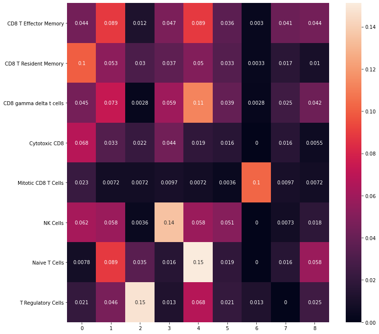
>>>>>>> d339118485321a54c24ffa554e2338af35789a73


```python

```
