```python
import scanpy as sc
import numpy as np
import scipy as sp
import pandas as pd
import matplotlib.pyplot as plt
from matplotlib import rcParams
from matplotlib import colors
import seaborn as sb
from gprofiler import GProfiler
import loompy as lp
import rpy2.rinterface_lib.callbacks
import logging
import scrublet as scr
from rpy2.robjects import pandas2ri
import anndata2ri
```


```python
# Ignore R warning messages
#Note: this can be commented out to get more verbose R output
rpy2.rinterface_lib.callbacks.logger.setLevel(logging.ERROR)

# Automatically convert rpy2 outputs to pandas dataframes
pandas2ri.activate()
anndata2ri.activate()
%load_ext rpy2.ipython

plt.rcParams['figure.figsize']=(8,8) #rescale figures
sc.settings.verbosity = 3
#sc.set_figure_params(dpi=200, dpi_save=300)
sc.logging.print_versions()
```

    The rpy2.ipython extension is already loaded. To reload it, use:
      %reload_ext rpy2.ipython
    scanpy==1.4.6 anndata==0.7.1 umap==0.4.2 numpy==1.18.4 scipy==1.4.1 pandas==1.0.3 scikit-learn==0.23.0 statsmodels==0.11.1 python-igraph==0.8.2 louvain==0.6.1


```r
%%R
# Load libraries from correct lib Paths for my environment - ignore this!
.libPaths("/home/spuccio/miniconda3/envs/scrnseq/lib/R/library")

# Load all the R libraries we will be using in the notebook
library(scran)
library(RColorBrewer)
library(slingshot)
library(monocle)
library(gam)
library(clusterExperiment)
library(ggplot2)
library(plyr)
library(MAST)
```

# 1 Reading in the data


```python
# Set up data loading

#Data files
sample_strings = ['GSM4147093', 'GSM4147094', 'GSM4147095', 'GSM4147096', 'GSM4147097', 'GSM4147098','GSM4147099','GSM4147100','GSM4147101']
sample_id_strings = ['093', '094', '095', '096', '097', '098','099','100','110']
sample_gep_strings = ['2', '2', '1', '2', '2', '1','2','2','2']
sample_age_at_diagnosis_strings = ['69', '66', '77', '44', '53', '80','68','73','73']
sample_sex_strings = ['M', 'M', 'M', 'F', 'M', 'F','F','M','F']
file_base = '/home/spuccio/isilon/SP025_NaClTcell/scranseq_durante/10Xmerge/'
cc_genes_file = '/home/spuccio/isilon/SP025_NaClTcell/scranseq_durante/Macosko_cell_cycle_genes.txt'
```


```python
adata = sc.read("".join([file_base,"matrix.mtx"]), cache=False)
adata = adata.transpose()
adata.X = adata.X.toarray()
barcodes = pd.read_csv("".join([file_base,"barcodes.tsv"]), header=None, sep='\t')
genes = pd.read_csv("".join([file_base,"genes.tsv"]), header=None, sep='\t')
#Annotate data
barcodes.rename(columns={0:'barcode'}, inplace=True)
barcodes.set_index('barcode', inplace=True)
adata.obs = barcodes
genes.rename(columns={0:'gene_id', 1:'gene_symbol'}, inplace=True)
genes.set_index('gene_symbol', inplace=True)
adata.var = genes
```

    --> This might be very slow. Consider passing `cache=True`, which enables much faster reading from a cache file.


```python
adata.var_names_make_unique()
```


```python
Metadata = pd.read_csv("/home/spuccio/isilon/SP025_NaClTcell/scranseq_durante/metadata.txt",sep="\t",header=0,low_memory=False)
```


```python
Metadata.head()
```


<div>
<style scoped>
    .dataframe tbody tr th:only-of-type {
        vertical-align: middle;
    }

    .dataframe tbody tr th {
        vertical-align: top;
    }

    .dataframe thead th {
        text-align: right;
    }
</style>
<table border="1" class="dataframe">
  <thead>
    <tr style="text-align: right;">
      <th></th>
      <th>cellid</th>
      <th>orig.ident</th>
      <th>nCount_RNA</th>
      <th>nFeature_RNA</th>
      <th>log10GenesPerUMI</th>
      <th>mitoRatio</th>
    </tr>
  </thead>
  <tbody>
    <tr>
      <th>0</th>
      <td>GSM4147093_AAACCTGAGCCACGTC-1</td>
      <td>GSM4147093</td>
      <td>3316</td>
      <td>1416</td>
      <td>0.895032</td>
      <td>0.026840</td>
    </tr>
    <tr>
      <th>1</th>
      <td>GSM4147093_AAACCTGAGGTTCCTA-1</td>
      <td>GSM4147093</td>
      <td>7491</td>
      <td>2299</td>
      <td>0.867597</td>
      <td>0.038446</td>
    </tr>
    <tr>
      <th>2</th>
      <td>GSM4147093_AAACCTGCAGATAATG-1</td>
      <td>GSM4147093</td>
      <td>34944</td>
      <td>4954</td>
      <td>0.813263</td>
      <td>0.053715</td>
    </tr>
    <tr>
      <th>3</th>
      <td>GSM4147093_AAACCTGCAGCTGTAT-1</td>
      <td>GSM4147093</td>
      <td>2437</td>
      <td>1140</td>
      <td>0.902579</td>
      <td>0.032827</td>
    </tr>
    <tr>
      <th>4</th>
      <td>GSM4147093_AAACCTGGTAAGTGTA-1</td>
      <td>GSM4147093</td>
      <td>745</td>
      <td>503</td>
      <td>0.940606</td>
      <td>0.016107</td>
    </tr>
  </tbody>
</table>
</div>


```python
#adata.obs['CellID'] = Metadata["cellid"].to_list()
adata.obs['SampleID'] = Metadata["orig.ident"].to_list()
```


```python
print(adata.obs['SampleID'].value_counts())

adata
```

    GSM4147099    14505
    GSM4147098    10707
    GSM4147095     9891
    GSM4147097     9870
    GSM4147094     7399
    GSM4147100     3777
    GSM4147096     3696
    GSM4147093     3522
    GSM4147101     1522
    Name: SampleID, dtype: int64


    AnnData object with n_obs × n_vars = 64889 × 24715 
        obs: 'SampleID'
        var: 'gene_id'


```python
row_attrs = { 
    "Gene": np.array(adata.var.index) ,
}
col_attrs = { 
    "CellID":  np.array(adata.obs.index) ,
    "nGene": np.array( np.sum(adata.X.transpose()>0 , axis=0)).flatten() ,
    "nUMI": np.array( np.sum(adata.X.transpose() , axis=0)).flatten() ,
}

lp.create( "/home/spuccio/isilon/SP025_NaClTcell/scranseq_durante/durante_unfiltered.loom", adata.X.transpose(), row_attrs, col_attrs )
```

# 1 Remove Doublet cells


```python
scrub = scr.Scrublet(adata.X,expected_doublet_rate=0.06)
adata.obs['doublet_scores'], adata.obs['predicted_doublets'] = scrub.scrub_doublets()
scrub.plot_histogram()
```

    Preprocessing...
    Simulating doublets...
    Embedding transcriptomes using PCA...
    Calculating doublet scores...
    Automatically set threshold at doublet score = 0.62
    Detected doublet rate = 0.1%
    Estimated detectable doublet fraction = 9.8%
    Overall doublet rate:
    	Expected   = 6.0%
    	Estimated  = 0.6%
    Elapsed time: 149.0 seconds


    (<Figure size 576x216 with 2 Axes>,
     array([<matplotlib.axes._subplots.AxesSubplot object at 0x7f4167a16f28>,
            <matplotlib.axes._subplots.AxesSubplot object at 0x7f416730abe0>],
           dtype=object))


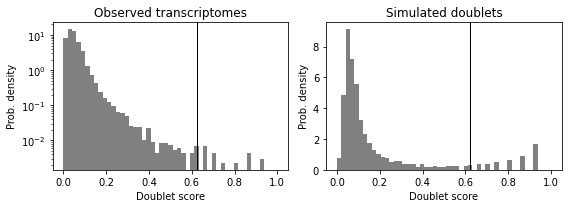


# 2 Diagnostic plots, pre-filtering


```python
adata = adata[:,adata.X.sum(axis=0) > 0]
```


```python
nCountsPerGene = np.sum(adata.X, axis=0)
nCellsPerGene = np.sum(adata.X>0, axis=0)

# Show info
print("Number of counts (in the dataset units) per gene:", nCountsPerGene.min(), " - " ,nCountsPerGene.max())
print("Number of cells in which each gene is detected:", nCellsPerGene.min(), " - " ,nCellsPerGene.max())
```

    Number of counts (in the dataset units) per gene: 1.0  -  12847732.0
    Number of cells in which each gene is detected: 1  -  64684


```python
# simply compute the number of genes per cell (computers 'n_genes' column)
sc.pp.filter_cells(adata, min_genes=0)
# mito and genes/counts cuts
mito_genes = adata.var_names.str.startswith('MT-')
ribo_genes = adata.var_names.str.startswith(("RPS","RPL"))
# for each cell compute fraction of counts in mito genes vs. all genes
adata.obs['percent_mito'] = np.sum(
    adata[:, mito_genes].X, axis=1) / np.sum(adata.X, axis=1)
# add the total counts per cell as observations-annotation to adata
adata.obs['n_counts'] = adata.X.sum(axis=1)
#
adata.obs['percent_ribo'] = np.sum(
    adata[:, ribo_genes].X, axis=1) / np.sum(adata.X, axis=1)
```

    Trying to set attribute `.obs` of view, copying.


```python
# Checking the total size of the data set
adata.shape
```


    (64889, 24683)


```python
import seaborn as sns
fig, (ax1, ax2, ax3) = plt.subplots(1, 3, figsize=(12, 4), dpi=150, sharey=True)

x = adata.obs['n_genes']
x_lowerbound = 1500
x_upperbound = 2000
nbins=100

sns.distplot(x, ax=ax1, norm_hist=True, bins=nbins)
sns.distplot(x, ax=ax2, norm_hist=True, bins=nbins)
sns.distplot(x, ax=ax3, norm_hist=True, bins=nbins)

ax2.set_xlim(0,x_lowerbound)
ax3.set_xlim(x_upperbound, adata.obs['n_genes'].max() )

for ax in (ax1,ax2,ax3): 
  ax.set_xlabel('')

ax1.title.set_text('n_genes')
ax2.title.set_text('n_genes, lower bound')
ax3.title.set_text('n_genes, upper bound')

fig.text(-0.01, 0.5, 'Frequency', ha='center', va='center', rotation='vertical', size='x-large')
fig.text(0.5, 0.0, 'Genes expressed per cell', ha='center', va='center', size='x-large')

fig.tight_layout()
```


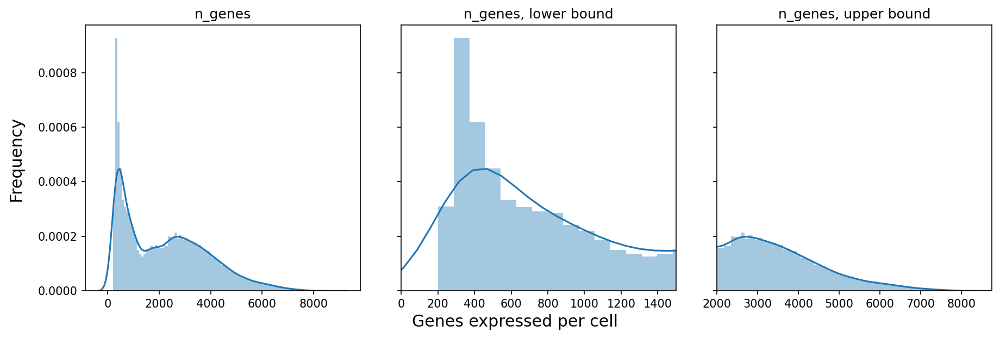


```python
fig, (ax1, ax2, ax3) = plt.subplots(1, 3, figsize=(12, 4), dpi=150, sharey=True)

x = adata.obs['percent_mito']
x_lowerbound = [0.0, 0.07 ]
x_upperbound = [ 0.10, 0.3 ]
nbins=100

sns.distplot(x, ax=ax1, norm_hist=True, bins=nbins)
sns.distplot(x, ax=ax2, norm_hist=True, bins=int(nbins/(x_lowerbound[1]-x_lowerbound[0])) )
sns.distplot(x, ax=ax3, norm_hist=True, bins=int(nbins/(x_upperbound[1]-x_upperbound[0])) )

ax2.set_xlim(x_lowerbound[0], x_lowerbound[1])
ax3.set_xlim(x_upperbound[0], x_upperbound[1] )
for ax in (ax1,ax2,ax3): 
  ax.set_xlabel('')

ax1.title.set_text('percent_mito')
ax2.title.set_text('percent_mito, lower bound')
ax3.title.set_text('percent_mito, upper bound')

fig.text(-0.01, 0.5, 'Frequency', ha='center', va='center', rotation='vertical', size='x-large')
fig.text(0.5, 0.0, 'Mitochondrial read fraction per cell', ha='center', va='center', size='x-large')

fig.tight_layout()
```


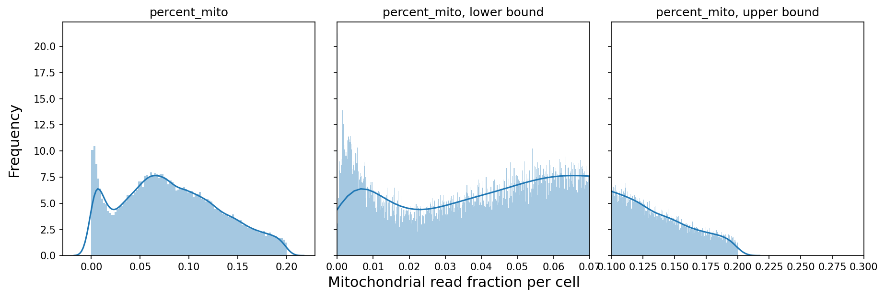


```python
fig, (ax1, ax2, ax3) = plt.subplots(1, 3, figsize=(12, 4), dpi=150, sharey=False)

sns.distplot( adata.obs['n_genes'], ax=ax1, norm_hist=True, bins=100)
sns.distplot( adata.obs['n_counts'], ax=ax2, norm_hist=True, bins=100)
sns.distplot( adata.obs['percent_mito'], ax=ax3, norm_hist=True, bins=100)

ax1.title.set_text('Number of genes expressed per cell')
ax2.title.set_text('Counts per cell')
ax3.title.set_text('Mitochondrial read fraction per cell')

fig.text(-0.01, 0.5, 'Frequency', ha='center', va='center', rotation='vertical', size='x-large')

fig.tight_layout()

fig.savefig('filtering_panel_prefilter.pdf', dpi=600, bbox_inches='tight')
```


```python
sc.pl.violin(adata, ['n_genes', 'n_counts', 'percent_mito'],
    jitter=0.4, multi_panel=True )
```

    ... storing 'SampleID' as categorical


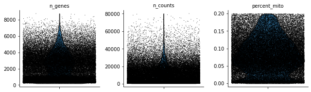


# 3 Carry out the filtering steps


```python
# initial cuts
sc.pp.filter_cells(adata, min_genes=200 )
sc.pp.filter_genes(adata, min_cells=3 )
```

    filtered out 533 genes that are detected in less than 3 cells


```python
# filter for gene detection for v2
keep = (adata.obs['n_genes'] > 200) 
print(sum(keep))
```

    64884


```python
fig, (ax1, ax2, ax3) = plt.subplots(1, 3, figsize=(12, 4), dpi=150, sharey=False)

sns.distplot( adata[keep, :].obs['n_genes'], ax=ax1, norm_hist=True, bins=100)
sns.distplot( adata[keep, :].obs['n_counts'], ax=ax2, norm_hist=True, bins=100)
sns.distplot( adata[keep, :].obs['percent_mito'], ax=ax3, norm_hist=True, bins=100)

ax1.title.set_text('Number of genes expressed per cell')
ax2.title.set_text('Counts per cell')
ax3.title.set_text('Mitochondrial read fraction per cell')

fig.text(-0.01, 0.5, 'Frequency', ha='center', va='center', rotation='vertical', size='x-large')

fig.tight_layout()

fig.savefig('filtering_panel_prefilter.pdf', dpi=600, bbox_inches='tight')
```


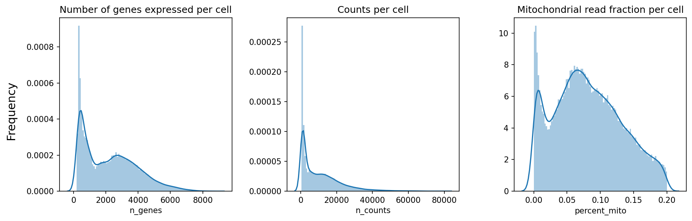


```python
adata.write("AfterQc.h5ad")
```


```python
adata = adata[keep, :]
```


```python
sc.pl.highest_expr_genes(adata, n_top=20)
```

    normalizing counts per cell
        finished (0:00:08)


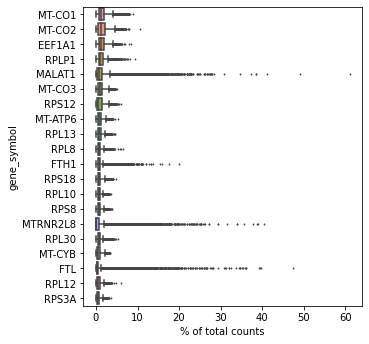


### Filter genes


```python
malat1 = adata.var_names.str.startswith(("MALAT1"))
# we need to redefine the mito_genes since they were first 
# calculated on the full object before removing low expressed genes.
mito_genes = adata.var_names.str.startswith(("MT-","MTRNR"))
ribo_genes = adata.var_names.str.startswith(("RPS","RPL"))
remove = np.add(mito_genes,ribo_genes,malat1)
keep = np.invert(remove)

adata = adata[:,keep]

print(adata.n_obs, adata.n_vars)
```

    64884 24028


```python
sc.pl.highest_expr_genes(adata, n_top=20)
```

    normalizing counts per cell
        finished (0:00:14)


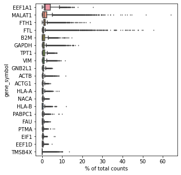


## Normalization


```python
sc.pp.normalize_total(adata, target_sum=1e4)
sc.pp.log1p(adata)
adata.raw = adata
# ComBat batch correction
sc.pp.combat(adata, key='SampleID')
sc.tl.score_genes_cell_cycle(
  adata,
  s_genes = ["MCM5","PCNA","TYMS","FEN1","MCM2","MCM4","RRM1","UNG","GINS2","MCM6","CDCA7","DTL","PRIM1","UHRF1","HELLS","RFC2","RPA2","NASP","RAD51AP1","GMNN","WDR76","SLBP","CCNE2","UBR7","POLD3","MSH2","ATAD2","RAD51","RRM2","CDC45","CDC6","EXO1","TIPIN","DSCC1","BLM","CASP8AP2","USP1","CLSPN","POLA1","CHAF1B","BRIP1","E2F8"],
  g2m_genes = ["HMGB2","CDK1","NUSAP1","UBE2C","BIRC5","TPX2","TOP2A","NDC80","CKS2","NUF2","CKS1B","MKI67","TMPO","CENPF","TACC3","FAM64A","SMC4","CCNB2","CKAP2L","CKAP2","AURKB","BUB1","KIF11","ANP32E","TUBB4B","GTSE1","KIF20B","HJURP","CDCA3","HN1","CDC20","TTK","CDC25C","KIF2C","RANGAP1","NCAPD2","DLGAP5","CDCA2","CDCA8","ECT2","KIF23","HMMR","AURKA","PSRC1","ANLN","LBR","CKAP5","CENPE","CTCF","NEK2","G2E3","GAS2L3","CBX5","CENPA"]
)
sc.pp.highly_variable_genes(adata)
```

    normalizing counts per cell
        finished (0:00:17)


    /home/spuccio/miniconda3/envs/scrnseq/lib/python3.6/site-packages/scanpy/preprocessing/_simple.py:297: UserWarning: Revieved a view of an AnnData. Making a copy.
      view_to_actual(data)


    Standardizing Data across genes.
    
    Found 9 batches
    
    Found 0 numerical variables:
    	
    
    Fitting L/S model and finding priors
    
    Finding parametric adjustments
    


    /home/spuccio/miniconda3/envs/scrnseq/lib/python3.6/site-packages/scanpy/preprocessing/_combat.py:338: RuntimeWarning: divide by zero encountered in true_divide
      change = max((abs(g_new - g_old) / g_old).max(), (abs(d_new - d_old) / d_old).max())


    Adjusting data
    
    calculating cell cycle phase
    computing score 'S_score'
        finished: added
        'S_score', score of gene set (adata.obs) (0:00:08)
    computing score 'G2M_score'
        finished: added
        'G2M_score', score of gene set (adata.obs) (0:00:07)
    -->     'phase', cell cycle phase (adata.obs)
    extracting highly variable genes
        finished (0:00:33)
    --> added
        'highly_variable', boolean vector (adata.var)
        'means', float vector (adata.var)
        'dispersions', float vector (adata.var)
        'dispersions_norm', float vector (adata.var)


```python
#adata = adata[:,adata.X.sum(axis=0) > 0]
#sc.pp.regress_out(adata, ['n_counts'])
```

    regressing out ['n_counts']
        finished (0:09:23)


```python
sc.pp.scale(adata,max_value=10)
sc.tl.pca(adata,svd_solver='arpack')
sc.pp.neighbors(adata,n_neighbors=15, n_pcs=30)
#sc.tl.louvain(adata, resolution = 0.5)
#sc.tl.tsne(adata, perplexity = 30, random_state = 100)
sc.tl.umap(adata, random_state = 100)
```

        on highly variable genes
    computing PCA with n_comps = 50
        finished (0:00:22)
    computing neighbors
        using 'X_pca' with n_pcs = 30
        finished: added to `.uns['neighbors']`
        'distances', distances for each pair of neighbors
        'connectivities', weighted adjacency matrix (0:00:23)
    computing UMAP
        finished: added
        'X_umap', UMAP coordinates (adata.obsm) (0:01:14)


## Visualization


```python
sc.pl.pca_scatter(adata, color='n_counts',s=50)
#sc.pl.tsne(adata, color='n_counts')
sc.pl.umap(adata, color='n_counts',s=50)
sc.pl.umap(adata, color='SampleID',s=50)
#sc.pl.diffmap(adata, color='n_counts', components=['1,2','1,3'])
#sc.pl.draw_graph(adata, color='n_counts')
```

    ... storing 'phase' as categorical


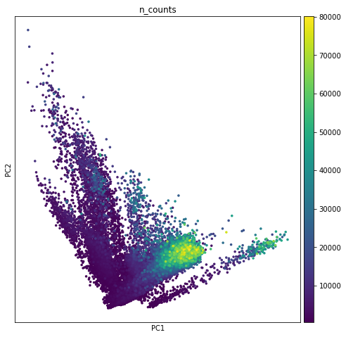


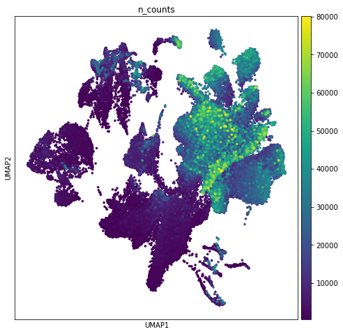


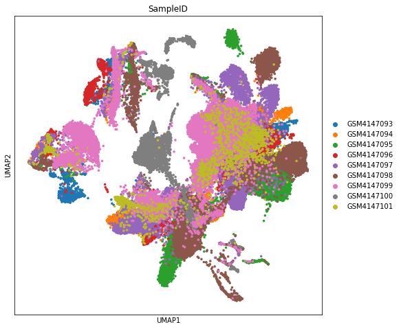


```python
sc.pl.umap(adata, color=['S_score', 'G2M_score'], use_raw=False,s=50)
sc.pl.umap(adata, color='phase', use_raw=False,s=50)
```


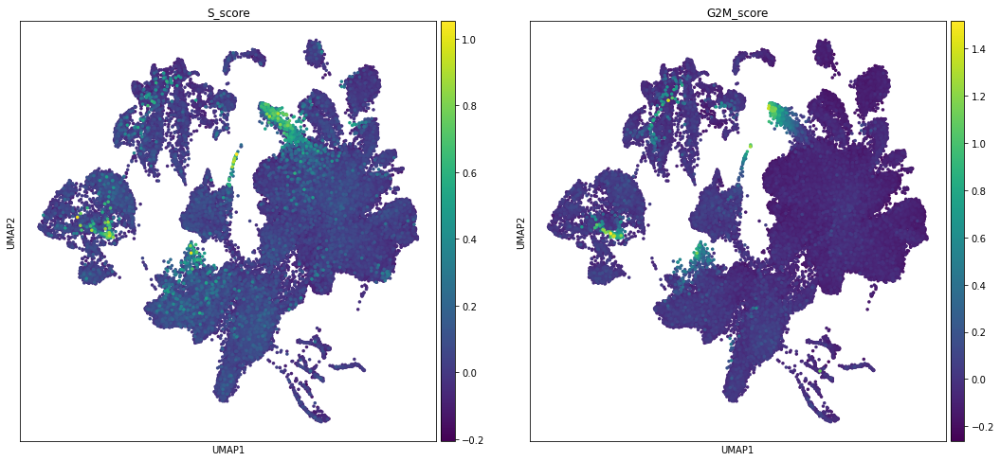


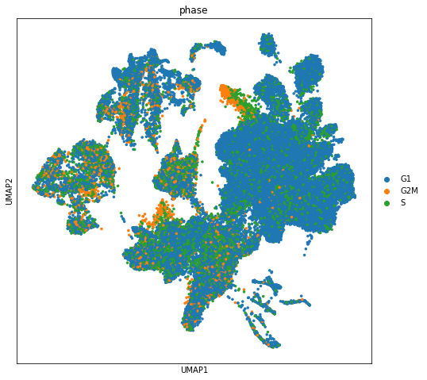


```python
row_attrs = { 
    "Gene": np.array(adata.var.index) ,
}
col_attrs = { 
    "CellID":  np.array(adata.obs.index) ,
    "nGene": np.array( np.sum(adata.X.transpose()>0 , axis=0)).flatten() ,
    "nUMI": np.array( np.sum(adata.X.transpose() , axis=0)).flatten() ,
}

lp.create( "/home/spuccio/isilon/SP025_NaClTcell/scranseq_durante/durante_filtered.loom", adata.X.transpose(), row_attrs, col_attrs )
```

# Clustering with louvain algorithm (0.8 - 0.6 - 0.4 Resolution)


```python
sc.tl.louvain(adata, resolution=0.8, key_added='louvain_r0.8', random_state=10,use_weights=True)
sc.tl.louvain(adata,resolution=0.6, key_added='louvain_r0.6',random_state=10,use_weights=True)
sc.tl.louvain(adata, resolution=0.4, key_added='louvain_r0.4', random_state=10,use_weights=True)
```

    running Louvain clustering
        using the "louvain" package of Traag (2017)
        finished: found 29 clusters and added
        'louvain_r0.8', the cluster labels (adata.obs, categorical) (0:00:19)
    running Louvain clustering
        using the "louvain" package of Traag (2017)
        finished: found 27 clusters and added
        'louvain_r0.6', the cluster labels (adata.obs, categorical) (0:00:17)
    running Louvain clustering
        using the "louvain" package of Traag (2017)
        finished: found 22 clusters and added
        'louvain_r0.4', the cluster labels (adata.obs, categorical) (0:00:14)


```python
rcParams['figure.figsize'] = 4, 4
sc.pl.umap(adata, color=['louvain_r0.8','louvain_r0.6','louvain_r0.4'],legend_loc='on data',s=50)
```


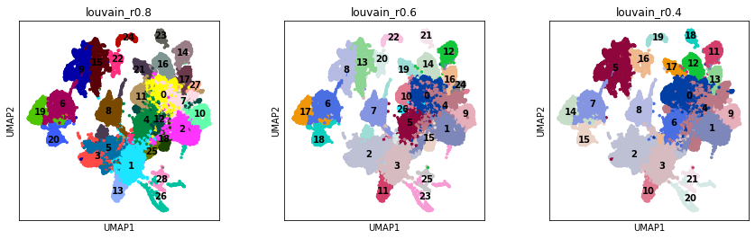


```python
rcParams['figure.figsize'] = 8, 8
sc.pl.umap(adata, color=['louvain_r0.4'],legend_loc='on data',s=50)
```


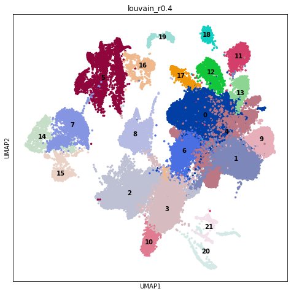


```python
colors2 = plt.cm.Reds(np.linspace(0, 1, 128))
colors3 = plt.cm.Greys_r(np.linspace(0.7,0.8,20))
colorsComb = np.vstack([colors3, colors2])
mymap = colors.LinearSegmentedColormap.from_list('my_colormap', colorsComb)
```


```python
sc.pl.umap(adata,color=['PTPRC','CD8A','CD4','CD3E','TOX','SGK1','IL7R','PDCD1','CD79A','KLRB1','CD69','CD28'], use_raw=False, color_map=mymap,s=50)
```


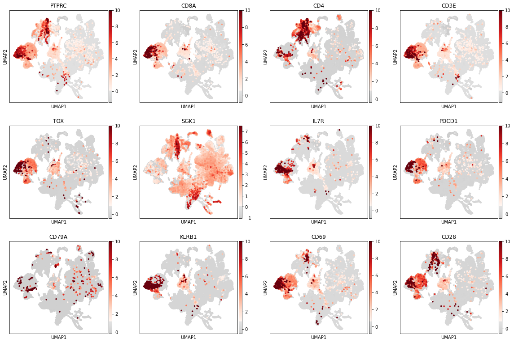


# Cluster correlation


```python
sc.tl.dendrogram(adata, groupby='louvain_r0.4')
```

        using 'X_pca' with n_pcs = 50
    Storing dendrogram info using `.uns['dendrogram_louvain_r0.4']`


```python
sc.pl.correlation_matrix(adata,'louvain_r0.4')
```


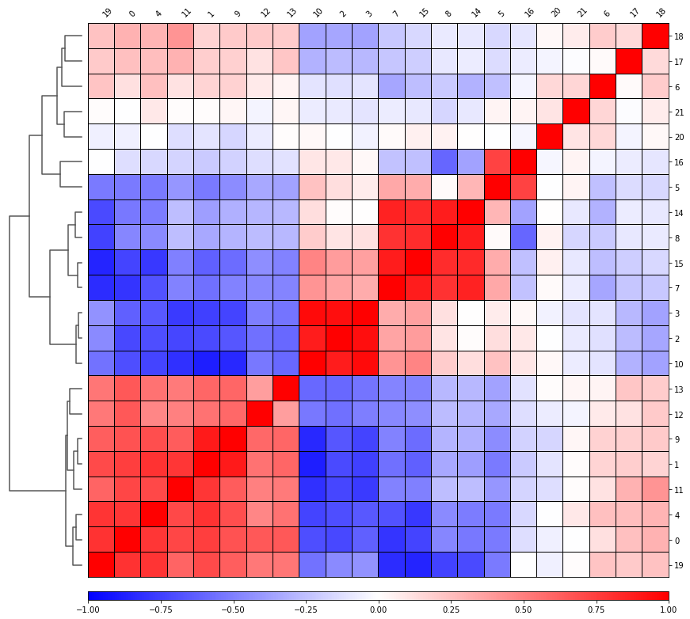


# Cluster rename 


```python
list_old = adata.obs['louvain_r0.4'].tolist()
```


```python
list_new= list_old
```


```python
for n, i in enumerate(list_old):
    if i == '0':
        list_new[n] = 'Tumor_C1'    
    if i == '1':
        list_new[n] = 'Tumor_C1'
    if i == '2':
        list_new[n] = 'Tumor_C2'
    if i == '3':
        list_new[n] = 'Tumor_C2'
    if i == '4':
        list_new[n] = 'Tumor_C1'
    if i == '5':
        list_new[n] = 'CD45+'
    if i == '6':
        list_new[n] = 'C6'
    if i == '7':
        list_new[n] = 'CD45+/CD3E+'
    if i == '8':
        list_new[n] = 'CD45+/CD3E+'
    if i == '9':
        list_new[n] = 'Tumor_C1'
    if i == '10':
        list_new[n] = 'Tumor_C2'
    if i == '11':
        list_new[n] = 'Tumor_C1'
    if i == '12':
        list_new[n] = 'Tumor_C1'
    if i == '13':
        list_new[n] = 'Tumor_C1'
    if i == '14':
        list_new[n] = 'CD45+/CD3E+'
    if i == '15':
        list_new[n] = 'CD45+/CD3E+'
    if i == '16':
        list_new[n] = 'CD45+'
    if i == '17':
        list_new[n] = 'C17'
    if i == '18':
        list_new[n] = 'C18'
    if i == '19':
        list_new[n] = 'Tumor_C1'
    if i == '20':
        list_new[n] = 'Retina_Cells'
    if i == '21':
        list_new[n] = 'C21'
```


```python
adata.obs['cluster_cd45']=list_new
```


```python
rcParams['figure.figsize'] = 8, 8
sc.pl.umap(adata, color=['cluster_cd45'],legend_loc='on data',s=50)
```

    ... storing 'cluster_cd45' as categorical


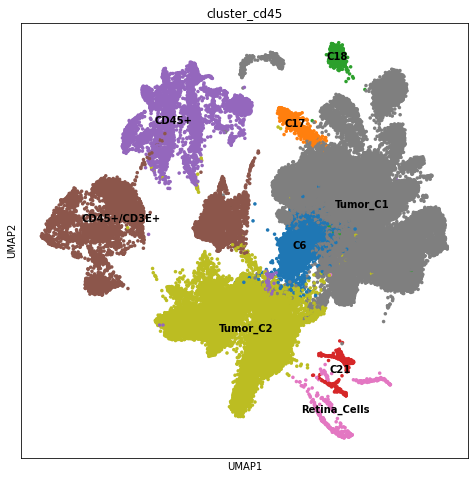


# Markers Gene


```python
sc.tl.rank_genes_groups(adata, 'cluster_cd45', method='t-test',key_added='rank_genes_cluster_cd45',n_genes=500)
```

    ranking genes
        finished: added to `.uns['rank_genes_cluster_cd45']`
        'names', sorted np.recarray to be indexed by group ids
        'scores', sorted np.recarray to be indexed by group ids
        'logfoldchanges', sorted np.recarray to be indexed by group ids
        'pvals', sorted np.recarray to be indexed by group ids
        'pvals_adj', sorted np.recarray to be indexed by group ids (0:01:09)


```python
result = adata.uns['rank_genes_cluster_cd45']
groups = result['names'].dtype.names
marker = pd.DataFrame(
    {group + '_' + key[:1]: result[key][group]
    for group in groups for key in ['names', 'pvals']})
```


```python
marker.to_csv("/home/spuccio/marker_rank_genes_cluster_cd45.txt",sep="\t",header=True,index=False)
```


```python
adata_sub = adata[adata.obs['louvain_r0.4_entero_sub'].isin(['CD45+/CD3E+']),:]
```

# Subclustering of CD45+/CD3E+ 


```python
#Subcluster 
sc.tl.louvain(adata, restrict_to=('cluster_cd45', ['CD45+/CD3E+']), resolution=0.2, key_added='louvain_r0.2_entero_sub')
sc.tl.louvain(adata, restrict_to=('cluster_cd45', ['CD45+/CD3E+']), resolution=0.4, key_added='louvain_r0.4_entero_sub')
sc.tl.louvain(adata, restrict_to=('cluster_cd45', ['CD45+/CD3E+']), resolution=0.6, key_added='louvain_r0.6_entero_sub')
sc.tl.louvain(adata, restrict_to=('cluster_cd45', ['CD45+/CD3E+']), resolution=0.8, key_added='louvain_r0.8_entero_sub')
```

    running Louvain clustering
        using the "louvain" package of Traag (2017)
        finished: found 14 clusters and added
        'louvain_r0.2_entero_sub', the cluster labels (adata.obs, categorical) (0:00:00)
    running Louvain clustering
        using the "louvain" package of Traag (2017)
        finished: found 17 clusters and added
        'louvain_r0.4_entero_sub', the cluster labels (adata.obs, categorical) (0:00:00)
    running Louvain clustering
        using the "louvain" package of Traag (2017)
        finished: found 18 clusters and added
        'louvain_r0.6_entero_sub', the cluster labels (adata.obs, categorical) (0:00:00)
    running Louvain clustering
        using the "louvain" package of Traag (2017)
        finished: found 22 clusters and added
        'louvain_r0.8_entero_sub', the cluster labels (adata.obs, categorical) (0:00:00)


```python
rcParams['figure.figsize'] = 8, 8
sc.pl.umap(adata, color=['louvain_r0.4_entero_sub'],s=50)
```


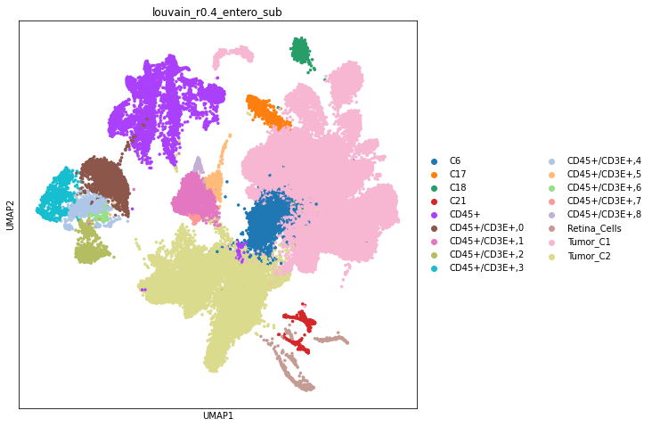


```python
sc.pl.umap(adata,color=['PTPRC','CD8A','CD4','CD3E','TOX','SGK1','IL7R','PDCD1','PRDM1','KLRB1','CD69','CD28'], use_raw=False, color_map=mymap,s=50)
```


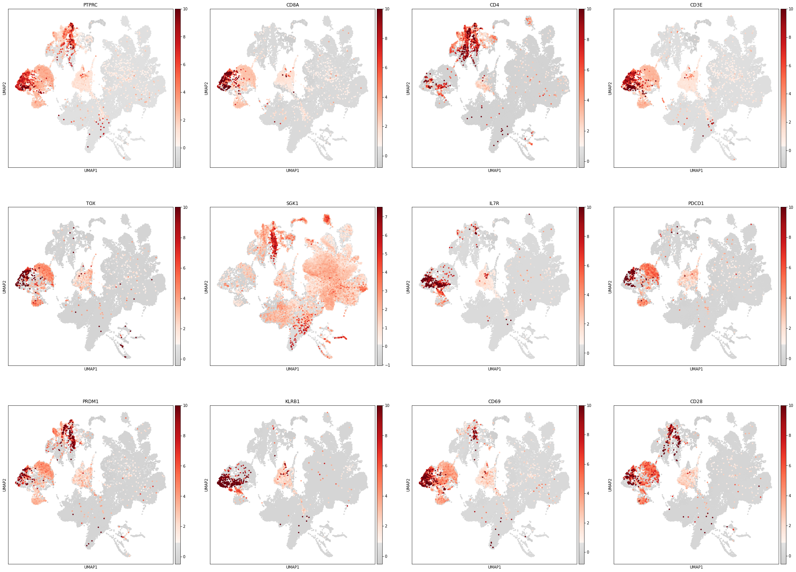


```python
sc.tl.rank_genes_groups(adata, 'louvain_r0.4_entero_sub', method='t-test',key_added='rank_genes_louvain_r0.4_entero_sub',n_genes=500)
```

    ranking genes
        finished: added to `.uns['rank_genes_louvain_r0.4_entero_sub']`
        'names', sorted np.recarray to be indexed by group ids
        'scores', sorted np.recarray to be indexed by group ids
        'logfoldchanges', sorted np.recarray to be indexed by group ids
        'pvals', sorted np.recarray to be indexed by group ids
        'pvals_adj', sorted np.recarray to be indexed by group ids (0:02:11)


```python
result = adata.uns['rank_genes_louvain_r0.4_entero_sub']
groups = result['names'].dtype.names
marker = pd.DataFrame(
    {group + '_' + key[:1]: result[key][group]
    for group in groups for key in ['names', 'pvals']})
```


```python
marker.to_csv("/home/spuccio/marker_rank_genes_louvain_r0.4_entero_sub.txt",sep="\t",header=True,index=False)
```


```python

```
