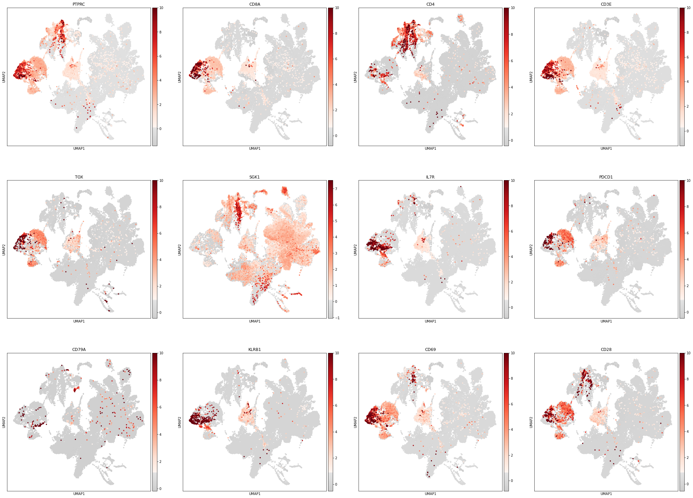
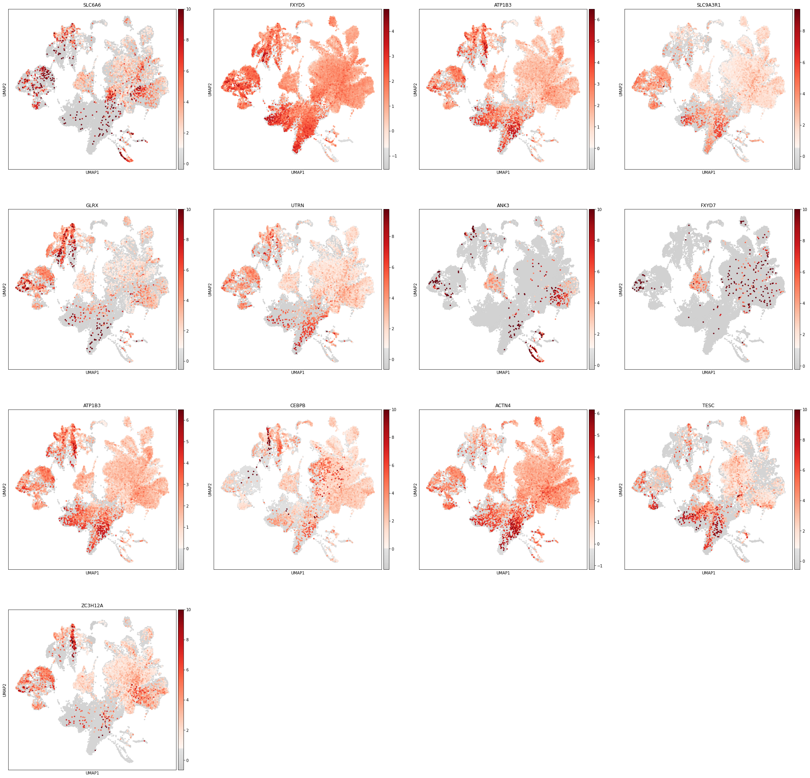
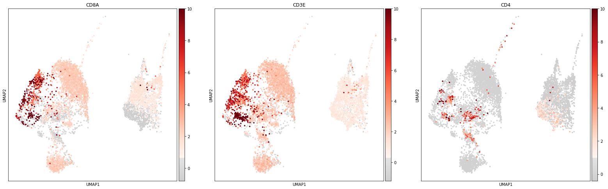
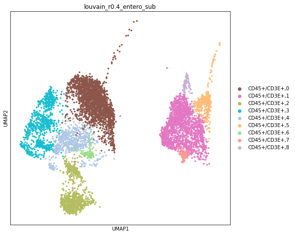
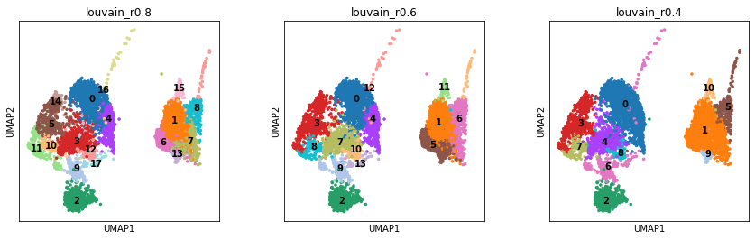
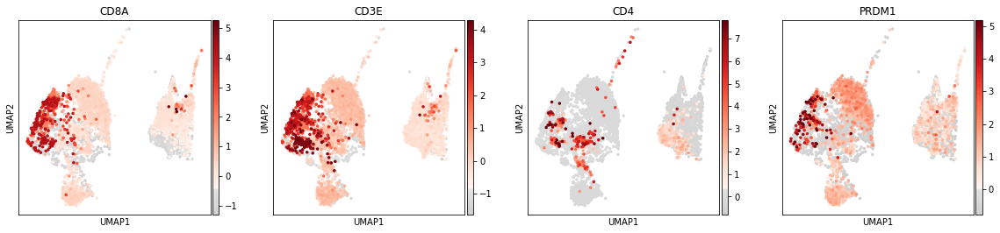
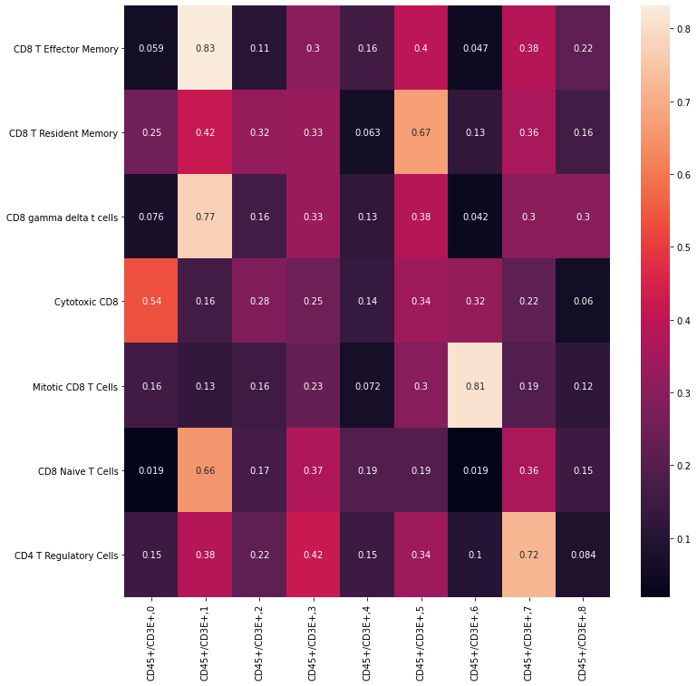

```python
import scanpy as sc
import numpy as np
import scipy as sp
import pandas as pd
import matplotlib.pyplot as plt
from matplotlib import rcParams
from matplotlib import colors
import seaborn as sb
from gprofiler import GProfiler
import loompy as lp
import rpy2.rinterface_lib.callbacks
import logging
import scrublet as scr
from rpy2.robjects import pandas2ri
import anndata2ri
```

    /home/spuccio/miniconda3/envs/scrnseq/lib/python3.6/site-packages/anndata/_core/anndata.py:21: FutureWarning: pandas.core.index is deprecated and will be removed in a future version.  The public classes are available in the top-level namespace.
      from pandas.core.index import RangeIndex


```python
# Ignore R warning messages
#Note: this can be commented out to get more verbose R output
rpy2.rinterface_lib.callbacks.logger.setLevel(logging.ERROR)

# Automatically convert rpy2 outputs to pandas dataframes
pandas2ri.activate()
anndata2ri.activate()
%load_ext rpy2.ipython

plt.rcParams['figure.figsize']=(8,8) #rescale figures
sc.settings.verbosity = 3
#sc.set_figure_params(dpi=200, dpi_save=300)
sc.logging.print_versions()
```

    scanpy==1.4.6 anndata==0.7.1 umap==0.4.2 numpy==1.17.5 scipy==1.4.1 pandas==1.0.3 scikit-learn==0.23.1 statsmodels==0.11.1 python-igraph==0.8.2 louvain==0.6.1


```r
%%R
# Load libraries from correct lib Paths for my environment - ignore this!
.libPaths("/home/spuccio/miniconda3/envs/scrnseq/lib/R/library")

# Load all the R libraries we will be using in the notebook
library(scran)
library(RColorBrewer)
library(slingshot)
library(monocle)
library(gam)
library(clusterExperiment)
library(ggplot2)
library(plyr)
library(MAST)
```

# 1 Reading in the data


```python
# Set up data loading

#Data files
sample_strings = ['GSM4147093', 'GSM4147094', 'GSM4147095', 'GSM4147096', 'GSM4147097', 'GSM4147098','GSM4147099','GSM4147100','GSM4147101']
sample_id_strings = ['093', '094', '095', '096', '097', '098','099','100','110']
sample_gep_strings = ['2', '2', '1', '2', '2', '1','2','2','2']
sample_age_at_diagnosis_strings = ['69', '66', '77', '44', '53', '80','68','73','73']
sample_sex_strings = ['M', 'M', 'M', 'F', 'M', 'F','F','M','F']
file_base = '/home/spuccio/isilon/SP025_NaClTcell/scranseq_durante/10Xmerge/'
cc_genes_file = '/home/spuccio/isilon/SP025_NaClTcell/scranseq_durante/Macosko_cell_cycle_genes.txt'
```


```python
adata = sc.read("".join([file_base,"matrix.mtx"]), cache=False)
adata = adata.transpose()
adata.X = adata.X.toarray()
barcodes = pd.read_csv("".join([file_base,"barcodes.tsv"]), header=None, sep='\t')
genes = pd.read_csv("".join([file_base,"genes.tsv"]), header=None, sep='\t')
#Annotate data
barcodes.rename(columns={0:'barcode'}, inplace=True)
barcodes.set_index('barcode', inplace=True)
adata.obs = barcodes
genes.rename(columns={0:'gene_id', 1:'gene_symbol'}, inplace=True)
genes.set_index('gene_symbol', inplace=True)
adata.var = genes
```

    --> This might be very slow. Consider passing `cache=True`, which enables much faster reading from a cache file.


```python
adata.var_names_make_unique()
```


```python
Metadata = pd.read_csv("/home/spuccio/isilon/SP025_NaClTcell/scranseq_durante/metadata.txt",sep="\t",header=0,low_memory=False)
```


```python
Metadata.head()
```


<div>
<style scoped>
    .dataframe tbody tr th:only-of-type {
        vertical-align: middle;
    }

    .dataframe tbody tr th {
        vertical-align: top;
    }

    .dataframe thead th {
        text-align: right;
    }
</style>
<table border="1" class="dataframe">
  <thead>
    <tr style="text-align: right;">
      <th></th>
      <th>cellid</th>
      <th>orig.ident</th>
      <th>nCount_RNA</th>
      <th>nFeature_RNA</th>
      <th>log10GenesPerUMI</th>
      <th>mitoRatio</th>
    </tr>
  </thead>
  <tbody>
    <tr>
      <th>0</th>
      <td>GSM4147093_AAACCTGAGCCACGTC-1</td>
      <td>GSM4147093</td>
      <td>3316</td>
      <td>1416</td>
      <td>0.895032</td>
      <td>0.026840</td>
    </tr>
    <tr>
      <th>1</th>
      <td>GSM4147093_AAACCTGAGGTTCCTA-1</td>
      <td>GSM4147093</td>
      <td>7491</td>
      <td>2299</td>
      <td>0.867597</td>
      <td>0.038446</td>
    </tr>
    <tr>
      <th>2</th>
      <td>GSM4147093_AAACCTGCAGATAATG-1</td>
      <td>GSM4147093</td>
      <td>34944</td>
      <td>4954</td>
      <td>0.813263</td>
      <td>0.053715</td>
    </tr>
    <tr>
      <th>3</th>
      <td>GSM4147093_AAACCTGCAGCTGTAT-1</td>
      <td>GSM4147093</td>
      <td>2437</td>
      <td>1140</td>
      <td>0.902579</td>
      <td>0.032827</td>
    </tr>
    <tr>
      <th>4</th>
      <td>GSM4147093_AAACCTGGTAAGTGTA-1</td>
      <td>GSM4147093</td>
      <td>745</td>
      <td>503</td>
      <td>0.940606</td>
      <td>0.016107</td>
    </tr>
  </tbody>
</table>
</div>


```python
#adata.obs['CellID'] = Metadata["cellid"].to_list()
adata.obs['SampleID'] = Metadata["orig.ident"].to_list()
```


```python
print(adata.obs['SampleID'].value_counts())

adata
```

    GSM4147099    14505
    GSM4147098    10707
    GSM4147095     9891
    GSM4147097     9870
    GSM4147094     7399
    GSM4147100     3777
    GSM4147096     3696
    GSM4147093     3522
    GSM4147101     1522
    Name: SampleID, dtype: int64


    AnnData object with n_obs × n_vars = 64889 × 24715 
        obs: 'SampleID'
        var: 'gene_id'


```python
row_attrs = { 
    "Gene": np.array(adata.var.index) ,
}
col_attrs = { 
    "CellID":  np.array(adata.obs.index) ,
    "nGene": np.array( np.sum(adata.X.transpose()>0 , axis=0)).flatten() ,
    "nUMI": np.array( np.sum(adata.X.transpose() , axis=0)).flatten() ,
}

lp.create( "/home/spuccio/isilon/SP025_NaClTcell/scranseq_durante/durante_unfiltered.loom", adata.X.transpose(), row_attrs, col_attrs )
```

# 1 Remove Doublet cells


```python
scrub = scr.Scrublet(adata.X,expected_doublet_rate=0.06)
adata.obs['doublet_scores'], adata.obs['predicted_doublets'] = scrub.scrub_doublets()
scrub.plot_histogram()
```

    Preprocessing...
    Simulating doublets...
    Embedding transcriptomes using PCA...
    Calculating doublet scores...
    Automatically set threshold at doublet score = 0.62
    Detected doublet rate = 0.1%
    Estimated detectable doublet fraction = 9.8%
    Overall doublet rate:
    	Expected   = 6.0%
    	Estimated  = 0.6%
    Elapsed time: 146.4 seconds


    (<Figure size 576x216 with 2 Axes>,
     array([<matplotlib.axes._subplots.AxesSubplot object at 0x7efb9c10f5f8>,
            <matplotlib.axes._subplots.AxesSubplot object at 0x7efb9a5325c0>],
           dtype=object))


# 2 Diagnostic plots, pre-filtering


```python
adata = adata[:,adata.X.sum(axis=0) > 0]
```


```python
nCountsPerGene = np.sum(adata.X, axis=0)
nCellsPerGene = np.sum(adata.X>0, axis=0)

# Show info
print("Number of counts (in the dataset units) per gene:", nCountsPerGene.min(), " - " ,nCountsPerGene.max())
print("Number of cells in which each gene is detected:", nCellsPerGene.min(), " - " ,nCellsPerGene.max())
```

    Number of counts (in the dataset units) per gene: 1.0  -  12847732.0
    Number of cells in which each gene is detected: 1  -  64684


```python
# simply compute the number of genes per cell (computers 'n_genes' column)
sc.pp.filter_cells(adata, min_genes=0)
# mito and genes/counts cuts
mito_genes = adata.var_names.str.startswith('MT-')
ribo_genes = adata.var_names.str.startswith(("RPS","RPL"))
# for each cell compute fraction of counts in mito genes vs. all genes
adata.obs['percent_mito'] = np.sum(
    adata[:, mito_genes].X, axis=1) / np.sum(adata.X, axis=1)
# add the total counts per cell as observations-annotation to adata
adata.obs['n_counts'] = adata.X.sum(axis=1)
#
adata.obs['percent_ribo'] = np.sum(
    adata[:, ribo_genes].X, axis=1) / np.sum(adata.X, axis=1)
```

    Trying to set attribute `.obs` of view, copying.


```python
# Checking the total size of the data set
adata.shape
```


    (64889, 24683)


```python
import seaborn as sns
fig, (ax1, ax2, ax3) = plt.subplots(1, 3, figsize=(12, 4), dpi=150, sharey=True)

x = adata.obs['n_genes']
x_lowerbound = 1500
x_upperbound = 2000
nbins=100

sns.distplot(x, ax=ax1, norm_hist=True, bins=nbins)
sns.distplot(x, ax=ax2, norm_hist=True, bins=nbins)
sns.distplot(x, ax=ax3, norm_hist=True, bins=nbins)

ax2.set_xlim(0,x_lowerbound)
ax3.set_xlim(x_upperbound, adata.obs['n_genes'].max() )

for ax in (ax1,ax2,ax3): 
  ax.set_xlabel('')

ax1.title.set_text('n_genes')
ax2.title.set_text('n_genes, lower bound')
ax3.title.set_text('n_genes, upper bound')

fig.text(-0.01, 0.5, 'Frequency', ha='center', va='center', rotation='vertical', size='x-large')
fig.text(0.5, 0.0, 'Genes expressed per cell', ha='center', va='center', size='x-large')

fig.tight_layout()
```


```python
fig, (ax1, ax2, ax3) = plt.subplots(1, 3, figsize=(12, 4), dpi=150, sharey=True)

x = adata.obs['percent_mito']
x_lowerbound = [0.0, 0.07 ]
x_upperbound = [ 0.10, 0.3 ]
nbins=100

sns.distplot(x, ax=ax1, norm_hist=True, bins=nbins)
sns.distplot(x, ax=ax2, norm_hist=True, bins=int(nbins/(x_lowerbound[1]-x_lowerbound[0])) )
sns.distplot(x, ax=ax3, norm_hist=True, bins=int(nbins/(x_upperbound[1]-x_upperbound[0])) )

ax2.set_xlim(x_lowerbound[0], x_lowerbound[1])
ax3.set_xlim(x_upperbound[0], x_upperbound[1] )
for ax in (ax1,ax2,ax3): 
  ax.set_xlabel('')

ax1.title.set_text('percent_mito')
ax2.title.set_text('percent_mito, lower bound')
ax3.title.set_text('percent_mito, upper bound')

fig.text(-0.01, 0.5, 'Frequency', ha='center', va='center', rotation='vertical', size='x-large')
fig.text(0.5, 0.0, 'Mitochondrial read fraction per cell', ha='center', va='center', size='x-large')

fig.tight_layout()
```


```python
fig, (ax1, ax2, ax3) = plt.subplots(1, 3, figsize=(12, 4), dpi=150, sharey=False)

sns.distplot( adata.obs['n_genes'], ax=ax1, norm_hist=True, bins=100)
sns.distplot( adata.obs['n_counts'], ax=ax2, norm_hist=True, bins=100)
sns.distplot( adata.obs['percent_mito'], ax=ax3, norm_hist=True, bins=100)

ax1.title.set_text('Number of genes expressed per cell')
ax2.title.set_text('Counts per cell')
ax3.title.set_text('Mitochondrial read fraction per cell')

fig.text(-0.01, 0.5, 'Frequency', ha='center', va='center', rotation='vertical', size='x-large')

fig.tight_layout()

fig.savefig('filtering_panel_prefilter.pdf', dpi=600, bbox_inches='tight')
```


```python
sc.pl.violin(adata, ['n_genes', 'n_counts', 'percent_mito'],
    jitter=0.4, multi_panel=True )
```

    ... storing 'SampleID' as categorical


# 3 Carry out the filtering steps


```python
# initial cuts
sc.pp.filter_cells(adata, min_genes=200 )
sc.pp.filter_genes(adata, min_cells=3 )
```

    filtered out 533 genes that are detected in less than 3 cells


```python
# filter for gene detection for v2
keep = (adata.obs['n_genes'] > 200) 
print(sum(keep))
```

    64884


```python
fig, (ax1, ax2, ax3) = plt.subplots(1, 3, figsize=(12, 4), dpi=150, sharey=False)

sns.distplot( adata[keep, :].obs['n_genes'], ax=ax1, norm_hist=True, bins=100)
sns.distplot( adata[keep, :].obs['n_counts'], ax=ax2, norm_hist=True, bins=100)
sns.distplot( adata[keep, :].obs['percent_mito'], ax=ax3, norm_hist=True, bins=100)

ax1.title.set_text('Number of genes expressed per cell')
ax2.title.set_text('Counts per cell')
ax3.title.set_text('Mitochondrial read fraction per cell')

fig.text(-0.01, 0.5, 'Frequency', ha='center', va='center', rotation='vertical', size='x-large')

fig.tight_layout()

fig.savefig('filtering_panel_prefilter.pdf', dpi=600, bbox_inches='tight')
```


```python
adata.write("AfterQc.h5ad")
```


```python
adata = adata[keep, :]
```


```python
sc.pl.highest_expr_genes(adata, n_top=20)
```

    normalizing counts per cell
        finished (0:00:08)


### Filter genes


```python
malat1 = adata.var_names.str.startswith(("MALAT1"))
# we need to redefine the mito_genes since they were first 
# calculated on the full object before removing low expressed genes.
mito_genes = adata.var_names.str.startswith(("MT-","MTRNR"))
ribo_genes = adata.var_names.str.startswith(("RPS","RPL"))
remove = np.add(mito_genes,ribo_genes,malat1)
keep = np.invert(remove)

adata = adata[:,keep]

print(adata.n_obs, adata.n_vars)
```

    64884 24028


```python
sc.pl.highest_expr_genes(adata, n_top=20)
```

    normalizing counts per cell
        finished (0:00:14)


## Normalization


```python
sc.pp.normalize_total(adata, target_sum=1e4)
sc.pp.log1p(adata)
adata.raw = adata
# ComBat batch correction
sc.pp.combat(adata, key='SampleID')
sc.tl.score_genes_cell_cycle(
  adata,
  s_genes = ["MCM5","PCNA","TYMS","FEN1","MCM2","MCM4","RRM1","UNG","GINS2","MCM6","CDCA7","DTL","PRIM1","UHRF1","HELLS","RFC2","RPA2","NASP","RAD51AP1","GMNN","WDR76","SLBP","CCNE2","UBR7","POLD3","MSH2","ATAD2","RAD51","RRM2","CDC45","CDC6","EXO1","TIPIN","DSCC1","BLM","CASP8AP2","USP1","CLSPN","POLA1","CHAF1B","BRIP1","E2F8"],
  g2m_genes = ["HMGB2","CDK1","NUSAP1","UBE2C","BIRC5","TPX2","TOP2A","NDC80","CKS2","NUF2","CKS1B","MKI67","TMPO","CENPF","TACC3","FAM64A","SMC4","CCNB2","CKAP2L","CKAP2","AURKB","BUB1","KIF11","ANP32E","TUBB4B","GTSE1","KIF20B","HJURP","CDCA3","HN1","CDC20","TTK","CDC25C","KIF2C","RANGAP1","NCAPD2","DLGAP5","CDCA2","CDCA8","ECT2","KIF23","HMMR","AURKA","PSRC1","ANLN","LBR","CKAP5","CENPE","CTCF","NEK2","G2E3","GAS2L3","CBX5","CENPA"]
)
sc.pp.highly_variable_genes(adata)
```

    normalizing counts per cell
        finished (0:00:17)


    /home/spuccio/miniconda3/envs/scrnseq/lib/python3.6/site-packages/scanpy/preprocessing/_simple.py:297: UserWarning: Revieved a view of an AnnData. Making a copy.
      view_to_actual(data)


    Standardizing Data across genes.
    
    Found 9 batches
    
    Found 0 numerical variables:
    	
    
    Fitting L/S model and finding priors
    
    Finding parametric adjustments
    


    /home/spuccio/miniconda3/envs/scrnseq/lib/python3.6/site-packages/scanpy/preprocessing/_combat.py:338: RuntimeWarning: divide by zero encountered in true_divide
      change = max((abs(g_new - g_old) / g_old).max(), (abs(d_new - d_old) / d_old).max())


    Adjusting data
    
    calculating cell cycle phase
    computing score 'S_score'
        finished: added
        'S_score', score of gene set (adata.obs) (0:00:07)
    computing score 'G2M_score'
        finished: added
        'G2M_score', score of gene set (adata.obs) (0:00:07)
    -->     'phase', cell cycle phase (adata.obs)
    extracting highly variable genes
        finished (0:01:09)
    --> added
        'highly_variable', boolean vector (adata.var)
        'means', float vector (adata.var)
        'dispersions', float vector (adata.var)
        'dispersions_norm', float vector (adata.var)


```python
#adata = adata[:,adata.X.sum(axis=0) > 0]
#sc.pp.regress_out(adata, ['n_counts'])
```


```python
sc.pp.scale(adata,max_value=10)
sc.tl.pca(adata,svd_solver='arpack')
sc.pp.neighbors(adata,n_neighbors=15, n_pcs=30)
#sc.tl.louvain(adata, resolution = 0.5)
#sc.tl.tsne(adata, perplexity = 30, random_state = 100)
sc.tl.umap(adata, random_state = 100)
```

        on highly variable genes
    computing PCA with n_comps = 50
        finished (0:00:23)
    computing neighbors
        using 'X_pca' with n_pcs = 30
        finished: added to `.uns['neighbors']`
        'distances', distances for each pair of neighbors
        'connectivities', weighted adjacency matrix (0:00:25)
    computing UMAP
        finished: added
        'X_umap', UMAP coordinates (adata.obsm) (0:01:15)


## Visualization


```python
sc.pl.pca_scatter(adata, color='n_counts',s=50)
#sc.pl.tsne(adata, color='n_counts')
sc.pl.umap(adata, color='n_counts',s=50)
sc.pl.umap(adata, color='SampleID',s=50)
#sc.pl.diffmap(adata, color='n_counts', components=['1,2','1,3'])
#sc.pl.draw_graph(adata, color='n_counts')
```

    ... storing 'phase' as categorical


```python
sc.pl.umap(adata, color=['S_score', 'G2M_score'], use_raw=False,s=50)
sc.pl.umap(adata, color='phase', use_raw=False,s=50)
```


```python
row_attrs = { 
    "Gene": np.array(adata.var.index) ,
}
col_attrs = { 
    "CellID":  np.array(adata.obs.index) ,
    "nGene": np.array( np.sum(adata.X.transpose()>0 , axis=0)).flatten() ,
    "nUMI": np.array( np.sum(adata.X.transpose() , axis=0)).flatten() ,
}

lp.create( "/home/spuccio/isilon/SP025_NaClTcell/scranseq_durante/durante_filtered.loom", adata.X.transpose(), row_attrs, col_attrs )
```

# Clustering with louvain algorithm (0.8 - 0.6 - 0.4 Resolution)


```python
sc.tl.louvain(adata, resolution=0.8, key_added='louvain_r0.8', random_state=10,use_weights=True)
sc.tl.louvain(adata,resolution=0.6, key_added='louvain_r0.6',random_state=10,use_weights=True)
sc.tl.louvain(adata, resolution=0.4, key_added='louvain_r0.4', random_state=10,use_weights=True)
```

    running Louvain clustering
        using the "louvain" package of Traag (2017)
        finished: found 29 clusters and added
        'louvain_r0.8', the cluster labels (adata.obs, categorical) (0:00:17)
    running Louvain clustering
        using the "louvain" package of Traag (2017)
        finished: found 27 clusters and added
        'louvain_r0.6', the cluster labels (adata.obs, categorical) (0:00:15)
    running Louvain clustering
        using the "louvain" package of Traag (2017)
        finished: found 22 clusters and added
        'louvain_r0.4', the cluster labels (adata.obs, categorical) (0:00:13)


```python
rcParams['figure.figsize'] = 4, 4
sc.pl.umap(adata, color=['louvain_r0.8','louvain_r0.6','louvain_r0.4'],legend_loc='on data',s=50)
```


```python
rcParams['figure.figsize'] = 8, 8
sc.pl.umap(adata, color=['louvain_r0.4'],legend_loc='on data',s=50)
```


```python
colors2 = plt.cm.Reds(np.linspace(0, 1, 128))
colors3 = plt.cm.Greys_r(np.linspace(0.7,0.8,20))
colorsComb = np.vstack([colors3, colors2])
mymap = colors.LinearSegmentedColormap.from_list('my_colormap', colorsComb)
```


```python
sc.pl.umap(adata,color=['PTPRC','CD8A','CD4','CD3E','TOX','SGK1','IL7R','PDCD1','CD79A','KLRB1','CD69','CD28'], use_raw=False, color_map=mymap,s=50)
```





# Cluster correlation


```python
sc.tl.dendrogram(adata, groupby='louvain_r0.4')
```

        using 'X_pca' with n_pcs = 50
    Storing dendrogram info using `.uns['dendrogram_louvain_r0.4']`


```python
sc.pl.correlation_matrix(adata,'louvain_r0.4')
```


# Cluster rename 


```python
list_old = adata.obs['louvain_r0.4'].tolist()
```


```python
list_new= list_old
```


```python
for n, i in enumerate(list_old):
    if i == '0':
        list_new[n] = 'Tumor_C1'    
    if i == '1':
        list_new[n] = 'Tumor_C1'
    if i == '2':
        list_new[n] = 'Tumor_C2'
    if i == '3':
        list_new[n] = 'Tumor_C2'
    if i == '4':
        list_new[n] = 'Tumor_C1'
    if i == '5':
        list_new[n] = 'CD45+'
    if i == '6':
        list_new[n] = 'C6'
    if i == '7':
        list_new[n] = 'CD45+/CD3E+'
    if i == '8':
        list_new[n] = 'CD45+/CD3E+'
    if i == '9':
        list_new[n] = 'Tumor_C1'
    if i == '10':
        list_new[n] = 'Tumor_C2'
    if i == '11':
        list_new[n] = 'Tumor_C1'
    if i == '12':
        list_new[n] = 'Tumor_C1'
    if i == '13':
        list_new[n] = 'Tumor_C1'
    if i == '14':
        list_new[n] = 'CD45+/CD3E+'
    if i == '15':
        list_new[n] = 'CD45+/CD3E+'
    if i == '16':
        list_new[n] = 'CD45+'
    if i == '17':
        list_new[n] = 'C17'
    if i == '18':
        list_new[n] = 'C18'
    if i == '19':
        list_new[n] = 'Tumor_C1'
    if i == '20':
        list_new[n] = 'Retina_Cells'
    if i == '21':
        list_new[n] = 'C21'
```


```python
adata.obs['cluster_cd45']=list_new
```


```python
rcParams['figure.figsize'] = 8, 8
sc.pl.umap(adata, color=['cluster_cd45'],legend_loc='on data',s=50)
```

    ... storing 'cluster_cd45' as categorical


# Markers Gene


```python
sc.tl.rank_genes_groups(adata, 'cluster_cd45', method='t-test',key_added='rank_genes_cluster_cd45',n_genes=1000)
```

    ranking genes
        finished: added to `.uns['rank_genes_cluster_cd45']`
        'names', sorted np.recarray to be indexed by group ids
        'scores', sorted np.recarray to be indexed by group ids
        'logfoldchanges', sorted np.recarray to be indexed by group ids
        'pvals', sorted np.recarray to be indexed by group ids
        'pvals_adj', sorted np.recarray to be indexed by group ids (0:01:08)


```python
result = adata.uns['rank_genes_cluster_cd45']
groups = result['names'].dtype.names
marker = pd.DataFrame(
    {group + '_' + key[:1]: result[key][group]
    for group in groups for key in ['names', 'pvals']})
```


```python
marker.to_csv("/home/spuccio/marker_rank_genes_cluster_cd45.txt",sep="\t",header=True,index=False)
```

# Subclustering of CD45+/CD3E+ 


```python
#Subcluster 
sc.tl.louvain(adata, restrict_to=('cluster_cd45', ['CD45+/CD3E+']), resolution=0.2, key_added='louvain_r0.2_entero_sub')
sc.tl.louvain(adata, restrict_to=('cluster_cd45', ['CD45+/CD3E+']), resolution=0.4, key_added='louvain_r0.4_entero_sub')
sc.tl.louvain(adata, restrict_to=('cluster_cd45', ['CD45+/CD3E+']), resolution=0.6, key_added='louvain_r0.6_entero_sub')
sc.tl.louvain(adata, restrict_to=('cluster_cd45', ['CD45+/CD3E+']), resolution=0.8, key_added='louvain_r0.8_entero_sub')
```

    running Louvain clustering
        using the "louvain" package of Traag (2017)
        finished: found 14 clusters and added
        'louvain_r0.2_entero_sub', the cluster labels (adata.obs, categorical) (0:00:00)
    running Louvain clustering
        using the "louvain" package of Traag (2017)
        finished: found 17 clusters and added
        'louvain_r0.4_entero_sub', the cluster labels (adata.obs, categorical) (0:00:00)
    running Louvain clustering
        using the "louvain" package of Traag (2017)
        finished: found 18 clusters and added
        'louvain_r0.6_entero_sub', the cluster labels (adata.obs, categorical) (0:00:00)
    running Louvain clustering
        using the "louvain" package of Traag (2017)
        finished: found 22 clusters and added
        'louvain_r0.8_entero_sub', the cluster labels (adata.obs, categorical) (0:00:00)


```python
adata_sub = adata[adata.obs['louvain_r0.4_entero_sub'].isin(['CD45+/CD3E+']),:]
```


```python
rcParams['figure.figsize'] = 8, 8
sc.pl.umap(adata, color=['louvain_r0.4_entero_sub'],s=50)
```


```python
sc.pl.umap(adata,color=['PTPRC','CD8A','CD4','CD3E','TOX','SGK1','IL7R','PDCD1','PRDM1','KLRB1','CD69','CD28'], use_raw=False, color_map=mymap,s=50)
```


```python
sc.pl.umap(adata,color=['SLC6A6','FXYD5','ATP1B3','SLC9A3R1','GLRX','UTRN','ANK3','FXYD7','ATP1B3','CEBPB','ACTN4','TESC','ZC3H12A'], use_raw=False, color_map=mymap,s=50)
```





```python
sc.tl.rank_genes_groups(adata, 'louvain_r0.4_entero_sub', method='t-test',key_added='rank_genes_louvain_r0.4_entero_sub',n_genes=1000)
```

    ranking genes
        finished: added to `.uns['rank_genes_louvain_r0.4_entero_sub']`
        'names', sorted np.recarray to be indexed by group ids
        'scores', sorted np.recarray to be indexed by group ids
        'logfoldchanges', sorted np.recarray to be indexed by group ids
        'pvals', sorted np.recarray to be indexed by group ids
        'pvals_adj', sorted np.recarray to be indexed by group ids (0:02:09)


```python
result = adata.uns['rank_genes_louvain_r0.4_entero_sub']
groups = result['names'].dtype.names
marker = pd.DataFrame(
    {group + '_' + key[:1]: result[key][group]
    for group in groups for key in ['names', 'pvals']})
```


```python
marker.to_csv("/home/spuccio/marker_rank_genes_louvain_r0.4_entero_sub.txt",sep="\t",header=True,index=False)
```

## Filter only the CD45+/CD3+ 


```python
adata_CD45_CD3 = adata[adata.obs['louvain_r0.4_entero_sub'].isin(['CCD45+/CD3E+,0','CCD45+/CD3E+,1','CCD45+/CD3E+,2','CCD45+/CD3E+,3','CCD45+/CD3E+,4','CCD45+/CD3E+,5','CCD45+/CD3E+,6','CCD45+/CD3E+,7','CCD45+/CD3E+,8']),:]
```


```python
adata_sub_CD8_POS = adata[adata.obs['louvain_r0.4_entero_sub'].isin(['CCD45+/CD3E+,0','CCD45+/CD3E+,1','CCD45+/CD3E+,2','CCD45+/CD3E+,3','CCD45+/CD3E+,4','CCD45+/CD3E+,5','CCD45+/CD3E+,6','CCD45+/CD3E+,7','CCD45+/CD3E+,8'])] 
```


```python
adata_sub_CD8_POS
```


    View of AnnData object with n_obs × n_vars = 0 × 24028 
        obs: 'SampleID', 'doublet_scores', 'predicted_doublets', 'n_genes', 'percent_mito', 'n_counts', 'percent_ribo', 'S_score', 'G2M_score', 'phase', 'louvain_r0.8', 'louvain_r0.6', 'louvain_r0.4', 'cluster_cd45', 'louvain_r0.2_entero_sub', 'louvain_r0.4_entero_sub', 'louvain_r0.6_entero_sub', 'louvain_r0.8_entero_sub'
        var: 'gene_id', 'n_cells', 'highly_variable', 'means', 'dispersions', 'dispersions_norm'
        uns: 'log1p', 'pca', 'neighbors', 'umap', 'SampleID_colors', 'phase_colors', 'louvain', 'louvain_r0.8_colors', 'louvain_r0.6_colors', 'louvain_r0.4_colors', 'dendrogram_louvain_r0.4', 'cluster_cd45_colors', 'rank_genes_cluster_cd45', 'louvain_r0.4_entero_sub_colors', 'rank_genes_louvain_r0.4_entero_sub'
        obsm: 'X_pca', 'X_umap'
        varm: 'PCs'


```python
adata_subset = adata[adata.obs['louvain_r0.4'].isin(['7','8','14','15'])]
```


```python
sc.pl.umap(adata_subset,color=['CD8A','CD3E','CD4'], use_raw=False, color_map=mymap,s=50)
```





```python
sc.pl.umap(adata_subset, color=['louvain_r0.4_entero_sub'],s=50)
```





```python
sc.tl.rank_genes_groups(adata_subset, 'louvain_r0.4_entero_sub', method='t-test',key_added='rank_genes_louvain_r0.4_entero_sub',n_genes=1000)
```

    ranking genes


    Trying to set attribute `.uns` of view, copying.


        finished: added to `.uns['rank_genes_louvain_r0.4_entero_sub']`
        'names', sorted np.recarray to be indexed by group ids
        'scores', sorted np.recarray to be indexed by group ids
        'logfoldchanges', sorted np.recarray to be indexed by group ids
        'pvals', sorted np.recarray to be indexed by group ids
        'pvals_adj', sorted np.recarray to be indexed by group ids (0:00:11)


```python
pd.DataFrame(adata_subset.uns['rank_genes_louvain_r0.4_entero_sub']['names']).head(50)
```


<div>
<style scoped>
    .dataframe tbody tr th:only-of-type {
        vertical-align: middle;
    }

    .dataframe tbody tr th {
        vertical-align: top;
    }

    .dataframe thead th {
        text-align: right;
    }
</style>
<table border="1" class="dataframe">
  <thead>
    <tr style="text-align: right;">
      <th></th>
      <th>CD45+/CD3E+,0</th>
      <th>CD45+/CD3E+,1</th>
      <th>CD45+/CD3E+,2</th>
      <th>CD45+/CD3E+,3</th>
      <th>CD45+/CD3E+,4</th>
      <th>CD45+/CD3E+,5</th>
      <th>CD45+/CD3E+,6</th>
      <th>CD45+/CD3E+,7</th>
      <th>CD45+/CD3E+,8</th>
    </tr>
  </thead>
  <tbody>
    <tr>
      <th>0</th>
      <td>CST7</td>
      <td>IL7R</td>
      <td>MALAT1</td>
      <td>DUSP2</td>
      <td>ACTB</td>
      <td>COTL1</td>
      <td>HMGN2</td>
      <td>ATP5E</td>
      <td>IFITM3</td>
    </tr>
    <tr>
      <th>1</th>
      <td>CD8A</td>
      <td>ANXA1</td>
      <td>TRAC</td>
      <td>FAU</td>
      <td>MYL12A</td>
      <td>HLA-C</td>
      <td>HMGB1</td>
      <td>PCBP1</td>
      <td>YBX1</td>
    </tr>
    <tr>
      <th>2</th>
      <td>NKG7</td>
      <td>ZFP36L2</td>
      <td>TYRP1</td>
      <td>ATP5E</td>
      <td>GNLY</td>
      <td>PCBP1</td>
      <td>HMGB2</td>
      <td>TNFRSF4</td>
      <td>IFITM2</td>
    </tr>
    <tr>
      <th>3</th>
      <td>CCL5</td>
      <td>PCBP1</td>
      <td>PMEL</td>
      <td>UBA52</td>
      <td>TPT1</td>
      <td>HLA-DRB5</td>
      <td>STMN1</td>
      <td>BATF</td>
      <td>PCBP1</td>
    </tr>
    <tr>
      <th>4</th>
      <td>TRAV19</td>
      <td>HSPA8</td>
      <td>RGS1</td>
      <td>IFITM2</td>
      <td>GZMB</td>
      <td>TNFRSF9</td>
      <td>TUBB</td>
      <td>HLA-C</td>
      <td>SERF2</td>
    </tr>
    <tr>
      <th>5</th>
      <td>TRBV15</td>
      <td>HSP90AA1</td>
      <td>BTG1</td>
      <td>IFITM1</td>
      <td>TMSB4X</td>
      <td>HLA-DRB1</td>
      <td>H2AFZ</td>
      <td>SELL</td>
      <td>ATP5E</td>
    </tr>
    <tr>
      <th>6</th>
      <td>HLA-A</td>
      <td>AC090498.1</td>
      <td>B2M</td>
      <td>TMSB10</td>
      <td>SLC2A3</td>
      <td>HSPE1</td>
      <td>TUBA1B</td>
      <td>SERF2</td>
      <td>PABPC1</td>
    </tr>
    <tr>
      <th>7</th>
      <td>GZMK</td>
      <td>S100A10</td>
      <td>XIST</td>
      <td>MYL12A</td>
      <td>GZMH</td>
      <td>DUSP2</td>
      <td>MKI67</td>
      <td>SPOCK2</td>
      <td>ATP6V0C</td>
    </tr>
    <tr>
      <th>8</th>
      <td>CD27</td>
      <td>HSPH1</td>
      <td>NDUFB8</td>
      <td>SH3BGRL3</td>
      <td>VIM</td>
      <td>SLC7A5</td>
      <td>ANP32B</td>
      <td>GK</td>
      <td>LDHA</td>
    </tr>
    <tr>
      <th>9</th>
      <td>CD8B</td>
      <td>DUSP1</td>
      <td>TMSB4X</td>
      <td>SERF2</td>
      <td>PFN1</td>
      <td>HSPD1</td>
      <td>ACTB</td>
      <td>TMSB10</td>
      <td>TYROBP</td>
    </tr>
    <tr>
      <th>10</th>
      <td>TRAV26-1</td>
      <td>HLA-C</td>
      <td>ATP5E</td>
      <td>AC090498.1</td>
      <td>CAPG</td>
      <td>DUSP4</td>
      <td>TYMS</td>
      <td>ATP5L</td>
      <td>UBL5</td>
    </tr>
    <tr>
      <th>11</th>
      <td>LAG3</td>
      <td>HSPD1</td>
      <td>NDUFA13</td>
      <td>PFN1</td>
      <td>EEF1A1</td>
      <td>HSPH1</td>
      <td>CALM3</td>
      <td>FXYD5</td>
      <td>POLR2L</td>
    </tr>
    <tr>
      <th>12</th>
      <td>NR4A2</td>
      <td>HSPE1</td>
      <td>RP11-138A9.1</td>
      <td>CD52</td>
      <td>AHNAK</td>
      <td>CACYBP</td>
      <td>H2AFV</td>
      <td>CTLA4</td>
      <td>PCBP2</td>
    </tr>
    <tr>
      <th>13</th>
      <td>CMC1</td>
      <td>RGCC</td>
      <td>TRBC1</td>
      <td>TOMM7</td>
      <td>ZNF683</td>
      <td>ATP5E</td>
      <td>GAPDH</td>
      <td>ARPC1B</td>
      <td>GZMB</td>
    </tr>
    <tr>
      <th>14</th>
      <td>DUSP4</td>
      <td>HSPA1A</td>
      <td>ZFP36L2</td>
      <td>MIF</td>
      <td>KLRD1</td>
      <td>TMEM2</td>
      <td>RRM2</td>
      <td>COX7C</td>
      <td>GNLY</td>
    </tr>
    <tr>
      <th>15</th>
      <td>VCAM1</td>
      <td>PNRC1</td>
      <td>MLANA</td>
      <td>TMSB4X</td>
      <td>FOXP3</td>
      <td>LYST</td>
      <td>NUSAP1</td>
      <td>TIGIT</td>
      <td>KLRD1</td>
    </tr>
    <tr>
      <th>16</th>
      <td>PTPN6</td>
      <td>AIM1</td>
      <td>PSMA2</td>
      <td>ATP5L</td>
      <td>ARHGDIB</td>
      <td>CRTAM</td>
      <td>HMGN1</td>
      <td>TNFRSF18</td>
      <td>SQSTM1</td>
    </tr>
    <tr>
      <th>17</th>
      <td>DENND2D</td>
      <td>HSP90AB1</td>
      <td>UQCR11</td>
      <td>PPDPF</td>
      <td>LTB</td>
      <td>PDCD1</td>
      <td>PFN1</td>
      <td>EIF3F</td>
      <td>GSTP1</td>
    </tr>
    <tr>
      <th>18</th>
      <td>PRF1</td>
      <td>VIM</td>
      <td>CEBPB</td>
      <td>BTG1</td>
      <td>TRDC</td>
      <td>HSP90AA1</td>
      <td>TOP2A</td>
      <td>AC090498.1</td>
      <td>SPON2</td>
    </tr>
    <tr>
      <th>19</th>
      <td>SYNGR2</td>
      <td>SPOCK2</td>
      <td>ATP5O</td>
      <td>S100A4</td>
      <td>IFITM2</td>
      <td>HMOX1</td>
      <td>SUMO2</td>
      <td>RAC1</td>
      <td>LMNA</td>
    </tr>
    <tr>
      <th>20</th>
      <td>LYST</td>
      <td>PARP8</td>
      <td>RP11-166O4.6</td>
      <td>COX7C</td>
      <td>GAPDH</td>
      <td>CD8B</td>
      <td>CFL1</td>
      <td>CARD16</td>
      <td>COX6C</td>
    </tr>
    <tr>
      <th>21</th>
      <td>ACTB</td>
      <td>SARAF</td>
      <td>RP11-138A9.2</td>
      <td>TMA7</td>
      <td>GZMM</td>
      <td>ISG20</td>
      <td>CKS1B</td>
      <td>TBC1D4</td>
      <td>ATP5B</td>
    </tr>
    <tr>
      <th>22</th>
      <td>CD38</td>
      <td>FAM177A1</td>
      <td>CD3D</td>
      <td>ACTB</td>
      <td>FTH1</td>
      <td>ZFP36L2</td>
      <td>UBE2C</td>
      <td>CYTIP</td>
      <td>KLRF1</td>
    </tr>
    <tr>
      <th>23</th>
      <td>MIR155HG</td>
      <td>TOMM7</td>
      <td>NDUFA11</td>
      <td>PCBP1</td>
      <td>ACTG1</td>
      <td>CD74</td>
      <td>TPX2</td>
      <td>FAU</td>
      <td>H3F3A</td>
    </tr>
    <tr>
      <th>24</th>
      <td>ITGA4</td>
      <td>BTG1</td>
      <td>AC016831.7</td>
      <td>S100A6</td>
      <td>CD69</td>
      <td>DUSP1</td>
      <td>RAD21</td>
      <td>TSC22D3</td>
      <td>BSG</td>
    </tr>
    <tr>
      <th>25</th>
      <td>ADGRG1</td>
      <td>KLF2</td>
      <td>POLR2J3</td>
      <td>HCST</td>
      <td>CD79A</td>
      <td>MS4A6A</td>
      <td>CCNA2</td>
      <td>UBC</td>
      <td>RAC1</td>
    </tr>
    <tr>
      <th>26</th>
      <td>TOX</td>
      <td>FKBP5</td>
      <td>RP11-347P5.1</td>
      <td>RAC1</td>
      <td>PTGER2</td>
      <td>PTMS</td>
      <td>PSMB9</td>
      <td>COTL1</td>
      <td>HSPD1</td>
    </tr>
    <tr>
      <th>27</th>
      <td>FTL</td>
      <td>TSC22D3</td>
      <td>NDUFC2</td>
      <td>COX6B1</td>
      <td>FOS</td>
      <td>RAC1</td>
      <td>H2AFX</td>
      <td>SOD1</td>
      <td>LPCAT1</td>
    </tr>
    <tr>
      <th>28</th>
      <td>B2M</td>
      <td>ISG20</td>
      <td>CHMP4A</td>
      <td>MYL6</td>
      <td>MYL12B</td>
      <td>NBEAL1</td>
      <td>RAN</td>
      <td>CORO1B</td>
      <td>UQCRQ</td>
    </tr>
    <tr>
      <th>29</th>
      <td>PSMB9</td>
      <td>DUSP2</td>
      <td>CXCR4</td>
      <td>COMMD6</td>
      <td>IFITM1</td>
      <td>ITGAE</td>
      <td>CENPF</td>
      <td>CD52</td>
      <td>ZEB2</td>
    </tr>
    <tr>
      <th>30</th>
      <td>RGS1</td>
      <td>AHNAK</td>
      <td>ARPC4</td>
      <td>GZMB</td>
      <td>SH3BGRL3</td>
      <td>CTLA4</td>
      <td>TMPO</td>
      <td>SNX9</td>
      <td>IER2</td>
    </tr>
    <tr>
      <th>31</th>
      <td>ASB2</td>
      <td>FXYD5</td>
      <td>EVI2B</td>
      <td>ZFP36L2</td>
      <td>TYROBP</td>
      <td>RAB27A</td>
      <td>DEK</td>
      <td>PMAIP1</td>
      <td>PPIA</td>
    </tr>
    <tr>
      <th>32</th>
      <td>LITAF</td>
      <td>COTL1</td>
      <td>C14orf2</td>
      <td>COX6C</td>
      <td>RCSD1</td>
      <td>FABP5</td>
      <td>ASF1B</td>
      <td>LTB</td>
      <td>UBA52</td>
    </tr>
    <tr>
      <th>33</th>
      <td>ZFP36L1</td>
      <td>TAGLN2</td>
      <td>ARL6IP1</td>
      <td>COX8A</td>
      <td>KLRF1</td>
      <td>UBC</td>
      <td>PPP1CA</td>
      <td>BTG1</td>
      <td>COX6A1</td>
    </tr>
    <tr>
      <th>34</th>
      <td>RAMP1</td>
      <td>FAU</td>
      <td>SNAP47</td>
      <td>COTL1</td>
      <td>NCR3</td>
      <td>ITGB1</td>
      <td>SMC4</td>
      <td>EEF2</td>
      <td>MBP</td>
    </tr>
    <tr>
      <th>35</th>
      <td>KIR2DL4</td>
      <td>EZR</td>
      <td>NEAT1</td>
      <td>GZMM</td>
      <td>IGFBP7</td>
      <td>HLA-DPA1</td>
      <td>COX8A</td>
      <td>ARID5B</td>
      <td>TGFB1</td>
    </tr>
    <tr>
      <th>36</th>
      <td>GZMA</td>
      <td>CD52</td>
      <td>UBL5</td>
      <td>H3F3A</td>
      <td>STOM</td>
      <td>ATP6V0C</td>
      <td>TPI1</td>
      <td>TNIK</td>
      <td>SLC25A3</td>
    </tr>
    <tr>
      <th>37</th>
      <td>TNFRSF9</td>
      <td>ARHGDIB</td>
      <td>PMF1</td>
      <td>GABARAP</td>
      <td>SMIM14</td>
      <td>GFOD1</td>
      <td>HNRNPA2B1</td>
      <td>HSPA8</td>
      <td>FCGR3A</td>
    </tr>
    <tr>
      <th>38</th>
      <td>HAVCR2</td>
      <td>CCR7</td>
      <td>BLOC1S1</td>
      <td>TCEB2</td>
      <td>TNFRSF18</td>
      <td>ADGRE5</td>
      <td>SIVA1</td>
      <td>YWHAB</td>
      <td>PRDX5</td>
    </tr>
    <tr>
      <th>39</th>
      <td>CD3E</td>
      <td>CD44</td>
      <td>SERF2</td>
      <td>SNRPD2</td>
      <td>FGFBP2</td>
      <td>SNX9</td>
      <td>CENPM</td>
      <td>SAMSN1</td>
      <td>EEF2</td>
    </tr>
    <tr>
      <th>40</th>
      <td>ITM2A</td>
      <td>DNAJB1</td>
      <td>COX7C</td>
      <td>OST4</td>
      <td>GBP5</td>
      <td>PNRC1</td>
      <td>MAD2L1</td>
      <td>FOXP3</td>
      <td>AC090498.1</td>
    </tr>
    <tr>
      <th>41</th>
      <td>TTN</td>
      <td>TMSB10</td>
      <td>VAMP2</td>
      <td>SOCS1</td>
      <td>PTGDS</td>
      <td>LSP1</td>
      <td>SMC2</td>
      <td>NBEAL1</td>
      <td>RBM3</td>
    </tr>
    <tr>
      <th>42</th>
      <td>BST2</td>
      <td>SMCHD1</td>
      <td>ARF6</td>
      <td>PFDN5</td>
      <td>CCDC50</td>
      <td>HSPB1</td>
      <td>ANP32E</td>
      <td>LEF1</td>
      <td>LRRFIP1</td>
    </tr>
    <tr>
      <th>43</th>
      <td>PRDM1</td>
      <td>P2RY8</td>
      <td>CSNK2B</td>
      <td>IFITM3</td>
      <td>CD300A</td>
      <td>HLA-DQA2</td>
      <td>PTTG1</td>
      <td>GNB2L1</td>
      <td>UQCRH</td>
    </tr>
    <tr>
      <th>44</th>
      <td>SNX18</td>
      <td>TXNIP</td>
      <td>NDUFB1</td>
      <td>CHCHD10</td>
      <td>GNB2L1</td>
      <td>HLA-DPB1</td>
      <td>CLIC1</td>
      <td>COMMD6</td>
      <td>DSTN</td>
    </tr>
    <tr>
      <th>45</th>
      <td>ERAP2</td>
      <td>STAT4</td>
      <td>ATP5I</td>
      <td>C12orf57</td>
      <td>IL32</td>
      <td>CD8A</td>
      <td>FABP5</td>
      <td>S100A4</td>
      <td>IFNGR1</td>
    </tr>
    <tr>
      <th>46</th>
      <td>ZNF331</td>
      <td>ALOX5AP</td>
      <td>PSMA1</td>
      <td>ATP5D</td>
      <td>ITGA1</td>
      <td>RBPJ</td>
      <td>NUCKS1</td>
      <td>PIK3IP1</td>
      <td>TCEB2</td>
    </tr>
    <tr>
      <th>47</th>
      <td>AC069363.1</td>
      <td>TC2N</td>
      <td>TMBIM4</td>
      <td>CORO1B</td>
      <td>IFI27</td>
      <td>HSP90AB1</td>
      <td>KIFC1</td>
      <td>MBNL1</td>
      <td>NARF</td>
    </tr>
    <tr>
      <th>48</th>
      <td>UBE2F</td>
      <td>MBP</td>
      <td>CNPY2</td>
      <td>TPT1</td>
      <td>RGS19</td>
      <td>HSPA8</td>
      <td>HIST1H4C</td>
      <td>OST4</td>
      <td>MAFF</td>
    </tr>
    <tr>
      <th>49</th>
      <td>HLA-E</td>
      <td>CAMK4</td>
      <td>NBEAL1</td>
      <td>NDUFS5</td>
      <td>ERAP2</td>
      <td>STIP1</td>
      <td>ZWINT</td>
      <td>CD28</td>
      <td>EIF3L</td>
    </tr>
  </tbody>
</table>
</div>


```python
adata_subset.write("CD3E.h5ad")
```


```python
sc.pp.regress_out(adata_subset, ['n_counts'])
```

    regressing out ['n_counts']
        finished (0:01:48)


```python
sc.pp.scale(adata_subset, max_value=10)
```


```python
sc.tl.louvain(adata_subset, resolution=0.8, key_added='louvain_r0.8', random_state=10,use_weights=True)
sc.tl.louvain(adata_subset,resolution=0.6, key_added='louvain_r0.6',random_state=10,use_weights=True)
sc.tl.louvain(adata_subset, resolution=0.4, key_added='louvain_r0.4', random_state=10,use_weights=True)
```

    running Louvain clustering
        using the "louvain" package of Traag (2017)
        finished: found 18 clusters and added
        'louvain_r0.8', the cluster labels (adata.obs, categorical) (0:00:00)
    running Louvain clustering
        using the "louvain" package of Traag (2017)
        finished: found 14 clusters and added
        'louvain_r0.6', the cluster labels (adata.obs, categorical) (0:00:00)
    running Louvain clustering
        using the "louvain" package of Traag (2017)
        finished: found 11 clusters and added
        'louvain_r0.4', the cluster labels (adata.obs, categorical) (0:00:00)


```python
rcParams['figure.figsize'] = 4, 4
sc.pl.umap(adata_subset, color=['louvain_r0.8','louvain_r0.6','louvain_r0.4'],legend_loc='on data',s=50)
```





```python
sc.pl.umap(adata_subset,color=['CD8A','CD3E','CD4','PRDM1'], use_raw=False, color_map=mymap,s=50)
```





```python
sc.tl.rank_genes_groups(adata_subset, 'louvain_r0.4_entero_sub', method='wilcoxon',key_added='rank_genes_louvain_r0.4_entero_sub',n_genes=1000)
```

    ranking genes
        finished: added to `.uns['rank_genes_louvain_r0.4_entero_sub']`
        'names', sorted np.recarray to be indexed by group ids
        'scores', sorted np.recarray to be indexed by group ids
        'logfoldchanges', sorted np.recarray to be indexed by group ids
        'pvals', sorted np.recarray to be indexed by group ids
        'pvals_adj', sorted np.recarray to be indexed by group ids (0:00:15)


```python
pd.DataFrame(adata_subset.uns['rank_genes_louvain_r0.4_entero_sub']['names']).head(50)
```


<div>
<style scoped>
    .dataframe tbody tr th:only-of-type {
        vertical-align: middle;
    }

    .dataframe tbody tr th {
        vertical-align: top;
    }

    .dataframe thead th {
        text-align: right;
    }
</style>
<table border="1" class="dataframe">
  <thead>
    <tr style="text-align: right;">
      <th></th>
      <th>CD45+/CD3E+,0</th>
      <th>CD45+/CD3E+,1</th>
      <th>CD45+/CD3E+,2</th>
      <th>CD45+/CD3E+,3</th>
      <th>CD45+/CD3E+,4</th>
      <th>CD45+/CD3E+,5</th>
      <th>CD45+/CD3E+,6</th>
      <th>CD45+/CD3E+,7</th>
      <th>CD45+/CD3E+,8</th>
    </tr>
  </thead>
  <tbody>
    <tr>
      <th>0</th>
      <td>CST7</td>
      <td>ANXA1</td>
      <td>MALAT1</td>
      <td>DUSP2</td>
      <td>ACTB</td>
      <td>COTL1</td>
      <td>STMN1</td>
      <td>TNFRSF4</td>
      <td>IFITM3</td>
    </tr>
    <tr>
      <th>1</th>
      <td>CD8A</td>
      <td>IL7R</td>
      <td>TMSB4X</td>
      <td>FAU</td>
      <td>MYL12A</td>
      <td>HLA-C</td>
      <td>HMGN2</td>
      <td>GK</td>
      <td>TYROBP</td>
    </tr>
    <tr>
      <th>2</th>
      <td>CCL5</td>
      <td>ZFP36L2</td>
      <td>TRAC</td>
      <td>IFITM1</td>
      <td>PFN1</td>
      <td>HLA-DRB5</td>
      <td>TUBB</td>
      <td>SELL</td>
      <td>GZMB</td>
    </tr>
    <tr>
      <th>3</th>
      <td>NKG7</td>
      <td>HLA-C</td>
      <td>B2M</td>
      <td>IFITM2</td>
      <td>GNLY</td>
      <td>SLC7A5</td>
      <td>HMGB2</td>
      <td>BATF</td>
      <td>GNLY</td>
    </tr>
    <tr>
      <th>4</th>
      <td>HLA-A</td>
      <td>HSPA8</td>
      <td>RGS1</td>
      <td>SH3BGRL3</td>
      <td>TMSB4X</td>
      <td>TNFRSF9</td>
      <td>TUBA1B</td>
      <td>TNFRSF18</td>
      <td>KLRD1</td>
    </tr>
    <tr>
      <th>5</th>
      <td>TRAV19</td>
      <td>HSP90AA1</td>
      <td>TYRP1</td>
      <td>PPDPF</td>
      <td>TPT1</td>
      <td>HSPE1</td>
      <td>HMGB1</td>
      <td>CTLA4</td>
      <td>IFITM2</td>
    </tr>
    <tr>
      <th>6</th>
      <td>CD27</td>
      <td>HSPH1</td>
      <td>PMEL</td>
      <td>CD52</td>
      <td>IL32</td>
      <td>HSPH1</td>
      <td>MKI67</td>
      <td>TBC1D4</td>
      <td>SPON2</td>
    </tr>
    <tr>
      <th>7</th>
      <td>NR4A2</td>
      <td>DUSP1</td>
      <td>XIST</td>
      <td>UBA52</td>
      <td>VIM</td>
      <td>HLA-DRB1</td>
      <td>H2AFZ</td>
      <td>CARD16</td>
      <td>KLRF1</td>
    </tr>
    <tr>
      <th>8</th>
      <td>GZMK</td>
      <td>S100A10</td>
      <td>NDUFB8</td>
      <td>MYL12A</td>
      <td>SH3BGRL3</td>
      <td>HSPD1</td>
      <td>TYMS</td>
      <td>PMAIP1</td>
      <td>LPCAT1</td>
    </tr>
    <tr>
      <th>9</th>
      <td>TRBV15</td>
      <td>HSPA1A</td>
      <td>ATP5E</td>
      <td>TMSB10</td>
      <td>EEF1A1</td>
      <td>CRTAM</td>
      <td>RRM2</td>
      <td>TIGIT</td>
      <td>GSTP1</td>
    </tr>
    <tr>
      <th>10</th>
      <td>CD8B</td>
      <td>HSPD1</td>
      <td>BTG1</td>
      <td>AC090498.1</td>
      <td>ACTG1</td>
      <td>PCBP1</td>
      <td>NUSAP1</td>
      <td>FOXP3</td>
      <td>TGFB1</td>
    </tr>
    <tr>
      <th>11</th>
      <td>DUSP4</td>
      <td>PCBP1</td>
      <td>UQCR11</td>
      <td>MIF</td>
      <td>MYL12B</td>
      <td>CACYBP</td>
      <td>ACTB</td>
      <td>TNIK</td>
      <td>FCGR3A</td>
    </tr>
    <tr>
      <th>12</th>
      <td>LAG3</td>
      <td>HSPE1</td>
      <td>TRBC1</td>
      <td>ATP5E</td>
      <td>GAPDH</td>
      <td>HMOX1</td>
      <td>TOP2A</td>
      <td>SPOCK2</td>
      <td>LDHA</td>
    </tr>
    <tr>
      <th>13</th>
      <td>CMC1</td>
      <td>RGCC</td>
      <td>NDUFA13</td>
      <td>PFN1</td>
      <td>GNB2L1</td>
      <td>PDCD1</td>
      <td>PFN1</td>
      <td>CORO1B</td>
      <td>LMNA</td>
    </tr>
    <tr>
      <th>14</th>
      <td>TRAV26-1</td>
      <td>AIM1</td>
      <td>CD3D</td>
      <td>TMSB4X</td>
      <td>SLC2A3</td>
      <td>MS4A6A</td>
      <td>UBE2C</td>
      <td>SNX9</td>
      <td>ZEB2</td>
    </tr>
    <tr>
      <th>15</th>
      <td>VCAM1</td>
      <td>AC090498.1</td>
      <td>MLANA</td>
      <td>SERF2</td>
      <td>FTH1</td>
      <td>TMEM2</td>
      <td>CENPF</td>
      <td>LTB</td>
      <td>IFNGR1</td>
    </tr>
    <tr>
      <th>16</th>
      <td>FTL</td>
      <td>HSP90AB1</td>
      <td>RP11-138A9.1</td>
      <td>S100A4</td>
      <td>CFL1</td>
      <td>CTLA4</td>
      <td>H2AFV</td>
      <td>LEF1</td>
      <td>MAFF</td>
    </tr>
    <tr>
      <th>17</th>
      <td>PRF1</td>
      <td>SARAF</td>
      <td>CEBPB</td>
      <td>ATP5L</td>
      <td>ARHGDIB</td>
      <td>PTMS</td>
      <td>TPX2</td>
      <td>HLA-C</td>
      <td>ATP6V0C</td>
    </tr>
    <tr>
      <th>18</th>
      <td>PSMB9</td>
      <td>VIM</td>
      <td>PSMA2</td>
      <td>TOMM7</td>
      <td>CLIC1</td>
      <td>ITGAE</td>
      <td>CKS1B</td>
      <td>PCBP1</td>
      <td>RAC1</td>
    </tr>
    <tr>
      <th>19</th>
      <td>HLA-E</td>
      <td>FAM177A1</td>
      <td>NDUFA11</td>
      <td>S100A6</td>
      <td>IFITM1</td>
      <td>DUSP2</td>
      <td>CCNA2</td>
      <td>PELI1</td>
      <td>GZMM</td>
    </tr>
    <tr>
      <th>20</th>
      <td>ACTB</td>
      <td>PARP8</td>
      <td>ATP5O</td>
      <td>ACTB</td>
      <td>IFITM2</td>
      <td>GFOD1</td>
      <td>GAPDH</td>
      <td>SESN3</td>
      <td>DSTN</td>
    </tr>
    <tr>
      <th>21</th>
      <td>B2M</td>
      <td>EEF1A1</td>
      <td>UBL5</td>
      <td>COX6B1</td>
      <td>GZMB</td>
      <td>SNX9</td>
      <td>ASF1B</td>
      <td>ARPC1B</td>
      <td>NARF</td>
    </tr>
    <tr>
      <th>22</th>
      <td>CD3E</td>
      <td>TSC22D3</td>
      <td>SERF2</td>
      <td>RAC1</td>
      <td>CORO1A</td>
      <td>ISG20</td>
      <td>ANP32B</td>
      <td>CNIH1</td>
      <td>FOSL2</td>
    </tr>
    <tr>
      <th>23</th>
      <td>LITAF</td>
      <td>SPOCK2</td>
      <td>RP11-166O4.6</td>
      <td>MYL6</td>
      <td>GZMH</td>
      <td>HLA-DQA2</td>
      <td>CFL1</td>
      <td>ARID5B</td>
      <td>POLR2L</td>
    </tr>
    <tr>
      <th>24</th>
      <td>PTPN6</td>
      <td>EZR</td>
      <td>RP11-138A9.2</td>
      <td>COMMD6</td>
      <td>LY6E</td>
      <td>HSPA1A</td>
      <td>H2AFX</td>
      <td>UBC</td>
      <td>PABPC1</td>
    </tr>
    <tr>
      <th>25</th>
      <td>LYST</td>
      <td>FKBP5</td>
      <td>C14orf2</td>
      <td>COX6C</td>
      <td>AHNAK</td>
      <td>HSP90AA1</td>
      <td>CALM3</td>
      <td>SAMSN1</td>
      <td>MBP</td>
    </tr>
    <tr>
      <th>26</th>
      <td>CD3D</td>
      <td>KLF2</td>
      <td>NEAT1</td>
      <td>COX7C</td>
      <td>LTB</td>
      <td>RBPJ</td>
      <td>TMPO</td>
      <td>CYTIP</td>
      <td>GLUL</td>
    </tr>
    <tr>
      <th>27</th>
      <td>SYNGR2</td>
      <td>PNRC1</td>
      <td>COX7C</td>
      <td>COTL1</td>
      <td>PABPC1</td>
      <td>FABP5</td>
      <td>SMC2</td>
      <td>MTHFD2</td>
      <td>NME2</td>
    </tr>
    <tr>
      <th>28</th>
      <td>DENND2D</td>
      <td>FAU</td>
      <td>POLR2J3</td>
      <td>COX8A</td>
      <td>CD69</td>
      <td>ITGB1</td>
      <td>KIFC1</td>
      <td>CD28</td>
      <td>IER2</td>
    </tr>
    <tr>
      <th>29</th>
      <td>ITGA4</td>
      <td>AHNAK</td>
      <td>NDUFC2</td>
      <td>TMA7</td>
      <td>TPM3</td>
      <td>HSPB1</td>
      <td>HIST1H4C</td>
      <td>RORA</td>
      <td>FCER1G</td>
    </tr>
    <tr>
      <th>30</th>
      <td>CCNI</td>
      <td>ISG20</td>
      <td>UQCRB</td>
      <td>HCST</td>
      <td>RAC2</td>
      <td>UBC</td>
      <td>MAD2L1</td>
      <td>AIM1</td>
      <td>FGFBP2</td>
    </tr>
    <tr>
      <th>31</th>
      <td>ZFP36L1</td>
      <td>TPT1</td>
      <td>AC016831.7</td>
      <td>C12orf57</td>
      <td>B2M</td>
      <td>DUSP4</td>
      <td>CENPM</td>
      <td>TMSB10</td>
      <td>BSG</td>
    </tr>
    <tr>
      <th>32</th>
      <td>RGS1</td>
      <td>BTG1</td>
      <td>EVI2B</td>
      <td>GZMM</td>
      <td>ARPC2</td>
      <td>RAB27A</td>
      <td>RAD21</td>
      <td>IL6ST</td>
      <td>MAP2K3</td>
    </tr>
    <tr>
      <th>33</th>
      <td>ITM2A</td>
      <td>ARHGDIB</td>
      <td>ARF6</td>
      <td>GABARAP</td>
      <td>NACA</td>
      <td>CD74</td>
      <td>SMC4</td>
      <td>ICA1</td>
      <td>AP1S2</td>
    </tr>
    <tr>
      <th>34</th>
      <td>ZNF331</td>
      <td>DUSP2</td>
      <td>EIF1</td>
      <td>TCEB2</td>
      <td>CAPG</td>
      <td>STIP1</td>
      <td>PTTG1</td>
      <td>RAC1</td>
      <td>YBX1</td>
    </tr>
    <tr>
      <th>35</th>
      <td>HLA-B</td>
      <td>TAGLN2</td>
      <td>RP11-347P5.1</td>
      <td>PCBP1</td>
      <td>FOS</td>
      <td>FKBP5</td>
      <td>ZWINT</td>
      <td>CACYBP</td>
      <td>H2AFJ</td>
    </tr>
    <tr>
      <th>36</th>
      <td>PKM</td>
      <td>TMSB10</td>
      <td>NBEAL1</td>
      <td>GZMB</td>
      <td>S100A4</td>
      <td>CCL4L2</td>
      <td>ASPM</td>
      <td>PIK3IP1</td>
      <td>GSN</td>
    </tr>
    <tr>
      <th>37</th>
      <td>GZMA</td>
      <td>TXNIP</td>
      <td>ARPC4</td>
      <td>SNRPD2</td>
      <td>GZMM</td>
      <td>AHSA1</td>
      <td>CDK1</td>
      <td>ATP5E</td>
      <td>NR4A3</td>
    </tr>
    <tr>
      <th>38</th>
      <td>CD74</td>
      <td>COTL1</td>
      <td>CHMP4A</td>
      <td>IFITM3</td>
      <td>S100A10</td>
      <td>RAC1</td>
      <td>PCNA</td>
      <td>TIAM1</td>
      <td>CEBPD</td>
    </tr>
    <tr>
      <th>39</th>
      <td>BST2</td>
      <td>DNAJB1</td>
      <td>SNAP47</td>
      <td>SOCS1</td>
      <td>TAGLN2</td>
      <td>ICOS</td>
      <td>KIF22</td>
      <td>NR3C1</td>
      <td>SERF2</td>
    </tr>
    <tr>
      <th>40</th>
      <td>ALDOA</td>
      <td>FXYD5</td>
      <td>ARL6IP1</td>
      <td>H3F3A</td>
      <td>KLRD1</td>
      <td>CHST11</td>
      <td>ANP32E</td>
      <td>CD4</td>
      <td>CD63</td>
    </tr>
    <tr>
      <th>41</th>
      <td>RNF19A</td>
      <td>CCR7</td>
      <td>COX7A2</td>
      <td>ATP5D</td>
      <td>PSMB9</td>
      <td>XCL2</td>
      <td>DEK</td>
      <td>ICOS</td>
      <td>PCBP1</td>
    </tr>
    <tr>
      <th>42</th>
      <td>TOX</td>
      <td>SMCHD1</td>
      <td>COX6C</td>
      <td>OST4</td>
      <td>ANXA1</td>
      <td>NBEAL1</td>
      <td>EZH2</td>
      <td>CCR8</td>
      <td>IMPDH2</td>
    </tr>
    <tr>
      <th>43</th>
      <td>LY6E</td>
      <td>P2RY8</td>
      <td>VAMP2</td>
      <td>COX7A2</td>
      <td>FYB</td>
      <td>CHORDC1</td>
      <td>HMGN1</td>
      <td>RP3-492J12.2</td>
      <td>SQSTM1</td>
    </tr>
    <tr>
      <th>44</th>
      <td>CD38</td>
      <td>STAT4</td>
      <td>BLOC1S1</td>
      <td>CYBA</td>
      <td>EEF2</td>
      <td>HLA-DRA</td>
      <td>SIVA1</td>
      <td>FBLN7</td>
      <td>PLAC8</td>
    </tr>
    <tr>
      <th>45</th>
      <td>FKBP1A</td>
      <td>ALOX5AP</td>
      <td>OST4</td>
      <td>SEC61G</td>
      <td>GBP5</td>
      <td>DUSP1</td>
      <td>TMEM106C</td>
      <td>STAM</td>
      <td>FLNA</td>
    </tr>
    <tr>
      <th>46</th>
      <td>CD2</td>
      <td>TC2N</td>
      <td>CXCR4</td>
      <td>CHCHD10</td>
      <td>CD37</td>
      <td>ADGRE5</td>
      <td>TPI1</td>
      <td>CCDC6</td>
      <td>C1orf21</td>
    </tr>
    <tr>
      <th>47</th>
      <td>TNFRSF9</td>
      <td>SLC7A5</td>
      <td>CIRBP</td>
      <td>EMP3</td>
      <td>IGFBP7</td>
      <td>BANP</td>
      <td>FABP5</td>
      <td>FKBP5</td>
      <td>MT2A</td>
    </tr>
    <tr>
      <th>48</th>
      <td>TPI1</td>
      <td>TGFB1</td>
      <td>ATP5I</td>
      <td>CORO1B</td>
      <td>JUNB</td>
      <td>POLR1E</td>
      <td>CKS2</td>
      <td>CASP1</td>
      <td>AREG</td>
    </tr>
    <tr>
      <th>49</th>
      <td>ACTG1</td>
      <td>MBP</td>
      <td>RUNX3</td>
      <td>PFDN5</td>
      <td>ACTR3</td>
      <td>STARD7</td>
      <td>RAN</td>
      <td>SRGN</td>
      <td>UQCRH</td>
    </tr>
  </tbody>
</table>
</div>


```python
marker_genes = dict()
marker_genes["CD8 T Effector Memory"]  = ['HSPA1A', 'HSPA1B', 'HSPH1', 'ANXA1', 'HSPA8', 'MTRNR2L12', 'IL7R', 'TC2N', 'RPS27', 'GZMM', 'HLA-C', 'RPL41', 'SAMD3', 'DNAJB1', 'GZMH', 'ZFP36L2', 'HSP90AA1', 'MTRNR2L8', 'RPS21', 'RPS29', 'HSPA6', 'SPOCK2', 'PARP8', 'MT-ATP8', 'XCL2', 'CAMK4', 'CACYBP', 'STK17A', 'HSPE1', 'P2RY8', 'RGCC', 'FYN', 'RPS15A', 'TUBA4A', 'HSPD1', 'PTPRCAP', 'DUSP2', 'AIM1', 'STAT4', 'FAM102A', 'SUN2', 'SH2D1A', 'HSP90AB1', 'MATK', 'CHORDC1', 'RPL26', 'SCML4', 'CXCR4', 'NELL2', 'RASAL3', 'CALM1', 'AC090498.1', 'HLA-B', 'CCR7', 'S1PR4', 'KLRG1', 'DNAJA1', 'AHNAK', 'CD52', 'GZMK', 'RNF125', 'SARAF', 'TXNIP', 'RPL36A', 'PLP2', 'HIST1H4C', 'CD69', 'SELPLG', 'ZFAND2A', 'IFITM1', 'LYAR', 'CD3E', 'PTPRC', 'AHSA1', 'ARHGEF1', 'BTG1', 'DUSP1', 'KLF2', 'OASL', 'UBC', 'TSC22D3', 'PLK3', 'CRTAM', 'CD5', 'TAGAP', 'RPS25', 'CD6', 'FKBP4', 'BIN2', 'JMJD6', 'RPL23A', 'TNFSF9', 'CNN2', 'CD48', 'RPL35A', 'RPL28', 'BAG3', 'CXCR3', 'ALOX5AP', 'RPL37', 'ARHGDIB', 'RPS12', 'CTSW', 'DOK2', 'COTL1', 'PCBP1', 'CYTIP', 'RPL30', 'MBP', 'CCND3', 'SEMA4D', 'LIME1', 'GZMA', 'LCP1', 'RPS28', 'ITK', 'CCNH', 'IL21R', 'DEDD2', 'HCST', 'RPL34', 'CDC42EP3', 'CD96', 'SLC7A5', 'ISG20', 'RPS3', 'TTC39C', 'SLBP', 'TCP1', 'RPS4Y1', 'TSPYL2', 'PPP1R2', 'ZC3HAV1', 'SMCHD1', 'F2R', 'GIMAP7', 'RASA3', 'EZR', 'GNG2', 'MYADM', 'RHOF', 'S100A10', 'CRIP1', 'SLC2A3', 'RPS27A', 'RPL17', 'SKAP1', 'PITPNC1', 'LEPROTL1', 'FAM177A1', 'SLC9A3R1', 'IL32', 'PRKCH', 'ZAP70', 'ACAP1', 'RPL39', 'RAC2', 'STOM', 'THEMIS', 'HSPA5', 'EMB', 'RALGAPA1', 'IL2RG', 'CD8B', 'SRSF2', 'PTGER4', 'AOAH', 'DNAJB6', 'SRSF7', 'PIK3R1', 'CSRNP1', 'TES', 'LDHA', 'IL2RB', 'PBXIP1', 'C12orf75', 'TGFB1', 'EML4', 'FCMR', 'RARA', 'RPL38', 'KIAA1551', 'CD37', 'ARHGEF3', 'FKBP5', 'MYH9', 'KLF3', 'CITED2', 'PDCL3', 'IKZF1', 'CD3G', 'PPP2R5C', 'TUBA1A', 'H2AFX', 'TMEM2', 'RPLP2', 'RPL36', 'SYNE1', 'AKNA', 'ADGRE5', 'FLNA', 'RBM39', 'MSN', 'NOP58', 'HERPUD2', 'TRAT1', 'FAU', 'SOCS1', 'SYNE2', 'STIP1', 'UBB', 'PIK3IP1', 'MRPL18', 'SEPT1', 'TAGLN2', 'TNFAIP8', 'PDCD4', 'HNRNPUL1', 'ETS1', 'RORA', 'DDX5', 'DDIT4', 'IL16', 'GABARAPL1', 'CDK17', 'SAP18', 'SF3A1', 'PTGES3', 'SRRT', 'CORO1A', 'FOXP1', 'CAPN2', 'SC5D', 'OCIAD2', 'FXYD5', 'DNTTIP2', 'HMHA1', 'TUBB4B', 'PNP', 'IFNG', 'MAPRE2', 'NBEAL1', 'CYFIP2', 'MT-ND1', 'MT-ND4L', 'RHOH', 'LTB', 'ARAP2', 'MT-ND4', 'ATF7IP', 'S100A4', 'NFATC2', 'MAT2A', 'KLRB1', 'DDX24', 'CDC42SE2', 'RBL2', 'ZFP36', 'APBB1IP', 'TRMT10C', 'FLT3LG', 'SLC38A1', 'CDC42SE1', 'PGK1', 'CD53', 'ARHGAP15', 'RNF213', 'TAPBP', 'YWHAZ', 'IDI1', 'SON', 'TMA7', 'CCT4', 'MECP2', 'STK17B', 'CD44', 'SEPT6', 'NUCB2', 'AES', 'LINC-PINT', 'JAK1', 'ARID5A', 'YWHAB', 'PDE3B', 'IDS', 'PRKACB', 'PSME1', 'FAM129A', 'PLIN2', 'GBP5', 'STK4', 'SP100', 'PNPLA2', 'CCT2', 'PDE4B', 'SLC1A5', 'MCL1', 'JUNB', 'ZC3H12A', 'ELOVL5', 'LRRFIP1', 'IFRD1', 'SAMSN1', 'TAF7', 'NUP98', 'YPEL5', 'CCL4', 'IFNGR1', 'VPS37B', 'TGFBR2', 'PHF20', 'HSPA4', 'NUDC', 'RNF149', 'ODC1', 'CLK1', 'ANKRD12', 'CLDND1', 'TNF', 'JUN', 'CSNK1D', 'PIM1', 'MT2A', 'KLF6', 'TNFAIP3', 'SFPQ', 'IL10RA', 'USP36', 'PER1', 'STARD7', 'ITGB1', 'RP11-290D2.6', 'MT1X', 'NEU1', 'ATP1B3', 'HSPB1', 'LMNA', 'NR4A1']
marker_genes["CD8 T Resident Memory"] = ['CXCL13', 'ETV1', 'PCAT29', 'KLRD1', 'XCL2', 'CRTAM', 'TNFRSF9', 'CTLA4', 'XCL1', 'LYST', 'DUSP2', 'TMEM2', 'CD8A', 'TIGIT', 'CD7', 'CD8B', 'PTPN22', 'AKAP5', 'NKG7', 'COTL1', 'ITM2A', 'RPS15A', 'CCL5', 'RNF19A', 'CNOT6L', 'HCST', 'DUSP4', 'CBLB', 'SLA', 'HOPX', 'TOX', 'PDCD1', 'CST7', 'CTSW', 'RPL28', 'RPS27', 'PTPRC', 'RAB27A', 'CD3D', 'TRAT1', 'FYN', 'PRKCH', 'CD27', 'CLEC2D', 'CD3E', 'IL32', 'ICOS', 'GZMA', 'CCL4', 'GFOD1', 'BTG1', 'NR3C1', 'ZFP36L2', 'CD96', 'PDE7A', 'CREM', 'ATP8A1', 'SH2D1A', 'LEPROTL1', 'MT-ND3', 'ISG20', 'FABP5', 'TRBC2', 'GEM', 'RGCC', 'HNRNPLL', 'PCED1B', 'RPLP1', 'SARAF', 'RPL12', 'NAB1', 'ARAP2', 'FAU', 'ALOX5AP', 'LAG3', 'TNFRSF1B', 'FAM177A1', 'RPL37', 'CD52', 'ITGA4', 'SIRPG', 'TRBC1', 'RPS24', 'SNX9', 'RPS15', 'RPL39', 'RPS21', 'SRGN', 'TUBA4A', 'SH3BGRL3', 'HMGB2', 'PTMS', 'ITGAE', 'ASXL2', 'RGS2', 'LIMD2', 'ITK', 'RPL35A', 'HLA-C', 'PYHIN1', 'WIPF1', 'SLA2', 'BCL11B', 'ETS1', 'SH2D2A', 'RPL18', 'RPL41', 'PPP1R2', 'MT-CO2', 'RPS28', 'IKZF3', 'VCAM1', 'SLC7A5', 'C12orf57', 'HAVCR2', 'SYTL3', 'RARRES3', 'NR4A2', 'TMA7', 'CXCR6', 'CCSER2', 'IFI16', 'SRRT', 'CD2', 'RPL26', 'SOD1', 'SNAP47', 'CLEC2B', 'CD99', 'ZEB2', 'EVL', 'PNRC1', 'CD3G', 'RPS2', 'RAC2', 'LBH', 'LINC00152', 'HSPE1', 'NUCB2', 'ELF1', 'IL2RG', 'PTPRCAP', 'C9orf16', 'SH3KBP1', 'UBE2B', 'STK4', 'PARK7', 'ADGRE5', 'RPL24', 'WHSC1L1', 'SEPT7', 'SRSF7', 'MAPRE2', 'COMMD6', 'EZR', 'RHBDD2', 'PPP1R16B', 'NIN', 'YPEL5', 'PCBP1', 'CDKN1B', 'LSP1', 'NFATC2', 'STAT3', 'RASAL3', 'LCK', 'SEMA4D', 'VPS37B', 'EMD', 'CD69', 'PPP2R5C', 'FAM3C', 'STK17B', 'MBNL1', 'ENTPD1', 'SIT1', 'GABARAPL1', 'CXCR4', 'ARID4B', 'PIK3IP1', 'CYTIP', 'CHIC2', 'STK17A', 'PARP8', 'GNG2', 'ATP5L', 'SRSF2', 'SNRPD2', 'RBM39', 'JMJD6', 'SUB1', 'PNISR', 'ATPIF1', 'CYCS', 'CRIP1', 'SLC38A1', 'FCMR', 'KIAA1551', 'RGS1', 'SKAP1', 'TERF2IP', 'NAP1L4', 'PSME1', 'TOMM5', 'C5orf56', 'PMAIP1', 'TSPYL2', 'SP140', 'RUNX3', 'IL21R', 'CNIH1', 'BUB3', 'ATXN1', 'RHOH', 'HLA-F', 'USP11', 'ARHGAP9', 'GSPT1', 'PTPN7', 'SHFM1', 'PPM1G', 'CCND2', 'GBP2', 'RALGAPA1', 'ISG15', 'CHST12', 'ARF6', 'SEPT1', 'PIK3R1', 'TBRG1', 'MAZ', 'EPC1', 'PTP4A1', 'LINC-PINT', 'SPN', 'NAA50', 'IFI27L2', 'FKBP5', 'ZBTB1', 'ITGB1', 'RNF125', 'AKAP13', 'JAK1', 'RELB', 'GPBP1', 'HBP1', 'STARD7', 'CELF2', 'GNAS', 'CDC42SE2', 'ATP5D', 'MT2A', 'SMG1', 'ODC1', 'HSPH1', 'CHORDC1', 'MAT2B', 'IDI1', 'CDK2AP2', 'SUN2', 'GGA2', 'C9orf142', 'OGT', 'RSRP1', 'SAMSN1', 'SON', 'KPNA2', 'DHX36', 'NBEAL1', 'CHD1', 'TSTD1', 'TANK', 'ATRX', 'RPL22L1', 'SCAND1', 'DNAJB1', 'EVI2A', 'BTG3', 'RBPJ', 'ARGLU1', 'KLRB1', 'NOP58', 'CNN2', 'PPP1R12A', 'KMT2E', 'PPP4R2', 'HSPD1', 'CD38', 'SCAF11', 'ATP1B3', 'ISCA1', 'REL', 'CLK1', 'GLUD1', 'GPCPD1', 'GZMM', 'N4BP2L2', 'AHSA1', 'PIM3', 'CACYBP']
marker_genes["CD8 gamma delta t cells"]  = ['KLRD1', 'GZMH', 'AC092580.4', 'XCL2', 'ZFP36L2', 'GZMB', 'IL7R', 'STAT4', 'GZMM', 'RNF125', 'PARP8', 'FAM177A1', 'BTG1', 'DUSP2', 'RPS27', 'AIM1', 'ANXA1', 'FYN', 'SPOCK2', 'SLC7A5', 'MATK', 'HLA-C', 'CXCR4', 'RPL41', 'TUBA4A', 'GNG2', 'XCL1', 'GABARAPL1', 'IFITM1', 'ALOX5AP', 'SATB1', 'RGCC', 'ISG20', 'PIK3R1', 'RORA', 'SYTL3', 'TGFB1', 'MYADM', 'LEPROTL1', 'TC2N', 'SARAF', 'RPL28', 'RPS29', 'SRSF2', 'P2RY8', 'FKBP5', 'CTSW', 'PBX4', 'AOAH', 'PTPRC', 'CAMK4', 'RPS15A', 'IL21R', 'CD52', 'RPS21', 'RPS12', 'S100A4', 'ARHGDIB', 'CD69', 'HLA-B', 'RARA', 'IL32', 'EZR', 'CD7', 'CD96', 'HNRNPUL1', 'CNOT6L', 'CALM1', 'TSC22D3', 'RALGAPA1', 'KLRB1', 'RPS27A', 'SCML4', 'EML4', 'ZFP36', 'SOCS1', 'HCST', 'DDIT4', 'PPP1R16B', 'SRGN', 'PITPNC1', 'LDHA', 'HOPX', 'GPR171', 'KLRG1', 'RPS25', 'IFNGR1', 'REL', 'RPL39', 'PDCD4', 'RPL35A', 'SLC2A3', 'RPL32', 'STK17A', 'ADGRE5', 'S1PR4', 'RPS14', 'PTGER4', 'LCP1', 'OASL', 'CCNH', 'YWHAZ', 'S100A10', 'PRF1', 'RPL23A', 'RASA3', 'SH2D2A', 'AKNA', 'FLNA', 'TAGLN2', 'RUNX3', 'MT-ATP8', 'CCL4', 'SYAP1', 'RPS28', 'GZMA', 'RPL26', 'FAM102A', 'ABLIM1', 'CD3E', 'RPL34', 'PTMA', 'MCL1', 'SELPLG', 'KMT2E', 'ETS1', 'GPR65', 'PTPN22', 'RPLP2', 'PDE4B', 'VPS37B', 'FAM129A', 'SRSF7', 'RPL36A', 'RPL30', 'AHNAK', 'CDC42SE2', 'PNRC1', 'TTC39C', 'SLC10A3', 'HERPUD2', 'RPL37', 'RPS3', 'EMB', 'SLA', 'GLIPR1', 'USP36', 'CXCR6', 'BZW1', 'SMCHD1', 'AKAP13', 'EMD', 'SFPQ', 'MT-ND3', 'LYAR', 'RNF149', 'HLA-A', 'LRRFIP1', 'YPEL5', 'S100A6', 'HSPA8', 'PLP2', 'RPL36AL', 'MBP', 'FAM46C', 'DDX24', 'CXCR3', 'TRBC2', 'SEMA4D', 'IFITM2', 'TMEM2', 'PCBP1', 'IL2RG', 'TRBC1', 'CRIP1', 'MYH9', 'CRTAM', 'G3BP2', 'HSPA5', 'MECP2', 'CDK17', 'PPP2R5C', 'NUP98', 'HIST1H4C', 'GUK1', 'JMJD6', 'CD8A', 'ELOVL5', 'ARF6', 'CD6', 'TNFAIP3', 'RPL36', 'SLC38A1', 'ARID5A', 'PIK3IP1', 'ARHGAP9', 'GYG1', 'AC090498.1', 'HSPH1', 'FAU', 'RPL38', 'RNF138', 'MTRNR2L12', 'ST3GAL1', 'C12orf75', 'ADSS', 'SKIL', 'PER1', 'FBXO34', 'PLK3', 'GSPT1', 'HSPE1', 'CREM', 'PLEKHA2', 'PDCL3', 'IKZF1', 'TSEN54', 'CD5', 'GPBP1', 'ATP8A1', 'PHF20', 'TNFRSF1B', 'CCND3', 'DIAPH1', 'HSPD1', 'CEBPZ', 'IDS', 'PRKCH', 'SUN2', 'DUSP1', 'CYTIP', 'GPR132', 'PRKX', 'STOM', 'CD55', 'NDUFS5', 'CYTH1', 'PPP2CA', 'TRAT1', 'PFKFB3', 'PTP4A1', 'IQGAP2', 'CSNK1D', 'ELL2', 'YIPF5', 'DHX36', 'FNBP1', 'BIN2', 'RPL17', 'PBXIP1', 'SLBP', 'DNAJB6', 'RBMS1', 'TUBB2A', 'RHOF', 'CITED2', 'KLF3', 'FOSL2', 'STK4', 'PPP1CB', 'MAZ', 'ARAP2', 'C9orf78', 'HNRNPA0', 'CD44', 'RASSF5', 'JAK1', 'IDI1', 'NR4A3', 'SH2D1A', 'ZC3HAV1', 'LMNA', 'CDC42SE1', 'PRNP', 'ACTN4', 'PDE3B', 'RASAL3', 'CAST', 'ATP1A1', 'STARD7', 'CSRNP1', 'MSN', 'SLC16A3', 'BCAS2', 'MT2A', 'WIPF1', 'RANBP2', 'RHOH', 'SURF4', 'BCL11B', 'MAT2A', 'TERF2IP', 'RAP1B', 'SRRM1', 'LIME1', 'CAPN2', 'MTRNR2L8', 'EVI2A', 'ACAP1', 'CD48', 'RBM39', 'LITAF', 'VIM', 'AREG', 'TMA7', 'TES', 'UBC', 'ID2', 'BRD2', 'SLA2', 'AES', 'SC5D', 'ITK', 'CD53', 'PPP1R2', 'CHD1', 'MAP1LC3B', 'PGK1', 'NCL', 'BHLHE40', 'ATF7IP', 'SELK', 'SERPINB9', 'PHF1', 'ICAM3', 'CELF2', 'PRKAR2A', 'HSP90AA1', 'BAZ1A', 'CCSER2', 'SCAF11', 'DOK2', 'ATP1B3', 'SEC62', 'UPP1', 'BIRC2', 'NBEAL1', 'CLEC2B', 'CNOT2', 'ZC3H12A', 'TUBB4B', 'NFKB1', 'SETD2', 'HSPA1A', 'JUND', 'KDM6B', 'MGAT4A', 'KIAA1551', 'PIM1', 'ERN1', 'TSPYL2', 'SNHG15', 'RP5-1171I10.5', 'RELB', 'TAGAP']
marker_genes["Cytotoxic CD8"] = ['TRBV15', 'NKG7', 'TRAV19', 'CCL5', 'CST7', 'CD8A', 'GZMK', 'VCAM1', 'CD27', 'TRAV26-1', 'CMC1', 'CD8B', 'LAG3', 'DUSP4', 'CD3D', 'PRF1', 'GZMA', 'TNFRSF9', 'CD2', 'TRAC', 'LYST', 'CTSW', 'RGS1', 'DENND2D', 'SNAP47', 'CD3G', 'CD3E', 'CD7', 'ADGRG1', 'ZNF331', 'HLA-A', 'TOX', 'ITM2A', 'LCK', 'LIMD2', 'CREM', 'PSMB9', 'HLA-E', 'HLA-B', 'B2M', 'IL32', 'RNF19A', 'NR4A2', 'CORO1A', 'LITAF', 'MALAT1', 'SIT1', 'HAVCR2', 'SIRPG', 'APOBEC3G', 'CXCR4', 'LBH', 'IL2RG', 'TRBC2', 'PARK7', 'EVL', 'CHST12', 'UBC', 'IRF1', 'SH2D2A', 'H3F3B', 'ITGA4', 'DDX5', 'GATA3', 'PTPN6', 'PRKCH', 'PDCD1', 'TERF2IP', 'TNFRSF1B', 'RARRES3', 'PTPN7', 'MTRNR2L8', 'APOBEC3C', 'CCNI', 'HNRNPA1', 'RPS4Y1', 'SYTL3', 'RUNX3', 'APMAP', 'SLA', 'CBLB', 'HNRNPLL', 'TUBA4A', 'TNFAIP3', 'SUB1', 'SLA2', 'SPN', 'PSTPIP1', 'PRDM1', 'SLC38A1', 'PTPRC', 'RGS2', 'SRSF7', 'LY6E', 'LSP1', 'SRSF5', 'TAP1', 'LAT', 'PSMB8', 'TIGIT', 'CD247', 'SEPT7', 'CD82', 'ENTPD1', 'RAC2', 'SRRT', 'SUMO2', 'STAT3', 'RAB27A', 'CLEC2D', 'STK17B', 'FAM3C', 'TRAF3IP3', 'MIR155HG', 'CCND2', 'ALDOA', 'PKM', 'CFL1', 'NPM1', 'CLIC1', 'FKBP1A', 'CNBP', 'CALR', 'UBB', 'ARHGAP9', 'CDK2AP2', 'HLA-F', 'SOD1', 'CIRBP', 'ARPC2', 'SYNGR2', 'ZFP36', 'NCL', 'CARHSP1', 'ACTG1', 'EIF5', 'CXCR3', 'ANXA6', 'TRAT1', 'CD2BP2', 'DRAP1', 'HNRNPK', 'LAPTM5', 'HOPX', 'CALM3', 'PSME1', 'PPDPF', 'CD38', 'DDIT4', 'GALM', 'AKNA', 'HMGB1', 'CD99', 'PDIA3', 'SPTAN1', 'PGAM1', 'HNRNPF', 'ARL6IP5', 'ARID4B', 'SEPT1', 'TPI1', 'ATP6V0E1', 'BRD2', 'FYB', 'SRSF2', 'CHCHD2', 'UCP2', 'MYH9', 'TMBIM6', 'PSMA7', 'TBC1D10C', 'PRRC2C', 'KMT2E', 'FUS', 'PEBP1', 'ISCU', 'BST2', 'ACAP1', 'EDF1', 'EID1', 'WIPF1', 'YWHAZ', 'PPP1CA', 'GPR65', 'PSME2', 'CYCS', 'CD37', 'SYNE2', 'C12orf57', 'SKP1', 'ABI3', 'PAG1', 'SH3KBP1', 'JUNB', 'UBE2L6', 'HSPA5', 'YPEL5', 'SLC9A3R1', 'TSPYL2', 'BAX', 'GABARAPL2', 'DAZAP2', 'MSN', 'DDX6', 'RHBDD2', 'GPSM3', 'LCP2', 'HMGN1', 'SPCS1', 'ID2', 'MAP3K8', 'RBM8A', 'CTSC', 'TMEM2', 'PSMB10', 'BUB3', 'VCP', 'RNF167', 'ADGRE5', 'AIP', 'CCDC85B', 'CIB1', 'ICAM3', 'RAB1B', 'CLDND1', 'ZFP36L1', 'TRBC1', 'PRR13', 'SF3B2', 'SKAP1', 'NOP58', 'HNRNPDL', 'RBM3', 'PSMB1', 'SNX9', 'LDHB', 'BHLHE40', 'CCNDBP1', 'TAPBP', 'TPR', 'THRAP3', 'LCP1', 'ZBTB38', 'ARF1', 'ITGB2', 'CLEC2B', 'IDH2', 'NCOR1', 'SRI', 'DDX24', 'SERTAD1', 'BCLAF1', 'TRAPPC1', 'SURF4', 'TRIM22', 'HNRNPA0', 'GIMAP4', 'SRSF3', 'EPC1', 'XRCC6', 'ANAPC16', 'WAS', 'SSR2', 'GBP5', 'PSMB3', 'SEPT9', 'PDIA6', 'EWSR1', 'JTB', 'RASSF5', 'C9orf142', 'G3BP2', 'HNRNPA3', 'PRPF38B', 'STAT1', 'WDR1', 'BTG3', 'CDKN1B', 'PRELID1', 'SON', 'FNBP1', 'IDS', 'CAP1', 'HNRNPR', 'ARHGEF1', 'PHLDA1', 'ELF1', 'ADAR', 'TMEM50A', 'SF3B1', 'UBXN1', 'C20orf24', 'PPP2R1A', 'KIAA1551', 'IDI1', 'GTF2B', 'GBP2', 'CRIP1', 'PNISR', 'SNRPB', 'ARF5', 'SF1', 'RNF213', 'MPHOSPH8', 'ATRX', 'PSMA3', 'TMEM179B', 'PTPN22', 'REEP5', 'SHISA5', 'C11orf58', 'OPTN', 'PSMA5', 'C14orf166', 'RNPS1', 'HSPA9', 'ADRM1', 'PDCD6', 'PPM1G', 'VPS37B', 'SCAMP2', 'MEAF6', 'ANXA11', 'MTDH', 'MAF1', 'M6PR', 'LINC00152', 'IMP3', 'SCAND1', 'PPP1CC', 'IFI16', 'SS18L2', 'SELT', 'AKIRIN1', 'NONO', 'ARGLU1', 'KIF5B', 'AKIRIN2', 'SUMO1', 'CELF2', 'XRCC5', 'PPP4C', 'ROCK1', 'ARL4C', 'HMGN3', 'IL10RA', 'TAX1BP1', 'ENSA', 'PSMD8', 'WHSC1L1', 'UBXN4', 'JAK1', 'MAT2B', 'AP3S1', 'SYF2', 'OTUB1', 'DYNLT1', 'CNPY3', 'HNRNPM', 'PSMB2', 'SIVA1', 'ARID5A', 'RSRP1', 'BCAP31', 'ANP32A', 'EIF4H']
marker_genes["Mitotic CD8 T Cells"] = ['TYMS', 'RRM2', 'MKI67', 'UBE2C', 'CENPF', 'TOP2A', 'CCNA2', 'NUSAP1', 'ASPM', 'TPX2', 'CKS1B', 'CDK1', 'ZWINT', 'ASF1B', 'TK1', 'CENPM', 'UHRF1', 'KIFC1', 'HIST1H1B', 'BIRC5', 'SMC2', 'CDKN3', 'MAD2L1', 'CDC20', 'PKMYT1', 'DHFR', 'CLSPN', 'AURKB', 'KIAA0101', 'CASC5', 'EZH2', 'UBE2T', 'CENPE', 'HMGB3', 'RACGAP1', 'NUF2', 'CENPW', 'CENPU', 'CCNB2', 'CCNB1', 'PLK1', 'CDCA5', 'DLGAP5', 'KIF23', 'CKAP2L', 'CENPN', 'CDCA8', 'GINS2', 'FANCI', 'KIF11', 'TCF19', 'RAD51AP1', 'KIF2C', 'NCAPH', 'TROAP', 'GTSE1', 'DEPDC1B', 'PRC1', 'MCM4', 'KIF15', 'CDCA2', 'NCAPG', 'HMMR', 'CDCA7', 'KIF14', 'CENPH', 'ESCO2', 'BUB1', 'CDCA3', 'NEIL3', 'NCAPG2', 'FAM111B', 'SPC25', 'CDT1', 'CENPA', 'ANLN', 'HJURP', 'CHEK1', 'DIAPH3', 'RAD51', 'FOXM1', 'MELK', 'MND1', 'CEP55', 'CDC6', 'CDC45', 'MYBL2', 'E2F8', 'DTL', 'SGOL1', 'SKA1', 'POC1A', 'PLK4', 'MCM2', 'FBXO5', 'ATAD2', 'FEN1', 'ECT2', 'ARHGAP11A', 'WDR34', 'NDC80', 'CENPK', 'MCM7', 'ORC6', 'SGOL2', 'STMN1', 'SPAG5', 'NCAPD2', 'TIMELESS', 'KIAA1524', 'DTYMK', 'PHF19', 'LIG1', 'PCNA', 'HELLS', 'SMC4', 'TMEM106C', 'FANCD2', 'HIRIP3', 'KIF22', 'HMGB2', 'WDR76', 'ATAD5', 'WHSC1', 'CCDC34', 'TMPO', 'GGH', 'SNRNP25', 'RNASEH2A', 'RFC4', 'AURKA', 'KIF20B', 'RPL39L', 'DNAJC9', 'MCM3', 'LRR1', 'CDCA4', 'SAE1', 'PTTG1', 'RRM1', 'BARD1', 'LMNB1', 'TUBB', 'GMNN', 'INCENP', 'NUDT1', 'WDHD1', 'TTF2', 'HIST1H1D', 'MCM5', 'NRM', 'CHAF1A', 'HMGN2', 'USP1', 'ANP32E', 'NCAPD3', 'RFC5', 'C12orf75', 'DLEU2', 'CCDC28B', 'SMC3', 'RPA3', 'TACC3', 'BRCA2', 'CARHSP1', 'POLA2', 'HMGB1', 'SAC3D1', 'DDX11', 'HIST1H4C', 'HIST1H1E', 'H2AFZ', 'BCL2L12', 'SMC1A', 'YEATS4', 'CDKN2A', 'TUBA1B', 'H2AFX', 'CKAP5', 'DEK', 'TOPBP1', 'FABP5', 'VRK1', 'SKA2', 'SSRP1', 'RBL1', 'PFN1', 'MCM6', 'H2AFV', 'CDC25B', 'FAM111A', 'ANP32B', 'MAD2L2', 'NCAPH2', 'TFDP1', 'RANBP1', 'CTNNAL1', 'DUT', 'DNMT1', 'MTHFD1', 'ACTB', 'LSM4', 'RAD21', 'ACAT2', 'NABP2', 'WDR54', 'GAPDH', 'TUBG1', 'ACOT7', 'CALM3', 'BAZ1B', 'CBX5', 'TEX30', 'CEP78', 'POLD3', 'RNASEH2B', 'DDX39A', 'C19orf48', 'HDAC1', 'CKS2', 'PAFAH1B3', 'SIVA1', 'HAUS1', 'ZDHHC12', 'CDKN2D', 'MIS18BP1', 'CFL1', 'ACTL6A', 'RAD51C', 'ITGB3BP', 'NUCKS1', 'RAN', 'POLR3K', 'RBBP7', 'CKAP2', 'FANCA', 'NUDT21', 'TOX', 'LSM5', 'LBR', 'MZT1', 'IDH2', 'PIN1', 'PSMC3', 'HADH', 'CNTRL', 'HSPB11', 'SFXN1', 'VDAC3', 'EBP', 'PRIM2', 'PPIA', 'TMEM14A', 'GMPS', 'CBX3', 'SIT1', 'BUB3', 'APOBEC3C', 'FDPS', 'LSM2', 'HNRNPR', 'STRA13', 'HN1', 'CORO1A', 'ACTG1', 'RALY', 'CDCA7L', 'HNRNPA2B1', 'HMGN1', 'BANF1', 'PPP1CA', 'PARP1', 'BATF', 'FIBP', 'NUDT5', 'ACYP1', 'DCPS', 'MAGOHB', 'DDB2', 'ARL6IP6', 'PSMB9', 'PTMA', 'SNRPA', 'MPHOSPH9', 'PCNT', 'PGAM1', 'SNRPD1', 'H2AFY', 'CDK2AP2', 'RFC2', 'TPI1', 'SNRPB', 'POP7', 'HAT1', 'CXCL13', 'OXCT1', 'SUPT16H', 'DCTPP1', 'HCFC1', 'ARPC5L', 'VBP1', 'JAKMIP1', 'C1orf35', 'RBBP4', 'HPRT1', 'TRNAU1AP', 'RCC1', 'NUP37', 'ODF2', 'CSE1L', 'MRPS11', 'HINT2', 'PSMB2', 'RBBP8', 'CTPS1', 'MYL6B', 'EXOSC8', 'DCTN3', 'SNRNP40', 'HDGF', 'NUP107', 'KPNA2', 'POLD2', 'RAC2', 'ITM2A', 'NASP', 'KIF2A', 'LSM14A', 'RAB27A', 'RHNO1', 'CEP57', 'TSEN15', 'ITGB1BP1', 'COX8A', 'PA2G4', 'PRDX3', 'SPN', 'PPIH', 'LSM6', 'PAICS', 'TUBB4B', 'PRKDC', 'HP1BP3', 'MRPL37', 'UBE2S', 'C17orf49', 'PKM', 'CCDC167', 'CDKN2C', 'PSIP1', 'NUDT15', 'PPM1G', 'SRP9', 'EXOSC9', 'HNRNPF', 'MAP4K1', 'ARPC2', 'RECQL', 'SRSF10', 'TAF15', 'IFI27L1', 'NUP210', 'PSMD2', 'SNRPA1', 'SCCPDH', 'UCHL5', 'SH2D1A', 'TPGS2', 'POLR2G', 'CYB5B', 'SNRPF', 'TESC', 'ANAPC11', 'PCMT1', 'HIST1H1C', 'NFATC2IP', 'PSTPIP1', 'SUMO2', 'NUP50', 'NONO', 'SLC25A5', 'ANAPC15', 'PDCD5', 'MRPL13', 'TOX2', 'HAUS2', 'PSMB8', 'PRPSAP1', 'HMGXB4', 'NUCB2', 'RUVBL2', 'PSMA4', 'RANGAP1', 'RPIA', 'RSRC1', 'INO80E', 'SSNA1', 'RNPS1', 'PSMD1', 'RFC1', 'TMEM109', 'SUZ12', 'HNRNPA3', 'ILF3', 'TAP1', 'TUBA1C', 'ILF2', 'NAP1L1', 'SNRPE', 'CD3G', 'ARPC5', 'U2AF2', 'THOC3', 'CDK5RAP2', 'DBF4', 'ANXA6', 'HNRNPD', 'LCK', 'CDK2', 'PTBP1', 'SEPT11', 'CCT5', 'CDK4', 'CD8B', 'TPR', 'PSMB3', 'CLIC1', 'IFI16', 'CBX1', 'PDCD1', 'TALDO1', 'IKZF3', 'PTPN7', 'ERH', 'XPO1', 'GALM', 'WDR1', 'TCP1', 'IMMT', 'ACTN4', 'DCXR', 'MEA1', 'HSD17B10', 'FAM96A', 'SF3A2', 'CTLA4', 'UBE2I', 'TIPRL', 'PARK7', 'SNRPC', 'CLN6', 'LAGE3', 'PDS5B', 'PMAIP1', 'RAB1B', 'PSMD7', 'SMARCC1', 'ITGAE', 'ID3', 'SNRPD3', 'MRPL51', 'UFD1L', 'SET', 'CPSF6', 'NELFCD', 'MPC2', 'PDAP1', 'GTF3C6', 'TNFRSF9', 'YWHAQ', 'ETFA', 'LSM3', 'HNRNPAB', 'LAG3', 'COX5A', 'VCAM1', 'MRPL11', 'AATF', 'UBE2N', 'PSMB6', 'NAP1L4', 'APOBEC3G', 'MYL6', 'NUTF2', 'RBM17', 'ROCK1', 'LUC7L2', 'GGCT', 'DENND2D', 'LAT', 'SIRPG', 'ENTPD1', 'PSMD14', 'AP1M1', 'DECR1', 'TIMM10', 'PHF5A', 'TOMM5', 'NDE1', 'KPNB1', 'UBE2A', 'RNASEH2C', 'AIP', 'LSP1', 'FAM195B', 'CMC2', 'DUSP4', 'SMC5', 'CD70', 'SUB1', 'CSK', 'YIF1B', 'DDX46', 'ATP5G3', 'HTATSF1', 'XRCC5', 'COPS3', 'DCK', 'C9orf142', 'TWF2', 'SLBP', 'ZCRB1', 'MRPL27', 'NAA38', 'POP4', 'CD3D', 'SRSF4', 'MED30', 'LINC00152', 'SRPK1', 'CD99', 'NOP56', 'PSME2', 'PSMC5', 'RRP7A', 'PSMG2', 'SRSF1', 'LCP1', 'CXCR3', 'SLC9A3R1', 'SRSF2', 'CD247', 'MAGOH', 'PSMA5', 'HNRNPM', 'PPP4C', 'STOML2', 'LRBA', 'TRAPPC1', 'MEAF6', 'SHMT2', 'ATP5F1', 'PLP2', 'HNRNPA1', 'MIR4435-2HG', 'RPSA', 'RNF167', 'DBI', 'PMVK', 'PSMD8', 'SYNCRIP', 'POLDIP3', 'LRMP', 'ELAVL1', 'SF3B2', 'BCAP29', 'C11orf73', 'PNN', 'FBXW2', 'CYC1', 'UQCRC1', 'HMGN4', 'IL21R', 'PTPN6', 'ANAPC5', 'GID8', 'SP140', 'CCT7', 'BCLAF1', 'RSRC2', 'SRSF3', 'SRRT', 'CDC123', 'RPA2', 'EOMES', 'SPTBN1', 'UBE2L6', 'SNRPG', 'SUMO3', 'IFI27L2', 'NHP2', 'CCT8', 'RBMX', 'SMS', 'ADRM1', 'DPM2', 'TMX1', 'THRAP3', 'PPP1R7', 'SHKBP1', 'HMGN3', 'PSMB7', 'GZMA', 'GSDMD', 'ACTR3', 'SLC25A39', 'PSMD11', 'CHCHD2', 'RBX1', 'FKBP1A', 'LYST', 'CCT2', 'DNAJC8', 'PSMA6', 'BAX', 'UBA2', 'PDIA6', 'BLOC1S1', 'CD27', 'DCAF7', 'BTG3', 'BOLA3', 'SF3B5', 'CCAR1', 'NUDC', 'RAB11A', 'MYO1G', 'PSMA7', 'DBNL', 'IAH1', 'MZT2B', 'SUMO1', 'ABRACL', 'PPP1R12A', 'CISD2', 'MYH9', 'PSMD13', 'CNN2', 'SEPT6', 'SMARCB1', 'NDUFA6', 'TBCB', 'ILK', 'SEPT1', 'TADA3', 'DOCK2', 'NDUFB10', 'NDUFB3', 'SH3KBP1', 'UBE2D2', 'CD8A', 'EWSR1', 'DHX15', 'NKG7', 'NDUFB6', 'LRRFIP1', 'MAP4', 'TRBC2', 'NDUFA12', 'EIF5A', 'RTF1', 'MRPS34', 'POLR2K', 'SYNE2', 'BCAS4', 'ENO1', 'ARF5', 'TPM3', 'EIF4G1', 'RASSF5', 'ARHGAP30', 'CCT6A', 'RHOA', 'CD82', 'NDUFS8', 'ATP5C1', 'C20orf24', 'MTHFD2', 'SF3B6', 'RBM42', 'MDH1', 'STAG2', 'ATPIF1', 'TMUB1', 'RFTN1', 'OPTN', 'PRDX6', 'LSM7', 'ARGLU1', 'TRAF5', 'PPDPF', 'STIP1', 'SEPT7', 'XRCC6', 'PPA1', 'HNRNPLL', 'ARL6IP4', 'NDUFA2', 'UBE2E3', 'ARHGDIA', 'UQCRFS1', 'ARL6IP1', 'NDUFAB1', 'TXNDC17', 'FLNA', 'UBE2L3', 'C7orf73', 'TMEM160', 'SLTM', 'GNG5', 'RAD23A', 'YWHAH', 'CHST12', 'PABPN1', 'SHFM1', 'RHEB', 'MAZ', 'TRA2B', 'TPM4', 'WNK1', 'CCDC109B', 'CBFB', 'COTL1', 'CDK6', 'PRPF40A', 'PPIG', 'SERBP1', 'NCL', 'HNRNPH3', 'PSMB10', 'DOCK8', 'TXN', 'TUFM', 'COX17', 'SRRM1', 'COX6A1', 'CD2', 'LIMD2', 'NDUFB11', 'CACYBP', 'SH2D2A', 'ITGA4', 'VCP', 'CTSW', 'GBP4', 'NDUFS6', 'ATP5J2', 'PRELID1', 'IL2RG', 'UBXN4', 'LDHA', 'ACP1', 'PSMB1', 'PHB2', 'HNRNPC', 'RAB11B', 'SLC20A1', 'TCEA1', 'C14orf166', 'CLEC2D', 'EIF2S2', 'RUNX3', 'RBM25', 'VDAC1', 'PHPT1', 'PSMA3', 'SRI', 'POLR2E', 'NDUFV2', 'RBM3', 'ATP5B', 'LDHB', 'CD3E', 'MZT2A', 'HNRNPDL', 'MIR155HG', 'CKLF', 'RBM8A', 'LY6E', 'GTF3A', 'CAP1', 'KHDRBS1', 'SH3BGRL3', 'H3F3A', 'CD7', 'GMFG', 'ARPC1B', 'SOD1', 'SDF2L1', 'HNRNPA0', 'SFPQ', 'PPP1CC', 'CD38', 'PSME1', 'EIF3A', 'HNRNPK', 'CALM2', 'HMGA1', 'HINT1', 'BRD2', 'PCBP2', 'PTGES3', 'MT-ND6', 'YWHAB', 'EID1', 'CALM1', 'HLA-F', 'HNRNPUL1', 'MSN', 'ZNF706', 'RPLP0', 'ATP5L', 'BHLHE40', 'PGK1', 'GZMK', 'ARHGDIB', 'DYNLL1', 'SNRPD2', 'VIM', 'COX7A2', 'UBB', 'NPM1', 'HLA-A', 'TMA7', 'CALR', 'MYL12A', 'S100A4', 'LGALS1', 'HLA-B']
marker_genes["CD8 Naive T Cells"] = ['IL7R', 'ANXA1', 'CD52', 'ZFP36L2', 'LTB', 'LEPROTL1', 'SARAF', 'RPS27', 'RPL39', 'RPS15A', 'RPL34', 'RPL28', 'RPLP2', 'RPL32', 'RPS12', 'RPS27A', 'RPS25', 'RPL30', 'RPS14', 'RPS3', 'RPL13', 'RPL10', 'BTG1', 'RPL11', 'RPS19', 'RPL35A', 'SPOCK2', 'RPS18', 'KLRB1', 'RPL41', 'CCR7', 'FAM177A1', 'RPS28', 'RPL23A', 'RPL18A', 'RPL36', 'CXCR4', 'RPS21', 'RPL21', 'RPS16', 'FAU', 'RPS15', 'RPL19', 'S100A4', 'RPS29', 'SLC2A3', 'RPL14', 'RPL37', 'IL32', 'RORA', 'RPL3', 'FLT3LG', 'RPLP1', 'IFITM1', 'RPS23', 'AIM1', 'CD69', 'RGCC', 'RPL9', 'RPS4X', 'STAT4', 'RPS6', 'PBX4', 'PIK3R1', 'SC5D', 'RPL35', 'RPL24', 'EML4', 'RPS8', 'TSC22D3', 'TC2N', 'RPS3A', 'MALAT1', 'RPL18', 'CAMK4', 'FXYD5', 'RNF125', 'EEF1A1', 'RPS7', 'RPS2', 'NR3C1', 'UBA52', 'RPSA', 'RPL29', 'TOMM7', 'ARHGDIB', 'SOCS1', 'ITK', 'JUNB', 'RPL13A', 'CD5', 'RPL10A', 'RPL27', 'RPS5', 'RPL38', 'RPS13', 'S100A10', 'GZMM', 'ALOX5AP', 'CD6', 'PARP8', 'RPL37A', 'FOXP1', 'MT-ND3', 'PTPRC', 'RPL27A', 'FKBP5', 'ISG20', 'CNOT6L', 'SMCHD1', 'RPL26', 'CD96', 'P2RY8', 'PTMA', 'CD3E', 'TRAT1', 'ETS1', 'PTGER4', 'RPL36AL', 'RPL22', 'PIK3IP1', 'YPEL5', 'DUSP2', 'RPL5', 'RHOH', 'CD28', 'ZFP36', 'IFITM2', 'S100A6', 'STK4', 'CYTIP', 'CREM', 'EZR', 'DDIT4', 'RPS20', 'EMB', 'CD2', 'SAMSN1', 'NDUFS5', 'CALM1', 'STK17A', 'PBXIP1', 'RPL36A', 'RPL31', 'CD44', 'PPP2R5C', 'CD48', 'CDC42SE2', 'FYN', 'TMA7', 'BCL11B', 'SH3BGRL3', 'GNG2', 'PLP2', 'TXNIP', 'KLF2', 'CCNH', 'TRBC1', 'COMMD6', 'GIMAP7', 'PPP1CB', 'TNFAIP3', 'GPR183', 'GLIPR1', 'SRGN', 'PDCD4', 'TAGLN2', 'AHNAK', 'ARHGAP15', 'LINC-PINT', 'EVI2A', 'MCL1', 'TRBC2', 'OCIAD2', 'CCDC109B', 'MYL12A', 'CRIP1', 'AC090498.1', 'FAM129A', 'TUBA4A', 'SEPT6', 'SF1', 'GLTSCR2', 'PDCL3', 'USP36', 'VIM', 'PLK3', 'TNFAIP8', 'PDE4B', 'ICOS', 'SEPT1', 'HCST', 'ANKRD12', 'ARID5A', 'CD37', 'IKZF1', 'ZC3HAV1', 'DDX24', 'PPP1R2', 'CD55', 'CDKN1B', 'SYNE2', 'TMEM123', 'TGFBR2', 'BIRC3', 'AES', 'FYB', 'SYTL3', 'MBNL1', 'RNF149', 'TGFB1', 'ACAP1', 'EMP3', 'STK17B', 'PER1', 'ABRACL', 'RPL17', 'ELF1', 'LMNA', 'SELK', 'CCND3', 'MBP', 'IDS', 'TRAC', 'KIAA1551', 'HNRNPA0', 'MYADM', 'RPS10', 'HNRNPUL1', 'CYTH1', 'SMAP2', 'ISCA1', 'NOSIP', 'ARL4C', 'ELOVL5', 'HERPUD2', 'RALGAPA1', 'CORO1B', 'N4BP2L2', 'GPBP1', 'AMD1', 'G3BP2', 'MT2A', 'EPC1', 'RPS17', 'KLF6', 'BAZ1A', 'FAM46C', 'TAGAP', 'ITGB1', 'PRMT2', 'EMD', 'PHF20', 'SYAP1', 'CITED2', 'PTP4A1', 'FOSL2', 'CHD2']
marker_genes["CD4 T Regulatory Cells"] =['FOXP3', 'TNFRSF4', 'TNFRSF18', 'LAYN', 'ICA1', 'BATF', 'CTLA4', 'TBC1D4', 'TIGIT', 'LTB', 'IKZF2', 'GK', 'IL32', 'SPOCK2', 'NMB', 'S100A4', 'NR3C1', 'CARD16', 'TNIK', 'MAGEH1', 'METTL8', 'IL7R', 'CD52', 'RPL28', 'DUSP16', 'ICOS', 'CORO1B', 'GEM', 'SESN3', 'AC133644.2', 'PMAIP1', 'BTG1', 'STAM', 'RPL32', 'RPL11', 'RPS19', 'RORA', 'DUSP4', 'ARID5B', 'RPS15', 'RPL18', 'RPS15A', 'CD2', 'RPL24', 'C12orf57', 'PHTF2', 'RPL30', 'TRBC2', 'RPS8', 'CD28', 'PTPRC', 'FAU', 'CD3E', 'RPS27', 'SH2D1A', 'RPL35A', 'SOD1', 'SKAP1', 'RPL18A', 'LAT', 'FXYD5', 'PBXIP1', 'CXCR6', 'RHBDD2', 'RPL36', 'SOCS1', 'RPL39', 'SH3BGRL3', 'RPL37', 'RAB11FIP1', 'OXNAD1', 'BIRC3', 'PELI1', 'ISG20', 'RPL41', 'UBE2B', 'TRBC1', 'RPL29', 'SNX9', 'BTG3', 'COMMD6', 'RHOH', 'PFN1', 'IL2RG', 'JUNB', 'CYTIP', 'SEPT6', 'RPS28', 'SARAF', 'NDUFV2', 'CDKN1B', 'CD7', 'MT-ND3', 'C9orf16', 'P2RY10', 'PHLDA1', 'MIR4435-2HG', 'CD247', 'CNIH1', 'PTPN22', 'FAS', 'TMEM173', 'TSC22D3', 'RAC2', 'RPS26', 'STK17B', 'TRAC', 'UCP2', 'DNPH1', 'RPS21', 'TRAF1', 'ITM2A', 'RPL22', 'HINT1', 'LEPROTL1', 'ITK', 'FCMR', 'IFITM1', 'MAF', 'GBP5', 'CREM', 'SIRPG', 'MRPS6', 'TSTD1', 'PRDX2', 'EPC1', 'APBB1IP', 'FAM129A', 'CD5', 'ETS1', 'SAMSN1', 'KLRB1', 'STAT3', 'LBH', 'TRAF3IP3', 'GBP2', 'ARHGDIB', 'CD4', 'USP15', 'TMA7', 'PIK3IP1', 'RPS27L', 'TLK1', 'BCL11B', 'PAK2', 'STK4', 'COX7C', 'GMFG', 'CIRBP', 'ADD3', 'SRGN', 'OCIAD2', 'LCK', 'ICAM3', 'CASP1', 'EPSTI1', 'TANK', 'PTTG1', 'SH2D2A', 'RGCC', 'STAT4', 'YWHAB', 'TAGLN2', 'UGP2', 'MAT2B', 'JAK1', 'CLEC2D', 'C19orf43', 'ZNF292', 'GNG2', 'GPRIN3', 'SMAP2', 'IL6ST', 'ANAPC16', 'N4BP2L2', 'WHSC1L1', 'CCDC167', 'CD82', 'ANKRD12', 'TNFRSF1B', 'RNF19A', 'CNOT6L', 'SYNE2', 'PIM2', 'ATPIF1', 'FAM107B', 'IFNAR2', 'H2AFZ', 'WDR74', 'RFTN1', 'PDE4D', 'ARL6IP5', 'PPM1G', 'ANP32B', 'TBC1D10C', 'SH3KBP1', 'RAP1A', 'UBE2D2', 'GRSF1', 'FYB', 'FKBP5', 'ATP5D', 'GPBP1', 'EML4', 'MBNL1', 'SEPT1', 'CDC42SE2', 'RHOF', 'G3BP2', 'H2AFV', 'ISG15', 'FOXP1', 'PPP1CB', 'MYCBP2', 'PNISR', 'RAB9A', 'REL', 'DGUOK', 'EVI2A', 'STAT1', 'CKLF', 'ELF1', 'TNIP1', 'CCND3', 'IQGAP1', 'MTHFD2', 'CLK1', 'BAX', 'CTSC', 'SCAND1', 'CCND2', 'SERPINB9', 'SDF4', 'CHD2', 'LINC00152', 'TMEM123', 'RBPJ']
```


```python
cell_annotation = sc.tl.marker_gene_overlap(adata_subset, marker_genes, key='rank_genes_louvain_r0.4_entero_sub')
cell_annotation
```


<div>
<style scoped>
    .dataframe tbody tr th:only-of-type {
        vertical-align: middle;
    }

    .dataframe tbody tr th {
        vertical-align: top;
    }

    .dataframe thead th {
        text-align: right;
    }
</style>
<table border="1" class="dataframe">
  <thead>
    <tr style="text-align: right;">
      <th></th>
      <th>CD45+/CD3E+,0</th>
      <th>CD45+/CD3E+,1</th>
      <th>CD45+/CD3E+,2</th>
      <th>CD45+/CD3E+,3</th>
      <th>CD45+/CD3E+,4</th>
      <th>CD45+/CD3E+,5</th>
      <th>CD45+/CD3E+,6</th>
      <th>CD45+/CD3E+,7</th>
      <th>CD45+/CD3E+,8</th>
    </tr>
  </thead>
  <tbody>
    <tr>
      <th>CD8 T Effector Memory</th>
      <td>20.0</td>
      <td>281.0</td>
      <td>36.0</td>
      <td>101.0</td>
      <td>54.0</td>
      <td>134.0</td>
      <td>16.0</td>
      <td>128.0</td>
      <td>74.0</td>
    </tr>
    <tr>
      <th>CD8 T Resident Memory</th>
      <td>76.0</td>
      <td>125.0</td>
      <td>97.0</td>
      <td>99.0</td>
      <td>19.0</td>
      <td>201.0</td>
      <td>38.0</td>
      <td>107.0</td>
      <td>49.0</td>
    </tr>
    <tr>
      <th>CD8 gamma delta t cells</th>
      <td>27.0</td>
      <td>274.0</td>
      <td>58.0</td>
      <td>118.0</td>
      <td>45.0</td>
      <td>136.0</td>
      <td>15.0</td>
      <td>107.0</td>
      <td>106.0</td>
    </tr>
    <tr>
      <th>Cytotoxic CD8</th>
      <td>196.0</td>
      <td>60.0</td>
      <td>104.0</td>
      <td>90.0</td>
      <td>50.0</td>
      <td>124.0</td>
      <td>117.0</td>
      <td>80.0</td>
      <td>22.0</td>
    </tr>
    <tr>
      <th>Mitotic CD8 T Cells</th>
      <td>133.0</td>
      <td>107.0</td>
      <td>129.0</td>
      <td>193.0</td>
      <td>60.0</td>
      <td>245.0</td>
      <td>671.0</td>
      <td>159.0</td>
      <td>99.0</td>
    </tr>
    <tr>
      <th>CD8 Naive T Cells</th>
      <td>5.0</td>
      <td>170.0</td>
      <td>43.0</td>
      <td>96.0</td>
      <td>50.0</td>
      <td>50.0</td>
      <td>5.0</td>
      <td>94.0</td>
      <td>38.0</td>
    </tr>
    <tr>
      <th>CD4 T Regulatory Cells</th>
      <td>36.0</td>
      <td>90.0</td>
      <td>52.0</td>
      <td>100.0</td>
      <td>36.0</td>
      <td>80.0</td>
      <td>24.0</td>
      <td>170.0</td>
      <td>20.0</td>
    </tr>
  </tbody>
</table>
</div>


```python
cell_annotation_norm = sc.tl.marker_gene_overlap(adata_subset, marker_genes, key='rank_genes_louvain_r0.4_entero_sub', normalize='reference')
fig, ax = plt.subplots(figsize=(12,12))
sb.heatmap(cell_annotation_norm, cbar=True, annot=True,ax=ax)
```


    <matplotlib.axes._subplots.AxesSubplot at 0x7efb06c09da0>





```python
pd.DataFrame(adata_subset.uns['rank_genes_louvain_r0.4_entero_sub']['names']).to_csv("/home/spuccio/marker_rank_genes_CD45_CD3pos.txt",sep="\t",header=True,index=False)
```


```python
adata_CD45_CD3_clean = adata[adata.obs['louvain_r0.4_entero_sub'].isin(['CCD45+/CD3E+CD3CCD45+/CD3E+,6','CCD45+/CD3E+,7','CCD45+/CD3E+,8',"Tumor_C2","Tumor_C1"]),:]
```


```python
adata_sub = adata[adata.obs['louvain_r0.4_entero_sub'].isin(['Tumor_C1','Tumor_C2','CD45+/CD3E+,0','CD45+/CD3E+,1','CD45+/CD3E+,2','CD45+/CD3E+,3','CD45+/CD3E+,4','CD45+/CD3E+,5','CD45+/CD3E+,6','CD45+/CD3E+,7','CD45+/CD3E+,8','CD45+']),:]
```

# UMAP Visualization 


```python
rcParams['figure.figsize'] = 8, 8
sc.pl.umap(adata_sub, color=['louvain_r0.4_entero_sub'],s=50)
```


```python
rcParams['figure.figsize'] = 8, 8
sc.pl.umap(adata_sub, color=['cluster_cd45'],s=50,legend_loc='on data')
```


```python

```
